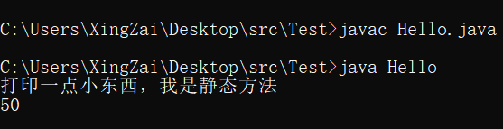

# ***Day10 详讲static和面向对象——继承与Java世上最厉害的IDE——IDEA***

> 今天的篇幅会比较长，因为牵扯到不少的内容还有面向对象的内容

## 第一章 static

> 首先我们先来填一下坑，之前挖的，说后面要详细讲解static这个关键字的作用，那在这之前我们先来复习一下static

1. 首先 `static` 这个关键字可以描述的方法，可以直接用main方法直接调用到
2. 其次 `static` 描述的不能直接调用 `非static` 的方法，只能直接调用 `static` 方法
3. 然后 `非static` 方法 可以调用所有

接着我再来讲一个小知识点，那就是我们调用static方法的时候其实很简单。我们可以直接通过 `类名.方法()`
的方式进行调用，因为静态方法还叫做类方法，他是一个类的所有对象公用的，就是说你一个类的多个对象，对类方法或者类属性进行更改都会影响到其他对象的调用

```java
//我们先来测试静态方法的调用
public class Hello {
    public static void main(String[] args) {
        Hello2.p();
        System.out.println(Hello2.i);
    }
}

class Hello2 {
    public static int i = 50;

    public static void p() {
        System.out.println("打印一点小东西，我是静态方法");
    }
}
```

注意在开发过程中不能这么写。


我们可以看到，我压根就没有创建对象是吧，就是用了我说的 `类名.静态方法()`
就实施了调用，接下来就演示演示，刚刚说的，如果我单个对象更改了静态属性，那我另外一个对象访问同个静态属性是不是也被更改了

```java
public class Hello {
    public static void main(String[] args) {
        Hello2 hello1 = new Hello2();
        Hello2 hello2 = new Hello2();
        System.out.println("hello1.i: " + hello1.i);
        //通过hello1这个对象对i进行更改
        hello1.i = 100;
        System.out.println("hello2.i: " + hello2.i);
    }
}

class Hello2 {
    public static int i = 50;

    public static void p() {
        System.out.println("打印一点小东西，我是静态方法");
    }
}
```


是不是发现被更改了，因为就和我说的一样，他们共享的一个属性。这里我要再提一嘴，因为静态变量属于类变量，其实只能有类再调是比较合理，但是不够人性，所以java是这样的。

但是这里要说到另外一个语言了，那就是C#，在C#里面如果你使用对去调用静态方法是会报错的，是合理，但是不够人性化了，只能说各有长短吧

## 第二章 面向对象之继承

> 这里可是一个比较多知识量的第一个部分了，如果有点不太清醒了，我建议你先去休息一下然后再来看

我们现在开始讲他的概念，我们先来看他这个知识点叫什么名字，是不是叫做继承，我们来回想一下现实生活中的继承是什么，是不是有继承权的意思，还有比如你继承了你父亲的什么什么特征，继承了你母亲什么什么特征。

所以，我们可以理解为，继承就是 `父` 留给 `子` 的，所以我们分别把被继承的基本的叫做 `基类`、`父类`、`超类`
继承的叫做 `子类`、`派生类`，我们一般都叫做父与子。

现在我们说完了他们的名称，我现在来说说他们的基本概念，首先是子类会继承父类的所有方法和属性(非私有的属性)
，然后继承的这个关键字叫做 `extends` 接下来我们进行一些案例来讲解

```java
public class Hello extends Father {
    public static void main(String[] args) {
        Hello hello = new Hello();
        System.out.println(hello.i);
        hello.p();
    }
}

class Father {
    public int i = 100;

    public void p() {
        System.out.println("123");
    }
}
```


我是不是在我的Hello中没有写任何相关的i属性和p方法对吧，但是我都还是能调用到，是不是就是相当于我的Hello类从Father中继承了这么两个东西，一个i属性一个p方法。

那么还记得之前我们所说的访问修饰符吗，访问修饰符在哪里都是奏效的，得先符合访问修饰符才能进行其他的操作。

假如我将i这个属性的访问修饰符修改为private呢

```java
public class Hello extends Father {
    public static void main(String[] args) {
        Hello hello = new Hello();
        System.out.println(hello.i);
        hello.p();
    }
}

class Father {
    private int i = 100;

    public void p() {
        System.out.println("123");
    }
}
```


是不是就发生了报错，所以我们的一切行动都还是要基于我们的封装性，也就是访问修饰符的控制。还有一个坑需要填的，就是我们学习访问修饰符的时候，是不是有个东西没有学的足够透彻的，那就是protected，首先我们先准备两个类，两个在不同包的类，然后将他们继承在一起。

```java
package Test;

//导入一下父类

import Test.Extends.Father;

public class Hello extends Father {
    public static void main(String[] args) {
        Hello hello = new Hello();
        System.out.println(hello.i);
    }
}
```

```java
package Test.Extends;

public class Father {
    protected int i = 500;
}
```


是不是正常使用了，但是，还记得我们说protected的时候是怎么说的吗?


是不是和子类，那如果我用其他类调用这个继承了父类的子类呢，那还能行吗？我也这么想过，但是事实是不行的，看代码

```java
package Test;

import Test.Extends.Father;

public class Hello extends Father {
}

class T {
    public static void main(String[] args) {
        Hello hello = new Hello();
        System.out.println(hello.i);
    }
}
```

```java
package Test.Extends;

public class Father {
    protected int i = 500;
}
```


是不是报错了，说明什么，只能自己使用，及时自己继承的父类之后，也不能被其他类使用自己去调用父类的属性和方法。

欧克，咱们进入继承的下一个内容，那就是 `super` 你们先别懵，还记得我之前说过的， `父类` 还叫做什么？是不是 `基类` 和 `超类`
，super是不是超的意思，其实这个意思就是调用父类构造器，自然也是和方法的重载是一样的，通过你的填的参数默认选择

但是如果你不写，然后你又使用了extends关键字去继承了，那他会默认放在你的无参构造器里面，就和this()
一样，而且记住，如果使用父类super()的话那就需要放在第一行，不然会报和this()一样的错，然后他的用法其实也和this是一样的，代表父类对象

```java
public class Hello extends Father {
    public int a = 0;

    public static void main(String[] args) {
        System.out.println(new Hello().a);
    }

    public Hello() {
        a = super.i;
    }
}

class Father {
    public int i = 50;
}
```


是不是和this的用法非常的类似，那我们在使用super()去调用父类的构造器来试试

```java
public class Hello extends Father {
    public int a = 0;

    public static void main(String[] args) {
        System.out.println(new Hello().a);
    }

    public Hello() {
        super();
        a = super.i;
    }
}

class Father {
    public int i = 50;

    public Father() {
        System.out.println("哈哈嗨，这里是爹地");
    }
}
```


是不是去调用了父类的构造器了，自然也是只能写在第一行的，这里我就不给代码了，我自己替换了


接下来要讲的一个东西可是非常重要的，用来判断是不是他的实例的，比如说我的类是Hello是吧，那我的hello就是他的实例，也就是对象的意思接下来的这个关键字可是至关重要的，
instanceof 在这个关键字的左边是你要判断的比如hello，右边是被判断的，比如说Hello

```java
public class Hello {
    public static void main(String[] args) {
        Hello hello = new Hello();
        if (hello instanceof Hello) {
            System.out.println("确定是亲生的实例");
        }
    }
}
```


这里就是判断是否为实例，但是不止如此，如果我的Hello继承于Father的话，那我的Father也可以拿来判断

```java
public class Hello extends Father {
    public int a = 0;

    public static void main(String[] args) {
        Hello hello = new Hello();
        if (hello instanceof Father) {
            System.out.println("是Father的实例");
        }
    }

    public Hello() {
        super();
        a = super.i;
    }
}

class Father {
    public int i = 50;

    public Father() {
        System.out.println("哈哈嗨，这里是爹地");
    }
}
```


结果很明显，Father也是可以拿来判断的是吧，但是如果我不继承的话，自然就不会打印了

接下来还是由继承带来的一个特性，名为重写，全名是方法的重写，听名字是不是还是有点懵的，实际上其实就是顾名思义，就是重写的意思，重写从父类继承过来的方法

```java
public class Hello extends Father {
    public static void main(String[] args) {
        Hello hello = new Hello();
        hello.p();
    }

    //实际上可以理解为覆盖，但是不一样，后面有他的用途的
    //还有一个注解是可以加的叫做@Override，加上会直接去检测你父类里面有没有这个方法
    //如果没有直接编译报错，如果有，那就进行重写
    public void p() {
        System.out.println("进行了重写");
    }
}

class Father {
    //父类方法
    public void p() {
        System.out.println("父类方法p()");
    }
}
```


那我们再来验证一下Override的注解

```java
public class Hello extends Father {
    public static void main(String[] args) {
        Hello hello = new Hello();
        hello.p();
    }

    @Override
    public void p() {
        System.out.println("重写");
    }
}

class Father {

}
```


这就是面向对象的继承的内容

## 第三章 下载IDEA

> 这里有部分需要使用科技，也就是破解，自然你如果只是学习，可以下载社区版。
> 当然如果你想用全功能的idea要么就是花钱要么就是使用科技  
> 浅提一嘴，如果你要花钱还是有两种渠道的，一种是去tb上面买IDEA的账号，另外一种就是去正常购买IDEA

首先我们先讲一下IDEA的来历和java的ide们，一般用的只有两个，要么是eclipse要么就是Intellij IDEA，我们一般称之为IDEA。

我们下载idea是通过jetbrains的官网去下载，[点我去jetbrains官网](https://www.jetbrains.com/)

我这里也直接给一个[IDEA链接](https://www.jetbrains.com/idea/download)


然后下载过来之后进行安装即可使用。

当你下载完了开启了和破解了之后，你就可以创建项目了


你大概可以看到这么一个界面，点击new Project就可以创建了


这样就创建完了


我们还可以使用包.类的方式直接创建带package的类


点向绿色三角形就能看到


或者是对有main方法的类里面按右键也会有运行


今天结束，就这么多内容