# ***Day11 面向对象——多态***

> 我们来复习一下面向对象的三大特性分别是什么，面向对象拥有的三大特性分别为
> 继承、封装、多态。继承我们也已经学过了，就是父类和子类、封装其实也学过了其实就是访问修饰符和包，主要的作用为更好的封装
>
> 我们接下来要讲的多态则是面向对象的最难点，他要基于继承进行的

## 第一章 多态基础——动态绑定机制

> 首先我们想要知道多态要怎么实现，多态的实现其实也非常的简单，只需要满足三个条件即可，第一个就是 有继承关系，第二个就是有重写的方法，第三个就是
> 父类引用指向子类对象，我知道你们突然懵了，但你们先别急，我来解释解释

首先我们来说说什么是父类引用指向子类对象，那么我们先来看看正常的对象什么，因为及时有继承我们也是使用子类进行创建对象的嘛

`Hello hello = new Hello();`
这个就是正常的对象创建对吧，但是我们现在来一点条件，比如现在有一个父类叫做Father然后我们的Hello类就继承这个Father，那我们现在创建的hello对象里面是不是有身为父类的Father里面的方法。

那我们现在换一个操作来声明，然后我们再确定一下，Hello是子类对吧，然后Father是父类，Hello extends Father。
我们就可以这么写就可以达成父类引用指向子类对象 `Father hello = new Hello()`
大家也可以自己使用之前的代码进行尝试一下，编译是不会出现问题的，但是会出现一个问题，就是你没有进行重写的时候想要调用子类中的方法是不可能的，我们来举个栗子

```java
public class Hello extends Father {
    public static void main(String[] args) {
        Father hello = new Hello();
        hello.p();
    }

    public void p1() {
        System.out.println("我是子类中的方法p1()");
    }
}

class Father {
    public void p() {
        System.out.println("我是父类中的方法p()");
    }
}

```

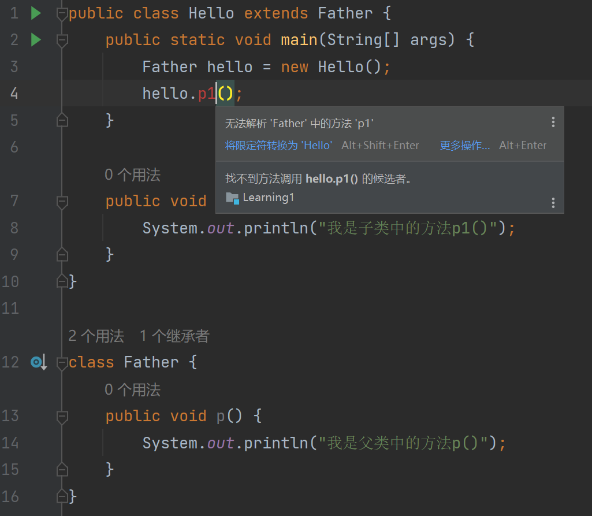

我们明显可以看到这里报错了，自然是运行不了的，我们来看看问题出在哪里，还记得我说的吗，想要完成多态就要经历三个，一个是 继承，一个是
重写，还有一个就是 父类引用指向子类对象，1和3条件都有了但是没有重写，所以没有完成多态，我们继续编写一下代码，让他拥有重写，然后就会形成多态

```java
public class Hello extends Father {
    public static void main(String[] args) {
        Father hello = new Hello();
        hello.p();
    }

    public void p() {
        System.out.println("我是子类中的方法p()");
    }
}

class Father {
    public void p() {
        System.out.println("我是父类中的方法p()");
    }
}

```

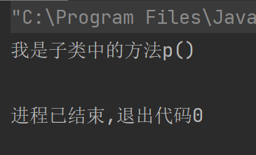

是不是就调用了重写之后的方法，这里就要讲到多态的一个特性了，首先我们需要重写，重写完了之后呢，我们需要在父类中使用一个方法调用这个被重写的方法完成真正的多态

```java
public class Hello extends Father {
    public static void main(String[] args) {
        System.out.println("首先声明，现在是使用p2的情况");
        Father hello = new Hello();
        hello.p2();
    }

    public void p() {
        System.out.println("我是子类中的方法p()");
    }
}

class Father {
    public void p() {
        System.out.println("我是父类中的方法p()");
    }

    public void p2() {
        p();
    }
}
```

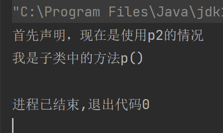

看到区别了吧，我们使用p2，然后p2调用了p，但这个时候的p并不是父类方法里面的p，而是子类里面的p，这个就是多态，神不神奇😁，我们来学习一下他的机制。

我们再使用一个带属性的案例来说明一下

```java
public class Hello extends Father {
    public static void main(String[] args) {
        System.out.println("首先声明，现在是带i的使用p2的情况");
        Father hello = new Hello();
        hello.p2();
    }

    public int i = 456;

    public void p() {
        System.out.println("我是子类中的方法p()");
    }
}

class Father {
    public int i = 123;

    public void p() {
        System.out.println("我是父类中的方法p()");
    }

    public void p2() {
        System.out.println("打印一下i先: " + i);
        p();
    }
}
```

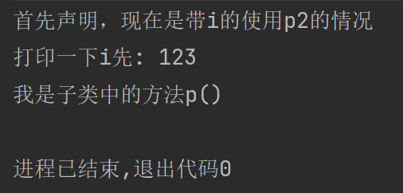

是不是看出来了什么，我们调用i的时候是不是还是父类里面的i，说明属性调用的还是父类的，然后我们再看看p是不是就是子类里面的，方法是不是就调用的有重写的子类，这个就是多态，这个机制呢就叫做动态绑定机制，绑定重写的方法不绑定属性

我们还没细细讲过什么是 父类引用指向子类对象呢，在我们使用这个操作的时候里面就发生了一种类型转换

## 第二章 多态声明——向上转型和向下转型

> 首先我们除了标题里面的向上转型和向下转型之外，我们还需要学习一个东西就叫做运行类型和编译类型。

举个例子，我们看向父类引用指向子类对象的这个 `Father hello = new Hello();` 在这一串里面其实我们的Father是编译类型，然后我们的
new Hello() 则是运行类型，就是等号前面的是编译类型，等号后面的是运行类型

### 方法在多态中的调用

这两个类型的区别就是，我们使用方法是看编译类型的，实际运行是看运行类型的，假如我们还是正常的 `Hello hello = new Hello()`
的话，那其实都是正常的，因为运行类型和编译类型都为Hello类，但是我们使用父类引用指向子类对象的时候就是Father为编译类型，所以我们调用方法的时候是看Father的

这个意思就是，我们想要调用方法是看Father的，如果我们Father里面没有这个方法那就没办法调用就和我们之前的那个p1一样，因为Father里面并没有这么个方法所以无法调用，编译报错。

运行类型为Hello，所以我们调用方法的时候都是从运行类型的看起的。

### 属性在多态中的调用

还有一个就是属性，我们属性和方法不一样，属性是看编译类型的，所以我们以下的这个代码即使是 父指子 也是调用的父类的，方法则是以子为开始

```java
public class Hello extends Father {
    public static void main(String[] args) {
        Father hello = new Hello();
        System.out.println(hello.i);
    }

    public int i = 456;
}

class Father {
    public int i = 123;
}
```

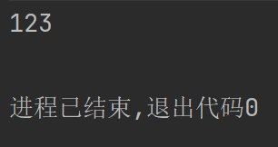

明显可见，我们使用 父指子 的方式的属性调用是从父类开始，调用父类的属性了，这个其实也叫做多态。

#### 小结一下

这个最基础使用的多态的特性有二，前提是满足了开启多态的条件，然后我们的多态调用方法的时候会从子类开始寻找，然后我们使用属性的话会从父类进行调用，但是其实因为编译类型的存在，父类是不可能没有属性然后子类是有的

不要忘记最基础的查看方法啊和属性的存在其实就是先看编译类型。

然后还有一个特点，那就是我所说的向上转型和向下转型

### 向上转型和向下转型

使用 父指子
的方式进行声明了之后，其实会自动进行向上转型。转到父类的类型所以调用不了子类中父类没有的方法和属性，但是实际上我们使用getClass这个方法还是会打印运行类型的类的，

然后我们在声明使用了 父指子 的情况后，我们的类型可以说是变成了父类，所以我们是调用不到子类方法的，但是我们可以通过向下转型，也就是强制类型转换，可以调用到子类的方法

```java
public class Hello extends Father {
    public static void main(String[] args) {
        Father hello = new Hello();
        //首先我们要对我们的hello进行从Father类型转换到Hello类型的操作
        //因为在声明的时候 父指子 了，所以进行了向上转型，变成了Father类型，需要强转才能调用子类方法
        //这里使用两个括号能看懂吧，首先我们先进行 (Hello) hello 的强转，但是我们后面跟着调用方法了，所以再加个括号当整体
        ((Hello) hello).p1();
    }

    public void p1() {
        System.out.println("测试一下这个向下转型，如果打印出来了那就是测试到了");
    }

    public void p() {
        System.out.println("我是子类中的方法p()");
    }
}

class Father {
    public void p() {
        System.out.println("我是父类中的方法p()");
    }
}
```

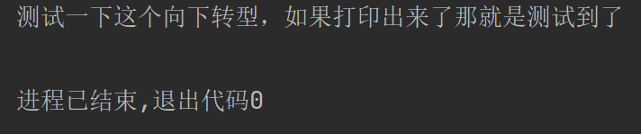

## 第三章 多态参数

> 我们先来复习一个东西，那就是 `instanceof` ，还记得这个关键字的作用吗，他就是做验证是否为实例的.

我们之前验证过了，子类创建的对象也是父类的实例，就通过这个操作，我们可以给定形式参数为父类，
然后就能让父类及其子类都可以作为实参传入，我们先看看案例，然后可以通过多态方法，直接只需要写一个父类，而不需要重载很多次方法，我们来看看案例

```java
public class Hello {
    public static void main(String[] args) {
        p123(new Father());
        p123(new Son());
    }

    public static void p123(Father obj) {
        obj.p();
    }
}

class Father {
    public void p() {
        System.out.println("父类的p方法");
    }
}

class Son extends Father {
    @Override
    public void p() {
        System.out.println("子类的p方法");
    }
}
```

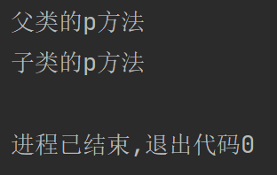

我们明显可以看到，我传的参数是Father和Son，但是我们接受的参数却是Father类型，这个我们也可以通过instanceof来查看对应的相关关系，假如我们作为子类还有自己的方法的话，就可以通过instanceof和上述的向下转型来进行转换使用。

```java
public class Hello {
    public static void main(String[] args) {
        Son son = new Son();
        Father father = new Father();
        Father sonF = new Son();
        System.out.println("son instanceof Son: " + (son instanceof Son));
        System.out.println("son instanceof Father: " + (son instanceof Father));
        System.out.println("father instanceof Son: " + (father instanceof Son));
        System.out.println("father instanceof Father: " + (father instanceof Father));
        System.out.println("sonF instanceof Son: " + (sonF instanceof Son));
        System.out.println("sonF instanceof Father: " + (sonF instanceof Father));
    }

    public static void p123(Father obj) {
        obj.p();
    }
}

class Father {
    public void p() {
        System.out.println("父类的p方法");
    }
}

class Son extends Father {
    @Override
    public void p() {
        System.out.println("子类的p方法");
    }
}
```

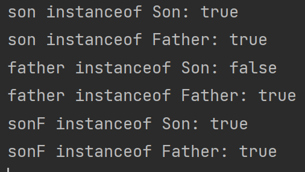

这里我们明显可以看到只有Father作为编译和运行双重类型进行声明的才会出现与Son的instanceof是错误的，我们的多态的 父指子
声明和正常的Son作为编译和运行双重类型都是不会出现任何的问题的。

然后我们能理解这个多态形参的情况了吧，然后就是为什么一定要叫多态形参而不是继承形参，因为我们如果有统一的方法名，比如说都有一个getAge方法，目的都是返回他们的年龄，是不是使用多态的方式更节省以及轻松实现一点

首先这么写的好处第一个就是节省了开发时间，因为我们只需要使用一个父类作为形参的类型即可，不然的话我们需要写很多的重载然后等我们又出现了新的子类的时候又要进行重载，统一了使用这个类的方法，只需要一个p123(
Father father )

其次这么写的好处就是通过多态进行编写的，子类都是继承了这个父类才能作为这个参数传入，那我如果不是的话就不能作为这个参数传入，也不会出现方法不存在的报错，因为我们只需要使用父类的方法，毕竟在形参那块可以理解为编译类型，毕竟只有声明部分，所以就和
父指子 一样会出现实际的方法调用是看编译类型的，所以不会出现要调用方法结果没有这个方法的情况

最后的好处就是，这个是后面的知识，我们使用接口规定我们的方法规范的时候，一般使用的都是我们接口里面规定的方法，其他的接口里面没有规定的方法一般作为private私有方法来辅助实现的这个接口里面的方法从而实现功能

为了让大家对这个多态的理解更深一点，我们再看几个例子

```java
public class Hello {
    public static void main(String[] args) {
        shoutTest(new Animal());
        shoutTest(new Dog());
        shoutTest(new Cat());
    }

    public static void shoutTest(Animal animal) {
        animal.shout();
    }
}

class Animal {
    public void shout() {
        System.out.println("Animal在发出喊叫声。。。");
    }
}

class Dog extends Animal {
    @Override
    public void shout() {
        System.out.println("Dog在狗叫。。。");
    }
}

class Cat extends Animal {
    @Override
    public void shout() {
        System.out.println("Cat在猫叫。。。");
    }
}
```

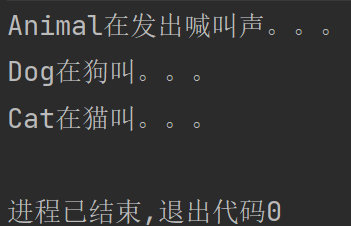

还有我们说的，比如调用共同的年龄，我们只需要在创建对象的时候设置一下年龄，自然还是有很多种方式去实现的。

```java
public class Hello {
    public static void main(String[] args) {
        printAge(new Boss(50));
        printAge(new Employee(30));
    }

    public static void printAge(Person person) {
        System.out.println(person.getClass().getSimpleName() + " " + person.getAge());
    }
}

class Boss extends Person {
    public Boss(int age) {
        super(age);
    }

    public Boss() {
    }
}

class Employee extends Person {
    public Employee(int age) {
        super(age);
    }

    public Employee() {
    }
}

class Person {
    private int age;

    public int getAge() {
        return age;
    }

    public void setAge(int age) {
        this.age = age;
    }

    public Person(int age) {
        this.age = age;
    }

    public Person() {
    }
}
```

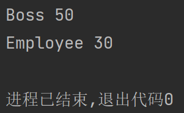

然后基于我们的动态绑定机制，其实也可以出现一点有趣的事情

```java
public class Hello {
    public static void main(String[] args) {
        Father a = new Son();
        System.out.println(a.getSum()); //20
        Father b = new Father();
        System.out.println(b.getSum()); //30
    }
}

class Father {
    public int i = 20;

    public int getI() {
        return i;
    }

    public int getSum() {
        return 10 + getI();
    }
}

class Son extends Father {
    public int i = 10;

    @Override
    public int getI() {
        return i;
    }
}
```

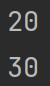

是不是很有趣，详细如果前面学的比较透彻的话，这里也是可以看懂和理解为什么打印会是这样的

## 第四章 多态数组

> 既然都已经弄懂了多态参数其实多态数组也就那么一回事，我们只不过通过声明父类的数组，但是在里面储存的不只是父类还有其子类的做法，其实理解起来和多态参数是一样的

```java
public class Hello {
    public static void main(String[] args) {
        Animal[] animals = new Animal[5];
        animals[0] = new Cat();
        animals[1] = new Dog();
        animals[2] = new Animal();
        animals[3] = new Cat();
        animals[4] = new Dog();
        for (Animal animal : animals) {
            System.out.println(animal.getClass());
        }
    }
}

class Animal {
}

class Dog extends Animal {
}

class Cat extends Animal {
}
```

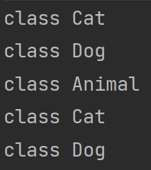

不难理解，道理都是一个道理，实现起来也是非常的简单，如果对自己感觉掌握的不是很透彻就多看看和多练练，应该就能轻松掌握了。

### [上一章](day10.md)

[//]: # (### [下一章]&#40;day12.md&#41;)

### [返回目录](README.md)