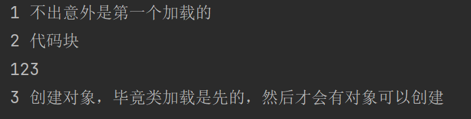

# ***Day12 剖析static关键字与普通代码块和静态代码块还有final关键字***

> 我们在教面向对象的继承的时候讲过了static的详细用法，以及标注了static之后的就会变成共享的属性，然后调用要使用
> `类名.属性(方法)`的这种方式进行调用，然后就是我们今天所要学习的代码块的知识

## 第一章 static再了解

### 类加载和static的关系

我们再来复习一下static这个关键字，我们之前又给他定义是静态，因为static就是静态的意思，但是他除了这个还有另外一个意思，那就是类的属性或者是类的方法这层意思

这里就要稍微讲到一点类加载的过程了，一般的类加载会是当我们要去创建这个类的对象的时候会在创建这个类的对象之前对这个类进行加载，然后通过加载的这个类进行实例的创建，也就是对象的创建，但是这个情况创建的对象都是只有非静态的方法和属性的，也就是他们是不会用到的类变量和类方法的。

那当我们用到了类方法和类变量的时候，他加载的样子又是怎么样的呢？其实我们如果没有static，那就是非常正常的加载，然后根据这个加载完的类进行创建对象，但是我们写了static的方法或者是属性之后，他其实也是这样加载的，只不过在加载的过程中的时候会把静态的属性啊或者是方法这些标注了static的进行加载。

总而言之，其实就是static会在类加载的时候同时加载，这就是为什么使用static属性的时候会共享一个了，因为就和对象一样，其实都是加载完类的分身，实际上的类还是一个，这个就相当于直接操作放在内存里面的这个static属性。

看不懂也没有关系，反正只需要记住静态属性和静态方法会和类加载同时进行加载而不是后面创建对象的那样，所以静态的才会共享

### 为什么main方法是static的

这个其实也很简单，因为我们的java代码无论是怎么写的，其实都是要通过jvm(java虚拟机)
去执行的，所以如果我们普通的写main方法的话，就会出现，首先我们的虚拟机要获取我们的这个类，然后通过这个类去创建对象，这个操作以后我们也会去学习的，在
`反射` 那块，如果通过这种方式的话那就十分的不方便而且比较臃肿

所以我们就直接规定静态方法main，这样的话我们的jvm调用起来只需要检查规定的主方法在什么类里面，然后直接调用即可，就没有创建对象那么麻烦的步骤，而且加载的速度也是非常的快的，因为是静态方法，所以在类加载的过程中其实我们的主方法就已经加载了。

### 代码的加载过程

我们使用一个简单的案例来告诉大家类加载的过程应该是怎么样的

```java
public class Hello {
    public static void main(String[] args) {
        new Test().p();
    }
}

class Test {
    public static int i = getSome();

    public static int getSome() {
        System.out.println("1 不出意外是第一个加载的");
        return 5;
    }

    public void p() {
        System.out.println("3 假如创建对象然后直接调用这个方法，那就是第三步");
    }

    public Test() {
        System.out.println("2 第二步才是创建对象，毕竟类加载是先的，然后才会有对象可以创建");
    }
}
```


我们呢看到，我们现在的这个类加载的过程差不多就是

1. 开始加载Test类
2. 加载静态属性和静态方法
3. 完成静态属性的初始化，如果没有初始化那默认为0或者null或者false
4. 调用静态方法getSome进行初始化
5. 类加载完成
6. Hello类内部的main方法创建Test类的对象
7. 调用Test类的构造器
8. 使用Test类创建好的对象调用p方法
9. 程序运行结束

总而言之就是，先加载，然后类就是同步加载的。然后才是创建对象的步骤

## 第二章 代码块

> 接下来我们要讲的内容则是代码块的内容，其实代码块也就是初始化的时候会使用的，比如普通代码块就是和构造器一起进行初始化作用的，
> 只不过比较通用，我无论调用什么构造器都会进行这块初始化  
> 然后就是静态代码块，其实就和其他静态一样，也是在类加载的时候就做事情的，至于先后关系，马上就会说到

### 普通代码块

我们先来说说代码块怎么使用，非常的简单就直接使用两个花括号框起来然后放在类的里面就是代码块，作用就是在创建对象的时候运行代码块内部的代码，也就是初始化的作用

```java
public class Hello {
    public static void main(String[] args) {
        Test test = new Test();
        test.p();
    }
}

class Test {
    public static int i = getSome();

    public static int getSome() {
        System.out.println("1 不出意外是第一个加载的");
        return 5;
    }

    public void p() {
        System.out.println("4 假如创建对象然后直接调用这个方法");
    }

    {
        System.out.println("2 代码块");
    }

    public Test() {
        System.out.println("3 创建对象，毕竟类加载是先的，然后才会有对象可以创建");
    }
}
```


代码块的优先级是在构造器之前的，但是在调用构造器创建对象之前还是会先把该对象的属性进行了初始化之后才会有创建对象的这个动作的，所以假如我们给属性的初始化也和静态属性一样从方法获取返回值的话就会这样

```java
public class Hello {
    public static void main(String[] args) {
        Test test = new Test();
    }
}

class Test {
    public static int i = getSome();

    public int i123 = p1();

    public static int getSome() {
        System.out.println("1 不出意外是第一个加载的");
        return 5;
    }

    public int p1() {
        System.out.println("123");
        return 1;
    }

    public void p() {
        System.out.println("4 假如创建对象然后直接调用这个方法");
    }

    {
        System.out.println("2 代码块");
    }

    public Test() {
        System.out.println("3 创建对象，毕竟类加载是先的，然后才会有对象可以创建");
    }
}
```


代码块会在调用方法初始化后面，那这个是必然的吗？代码块的优先级就是比初始化低吗？其实不然，因为代码也是讲究顺序的，同优先级的情况下自然是顺序决定一切，所以只要我们把顺序替换一下，把代码块放在属性的初始化之前那就会不一样了

```java
public class Hello {
    public static void main(String[] args) {
        Test test = new Test();
    }
}

class Test {
    public static int i = getSome();

    {
        System.out.println("2 代码块");
    }

    public int i123 = p1();

    public static int getSome() {
        System.out.println("1 不出意外是第一个加载的");
        return 5;
    }

    public int p1() {
        System.out.println("123");
        return 1;
    }

    public void p() {
        System.out.println("4 假如创建对象然后直接调用这个方法");
    }

    public Test() {
        System.out.println("3 创建对象，毕竟类加载是先的，然后才会有对象可以创建");
    }
}
```



### 静态代码块

实际上没什么区别，我指的是写法上，唯一区别的就是在普通的 `{}` 的前面加上一个static就像这样 `static{}`

实际的作用也和普通代码块一样只不过他的优先级是类加载的优先级，只会加载一遍然后初始化的优先级也是一样，和顺序一样

```java
public class Hello {
    public static void main(String[] args) {
        Test test = new Test();
    }
}

class Test {
    public static int i = getSome();

    {
        System.out.println("普通代码块");
    }

    static {
        System.out.println("静态代码块");
    }

    public int i123 = p1();

    public static int getSome() {
        System.out.println("静态初始化");
        return 5;
    }

    public int p1() {
        System.out.println("普通初始化");
        return 1;
    }

    public void p() {
        System.out.println("4 假如创建对象然后直接调用这个方法");
    }

    public Test() {
        System.out.println("调用构造器创建对象");
    }
}
```


很明显其实也和普通的代码块差不多意思，然后我们把这个静态代码块的位置拉到静态初始化之前会发生什么变化？

```java
public class Hello {
    public static void main(String[] args) {
        Test test = new Test();
    }
}

class Test {
    static {
        System.out.println("静态代码块");
    }

    public static int i = getSome();

    {
        System.out.println("普通代码块");
    }

    public int i123 = p1();

    public static int getSome() {
        System.out.println("静态初始化");
        return 5;
    }

    public int p1() {
        System.out.println("普通初始化");
        return 1;
    }

    public void p() {
        System.out.println("4 假如创建对象然后直接调用这个方法");
    }

    public Test() {
        System.out.println("调用构造器创建对象");
    }
}
```


其实和普通的代码块的变化是一样的，就是看顺序，先看优先级的级别然后再看顺序。

## 第三章 final关键字

> 这个其实特别简单，就只是作用和名字一个意思的东西

### 属性的final

我们现在声明的属性是不是也叫做变量，因为他可以随意赋值以及随意运算并赋值，其实就是赋值，但是我们使用了final去修饰之后呢，她就不能这么随意了，因为就变成了最后，也就是final的属性了，所以从另外一个角度去理解，就是变成了常量

```java
public class Hello {
    public static final int number = 50;

    public static void main(String[] args) {
        System.out.println(number);
        number = 60;
    }
}
```


可以看到，在编译阶段就直接报错了，说明被final修饰之后就变成了最终的属性，也就是常量

自然除了属性还有其他地方可以使用final进行修饰，比如说类和方法

### 类的final

其实和属性的final一样，他也是就变成了最终的情况，只不过属性的final是不能被修改，而类则是不能被继承

```java
public class Hello extends Test {
    public static void main(String[] args) {
    }
}

final class Test {

}
```


其实在java的底层也是有不少的类用的也是final修饰，比如String、Integer等等一系列类


### 方法中的final

在方法中其实也和类中差不多，类的这种情况叫做继承，那么方法的这种情况就叫做重写，所以标记了final的方法是不能进行重写的

```java
public class Hello extends Father {
    public static void main(String[] args) {

    }

    public final void p() {

    }
}

class Father {
    public final void p() {
        System.out.println("final method p()");
    }
}
```


今天学的东西还是非常简单的，下节我们来学习一些比较抽象的东西

### [上一章](day11.md)

### [下一章](day13.md)

### [返回目录](README.md)