# ***Day13 抽象类与接口***

> 通过了前面的学习，我们已经掌握了面向对象的基础 继承 封装 多态

## 第一章 抽象类

> 接下来，我们要对面向对象学习高级的部分，我们先要学到的就是抽象类，听名字也能想到，肯定很抽象，那我们先来学习一下抽象的单词
> abstract 自然我们后面有关抽象的都是需要使用这个关键字去修饰的

首先我们先来讲一讲概念和用法，我们的抽象类的作用是包含抽象方法，就我们平时的编码过程其实方法都是直接写的对吧，没有出现过方法是单单声明的过程，我们接下来学习的这个就是可以理解为声明方法。

然后我们需要将继承声明抽象方法的这个类并实现这个被声明的这个方法，被声明的方法我们一般叫做抽象方法，需要在继承后实现他，实现就是相当于对这个方法进行初始化

最后就是我们的抽象类的定义和我们抽象方法的所去所从，有抽象方法的类必须是抽象类，抽象类可以没有抽象方法，抽象类不能被创建对象，抽象类也可以有正常的方法

我们来看看声明，首先是抽象类，就是在class面前加上
abstract，然后抽象方法则是加上abstract之后去除方法体然后在末尾加上分号，然后注意标注在方法上的abstract关键字不能与static和final共存

```java
public class Hello {
    public static void main(String[] args) {

    }
}

abstract class Father {
    public abstract void p();
}
```

这个就是非常完美的案例，然后我们来看看创建对象能不能成功

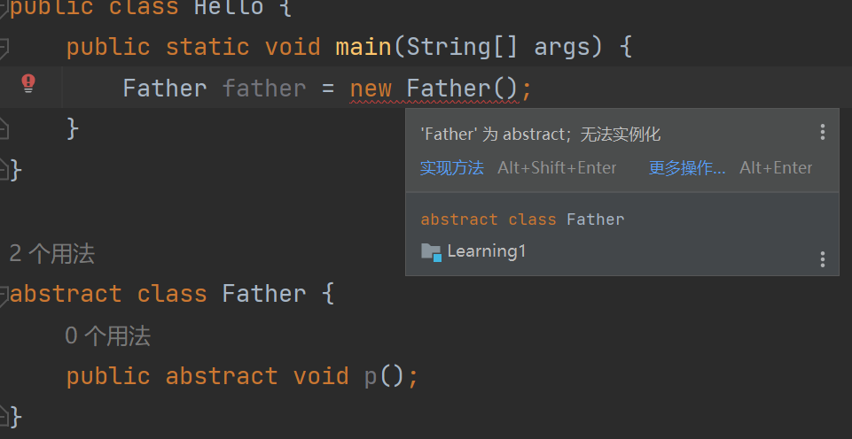

很明显，直接失败了，因为抽象类不能创建对象，但是可以被继承，所以我们可以这么修改

```java
public class Hello {
    public static void main(String[] args) {

    }
}

class Son extends Father {

}

abstract class Father {
    public abstract void p();
}
```

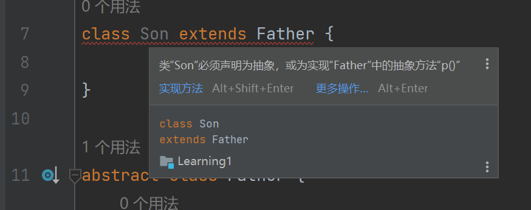

很明显报错了，这个问题是什么呢，就是我们上面所说的，抽象类可以没有抽象方法，但是抽象方法必须在抽象类里面，我们现在继承过来的是不是继承了抽象方法p，所以我们需要在里面实现了p之后才能是正常的类，或者我们把Son也变成抽象类，再让后者继承他之后再实现方法p

```java
public class Hello {
    public static void main(String[] args) {
        Son son = new Son();
        son.p();
    }
}

class Son extends Father {
    @Override
    public void p() {
        System.out.println("I'm method p()");
    }
}

abstract class Father {
    public abstract void p();
}
```

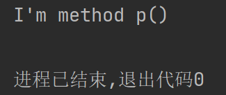

自然我们也可以使用多态的方式进行调用这个p方法，因为我们可以说是在Father这个类里面规定了子类及其子类都必须要有p方法以及一次或者多次实现的可能

```java
public class Hello {
    public static void main(String[] args) {
        Father son = new Son();
        System.out.println("现在是父指子的用法");
        son.p();
    }
}

class Son extends Father {
    @Override
    public void p() {
        System.out.println("I'm method p()");
    }
}

abstract class Father {
    public abstract void p();
}
```

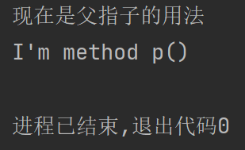

自然我们也可以正常写其他方法，只不过没办法创建对象罢了，但是我们把方法写在抽象类中，然后有类继承他，并且我们使用多态的 父指子
用法也可以调用

```java
public class Hello {
    public static void main(String[] args) {
        Father son = new Son();
        son.p();
        son.p123();
    }
}

class Son extends Father {
    @Override
    public void p() {
        System.out.println("I'm method p()");
    }
}

abstract class Father {
    public abstract void p();

    public void p123() {
        System.out.println("print something");
    }
}
```

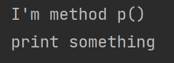

## 第二章 接口

> 在上面的章节我们已经见识到了抽象类，然后在我们的代码中其实还有更抽象的东西，就是极致抽象的类，我们叫做接口

我们只需要把class这个关键字替换成interface即可，自然我们使用public
class的时候也可以把这个class换成interface，只不过里面是极致的抽象，所以不能出现正常的方法，只能有抽象方法

还有一点，我们可以只写 返回值 方法名(参数列表); 因为既然已经极致的抽象，自然会带上配合抽象的public
abstract，我们可以在idea中先试用一下，还有一件事，就是我们使用idea创建类的时候，可以看到其实我们可以选择接口进行创建的

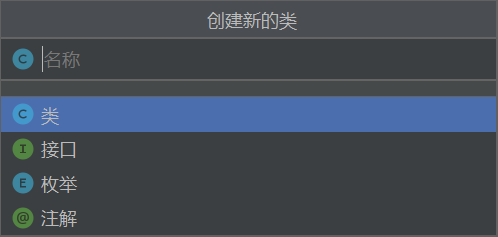

我们可以看到，下面有接口的选项，其实创建完之后也就是把class换成了interface自然我们在单个文件写多个类的时候，换成接口之后也是一样的操作，只需要把class换成interface即可，但是切记，我们在开发过程中是不能这么写的，一个文件里面只能有一个类，我指的是同级类，自然不包含我们后面要说的内部类的内容

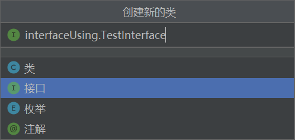

我们进行创建

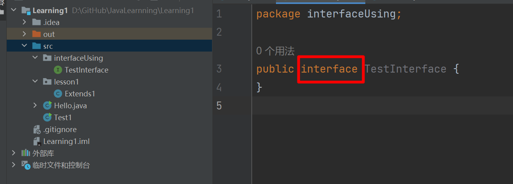

我们可以看到已经完成了创建，并且自动替换为了interface，然后在左边项目列表里面的图标也发生了变化，中间的数字变成了I然后变成了绿色的图标，说明这个就是接口，因为I是interface的首字母，就和Class的蓝色填充一样，蓝色的C

小图标也是带有细节的，比如我们的Hello类里面现在应该是写着不止一个类，左边就有个小箭头，然后我们的Hello类里面有main函数，所以就有个绿色箭头代表可运行

### 接口中的方法声明

我们再看看，我说的在接口中写方法只能写抽象的，还有不需要写public和abstract

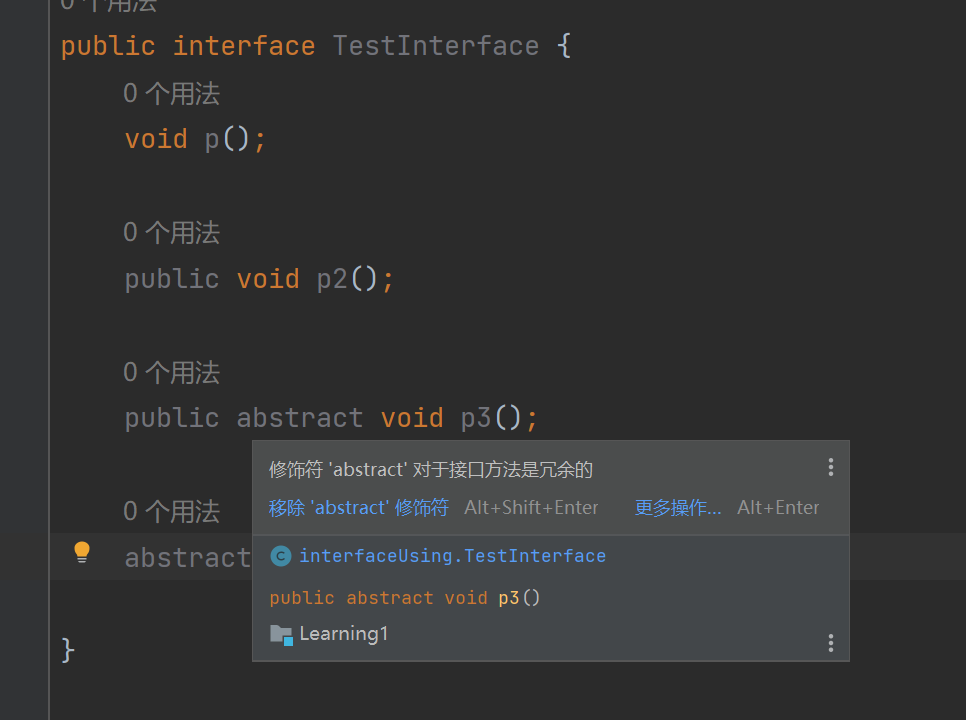

是不是提示是冗余的，就说明了可以不写这两个关键字。

### 接口中的属性

然后我们在接口中也是可以写属性的，只不过一写就会变成常量，而且是静态的常量，可以调用的更加的方便，如果你问抽象类中的属性呢，我只能说和普通的类是一样的，只是抽象方法是特殊的，还有对象不能创建而已，然后我们的接口既然是抽象到极致的抽象类，那么，自然他也没办法创建对象，至于属性，我马上就要说了

而且抽象到极致的类，也就是接口中也不能出现
常量声明也就是属性声明和方法声明外还有jdk8新添加的新特性default方法之外，其余在类中可以用的，在接口中都是不能用，而且接口作为规范方法的作用，在开发过程的作用是很大的，有了接口就能规定一个规范

就像我们现在使用的type-c接口一样，大部分的手机厂商都是为了满足这个接口，相当于我们使用接口作为父，然后手机作为子进行了 父指子
然后进行调用一样，充电，数据传输都使用的接口，差不多就是这个接口的意思

```java
package interfaceUsing;

public interface TestInterface {
    //接口中的属性声明 默认自带 public static final
    String name = "tom";
    public static final String a = "a";
    //多余的就不写了
    public final String b = "b";

    //抽象方法声明，自带public abstract
    void p();
}
```

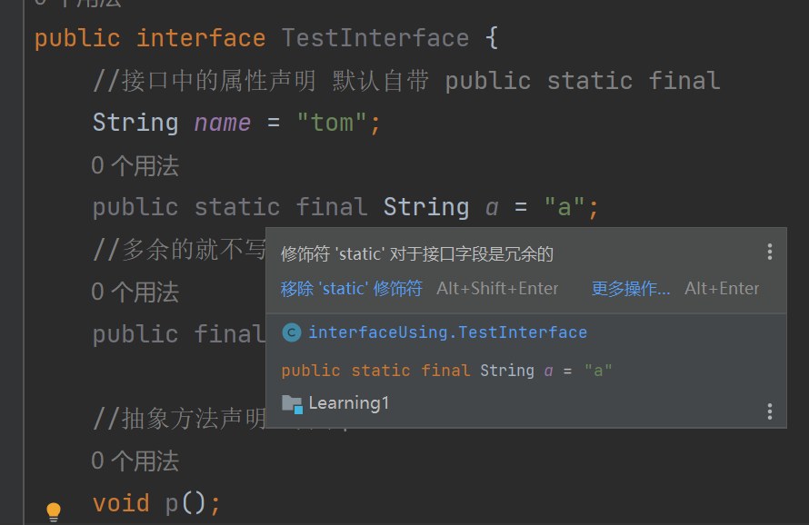

很明显，我们可以看到前面的public static final 都是灰色的，也就是是自动加上的。

### 接口的实现（类继承接口）

毕竟是抽象到极致的类，所以我们的接口进行继承也就是接口的实现也是和普通的类不一样的，因为接口里面规定的都是抽象方法，所以可以重复无所谓，因为我们java中是只支持单继承的，我们所有的类只能有一个爹，就不会出现我是Hello继承了Father和Father2，然后Father和Father2中的方法重复了，那我调用这同个名字的方法调用的是哪一个，但是我们的接口都是抽象的，所以可以随便继承

接口的继承就是实现，然后实现的英文单词就是implements

```java
public class Hello {
    public static void main(String[] args) {
        Test test = new Test();
        test.p();
        System.out.println(test.sum(1, 5));
    }
}

class Test implements interface1 {

    @Override
    public void p() {
        System.out.println("method p()");
    }

    @Override
    public int sum(int a, int b) {
        return a + b;
    }
}

interface interface1 {
    void p();

    int sum(int a, int b);
}
```

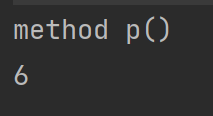

### 接口的继承（接口继承接口）

我们类继承接口也就是类实现这个接口，使用的是implements，但是我们接口与接口还是正常的继承关系，继承这么抽象的方法，所以还是使用的extends，只有我们接口变换到了类里面才会是使用了implements
实现。

```java
public class Hello {
    public static void main(String[] args) {
    }
}

class Test implements interface1 {

    @Override
    public void p() {
        System.out.println("method p()");
    }

    @Override
    public int sum(int a, int b) {
        return a + b;
    }

    @Override
    public void fatherMethod() {
        System.out.println("来自fatherInterface的方法");
    }
}

interface interface1 extends interFather {
    void p();

    int sum(int a, int b);
}

interface interFather {
    void fatherMethod();
}
```

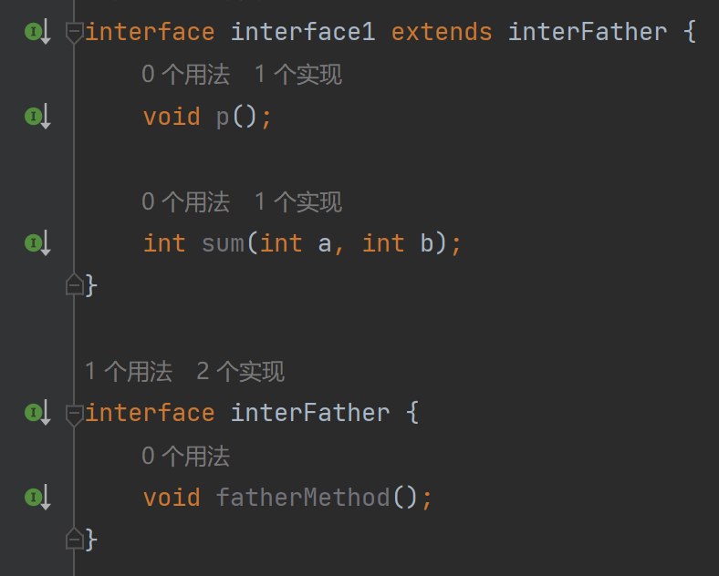

明显一看就能看出来，接口与接口之间使用的是不是还是extends

### 接口的jdk8新特性

如果我们使用的jdk8及以上的话，接口除了我以上说的抽象到极致的方法，写上 返回值 方法名 (参数列表) 会自动添上 public 和
abstract 与 写属性直接会变成 public static final 修饰的常量之外，还会有两个新特性

一个是默认方法，另外一个则是静态方法，自然我们不需要写public，他会自带public

```java
package interfaceUsing;

public interface TestInterface {
    static void p() {
        System.out.println("static void p()");
    }

    default void p1() {
        System.out.println("default void p1()");
    }
}

class H implements TestInterface {

}

class Main {
    public static void main(String[] args) {
        H h = new H();
        h.p1();
        TestInterface.p();
    }
}
```

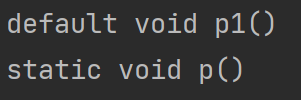

我们明显看到，默认方法其实就是普通的public方法，而静态方法就是静态的public方法，我们调用默认方法的时候需要有类去实现这个接口然后创建对象才可以调用，而静态方法和我们所理解的静态方法是一样的，我们可以使用
类名.静态方法名(参数列表);的方式进行调用，只不过从类名变成了接口名

以上差不多就是这次的全部内容了，是不是有点抽象，多写一写就习惯和熟悉起来了

### [上一章](day12.md)

### [下一章](day14.md)

### [返回目录](README.md)