# ***Day14 内部类***

> 类有外边的public
> class，然后还有一个文件多个的class，但是有没有想过，class可以作为成员也就是类内部的类，甚至作为方法内部的属性也就是类内部的方法的内部出现。除了这两个，
> 还有直接对着上节课讲的抽象类和接口创建对象的匿名内部类，和成员内部类的静态化，静态内部类

## 第一章 内部类

我们先来讲一下内部类有几个

* 局部内部类
* 成员内部类
* 静态内部类
* 匿名内部类

分别都是方法内部的、类内部的、类内部的、和创建对象的时候可以匿名创建一个子类的。

### 局部内部类

> 局部内部类，刚刚也讲了，其实就是方法内部的一个类，所以叫做局部，以为他并不是作为一个属性存在，而是有点方法内部的变量的意思。

首先我们先来说说怎么进行声明，就是在一个方法内部直接写class即可，在此之前我们先防止踩雷，先说几点，就正常的写类即可，但是在内部的方法声明里面，无法声明static方法，除非你是jdk16+

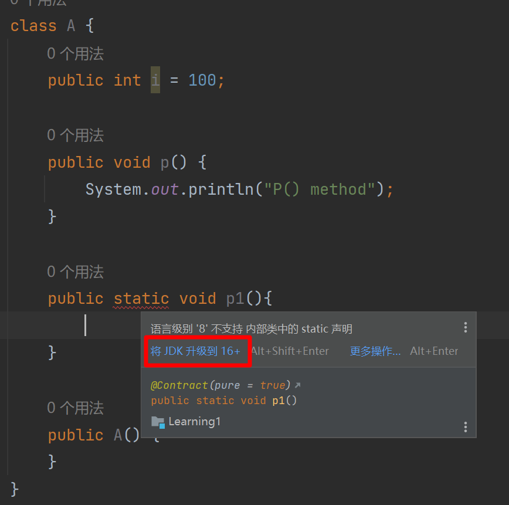

其他的情况就和正常的类一样使用即可，还有就是，因为他是局部的，而且是方法内部的，所以无论是什么等级的访问修饰符其实都是一个作用的，就是延伸也延伸不到外面，都是被困死在这个方法内部的，而且就算使用了private关键字进行的声明，在这个方法里面还是可以照常使用被private声明的方法以及属性的，其余和外部的类是一样的

```java
package innerClass;

public class LocalInnerClass {
    public static void main(String[] args) {
        class A {
            private int i = 100;

            private void p() {
                System.out.println("P() method");
            }

            public A() {
                System.out.println("创建对象");
            }
        }
        A a = new A();
        System.out.println(a.i);
        a.p();
    }
}
```

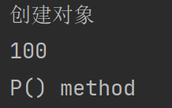

局部内部类的作用就是，比如你在方法中临时要用到这块内容，然后这块内容只有在类中是可以实现的，才会这么去用，在一般的开发状况下是用不着的，但是java还是提供着这个办法先，我们也就可以当做了解，不做过多的深入

### 成员内部类

成员内部类的位置和只有一个类的时候的内部里面的方法和属性是同一等级的，也就是class内部的class和method和property是一个等级的，所以也说明，我们在同一个类里面方法1是不是可以正常调用方法2，所以我在成员内部类class里面的方法3也是可以调用外部类的方法1，如果有重复的，就和局部变量一样，就近原则。

希望大家还记得我们讲就近原则的时候的情况，是this相关，有属性i和形参i，如果只用i就会就近使用形参i，所以这里同理，如果我们就近上使用了同名方法，但是实际上我要用外边的，我们就需要使用this，但是我们这个时候也在类里面，所以这个this前面就要加上一点东西，就是外部类的名字，成员内部类的东西还是很多的，我们娓娓道来

我们先讲创建和使用

```java
package innerClass;

public class OuterClass {
    public class InnerClass {
        public void p1() {
            p();
        }
    }

    public void p() {
        System.out.println("OuterClass p()");
    }
}
```

创建十分的简单，就是这样子即可，就是类里面套了一个类，但是我们使用起来的话就没有那么的方便了，我们先学习一下怎么使用，和使用的原理是怎么样的，然后怎么简略使用。

首先，我们的这个类是内部类，所以说是内部的一个类，然后他又是个普通成员，是非静态的，所以我们想要使用这个类，是不是需要使用对象.类这样子的用法，所以就是我们先要创建一个外部类的对象，然后通过外部类的这个对象进行创建内部类的对象

创建外部的类我们还是非常习惯和擅长的是吧，就使用 `OuterClass outerClass = new OuterClass()`
即可创建外部的类，但是要创建内部的类的话，需要使用外部的类进行new，所以我们写起来就是这样的，自然是基于上面外部类的对象创建好的基础上进行创建的，

`OuterClass.InnerClass innerClass = outerClass.new InnerClass()`

是不是非常的长,但是希望大家能够理解这个意思，毕竟我已经讲的很清楚了，想要创建一个非静态类然后又在成员位置的类的对象，首先就需要先创建一个外部类的对象，然后再通过这个对象对内部的类进行对象的创建。

然后我们再来看一个缩减版，就是不需要保存外部对象就可以创建，其实就是匿名内部类的使用

`OuterClass.InnerClass innerClass = new OuterClass().new InnerClass();`

学的比较好的同学们应该可以看懂，其实就是一模一样的，只不过匿名了一下

```java
package innerClass;

public class OuterClass {
    public class InnerClass {
        public void p1() {
            p();
        }
    }

    public void p() {
        System.out.println("OuterClass p()");
    }
}

class Test {
    public static void main(String[] args) {
        OuterClass.InnerClass innerClass = new OuterClass().new InnerClass();
        innerClass.p1();
        OuterClass outerClass = new OuterClass();
        OuterClass.InnerClass innerClass1 = outerClass.new InnerClass();
        innerClass1.p1();
    }
}
```

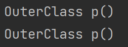

还是非常的简单的对吧，然后我们现在已经会了怎么创建并使用，就再来深究一下内部的情况，比如我刚刚说的就近原则，还有使用外部类的属性和方法，这里我们已经浅演示了一下，因为我们内部类的p1调用了p方法，然后p方法是从属于外部类的。

我们来看一下内部类的就近原则，和使用外部的怎么进行使用，我们使用 `外部类类名.this.方法` 就可以实现调用

```java
package innerClass;

public class OuterClass {
    public class InnerClass {
        public void p1() {
            p();
            System.out.println("以上为内部类的p，接下来是外部类的p");
            OuterClass.this.p();
        }

        public void p() {
            System.out.println("InnerClass p()");
        }
    }

    public void p() {
        System.out.println("OuterClass p()");
    }
}

class Test {
    public static void main(String[] args) {
        OuterClass.InnerClass innerClass = new OuterClass().new InnerClass();
        innerClass.p1();
    }
}
```

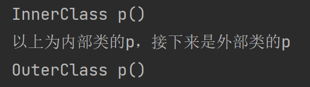

现在大家也都已经会了就近原则和怎么使用被就近原则的方法了，接下来我们来讲讲内部类继承的特性

```java
package innerClass;

public class OuterClass {
    public int i = 100;

    public class InnerClass extends OuterClass {
        public int i = 50;

        public void p1() {
            System.out.println("p1()");
            OuterClass.this.p();
        }

        public void p() {
            p1();
            System.out.println("InnerClass p()");
        }
    }

    public void p() {
        System.out.println("OuterClass p()");
    }
}

class Test {
    public static void main(String[] args) {
        OuterClass innerClass = new OuterClass().new InnerClass();
        innerClass.p();
        System.out.println(innerClass.i);
    }
}
```

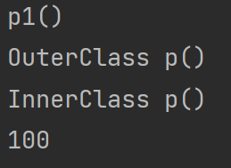

实际上，和普通的继承是一样的。

### 静态内部类

> 静态的成员内部类，就因为是静态的，所以会出现静态的一些特性。

有但不限于，自身为静态，所以不能调用外部的非静态的属性，
比如外部的属性i就是不能调用的，即使自己也没有i。不能出现OuterClass.this.p();
因为这个是属于调用对象了，所以为非静态，然后外部如果为静态方法的话，那就是使用 OuterClass.p()
进行调用了，然后在创建对象的时候也不一样的，要
`OuterClass.InnerClass innerClass = new OuterClass.InnerClass();`
因为这个类为静态类，所以和其他静态属性和方法一样的，无需创建对象，直接使用 `类名.静态类名` 即可。

同样，继承的话那也和成员内部类一致，但是还有静态类的特性保持住就是一样了。

```java
package innerClass;

public class OuterClass {
    public static int i = 100;

    public static class InnerClass {
        public static void p1() {
            System.out.println("p1()");
        }

        public void p() {
            System.out.println(i);
            p1();
            System.out.println("InnerClass p()");
        }
    }

    public void p() {
        System.out.println("OuterClass p()");
    }
}

class Test {
    public static void main(String[] args) {
        OuterClass.InnerClass innerClass = new OuterClass.InnerClass();
        innerClass.p();
        OuterClass.InnerClass.p1();
    }
}
```

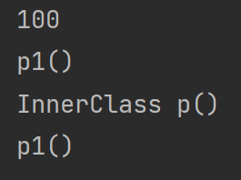

静态内部类在实际的作用中还是比较多的，毕竟创建完静态类其实和创建在外边的普通类是差不多了，只不过这个放在内部更好的看见，因为这样普通的类也是进行一次加载，然后对加载完的这个类进行对象的创建，相当于就是镜像，这个声明就是静态，说明和普通的类是一样的加载过程，不像成员内部类会出现，我换一个对象，那个我的类就得重新加载一遍这种情况

### 匿名内部类

> 这个类非常的好用而且非常的经常用，就比如说我们创建不了对象的，抽象类啊、接口啊这些，包括正常的类都是可以衍生出匿名内部类的

一般我们的匿名内部类的声明都是 `类名 对象 = new 类名(){ }`
然后需要补充的东西写在花括号里面，可以理解为直接创建了一个类，然后继承或者是实现了这个最左边的父指子的这个父，我们分别使用抽象类和接口来给大家演示一下，使用匿名内部类的方式实现功能，然后我们再说一下普通的类可以不可以使用匿名内部类的方式进行创建

```java
package innerClass;

public class AnonymousInnerClass {
    public static void main(String[] args) {
        //从花括号开始就是匿名内部类的创建
        A a = new A() {
            @Override
            public void a() {
                System.out.println("method a()");
            }
        };
        a.a();
        a.p();
    }
}

abstract class A {
    public void p() {
        System.out.println("打印一些东西");
    }

    public abstract void a();
}
```

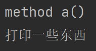

我们再来看看接口，这次我们搞两个方法，这里说一句题外话，就是jdk8的新特性，单个方法的接口，又叫做函数式接口，可以使用java8加入的新特性Lambda表达式来更快的解决，Lambda表达式就是匿名内部类写单个方法的接口的缩写版，也就是函数式接口的匿名内部类的缩写版，我们暂且只是提一嘴

```java
package innerClass;

public class AnonymousInnerClass {
    public static void main(String[] args) {
        TwoMethods twoMethods = new TwoMethods() {
            @Override
            public void one() {
                System.out.println("print one");
            }

            @Override
            public void two() {
                System.out.println("print two");
            }
        };
        twoMethods.one();
        twoMethods.two();
    }
}

interface TwoMethods {
    void one();

    void two();
}
```

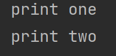

能理解吧，接下来我再带大家看一个东西，也就是字节码的各种内部类是怎么样的。

自然我们从idea中还是看不到的

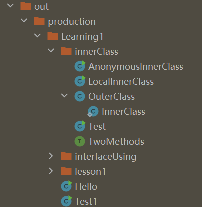

这里放的还是比较保守的，其实就是可视化更好，所以接下来我们直接去文件里面去瞅瞅。

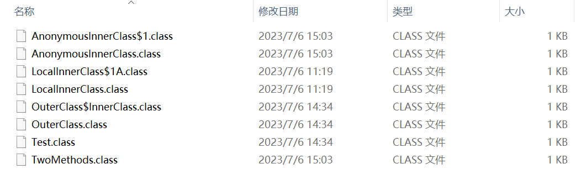

以肉眼可见，我们的LocalInnerClass中出现了个$1A，这个其实就是成员内部类创建的字节码，然后我们的匿名内部类创建的则是，AnonymousInnerClass$1，我们可以来证明一下

```java
package innerClass;

public class AnonymousInnerClass {
    public static void main(String[] args) {
        TwoMethods twoMethods = new TwoMethods() {
            @Override
            public void one() {
                System.out.println("print one");
            }

            @Override
            public void two() {
                System.out.println("print two");
            }
        };
        twoMethods.one();
        twoMethods.two();
        System.out.println(twoMethods);
        System.out.println(new AnonymousInnerClass());
        System.out.println(twoMethods instanceof AnonymousInnerClass);
        System.out.println(twoMethods instanceof TwoMethods);
    }
}

interface TwoMethods {
    void one();

    void two();
}
```

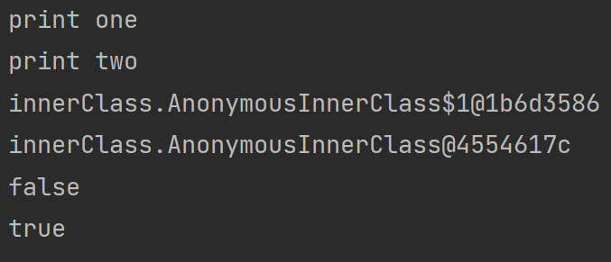

答案告诉我们，他只是名字是和这个AnonymousInnerClass有关，但和这个类实际上是无关的，因为我们在判断实例的时候直接返回了false，下面的true也说明我们直接创建的这个类，实际上就是实现/继承了我们没办法直接创建实例的类，并创建一个对象，但是没有实际的名字给我们看到，所以叫做匿名内部类

包括匿名对象，其实我们不知道这个对象的名字，毕竟我们的 Hello hello = new Hello() 里面的对象就是hello是吧，但是我们直接使用
new Hello() 的话是不是就是不知道他叫什么名字，那是不是就是匿名的。

还有一点，就是不只是只有不能创建对象的抽象类和接口才能使用匿名内部类，其实什么类都可以使用匿名内部类的方式进行创建对象，包括正常的类，接下来就给大家演示一下

```java
package innerClass;

public class AnonymousInnerClass {
    public static void main(String[] args) {
        Dog dog = new Dog() {

        };
        dog.setAge(10);
        dog.setName("Nick");
        System.out.println(dog);
    }
}

class Dog {
    private String name;
    private int age;

    @Override
    public String toString() {
        return "Dog{" +
                "name='" + name + '\'' +
                ", age=" + age +
                '}';
    }

    public String getName() {
        return name;
    }

    public void setName(String name) {
        this.name = name;
    }

    public int getAge() {
        return age;
    }

    public void setAge(int age) {
        this.age = age;
    }

    public Dog() {
    }

    public Dog(String name, int age) {
        this.name = name;
        this.age = age;
    }
}
```


结果很明显，并没有任何的问题

### [上一章](day13.md)

[//]: # (### [下一章]&#40;day15.md&#41;)

### [返回目录](README.md)