# ***Day15 枚举与Debug***

> 这节课我们来看看枚举，和Debug，当我们学完并会用debug之后呢，编码会非常的舒服，而且debug就是调试嘛，所以我们会了debug之后，在程序哪里出问题也可以进行锁定。

## 第一章 枚举

> 枚举并不是非常的常用，但也可以说是非常的常用，因为枚举主要就是储存的常量，但是其实我们写在接口里面也是一样的，然后不写接口使用普通的类写也是一样的，所以并不是特别常用，主要就是因为有替代品。
>
> 但是枚举的好处就在，我可以不写类型，我判断的时候都使用该枚举的属性即可，虽然正常写也是这样的，就是我们在一个场景需要
> RED、GREEN、YELLOW的情况下，我们使用普通的常量声明，可以让他为任何的值，但是枚举就是直接写他们的名字自动为字符串类型。

首先我们和接口和普通的类一样，我们先来讲讲怎么声明和使用，至于我为什么和接口和普通的类一样，就是因为我们的这个枚举，也是通过变更interface或者是class达到枚举的创建，其实也就是一个类，我们的枚举声明使用的关键字是 `enum`
我们使用自然除了手动改是可以的，也可以使用创建的时候选择，如下

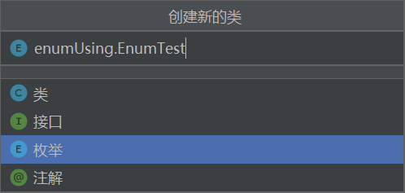

我们只需要选择为枚举就可以直接创建枚举了

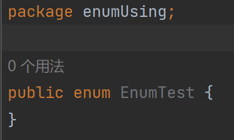

很明显的可以看到，我们进行更改就只有class所在的那个位置，那我们先来讲讲枚举怎么使用

首先我们需要知道，枚举其实也是类，只不过是有点特殊的类，就是他多了枚举这么个东西，所以我们在使用的时候其实就是可以当做普通的类进行使用，但是不能创建对象，然后多了特殊的属性，在初始化这些属性的时候会进行本类的初始化和创建对象，在后面我们会使用debug来查看这一现象，首先我们来说说特殊的属性和枚举使用的用法

枚举的特性

* 和普通的类一样，有方法，属性，构造器，静态，代码块等等
* 不能创建对象
* 多了枚举量
    * 枚举量只能作为第一语句，要在类的最上面，末尾使用分号，如果不使用分号则不能有其他语句，如果没有其他语句可以不用分号

我们来看看两种枚举，一种是就只有枚举量的枚举，另外一个是有点像普通类的枚举。

普通枚举类

```java
package enumUsing;

import java.lang.reflect.Field;
import java.lang.reflect.Method;
import java.util.HashSet;
import java.util.Set;

public enum EnumTest {
    //属性，也就是枚举量的声明，在有其他语句的情况下要在第一行，或者说是第一个语句
    //在写其他语句的时候，要在第一个语句后面先加上分号结束这个语句才可以写其他的
    //然后我们就是当声明变量，也就是按照规范写都是可以的，然后多个就用逗号隔开
    A, B, C, D, E,
    F, G,   //可以随意换行，只要带上逗号即可
    H,
    I,
    J,
    K;  //分号结束，如果只有枚举类可以不用
}

class Main {
    public static void main(String[] args) {
        EnumTest a = EnumTest.A;    //返回类型其实就是Enum类型

        //下面这块代码，大家可以先不用管，这个是为了打印信息给大家看的，就是这个枚举类自带的什么方法
        //想要了解的以后会说的，分别用到了容器和反射来映射类的信息
        Set<String> ms = new HashSet<>();
        //获取类
        Class<? extends EnumTest> aClass = a.getClass();
        //从类中获取方法
        Method[] methods = aClass.getMethods();
        //保存方法到集合里面，集合和高中集合的特性是一样的，不可重复
        for (Method method : methods) {
            method.setAccessible(true);
            ms.add(method.getName());
        }
        //获取Object，还记得我们说的所有类其实都直接或者间接继承Object类
        Class<Object> objectClass = Object.class;
        //获取Object类的方法
        Method[] methods1 = objectClass.getMethods();
        //遍历方法数组并从集合中移除Object内有的方法
        for (Method method : methods1) {
            method.setAccessible(true);
            ms.remove(method.getName());
        }
        //得出来的就是枚举的方法
        System.out.println("枚举的方法:");
        for (String m : ms) {
            System.out.println(m);
        }
        System.out.println("枚举的属性:");
        //获取字段
        Field[] fields = aClass.getFields();
        //打印字段
        for (Field field : fields) {
            System.out.println(field);
        }
    }
}
```

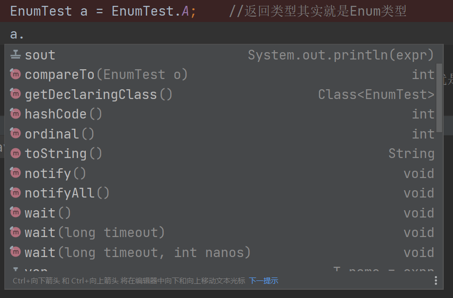

我们这里就能看到有非常多的方法，但是又不少是重复的，所以我们就要使用刚刚main方法下面写的反射+集合的方式去去除重复的，并获取里面的方法来打印

```
枚举的方法:
valueOf
values
compareTo
getDeclaringClass
name
ordinal
枚举的属性:
public static final enumUsing.EnumTest enumUsing.EnumTest.A
public static final enumUsing.EnumTest enumUsing.EnumTest.B
public static final enumUsing.EnumTest enumUsing.EnumTest.C
public static final enumUsing.EnumTest enumUsing.EnumTest.D
public static final enumUsing.EnumTest enumUsing.EnumTest.E
public static final enumUsing.EnumTest enumUsing.EnumTest.F
public static final enumUsing.EnumTest enumUsing.EnumTest.G
public static final enumUsing.EnumTest enumUsing.EnumTest.H
public static final enumUsing.EnumTest enumUsing.EnumTest.I
public static final enumUsing.EnumTest enumUsing.EnumTest.J
public static final enumUsing.EnumTest enumUsing.EnumTest.K

```

因为内容太多一下子没截下来，所以我们就使用这种方式给大家展示，大家如果是复制粘贴并运行的话，其实输出也是一模一样的。

然后在写完我要去查看对应方法是什么作用的时候，死去的记忆突然开始攻击我，我使用反射获取方法和属性的时候是因为我印象里这个枚举在底层是自动继承了抽象类Enum的，但是我一开始没有找到，后面追方法的时候追进去了，所以给大家看看，可以去翻一下源码

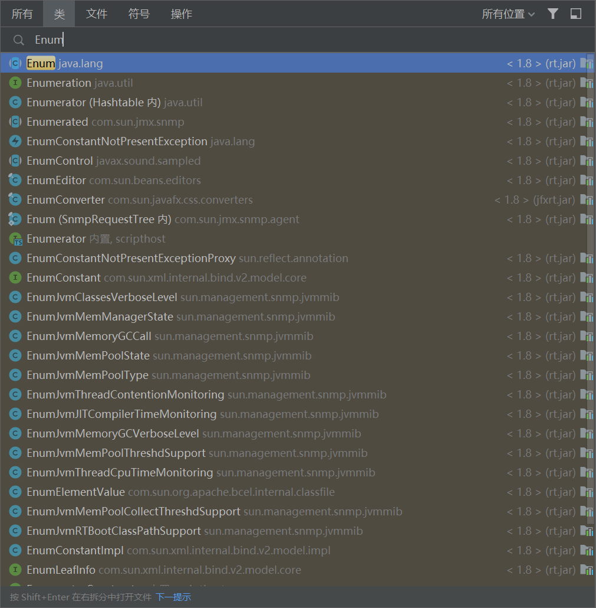

使用双shift打开搜索，切换到类，然后输入Enum并打开右上角的所有位置，就可以看到了，打开这个类就在里面，都有对应的方法，但是我想了想，毕竟我反射写都写了，删了也有点可惜，毕竟让大家感受一下编程的魅力和乐趣，让你们感觉一下
“还有这种操作” 的想法，能提起一下学习的动力，毕竟当初我学反射的时候是非常的有意思的。

我们现在来说一下他的方法分别是什么，我们按顺序来

1. valueOf 静态方法，直接调用，作用是获取对应的属性
2. values 静态方法，获取枚举类数组，因为枚举量其实就是自己一个枚举类
3. compareTo 实现了Comparable接口，是这个接口里面的方法
4. getDeclaringClass 获取声明类，其实就是封装到Enum中反射操作之一
5. name 获取名字，因为他是字符串然后变量名又是同样的
6. ordinal 获取原始值，这个就是和C里面的枚举一样，他的原始值，在Java中就这么理解好了，使用下标标注然后就是根据你写的枚举量的顺序来的，自然是0位下标

然后我们再来看一眼反射获取的字段分别是什么，其实就是刚刚所说的，枚举量的类型其实就是该枚举。然后里面封装了方法，比如说name就是获取名字的，所以说 `public static final enumUsing.EnumTest enumUsing.EnumTest.A`
其实就是一个叫做A的变量，然后类型是EnumTest

我们分别来使用一下

```java
package enumUsing;

import java.lang.reflect.Field;
import java.lang.reflect.Method;
import java.util.HashSet;
import java.util.Set;

public enum EnumTest {
    //属性，也就是枚举量的声明，在有其他语句的情况下要在第一行，或者说是第一个语句
    //在写其他语句的时候，要在第一个语句后面先加上分号结束这个语句才可以写其他的
    //然后我们就是当声明变量，也就是按照规范写都是可以的，然后多个就用逗号隔开
    A, B, C, D, E,
    F, G,   //可以随意换行，只要带上逗号即可
    H,
    I,
    J,
    K;  //分号结束，如果只有枚举类可以不用
}

class Main {
    public static void main(String[] args) {
        EnumTest a = EnumTest.A;    //返回类型其实就是Enum类型
        //原始值
        System.out.println(EnumTest.A.ordinal());
        //因为是静态，所以也可以直接类.属性出来
        //名字
        System.out.println(EnumTest.B.name());
        //不写也一样，相当于自己调用了name和toString是一样的
        System.out.println(EnumTest.C);
        //反射
        System.out.println(EnumTest.D.getDeclaringClass());
        //compareTo不用管，是判断大小用的，主要是一开始没想起来也没想过他实现了Comparable
        //values 获取类，可以遍历获得里面的枚举
        EnumTest[] values = EnumTest.values();
        //valueOf(String) 给字符串，获取对应的枚举量，如果没有就抛异常，简单理解为报错
        System.out.println(EnumTest.valueOf("E"));
        //这里演示一下，但是使用异常处理的方式，让报错也不能停下运行
        try {
            System.out.println(EnumTest.valueOf("123"));
        } catch (Exception e) {
            //不让他爆红，就打印一下错误是什么
            System.out.println(e);
        }
        //valueOf(Class, String) 通过反射类配合字符串获取
        System.out.println(EnumTest.valueOf(EnumTest.class, "F"));
        System.out.println("以上就是全部的方法了");
    }
}
```

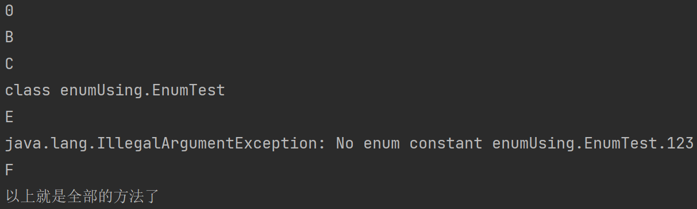

然后我们再来看看有点像普通类的枚举类，就是加上普通类的一些方法和属性，然后记住顺序不能错

```java
package enumUsing;

public enum EnumTest2 {
    Monday, asd, ASD;
    private int i = 100;

    EnumTest2() {
        p();
    }

    public void p() {
        System.out.println(Monday);
    }

    public static void p2() {

    }

    public static void main(String[] args) {

    }
}
```

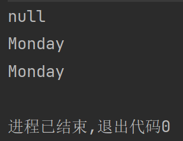

我们来看看为什么，首先没有报错，所以证明他和普通类是一样的，可以有静态方法，属性，普通方法，然后还有构造器，然后出现这个情况，应该是有不少人想到是为什么的。

还记得就上面我们获取enum的a的时候的情况吗？是不是返回了enum同样的类型，所以自然是在自己内部进行了初始化，因为有三个枚举类，所以初始化了三次，至于为什么第一次没有是因为，第一次就是初始化Monday这个枚举类，所以没有属性，所以是null，后面两次，因为都调用了然后又初始化了，所以就打印出来了

## 第二章 Debug

> 这个可是重中之重的知识点，不会这个那就完蛋了，工作都找不到了。找到了出现了问题之后自己也解决不掉了。但是debug大部分还是看自己的经验的，或者说是有报错，根据报错的地方打断点并进行debug

我们先进行我们的第一个debug，用最简单的程序，HelloWorld
那我们先进行断点的设置，非常的简单，看图

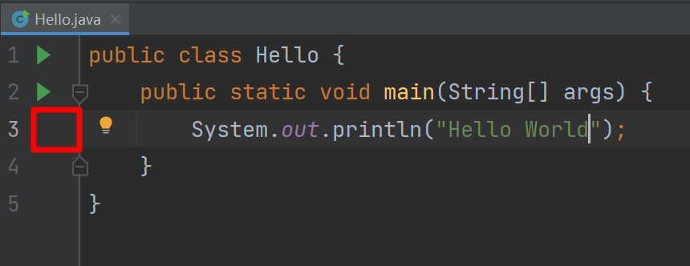

我们点击图片内标红的地方，其实就是代表行数的数字的右边一小部分，一点就可以变成一个红点，那就是断点

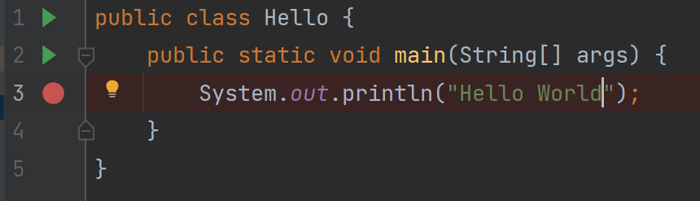

然后我们就可以开始debug了，注意，这里就是在运行的时候要注意了，因为我们要选择debug而非运行，就是调试

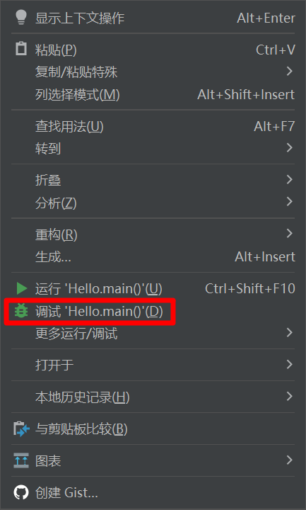

直接点调试即可

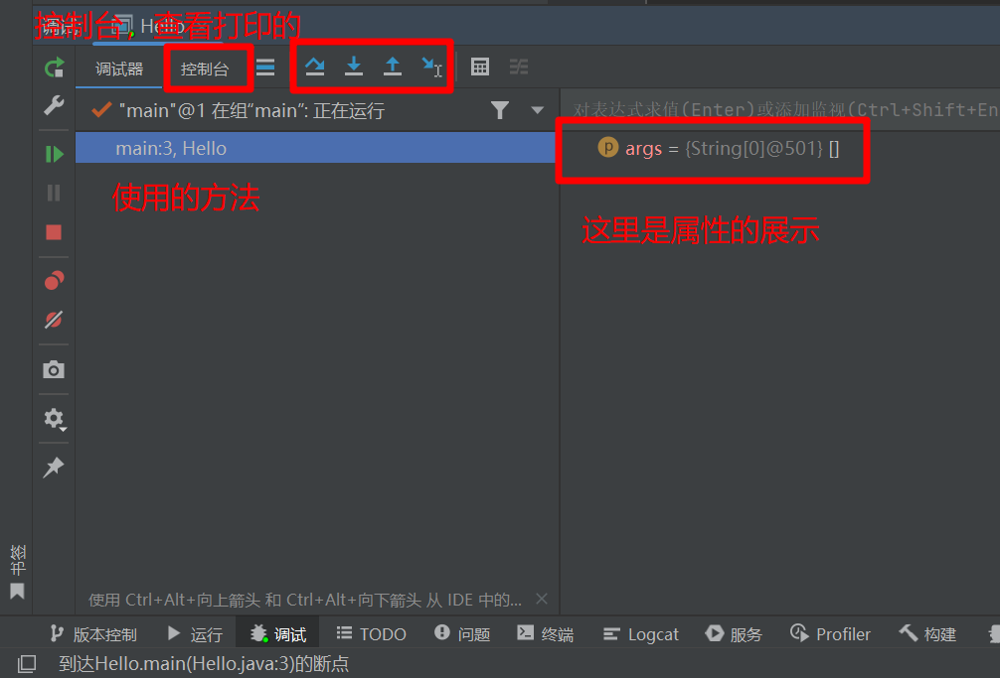

我们来讲讲，框起来的四个蓝色的，分别是

* 步过(F8) 下一步
* 步入(F7) 进入方法，如果没有方法就下一步
* 步出(Shift+F8) 从方法里面出来
* 运行到光标处(Alt+F9)

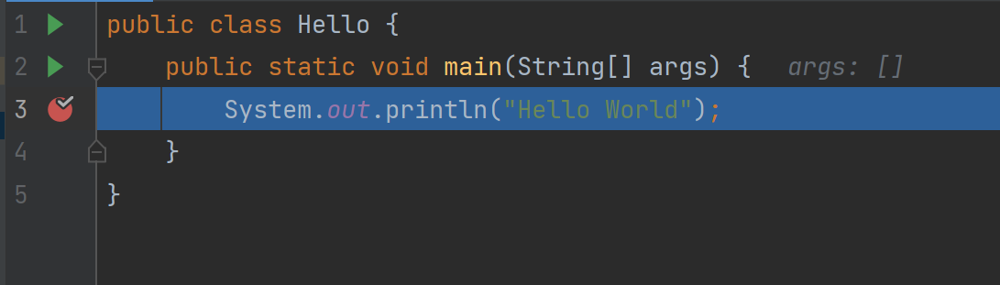

然后我们看代码，是不是有蓝的一块，那就是当前执行到这一步，但是这一步还没有执行，等待我们的命令，因为debug是正常跑程序，跑到有断点的地方为止，如果我们没打断点，或者打断点的地方他运行不过来，那就不会顿住，会直接运行完

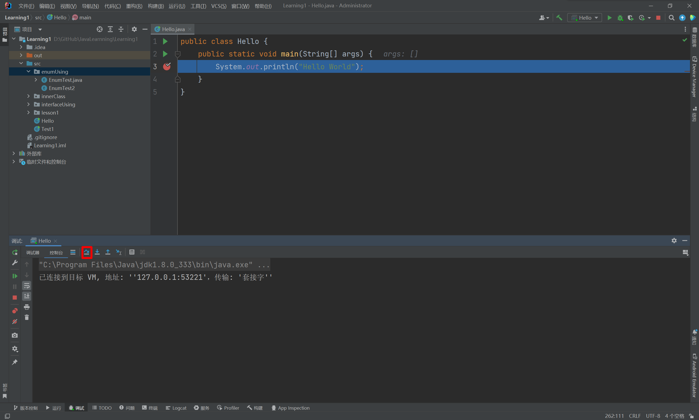

我们点击步过来走一步

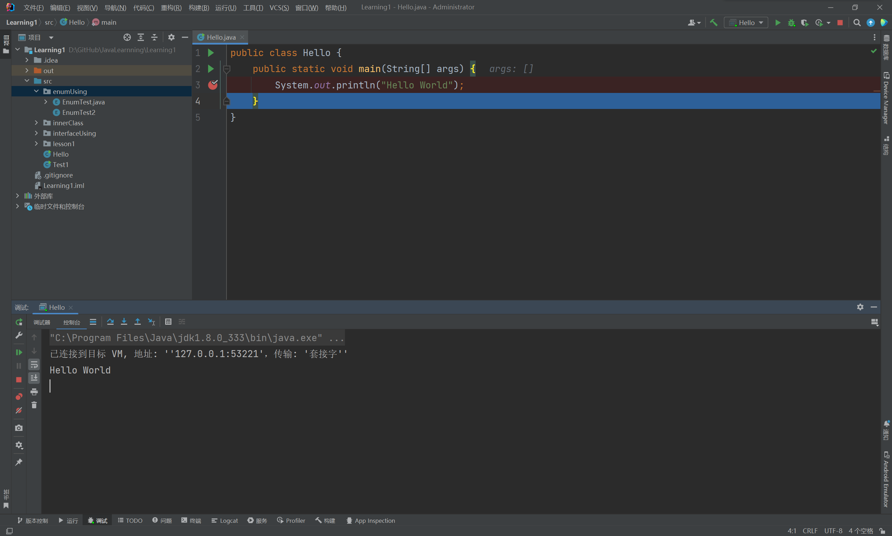

程序里面执行了一步，然后我们的控制台也打印了东西，然后运行到了这个方法的结尾处，如果是我们调用的方法就选择了步过就会结束这个方法回到上一个调用这个方法的方法，假如就是我们的main方法调用了方法p，然后方法p运行到花括号的结尾了，那我们使用步过，就会结束这个方法，并且，回到main方法。

那假如我们多套一点，比如我使用main方法调用p，然后使用p调用m，我们结束了m方法就会回到p方法，然后再运行结束，回到main方法

如果我们在方法上面没有按步入而是步过的话，那就会直接执行完这个方法后再走一步。

```java
public class Hello {
    public static void main(String[] args) {
        System.out.println("Hello World");
        p();
    }

    public static void p() {
        System.out.println("打印 p");
    }
}
```

这种情况，然后我们把断点继续打到打印hello world那一行，然后一直步过就不会进入p方法，那如果我们停顿在要执行p方法的时候用了步入就会进入p方法。

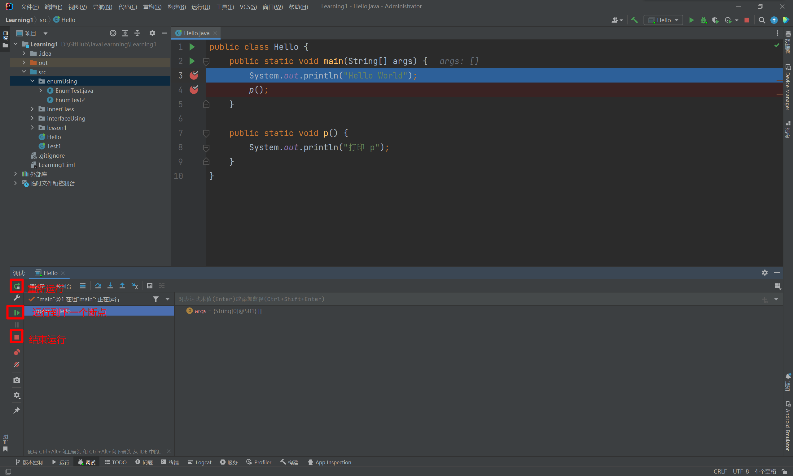

这里是左边一列，常用的，有运行到下一个断点等等，在图上都标记了

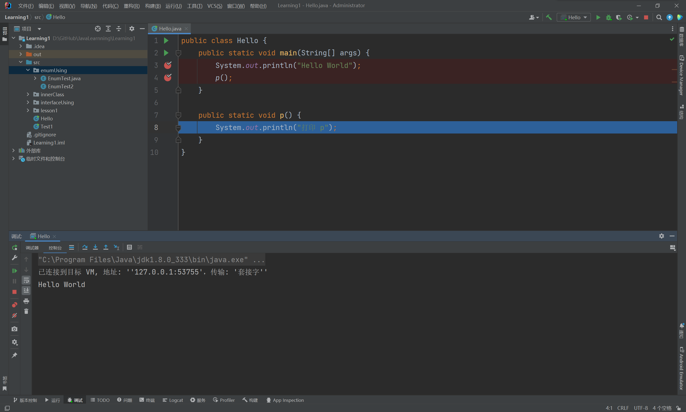

这里就是步入了方法，自然构造器啊，类的其他地方都是可以步入的，包括你直接把断点打到静态代码块里面，也是一样的，只要能运行到然后检测到有断点的话就会停住。这就是debug，还有更多的内容可以自己摸索一下，因为教只能教个入门，这个怎么用都是看个人习惯，属于是斧头教了你怎么用，怎么挥着舒服是自己的自由

### [上一章](day14.md)

### [下一章](day16.md)

### [返回目录](README.md)