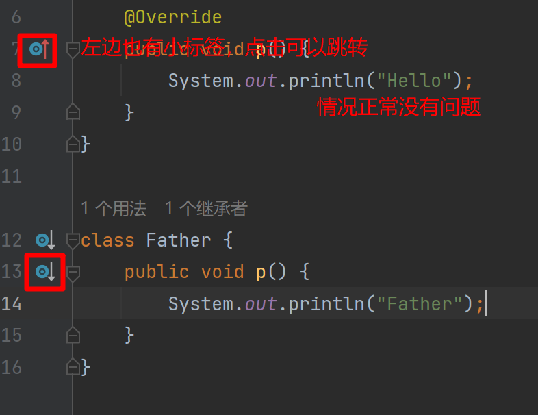

# ***Day16 注解和异常处理***

> 为什么一定要标注是元注解呢，这个原因其实非常的简单，因为注解现在还不能写，想要使用注解达到SpringMVC和SpringBoot的等级需要使用反射，但是反射我们现在还不会，所以就先讲讲最基本的元注解。

## 第一章 注解

> 注解分很多类型，除了一般我们使用的普通注解还有负责辅助注解工作的元注解，普通的注解我们一般使用的不是特别多，虽然java的注解是很多的，但一般用到的时候再去查资料和看api文档都是可以的，只需要记住常用的几个注解

### @Override

在我们自动生成要实现的内容的时候，或者自动生成并更改要从父类继承的方法时，我们的idea会自动带上这个注解
@Override，之前我前说过一嘴，就是检测是否真的是要重写，这个就是这个注解的作用，我们待会讲完元注解之后稍微看的细一点。现在先简略的看一下。




### @Deprecated

这个注解是已经弃用的注解，标注了之后再调用就会出现一个小划线


就会出现这种小横线，意思也很明确，反正就是划掉了让你别用，但是只是建议让你别用而不是不让你用，你只要想用，都还是可以使用的。我们再来看看，我们调用完之后会出现什么


很明显，我们直接能看到他报黄了，报的是被弃用的成员还在被使用。所以这个也只是个警告并不是错误，所以是不会影响编译的。

### @FunctionalInterface

这个时候要讲一讲这个了，但是并不是人人都用的，毕竟java自带的注解其实功能都是比较方便但是不够全面的，只有用上了框架之后，他们的注解才是真的好用

这个注解的意思就是函数式接口，就是我们之前说过的，可以使用jdk8的新特性lambda表达式进行快速创建匿名内部类进行使用的。函数式接口的结构为一个接口但是有且只有一个抽象方法。

所以我们的这个注解就是检测他是不是函数式接口，如果不是就爆红，和@Override是有点相似的，至于为什么说是只能有一个抽象方法呢，因为其他的可以直接用，比如default方法和静态方法，还有常量，他们都是不会影响匿名内部类的，所以也就是不会影响函数式接口的存在，所以他们的存在与否其实无所谓。

说了这么多，来给大家演示一下好了。

```java

@FunctionalInterface
public interface Function {
    int i = 100;

    default void method() {
        System.out.println("print");
    }

    static void method2() {
        System.out.println("static method");
    }

    void p();
}
```


没有任何的问题，但是我们再来看一看如果不是一个抽象方法呢，没有抽象方法的情况我们就不看了，毕竟和有两个及以上是一样的情况，我就演示两个的情况给大家看。


是不是看到爆红了，这个就是因为刚刚所说的，是警告，因为我们是函数式接口就只能有且只有一个抽象方法，不能有更多或者更少的。

再给大家看一个东西，就是我们之前说过的lambda表达式，但是现在没必要去学习。因为后面会讲，在我们学习完javaSE的全部内容之后就会接入jdk的新特性进行学习。

我们的lambda表达式也叫做箭头函数，所以就是那箭头来代表我们是lambda表达式，我们来看看区别和节省的空间有多少。

### Lambda表达式(略讲，可以跳过)

先来看看无参但是有返回值的情况

```java
package annotation;

public class AnnotationTest {
    public static void main(String[] args) {
        Function f1 = new Function() {
            @Override
            public int p() {
                System.out.println("123");
                return 5;
            }
        };
        //带函数体的情况
        Function lf1 = () -> {
            System.out.println("123");
            return 5;
        };

        Function f2 = new Function() {
            @Override
            public int p() {
                return 5;
            }
        };
        //直接返回值的情况
        Function lf2 = () -> 5;
        System.out.println(f1.p());
        System.out.println(lf1.p());
        System.out.println(f2.p());
        System.out.println(lf2.p());
    }
}

@FunctionalInterface
interface Function {
    int p();
}
```


我们的idea其实也推荐我们使用lambda表达式，点击替换其实就可以直接切换了


这个就是输出的结果，我们如果直接打印一下他们本身的对象就会变成这样


其实也很明显，前面的匿名内部类是$1，然后我们的Lambda其实就加了点后缀是吧，实际上都是匿名内部类，但是java的底层已经把lambda封装一下，所以我们用起来lambda，用起来这个箭头函数是很舒服的。前提是你能看的很懂

接下来我们来演示一下有参数的情况

```java
package annotation;

public class AnnotationTest {
    public static void main(String[] args) {
        //带参数的函数式接口，其实只需要符合参数列表就行，无所谓类型，有点python和js的意思了是吧
        //而且也不规定一定要用你参数列表一模一样的名字
        Function f = (i, j) -> {
            int c = (int) (i + j);
            c += 5;
            return c;
        };
        System.out.println(f.p(5, 6));
        //然后我们除了这种方式还可以用其他的，直接应用方法对函数式接口进行使用
        //类::方法的方式进行引用
        Function f2 = AnnotationTest::returnSomething;
        System.out.println(f2.p(5, 6));
    }

    //为了实现直接使用函数式接口直接引用，比写在里面更方便一点，我们就可以使用这种方式
    public static int returnSomething(int i, double j) {
        int c = (int) (i + j);
        c += 5;
        return c;
    }
}

@FunctionalInterface
interface Function {
    int p(int a, double b);
}
```


对于这节课来说这个其实是属于额外内容，可以不学，有兴趣的可以看一下，继续讲我们下一个的注解，这个注解可厉害了，可以拦住你的报黄

### @SuppressWarnings

抑制报错的，应该说是抑制警告的注解，可以让你看不到烦人的报黄。用法是十分的简单的。就只需要写上@SuppressWarnings之后呢，在他的括号里面填写以下的内容即可，随便选一个都行，也可以填数组

@SuppressWarnings("all") √  
@SuppressWarnings({"all"}) √  
这两种方法都是可以的，可以写单个，也可以写一个数组，所以能听懂我意思吧，既然是数组的话，那自然是都可以填写的，你可以填写不止一个，那我们看看他的作用范围在哪里，前面的三个我们都很清楚，差不多都是有限的，那这个填在哪里呢，这个时候就要教你们元注解了，马上来。

1. "all"：抑制所有类型的警告。
2. "unchecked"：抑制未经检查的警告，例如使用泛型时的类型转换警告。
3. "deprecation"：抑制使用过时方法或类的警告。
4. "rawtypes"：抑制原始类型未经检查的警告。
5. "unused"：抑制未使用的变量或未调用的方法的警告。
6. "cast"：抑制类型转换时的警告。
7. "serial"：抑制缺少 serialVersionUID 的警告。
8. "finally"：抑制 finally 块无法正常完成的警告。
9. "fallthrough"：抑制在 switch 语句中的 case 块之间缺少 break 语句的警告。
10. "rawtypes"：抑制使用原始类型（raw type）相关的警告。

## 第二章 元注解

### @Target

> 看名字也看出来了，目标嘛，这马上就接上我们说的那个，范围，目标就是他注解要写在哪里的，我们先来看看@SuppressWarnings的源码


不难看出，都写着英文的对吧，Type,Field,Method,Parameter,Constructor,LocalVariable，但是还是不是很懂，但是又不是不懂，比如看懂了Field
字段，Method 方法，Parameter 参数，Constructor 构造器，是吧，其他的邮电看不懂，那我们就再追一层，直接追Target里面填的东西，我们发现是


看注释，是不是有解释，然后我们就可以看到这个Type没想到，就是写在 `类啊，接口(包括注解)还有枚举上面的`
本土化翻译😁。然后我们再看看下面的LOCAL_VARIABLE，是不是写着 local variable
declaration，局部类型声明，所以其实写的是很明白的，只需要我们浅看一下就会了，至于为什么Type上面写的注解里面为什么是interface然后括号一个包括注解类的呢，这个嘛就是因为，注解的声明其实是@interface替换interface或者class或者enum。

所以能知道@SuppressWarning是写在哪里的了吧，其实包括其他的我们也都可以看一下

@Override的


@Deprecated的


@FunctionalInterface的


是不是有疑问，都有Target，那Target自己呢？还有这个@Retention是什么？我们一个一个来，我们先来看他自己，没想到吧，自己头上也有个自己🤣，具体怎么实现就没必要说了，也是通过反射自己映射的。


### @Retention

> 按照惯例，我们先看英文的意思，Retention，英文的意思是保留的意思，所以这个其实就是在什么情况下进行保留，比如源码，那就是在源码的时候保留在编译的时候进行销毁，比如Runtime，就是在运行的时候进行保留

比如我们的Override就没必要在运行的时候还留着对吧，我们打开他调用的那个枚举，细细看来


我们可以看到，在source上面的注释就是说，会被编译器丢掉，也就是就保留的编译的时候，再看class，在运行的时候抛弃，但是保留在字节码里，说明编译后尚在，但是运行的时候噶了，我们在看runtime，其实都不用看，已经可以猜到了，那就是一直保留着，直到运行完之后一起销毁

很明显，@Retention和@Target其实作为元注解都是拿来修饰的，通过这些衍生出更多的注解自然还有其他的元注解，就说说经常看到的这个@Document好了

### @Document

> 先看源码，我们的@Document是不是也是自己修饰自己呢。


果然还是如此对吧，毕竟是元注解，它本身是用于标记其他注解的存在。它的作用是指示编译器将注解的信息包含在生成的 Java 文档中。

当一个注解被 @Documented 注解标记时，它的元数据（包括注解的名称、描述、参数等）会被包含在生成的 API
文档中。这样，在使用该注解的类、方法或字段的文档中，用户可以看到该注解的说明和用法。

使用 @Documented 注解通常是为了增加注解的可见性和文档化程度，使其他开发人员能够更方便地理解和使用注解。它对于那些希望将自定义注解作为公共API的一部分，或者为使用自定义注解的开发人员提供更详细的文档信息非常有用。

上面这一段话是ChatGPT说的，我来说一下人话，就是你写技术文档的时候其他人可以在查看文档时，能更方便地获取注解的描述、用法和其他元数据信息。

### @Inherited

> 按照惯例，还是先看英文，他的意思其实就是继承的意思，所以只要被这个注解修饰的注解

至于我为什么这么说，其实就是因为他源码就是写的只能标注注解


他其实就是被标注了之后，比如我自己写了个注解叫做 MyAnnotation，然后我标上了经典三个元注解 @Document
@Retention和@Target并填写了对应的参数之后，我们还想要被这个标注的类啊、方法啊、字段啊等等让他的子类也能享受，就写上这个即可。

## 第三章 异常处理

> 注解告一段落了，需要注意的时候注解就是这个@开头的这些个东西，然后如果你是和我一样的黑夜模式是黄色的，
> 而非注释，因为注释是//开始和/**/的叫做注释

然后我们现在来说说异常处理是什么，其实在上次节课讲枚举的时候其实演示过一小段，他报错了，但是并没有打断进程，这个其实就是异常处理的一环。

### 异常和错误

> 我们所说的异常和错误其实区别都是有的，我们所说的异常的英文其实就是Exception，然后错误的话就是Error，是不是非常耳熟，报错了基本就是Error，所以我的异常处理处理的是异常而不是错误

我们先来看一个最简单的异常，就是1/0，是不是无法计算，自然我们说的肯定不是学过高等数学的人，在高数里面这个就是无穷，但是计算机并没有高等数学的概念。

```java
package exception;

public class ExceptionTest {
    public static void main(String[] args) {
        int i = 1 / 0;
        System.out.println("你好");
    }
}
```


我们现在看到报错不要害怕和其他的，我们要看报错的原因，比如看看他的，这个时候英文就非常的有用了， `异常在线程"main"里 java.lang.ArithmeticException: / by zero
在exception.ExceptionTest.main(ExceptionTest.java:5)`

说实话可以翻译的地方真少，后面都是关键字了，上来跟我们说在是哪个线程报的错误，我们现在还没有学习线程和多线程，所以我们的线程只有一个主方法这个线程，也就是主线程。然后马上就是报错的异常类型了，是
java.lang.ArithmeticException 这个类，没错异常其实还是类，错误信息在冒号的后面，是 / 除号也就是除以，by zero
除以0的意思，发生这个错误的信息就是除以0发生的，然后错误的类叫做
java.lang.ArithmeticException，因为要带上package的，他就是java这个包下的lang这个包下的ArithmeticException，之前学过的基础不要忘记了，然后这个是报错信息，下面就是报错地点了，在主线程的第五行，如果是你一个一个方法调用进去再报错的话，他会慢慢进去的，我们来演示一下

```java
package exception;

public class ExceptionTest {
    public static void main(String[] args) {
        p();
        System.out.println("你好");
    }

    public static void p() {
        t();
    }

    public static void t() {
        int i = 1 / 0;
    }
}
```


是吧完全可以锁定报错了已经，而且这个蓝色还是超链接，可以点进去了，就和我写的上一章，下一章是一样的。

知道了报错之后，我们再来看看这一章开头说的错误和异常的关系，我们就直接拿上我们的这个异常，然后再来个数组的下标越界的异常

先来看一下图，这个可不是我自己画的，是可以用idea自己看的


很明显可以看到，我说的Error和Exception分的很开，虽然他的父类都是这个Throwable，但是实际作用还是不一样的，就和继国缘一和继国岩胜一样。

### 处理异常

> 我们是不是说过处理异常处理的是异常而不是错误，一般发生了错误，比如说栈溢出啊，爆内存啊都是错误而不是异常了，是处理不掉的，最起码不是软件层面能处理的。所以我们只处理异常

#### 处理异常的第一种办法(throws)

这个时候我们还需要再说一下我们的异常分哪几种类型，一个是运行异常，一个是编译异常，运行异常是平时不知道，但是会在运行的时候进行报错，编译异常则是在你编译阶段不处理掉，那你就会一直报错无法通过编译。

我们先来演示一下编译异常，因为运行异常不是这个throws可以解决的，throws的这个意思就是抛出，所以在这个关键字修饰了之后就是把异常抛了出去，如果你是方法1调用方法2，然后调用方法3，如果你方法3抛了异常你方法2没处理的话或者抛出的话，那就报错了。如果你抛出了异常的话，只要没有在运行阶段出现这个情况的异常的话，那就不会报错

给大家演示一下，这个要用到后面要学的知识了，因为我们目前并没有出现过编译异常的情况

我们选择最容易有异常的io流操作。


我们刚写完，什么都还没干呢，就报错了，这个就是编译异常，需要在我们编译之前就处理掉，处理的方式也很简单，我们可以直接使用
throws
进行抛出，让下一家，也就是外面调用我这个方法的方法去处理，很显然，调用我们main方法的是jvm，所以就相当于把异常抛给了jvm，如果没报错还好，报错了的话，jvm也是会抛异常，或者说是只会抛异常，会抛下去，发现有错误，
然后停止运行。所以代码就这么停掉的，待会会教第二种处理方式，那个就是真处理了。

然后异常也是有继承关系的，最大的异常就是Exception，往下是越来越小，比如我们现在需要抛出的异常是不是叫做
FileNotFoundException ，但是我们可以抛比这个还要大的，比如IOException或者就是直接丢Exception

我们来看看这个异常类


是不是继承着我刚刚所说的IOException，所以我们可以直接越抛越大，注意只能往大的抛，不能往小的抛。

```java
package exception;

import java.io.FileInputStream;
import java.io.FileNotFoundException;

public class ExceptionTest {
    public static void main(String[] args) throws FileNotFoundException {
        FileInputStream fileInputStream = new FileInputStream("list.txt");
        System.out.println("结尾");
    }
}
```

马上就要报错喽


是不是说找不到该文件，那我找到了不就不报错了吗，我们手动给他创建一个，注意了Java的相对路径有很多种，一般IO流的相对路径是从这个项目开始，所以只需要创建一个之后就不会报错了


这个就只是非常简单的将异常抛出，我们现在换一个高级一点的，try-catch处理，是真的处理掉异常了

#### 异常处理的第二种办法(try-catch)

这个也不难，就是看名字，try-catch处理，所以是把感觉会报错的代码放在try里面进行试一下，报错了就会被catch，同样是拿这个IO流作为测试，然后我们先将list.txt删除

```java
package exception;

import java.io.FileInputStream;
import java.io.FileNotFoundException;

public class ExceptionTest {
    public static void main(String[] args) {
        try {
            FileInputStream fileInputStream = new FileInputStream("list.txt");
        } catch (FileNotFoundException e) {
            e.printStackTrace();
        }
        System.out.println("结尾");
    }
}
```


报错归报错，但是执行还是执行了的，其实这个报错也是人工而为之，我只需要把catch里面的那个打印报错给他地换掉，就不会出现任何的错误了。

```java
package exception;

import java.io.FileInputStream;
import java.io.FileNotFoundException;

public class ExceptionTest {
    public static void main(String[] args) {
        try {
            FileInputStream fileInputStream = new FileInputStream("list.txt");
        } catch (FileNotFoundException e) {
            System.out.println("哎鸭，没找到");
        }
        System.out.println("结尾");
    }
}
```


如果执行下来没有报错的话，那就不会进入catch里面了，还有一点内容，就是我们在try-catch之外后面还可以跟上另外一个东西，那就是try-catch-finally，finally，最后，就是无论如何都是会走到这么一步的，这个就是finally。即使你的这个方法已经被返回值返回走了，也会进入finally里面进行执行的

```java
package exception;

import java.io.FileInputStream;
import java.io.FileNotFoundException;

public class ExceptionTest {
    public static void main(String[] args) {
        System.out.println(p());
    }

    public static int p() {
        try {
            FileInputStream fileInputStream = new FileInputStream("list.txt");
            return 1;
        } catch (FileNotFoundException e) {
            System.out.println("哎鸭，没找到");
            return 0;
        } finally {
            System.out.println("我是一定会打印的，无论你找没找到");
        }
    }
}
```

第一个结果是没有list的，也就是会报错的情况，第二个结果反之


还有一件事，这个就可以交给大家自己去摸索了，我们已经看到了顺序是这样的对吧，但真实情况是怎么样呢，真的是返回后吗，还是因为返回出来的值后执行的所以才后呢，大家伙可以自己使用debug的方式进行查看。

我可以直接跟大家伙说实际情况，实际情况是执行到了return要返回值了，但是因为还有finally所以先执行到return然后跳转到finally执行完finally语句之后再回来执行return，自然是debug出来的。

### 自定义异常

> 自然有这么多异常，肯定少不了自定义了，我们是可以进行自定义异常的，这个时候需要介绍另外一个异常，他的名字叫做RuntimeException

是运行异常，然后我们的Exception其实就是编译异常，我们自定义异常需要通过继承已有的异常类进行，一般来说只会使用这个两个，一个是Exception会出现编译异常，另外一个就是RuntimeException，他就是运行异常，只有报错的时候才会报错，不会在编译的时候报错

然后我们还需要学会一个操作，就是我们自己抛出异常，throws是在检测到异常之后再使其抛出，但是我们使用接下来这个就是无论什么时候都可以抛出异常，他就是throw，没有s

先给大家看看编译异常是什么情况

```java
public class MyException extends Exception {
    public MyException(String message) {
        super(message);
    }
}

class Test {
    public static void main(String[] args) {

    }

    public static void method(int i) throws MyException {
        if (i == 0) {
            throw new MyException("就是要抛异常");
        }
    }
}
```

就是这么简单，我们只需要继承一下异常就结束了，然后他是编译异常，我们使用下面的这种情况抛异常


直接报错，因为是编译异常，然后我们换成RuntimeException，换成运行异常


就直接没有报错，那我们来运行一下，先是正常的

```java
package exception;

public class MyException extends RuntimeException {
    public MyException(String message) {
        super(message);
    }
}

class Test {
    public static void main(String[] args) {
        method(1);
        System.out.println("打印");
    }

    public static void method(int i) throws MyException {
        if (i == 0) {
            throw new MyException("就是要抛异常");
        }
    }
}
```


把值换成可以抛异常的0

```java
package exception;

public class MyException extends RuntimeException {
    public MyException(String message) {
        super(message);
    }
}

class Test {
    public static void main(String[] args) {
        method(0);
        System.out.println("打印");
    }

    public static void method(int i) throws MyException {
        if (i == 0) {
            throw new MyException("就是要抛异常");
        }
    }
}
```


是不是直接报错了，打印都不打了，这就是自定义异常，分别是编译异常继承Exception和运行异常继承RuntimeException，制造异常throw，处理异常throws、try-catch-finally，这就是异常的内容，是不是非常的简单。今天就到这里了xdm，学的东西已经很多了。

### [上一章](day15.md)

### [下一章](day17.md)

### [返回目录](README.md)