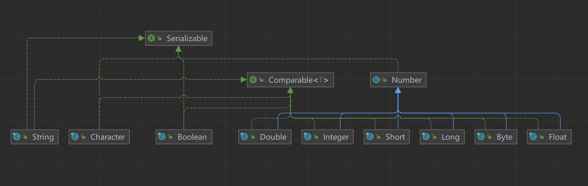
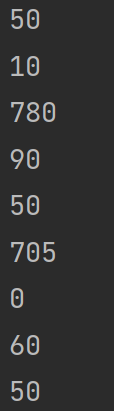
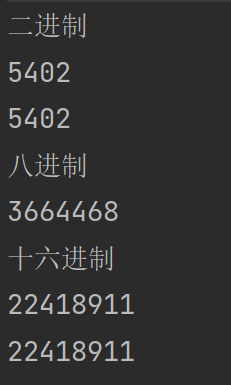
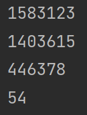
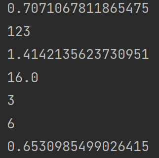
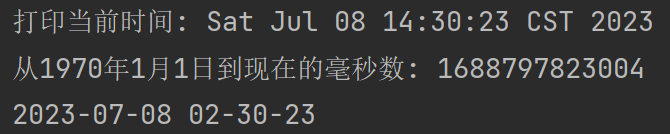
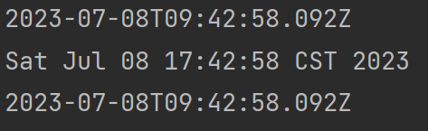
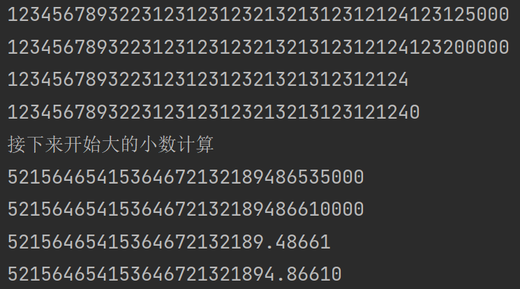

# ***Day17 常用类(包装类、数学类、日期类、可变长字符串等等)***

> 这一节会非常的简单和轻松，可以当做今天的学习就是在放松自己，因为这些常用类只需要记住类名和大概的方法在里面即可，翻一下看一下方法名都可以看出来的

## 目录

1. [包装类](#第一章-包装类)
2. [数学类Math](#第二章-数学类math)
3. [日期类](#第三章-日期类)
    1. [Date](#date)
    2. [Calender](#calender)
    3. [LocalDatetime](#localdatetime)
    4. [Instant](#instant)
4. [可变长字符串](#第四章-可变长字符串)
    1. [StringBuffer](#stringbuffer)
    2. [StringBuilder](#stringbuilder)
5. [大数](#第五章-大数big-decimal)

## 第一章 包装类

> 这个包装类在jdk5开始有大的变化，我们就不管前面是怎么样了，也就我浅提几句，让你们了解一下他的历史之后就差不多了，用法全部是按照现在及以后的用法了。

所谓包装类其实就是把普通的数据类型包装成类拿来使用了，所以叫做包装类。分别有所有的数据类型的包装类，还记得基本数据类型有多少个和分别是什么吗？

总共有8个，分别是整型的四个 long int short byte，浮点的两个 double float，字符的一个 char，布尔的一个
boolean，他们都是有包装类的，基本上都是首字母大写就是他的包装类，但是有两个数据类型不是这样的，一个是int一个是char，这两个是特殊的，其他的都是首字母大写为自己的包装类

分别为

* Long
* Integer
* Short
* Byte
* Double
* Float
* Character
* Boolean

再给大家看一下他们的关系图



我们明显可以看到，数字的浮点和整型都是继承了Number这个抽象类，说明他是数字，其实在很多的语言里面都是这样的，比如说是JS里面，没有写明数据类型，但是明显的就是要么是数字，要么是字符串要么是布尔值，所以这个Number的作用也非常的易懂，将他们放在一起，比如使用我们以后要使用的泛型的时候就会非常的方便

然后就是分开的布尔，字符，然后不难看出，他们的脑壳上都是有一个锁的，说明他们是被final修饰过的，也就是说其实是不能被继承的，所以就不会担心数据外漏的事情。

说的其实已经有点多了，大家了解一下就行了，我们现在来讲用法，就是正常的声明用法其实和他们包装起来的基本数据类型是一样的，比如我们的int是这样
int i = 50; 所以他其实也是 Integer i = 50;
然后现在使用直接就把Integer等价与int即可，这个时候要讲以前了，在jdk5以前的时候，我们使用包装类需要我们手动进行包装然后才能赋值给Integer的，现在是我们使用了这个类就会自动进行拆包和包装，就和String有点像，因为我们的String其实底层用的是char数组，就是和C一样的，但是都已经给你包装了，所以可以直接使用即可。

然后其他的其实都和这个类似，我就略讲了，然后再讲个int类型的特性，也是Integer共享的特性，因为毕竟是包装类嘛

```java
package wrapper;

public class WrapperTest {
    public static void main(String[] args) {
        Integer i = 50;
        System.out.println(i);
    }
}
```


很明显其实没有任何的问题，所有的包装类都是可以什么都不变的情况下替换掉基本数据类型，如下我甚至可以声明一个Integer的数组，然后不使用Integer的数据类型进行遍历而使用int，也是可行的

```java
package wrapper;

public class WrapperTest {
    public static void main(String[] args) {
        Integer[] a = {50, 10, 780, 90, 50, 705, 0, 60, 50};
        for (int i : a) {
            System.out.println(i);
        }
    }
}
```



然后我们来讲一讲int类型的特殊情况，比如我们可以直接创建的时候选择使用二进制、八进制、十六进制等等，分别的写法为0b后面跟二进制数字，0后面跟八进制数字。0x后面跟十六进制数字，我们来演示一遍

```java
package wrapper;

public class WrapperTest {
    public static void main(String[] args) {
        //注意二进制所以到二就进制了，所以不能有2，
        Integer binary = 0b1010100011010;
        //大小写无所谓
        Integer binary2 = 0B1010100011010;
        //八进制同理，不能到达8
        Integer octal = 015765124;
        //16进制，是这样的，数字的最大是9，所以后面是用英文字母，ABCDEF来代表10~15
        Integer hex = 0x15615DF;
        //16进制也是一样
        Integer hex2 = 0x15615DF;
        System.out.println("二进制");
        System.out.println(binary);
        System.out.println(binary2);
        System.out.println("八进制");
        System.out.println(octal);
        System.out.println("十六进制");
        System.out.println(hex);
        System.out.println(hex2);
    }
}
```



是不是非常的简单，然后不止这样，我们还可以使用Integer内部封装的方法让他达到和字符串互相转换的功能，自然从字符串转回Integer类型的时候不能出现除了数字之外的其他字符

接下来教一下大家怎么让一个值在字符串中和数字里面反复横跳，其实除了最傻的拼接字符串变成字符串外，我们的String类里面也还是有对应的方法可以进行操作的，而且可视化更好。

```java
package wrapper;

public class WrapperTest {
    public static void main(String[] args) {
        Integer i = 500;
        //第一种 自己的toString方法
        String s1 = i.toString();
        //第二种 使用Integer里面的静态方法toString
        String s2 = Integer.toString(i);
        //第三种 拼接字符串
        String s3 = "" + i;
        //第四种 使用String类里面的valueOf
        String s4 = String.valueOf(i);
        System.out.println(s1);
        System.out.println(s2);
        System.out.println(s3);
        System.out.println(s4);
    }
}
```


这个是从数字变成字符串，这个还是非常简单的，因为就算是之前也有这么一个拼接字符串的方式，接下来我们来给大家演示怎么把字符串变成数字，然后在变的途中甚至可以加上进制的限制

```java
package wrapper;

public class WrapperTest {
    public static void main(String[] args) {
        String decimal = "1583123";
        String hex = "156ADF";
        String octal = "1547652";
        String binary = "0110110";
        //使用Integer内部的parseInt的方法进行转换，这个方法进行了重载
        //如果你只给了一个String的参数的话就只会作为十进制
        //如果你给了String并且又给了一个进制大小的话就会变成对应进制的数了
        System.out.println(Integer.parseInt(decimal));
        System.out.println(Integer.parseInt(hex, 16));
        System.out.println(Integer.parseInt(octal, 8));
        System.out.println(Integer.parseInt(binary, 2));
    }
}
```



大家伙可以自己去算一下是不是这样的，打开计算器即可😁，其他包装类都大差不差，都差不多，想要看看里面的方法什么有用只需要追进去看源码就行了

## 第二章 数学类Math

> 讲完内容比较多，但是非常好用的包装类之后呢，来讲个比较简单的，但是又不简单的，简单在调用非常的简单，不简单在他是数学。

Math类里基本上都是静态方法，所以我们调用的时候非常的简单只需要使用Math.静态方法就可以调用里面的静态方法了，我们就不看里面有什么方法了，大家伙自己去看一下，里面的数学符号绝对不会让你们小看的，sin
cos tan asin acos atan log sqrt pow abs atan2等等，就给大家举几个简单的例子，里面还有两个数，分别是π，自然用的是英文PI，然后还有e自然常数

```java
package wrapper;

public class WrapperTest {
    public static void main(String[] args) {
        //根号二除以2，sin(45°)，也就是π/4
        System.out.println(Math.sin(Math.PI / 4));
        //绝对值
        System.out.println(Math.abs(-123));
        //开根
        System.out.println(Math.sqrt(2));
        //2的4次幂
        System.out.println(Math.pow(2, 4));
        //取最大
        System.out.println(Math.max(1, 3));
        //四舍五入
        System.out.println(Math.round(5.5));
        //0~1的随机数具体的区间是[0,1)，每次都不一样
        System.out.println(Math.random());
    }
}
```



## 第三章 日期类

> 日期类可多了，总共有三种，其实我记得也并不是很牢，我建议以及我一般只记一种，那就是Date，因为可以接受数据库的Datetime

### Date

```java
package wrapper;

import java.text.SimpleDateFormat;
import java.util.Date;

public class WrapperTest {
    public static void main(String[] args) {
        //直接获取当前时间
        Date date = new Date();
        //打印当前时间
        System.out.println("打印当前时间: " + date);
        System.out.println("从1970年1月1日到现在的毫秒数: " + date.getTime());
        //然后我们可以使用一些方法让这个时间进行格式化，首先我们来讲讲格式化需要什么，格式化需要对时间的格式化的字母
        //我们可能见过但也有可能没见过，我来给大家做个例子就是 "yyyy-MM-dd" 就是年月日分别显示多少个数字，比如说这个
        //yyyy就是四位年，大家伙可以自己进行更改，因为yyy也是四个，但是yy就是两个，然后单个y就是四个，这个也是有道理的
        //因为平时我们要么就是说全年份，比如2023年是吧，或者就是缩写的两个，23年是吧，然后我们再看这个格式化的字母
        //y是不是year，那M是不是month月份嘛，为什么是大写呢，你再想想看，分钟的m是不是minute是不是也是m，所以小一点的小写
        //这里就是格式化的格式hh是12小时制，而HH是24小时制
        SimpleDateFormat simpleDateFormat = new SimpleDateFormat("yyyy-MM-dd HH-mm-ss");
        //创建完对象之后我们就可以把日期放进去了，就可以得到格式化后的字符串了，就可以拿来打印和返回等等
        String format = simpleDateFormat.format(date);
        System.out.println(format);
    }
}
```



### Calender

> 如果说Date是日期类的话，那这个应该叫做日历类，毕竟名字都叫日历

```java
package wrapper;

import java.util.Calendar;

public class CalenderTest {
    public static void main(String[] args) {
        //获取实例，为什么不是创建对象呢，你们可以追进去看一下，这个其实是抽象类，所以不能直接创建对象
        //但是他提供了一个返回实例的方法，所以直接调用即可
        Calendar calendar = Calendar.getInstance();
        //这个对象自带的内容是很多的
        System.out.println(calendar);
        //一般能想到的英文都是可以找到对应的时间的
        System.out.println("Year :" + calendar.get(Calendar.YEAR));
        System.out.println("Month :" + (calendar.get(Calendar.MONTH) + 1));
        System.out.println("Day :" + calendar.get(Calendar.DAY_OF_MONTH));
        System.out.println("Hour :" + calendar.get(Calendar.HOUR_OF_DAY));
        System.out.println("Minute :" + calendar.get(Calendar.MINUTE));
        System.out.println("Second :" + calendar.get(Calendar.SECOND));
    }
}
```

```
java.util.GregorianCalendar[time=1688806789412,areFieldsSet=true,areAllFieldsSet=true,lenient=true,zone=sun.util.calendar.ZoneInfo[id="Asia/Shanghai",offset=28800000,dstSavings=0,useDaylight=false,transitions=31,lastRule=null],firstDayOfWeek=1,minimalDaysInFirstWeek=1,ERA=1,YEAR=2023,MONTH=6,WEEK_OF_YEAR=27,WEEK_OF_MONTH=2,DAY_OF_MONTH=8,DAY_OF_YEAR=189,DAY_OF_WEEK=7,DAY_OF_WEEK_IN_MONTH=2,AM_PM=1,HOUR=4,HOUR_OF_DAY=16,MINUTE=59,SECOND=49,MILLISECOND=412,ZONE_OFFSET=28800000,DST_OFFSET=0]
Year :2023
Month :7
Day :8
Hour :16
Minute :59
Second :49
```

### LocalDateTime

> 除了以上两个还有另外一个

```java
package wrapper;

import java.time.LocalDate;
import java.time.LocalDateTime;
import java.time.LocalTime;
import java.time.format.DateTimeFormatter;

public class LocalDateTimeTest {
    public static void main(String[] args) {
        //和日历类有点类似，通过这种方式获取实例，其实这种方式是一个设计模式，叫做单例模式，为的就是只能创建一个对象
        LocalDateTime ldt = LocalDateTime.now();
        //类似的打印全部信息
        System.out.println("All: " + ldt);
        System.out.println("Year: " + ldt.getYear());
        System.out.println("Month: " + ldt.getMonth());
        System.out.println("Day: " + ldt.getDayOfMonth());
        System.out.println("Hour: " + ldt.getHour());
        System.out.println("Minute: " + ldt.getMinute());
        System.out.println("Second: " + ldt.getSecond());
        //然后还有拆开的LocalDate，这个是日期
        LocalDate ld = LocalDate.now();
        System.out.println(ld);
        //和LocalTime，这个是时间
        LocalTime lt = LocalTime.now();
        System.out.println(lt);
        //然后我们可以通过这个类进行格式化输出
        DateTimeFormatter dtf = DateTimeFormatter.ofPattern("yyyy年MM月dd日 HH:mm:ss");
        System.out.println(dtf.format(ldt));
    }
}
```

```
All: 2023-07-08T17:09:06.280563600
Year: 2023
Month: JULY
Day: 8
Hour: 17
Minute: 9
Second: 6
2023-07-08
17:09:06.296058100
2023年07月08日 17:09:06
2023-07-08T09:09:06.301058800Z
Sat Jul 08 17:09:06 CST 2023
2023-07-08T09:09:06.301Z
```

还有另外一个，大家伙自己领悟一下吧，这个玩意我感觉是真的没什么用，会一个就可以了，在java.time下是真的很多

### Instant

```java
package wrapper;

import java.time.Instant;
import java.util.Date;

public class InstantTest {
    public static void main(String[] args) {
        Instant now = Instant.now();
        System.out.println(now);
        Date date = Date.from(now);
        System.out.println(date);
        Instant instant = date.toInstant();
        System.out.println(instant);
    }
}
```



## 第四章 可变长字符串

> 我们先来说一个概念，这个可能之前没有说过，是有关字符串的，字符串实际上是一个不可变字符序列，就是写死长度的字符的数组，是不可变的，每次拼接字符串就是在内存里面重新创建一个更长长度的字符串，但是java整了两个可变长的字符串

为什么回事两个呢，其实原因就是一个是保证了安全，在后面学习多线程的时候会学到关于线程安全的这块内容，不然会出现问题，他们的区别分别是一个是速度最快然后线程不安全，另外一个是线程安全都是速度就没有那么快，但是其实都是比String快的，但是String写起来方便而且是储存在常量池里面的。所以只要不是会乱变长的可以就使用String，但是如果发现有胡乱变长的可以使用这两个，看情况选择

### StringBuffer

> StringBuffer，Buffer其实就是缓冲区的意思，你们也可以理解为buff，因为要上buff所以要慢一点，因为慢了一点所以线程就安全了，
> 实际情况是因为安全了所以慢了，如果不想用buff去理解可以这么去理解，有缓冲了安全了，因为安全了，所以就慢了

```java
package wrapper;

public class SBTest {
    public static void main(String[] args) {
        //直接创建空字符串然后拼接也是可以的
        StringBuffer sb = new StringBuffer();
        //带着字符串创建也是可以的
        StringBuffer sb2 = new StringBuffer("Hello");
        System.out.println("默认的容量，也就是空字符串+缓冲区也就是缓冲区是: " + sb.capacity());
        System.out.println("Hello字符五个长度加上缓冲区: " + sb2.capacity());
        System.out.println("所以不难得出，缓冲区其实就是16个大小");
        //自然我们也是可以调整缓冲区的，默认就是16，可以在创建空对象的时候使用int类型的值进行创建
        //然后我们再拼接要加的字符串即可
        //然后我们来讲讲怎么拼接，然后再看看拼接之后如果超容量了会怎么办
        System.out.println("进行拼接");
        //使用append方法进行拼接，不用担心是什么数据，甩进去就行了，基本数据类型都进行了重载
        //即使不是基本数据类型是类的话，我们也有toString方法可以调用是吧，反正不是我们调用，是底层调的
        //我们只需要知道要拼什么就放什么就行
        sb.append(5);
        System.out.println("目前容量: " + sb.capacity());
        System.out.println("开始多次拼接");
        //我们再拼接到极限容量为止，然后再看看会发生什么事情
        for (int i = 0; i < 35; i++) {
            System.out.println("现在容量拼接第" + (i + 2) + "个前 : " + sb.capacity());
            System.out.println("拼接第 " + (i + 2) + "个数据");
            sb.append(1);
            System.out.println(sb.length());
            System.out.println("现在容量拼接第" + (i + 2) + "个后 : " + sb.capacity());
            System.out.println();
        }
        //接下来是调用，怎么把他变回字符串，因为现在是可变长数组还并不是字符串
        //其实非常简单，使用toString方法就行了
        String string = sb.toString();
        System.out.println(string);
    }
}
```

```
默认的容量，也就是空字符串+缓冲区也就是缓冲区是: 16
Hello字符五个长度加上缓冲区: 21
所以不难得出，缓冲区其实就是16个大小
进行拼接
目前容量: 16
开始多次拼接
现在容量拼接第2个前 : 16
拼接第 2个数据
2
现在容量拼接第2个后 : 16

现在容量拼接第3个前 : 16
拼接第 3个数据
3
现在容量拼接第3个后 : 16

现在容量拼接第4个前 : 16
拼接第 4个数据
4
现在容量拼接第4个后 : 16

现在容量拼接第5个前 : 16
拼接第 5个数据
5
现在容量拼接第5个后 : 16

现在容量拼接第6个前 : 16
拼接第 6个数据
6
现在容量拼接第6个后 : 16

现在容量拼接第7个前 : 16
拼接第 7个数据
7
现在容量拼接第7个后 : 16

现在容量拼接第8个前 : 16
拼接第 8个数据
8
现在容量拼接第8个后 : 16

现在容量拼接第9个前 : 16
拼接第 9个数据
9
现在容量拼接第9个后 : 16

现在容量拼接第10个前 : 16
拼接第 10个数据
10
现在容量拼接第10个后 : 16

现在容量拼接第11个前 : 16
拼接第 11个数据
11
现在容量拼接第11个后 : 16

现在容量拼接第12个前 : 16
拼接第 12个数据
12
现在容量拼接第12个后 : 16

现在容量拼接第13个前 : 16
拼接第 13个数据
13
现在容量拼接第13个后 : 16

现在容量拼接第14个前 : 16
拼接第 14个数据
14
现在容量拼接第14个后 : 16

现在容量拼接第15个前 : 16
拼接第 15个数据
15
现在容量拼接第15个后 : 16

现在容量拼接第16个前 : 16
拼接第 16个数据
16
现在容量拼接第16个后 : 16

现在容量拼接第17个前 : 16
拼接第 17个数据
17
现在容量拼接第17个后 : 34

现在容量拼接第18个前 : 34
拼接第 18个数据
18
现在容量拼接第18个后 : 34

现在容量拼接第19个前 : 34
拼接第 19个数据
19
现在容量拼接第19个后 : 34

现在容量拼接第20个前 : 34
拼接第 20个数据
20
现在容量拼接第20个后 : 34

现在容量拼接第21个前 : 34
拼接第 21个数据
21
现在容量拼接第21个后 : 34

现在容量拼接第22个前 : 34
拼接第 22个数据
22
现在容量拼接第22个后 : 34

现在容量拼接第23个前 : 34
拼接第 23个数据
23
现在容量拼接第23个后 : 34

现在容量拼接第24个前 : 34
拼接第 24个数据
24
现在容量拼接第24个后 : 34

现在容量拼接第25个前 : 34
拼接第 25个数据
25
现在容量拼接第25个后 : 34

现在容量拼接第26个前 : 34
拼接第 26个数据
26
现在容量拼接第26个后 : 34

现在容量拼接第27个前 : 34
拼接第 27个数据
27
现在容量拼接第27个后 : 34

现在容量拼接第28个前 : 34
拼接第 28个数据
28
现在容量拼接第28个后 : 34

现在容量拼接第29个前 : 34
拼接第 29个数据
29
现在容量拼接第29个后 : 34

现在容量拼接第30个前 : 34
拼接第 30个数据
30
现在容量拼接第30个后 : 34

现在容量拼接第31个前 : 34
拼接第 31个数据
31
现在容量拼接第31个后 : 34

现在容量拼接第32个前 : 34
拼接第 32个数据
32
现在容量拼接第32个后 : 34

现在容量拼接第33个前 : 34
拼接第 33个数据
33
现在容量拼接第33个后 : 34

现在容量拼接第34个前 : 34
拼接第 34个数据
34
现在容量拼接第34个后 : 34

现在容量拼接第35个前 : 34
拼接第 35个数据
35
现在容量拼接第35个后 : 70

现在容量拼接第36个前 : 70
拼接第 36个数据
36
现在容量拼接第36个后 : 70

511111111111111111111111111111111111

进程已结束,退出代码0
```

从我们的输出代码里面也不难看出，16个上限，在到达16的时候还是没有满的，如果直接拼接第17个的时候会直接翻倍变成34个容量，以此类推，34满的时候就是要拼35的时候翻倍变成70，下一个就是142。然后我们只要使用的时候用toString就能变成普通的字符串，他还有很多的方法我就暂且不说了，大家伙可以自己看看源码，最主要的就是他这个机制

### StringBuilder

> 这个也没什么好讲的，因为和上面的那个是一模一样的，就是去除了线程安全的操作让他变快了。

## 第五章 大数Big Decimal

> 我们都知道我们最大的储存大小其实就是Long，有2^63 - 1的大小，但是万一不够用了呢，我们Java还有个解决方案，就是大数，他是通过字符串进行存储然后再进行计算并使用

大数有两个，一个是BigInteger是用来储存整型的，还有一个就是BigDecimal是用来储存带小数的，可以理解为一个是大型int一个是大型double

```java
package wrapper;

import java.math.BigDecimal;
import java.math.BigInteger;

public class UsingBigDecimal {
    public static void main(String[] args) {
        //在创建BigInteger对象的时候只能使用字符串
        BigInteger big = new BigInteger("123456789322312312312321321312312124123125123");
        //这个非常的明显，直接是超过了int类型的大小，甚至超越了long的大小，接下来我们来进行计算
        //既然都是这么存储的情况了，肯定不是用加减乘除进行计算的，我们是调用方法进行计算的
        //但是我们可以使用这种方式创建对象，就和String的valueOf一样，大数也是有的
        BigInteger subtract = big.subtract(BigInteger.valueOf(123));
        System.out.println(subtract);
        BigInteger add = subtract.add(BigInteger.valueOf(75000));
        System.out.println(add);
        BigInteger divide = add.divide(BigInteger.valueOf(1000000000));
        System.out.println(divide);
        BigInteger multiply = divide.multiply(new BigInteger("10"));
        System.out.println(multiply);

        System.out.println("接下来开始大的小数计算");

        BigDecimal big2 = new BigDecimal("52156465415364672132189486535123");
        BigDecimal subtract2 = big2.subtract(BigDecimal.valueOf(123));
        System.out.println(subtract2);
        BigDecimal add2 = subtract2.add(BigDecimal.valueOf(75000));
        System.out.println(add2);
        BigDecimal divide2 = add2.divide(BigDecimal.valueOf(1000000000));
        System.out.println(divide2);
        BigDecimal multiply2 = divide2.multiply(new BigDecimal("10"));
        System.out.println(multiply2);
    }
}
```



### [上一章](day16.md)

### [下一章](day18.md)

### [返回目录](README.md)