# ***Day18 容器与泛型***

> 我们来简单讲讲容器是什么，顾名思义，是存东西的器皿，就叫做容器，那在我们计算机中需要存的是什么呢，是不是就是数据啊，所以我们的java是有提供一系列数据容器的，容器我们也叫做集合框架。
>
> 容器分多钟，主要为两个大结构，分别为单例集合和双例集合，单例集合顾名思义，就只有一个列，双例就是两个列，他们区别是有的，单的用下标或者元素获取，而双的则是通过键值对的方式获取
>
> 本节的内容除了容器还有泛型，很多地方都用到了泛型，所以我们可能现讲泛型再讲集合也就是容器，因为容器基本上都会使用泛型来限制数据类型

## 第一章 泛型

> 对于泛型，实际上不是一开始就有的，是后面的jdk加入的。这个非常厉害的概念也是和包装类的自动拆箱一样是从jdk
> 1.5也就是第五个版本的java引入的。java的版本分部应该比较清楚的吧，在1.8以前都是1.x的这种方式，在8后面之后直接使用大数字，比如现在就有11啊，17等等版本

我们先来讲泛型，所谓泛型就是允许我们在定义类、接口和方法时使用类型参数，这使得我们可以编写更通用、类型安全和可重用的代码。通过使用泛型，我们可以将类型的检查和转换从运行时转移到编译时，从而减少了潜在的类型错误，并提高了代码的可读性和可维护性。

在引入泛型之前，集合类中的元素类型都是Object类型，需要在使用时进行强制类型转换。但是，强制类型转换可能导致运行时异常，因为在编译时无法对类型进行检查。而引入泛型后，可以指定集合中元素的具体类型，在编译时就能检查类型的正确性，减少了出错的可能性。

泛型使得Java的集合框架更加安全和灵活，同时也简化了代码编写和阅读。通过使用泛型，我们可以更好地在编译时捕获潜在的类型错误，提高了代码的质量和可靠性。

所以这个就是泛型的重要性，那怎么用呢，非常的简单我们只需要使用尖括号就可以使用泛型了。也就是小于号和大于号 `<>`

接下来我们讲规范和用法，首先我们泛型是属于是编译工具，就是在编译之后就没了，他就只是一个限制我们类型的小工具，被编译了之后就不复存在了。所以泛型的使用与否其实不影响正确，全部使用Object也无所谓。

但是我们使用了泛型之后可以提高开发的效率，还有一个就是我们可以使用任何的名字来使用泛型，只要符合规范，我们的泛型可以叫做
`$ASD` 可以叫做 `_NIMAMA` 可以叫做 `A` 可以叫做 `B` 可以叫做 `ASKLDJQKLWJEKLAJDS`
这个是不受限制的，然后就是我们的泛型可以在方法中使用也可以在类中使用，都是需要声明再进行使用的。我们先来显示一下类泛型，先说一下规范，自然也可以不管规范

* E - Element (在集合中使用，因为集合中存放的是元素)
* T - Type（Java 类）
* K - Key（键）
* V - Value（值）
* N - Number（数值类型）

### 类泛型

```java
package generic;

//首先你要成为泛型类的话需要在末尾加上尖括号代表泛型然后在里面天上你要当做类型的名字<>
//像这里，我用的就是A，自然可以使用乱打的ASLKDJASKLDJASKLD都是可以的
public class GenericTest1<A> {
    public static void main(String[] args) {
        //声明方式为类<泛型> 对象名 = new 类<>(); 然后我们引用指向对象的这个对象在前面声明过了的话可以为空
        //大家可以自己加上看看，反正是黯淡无光的，然后我们创建有泛型的对象的时候泛型的填写是有规定的
        //我们填写泛型的时候不能使用基本数据类型，也就是说要用基本数据类型的话需要添上包装类
        GenericTest1<Integer> genericTest1 = new GenericTest1<>();
        System.out.println(genericTest1.getA(5));
        //但是我们使用这种方式，匿名创建的方式就不会这样了，可以写在后面而且正常生效
        //如果把这里的String类型变成了其他不能接受String类型的话其实就是会报错的
        System.out.println(new GenericTest1<String>().getA("ASD"));
    }

    //这个可以说是泛型方法，但又不完全是泛型方法，因为他不是使用方法的时候声明的，而是在类上声明的
    //因为泛型是锁定类型的，所以我们只需要把返回类型变成泛型就行了，参数也可以使用泛型
    //还有一件事，泛型只能在非静态方法中使用，使用类泛型的时候
    public A getA(A a) {
        return a;
    }
}
```

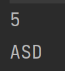

经过学习我们现在已经会使用类泛型了，但是在我们的类泛型之中还是有点小秘密的，比如说我们的这个泛型是不是作为数据类型的话没有出现过数组是吧，那我们来一下

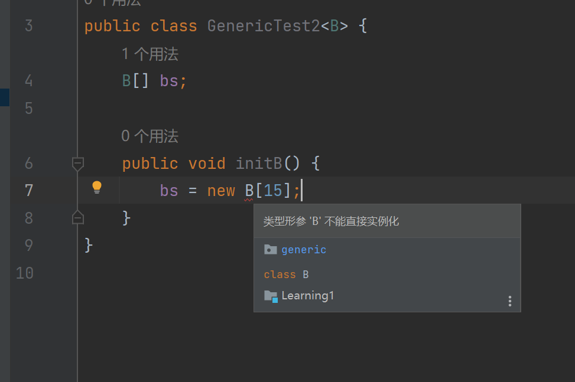

所以我们需要使用先声明Object数组然后进行B数组的强转就能变换回来了或者使用一些方法直接从外部作为参数传入进来就能直接用了，然后我们再来看看方法泛型，也是不难的。

### 方法泛型

```java
package generic;

public class GenericTest2 {
    public static void main(String[] args) {
        //使用泛型方法的时候不需要进行泛型的声明
        System.out.println(get(123));
        doSome(456);
    }

    //使用起来也是非常的简单的，我们是需要把泛型放在返回类型之前就能做声明的操作
    //如果在泛型在类型的后面则会出现报错的现象，自然写了泛型也可以是没返回值
    //然后我们的方法泛型可以在静态方法上面进行使用
    public static <E> E get(E e) {
        return e;
    }

    public static <E> void doSome(E a123) {
        System.out.println(a123);
    }
}
```

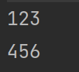

### 通配符

接下来我们来看看不确定类型也就是泛型的通配符。非常的好认就是 `?` 然后我们的通配符一般有两种情况 无界、有界

我们来看一段代码

#### 无界通配符

```java
package generic;

public class GenericTest3<T> {
    public void getSome() {
        System.out.println("someThing");
    }
}

class Test {
    public static void main(String[] args) {
        GenericTest3<String> g1 = new GenericTest3<>();
        GenericTest3<Integer> g2 = new GenericTest3<>();
        p(g1);
        p(g2);
    }

    public static void p(GenericTest3<?> g) {
        g.getSome();
    }
}
```

使用的通配符，所以什么泛型都可以进来，但如果使用有界的情况下，就不会如此了，我们写的两个泛型分别是String和Integer，之前讲包装类的时候也讲过了，我们这两个是没有共通性的。

我们先讲有界其中一个，就是上界限定，其实就是写了继承，这么写的意思是 `是该类或其子类`，因为继承就是写了上限，我们这么写

#### 上界通配符

```java
package generic;

public class GenericTest3<T> {
    public void getSome() {
        System.out.println("someThing");
    }
}

class Test {
    public static void p(GenericTest3<? extends Number> g) {
        g.getSome();
    }

    public static void main(String[] args) {
        GenericTest3<String> g1 = new GenericTest3<>();
        GenericTest3<Integer> g2 = new GenericTest3<>();
        p(g1);
        p(g2);
    }
}
```

很明显就能看到错误

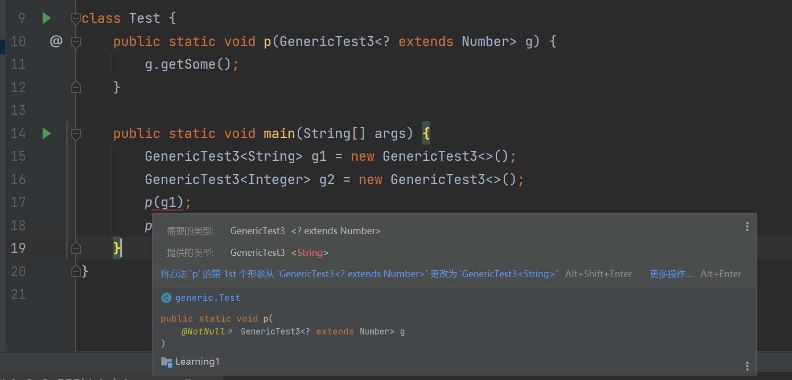

因为String并不是Number的子类而Integer是，所以就发生了报错。然后我们再来看看super因为有extends肯定有super对吧，这个就是下界限定，最起码要从这个开始，上不封顶，有关系就行

#### 下界通配符

```java
package generic;

public class GenericTest3<T> {
    public void getSome() {
        System.out.println("someThing");
    }
}

class Test {
    public static void p(GenericTest3<? super Integer> g) {
        g.getSome();
    }

    public static void main(String[] args) {
        GenericTest3<String> g1 = new GenericTest3<>();
        GenericTest3<Integer> g2 = new GenericTest3<>();
        p(g1);
        p(g2);
    }
}
```

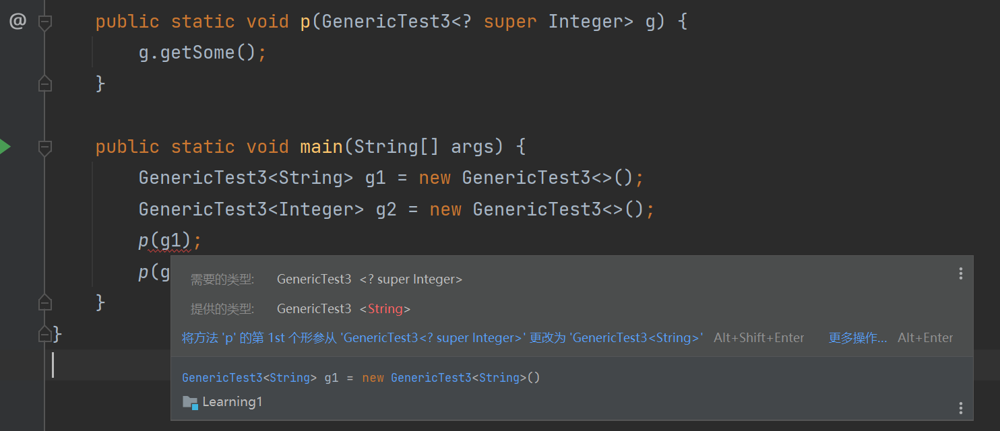

我们发现依旧是这一行的报错，但是报错信息就不一样了，因为不是Integer及其父类所以报错，假如我把这个g1的泛型换成Number就不会报错了，这个就是泛型的通配符，其实一般情况也用不着，一般会个普通的泛型就行了。但是我们学习还是都要学一学的

## 第二章 容器

> 虽然是集合框架，但是我一般不叫它集合，因为他的容器里面就有一类叫做集合和我们高中学的集合是一样的，不可重复

我们先来看看分几个大类，我们之前也说了是两个，一个是单例集合一个是双例集合，但是还有分，接下来分出来的才是我们常说的大类

我们分

* 列表List
* 集合Set
* 映射Map (也叫字典，因为键值对的查询)

如果学过python的其实会感觉很眼熟，不就是列表 集合 字典嘛，然后数组就是元组，其实就是这样的，编程语言和编程语言之间是互通的。

我们来看看Java里这三个类型的结构

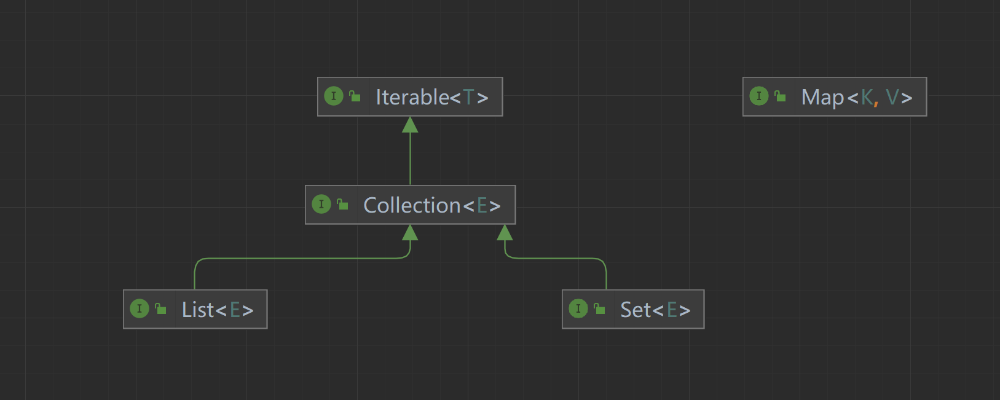

我们可以看到，他们都是接口，所以他们其实就是一个规范，一个列表的规范，一个集合的规范，一个映射的规范，所以底下是有很多的实现的，我们肯定不能全部学完。我们只学部分常用的和常见的。然后我们先别急着学下去，我们再来看看他们的结构，是不是作为单例集合的List和Set都继承与Collection这个接口然后又继承与Iterable，

我们这个Collection容器继承与迭代器所以可以使用迭代器，这在后面我们会讲的，使用多种方式遍历这俩单例集合的时候。

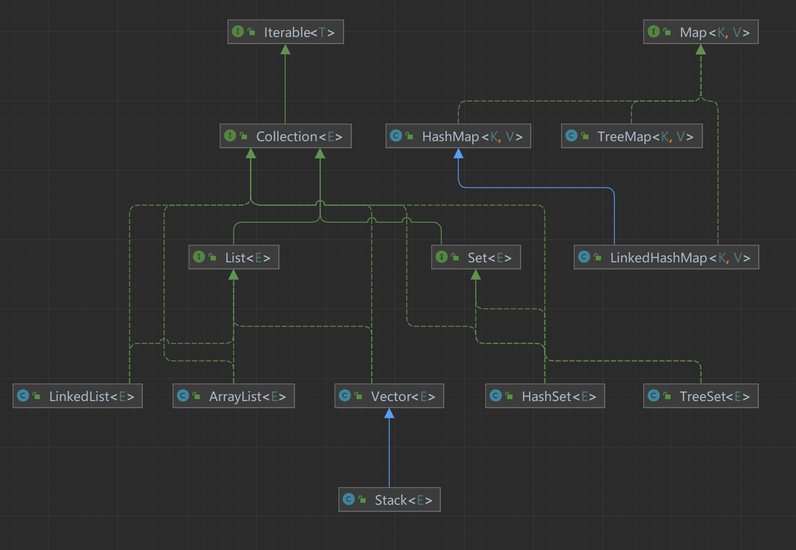

我们要学的差不多就这么多，自然学习的是类，分别是列表里四个，集合里两个，映射里三个，自然都是封装好了，里面会出现一点数据结构，但是我们是不讲数据结构的，大家可以自己去补补，不然就太长了，我们就是单纯学习一门语言的使用

* List 列表
    * LinkedList 双向链表
    * ArrayList 可边长数组
    * Vector 可边长数组(线程安全)
    * Stack 栈
* Set 集合
    * HashSet 散列集合(无序)
    * TreeSet 树集合(有序)
* Map 映射(字典)
    * HashMap 散列映射(无序存放)
    * TreeMap 树映射(按元素有序存放)
    * LinkedHashMap 链表散列映射(按存入顺序存放)

### List

> List还是非常简单的，由于篇幅有限，我就不带大家看源码了，就简单解释一下好了。列表是有序可重复的。

我们先看ArrayList，我们一般使用的时候也是通过父指子也就是List为父ArrayList为子的方式进行对象的创建，一般我们传输列表对象的时候基本上是只用List的所以我们可以保证通用性，但是不能保证这些实现了List的类的内部的特殊方法的使用，因为那需要向下转型，需要强转是比较麻烦的行为。

#### ArrayList

我们创建对象的时候是需要使用泛型的，自然我们不用的话默认就是Object类型，自然我们也可以手动在泛型里面写Object可以看不到报黄，但是实际作用和不写是一样的，我们就限定为String类型好了。

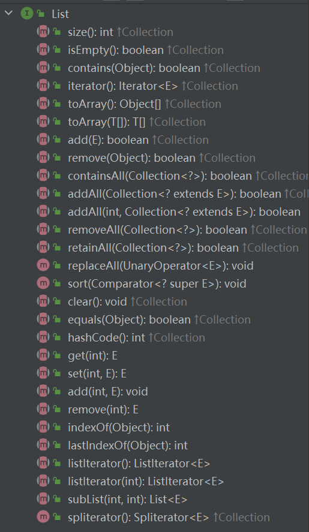

通过查看List接口的结构，我们可以看到有这么多的方法可以调用，其实我们只要会用这里面的方法就行了，因为很少有情况会不通过父指子的方式创建List的对象的，也就是直接使用ArrayList做引用创建List的情况占少数，如果想要自己去用一下ArrayList里面的自带方法，也是可以去试一下的，这里就不多做演示了。

其实我们看名字就知道有这么作用了这些方法

```java
package collection;

import java.util.ArrayList;
import java.util.List;

public class ArrayListUsing {
    public static void main(String[] args) {
        List<String> list = new ArrayList<>();
        //添加元素，添加元素E，也就是我们给定泛型的元素
        list.add("1");
        list.add("2");
        list.add("3");
        list.add("4");
        list.add("5");
        list.add("6");
        //删除元素，有重载，可以是输入元素也可以是输入下标，如果元素就是整型的话，那就是下标
        list.remove("6");   //如果是元素删除则返回布尔值表明删除与否
        list.remove(0);     //如果是下标则返回元素是什么
        System.out.println(list);
    }
}
```

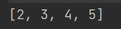

```java
package collection;

import java.util.ArrayList;
import java.util.Arrays;
import java.util.List;

public class ArrayListUsing {
    public static void main(String[] args) {
        List<String> list = new ArrayList<>();
        for (int i = 1; i <= 6; i++) {
            list.add(String.valueOf(i));
        }
        list.remove("6");
        list.remove(0);
        System.out.println(list);
        //判断是否为空，返回布尔值
        System.out.println(list.isEmpty());
        //通过下标获取元素，我已经删除了下标为0元素所以0后面的元素会全部往前移动。所以0还是在的
        System.out.println(list.get(0));
        //通过元素找下标，如果没找到则返回-1
        System.out.println(list.indexOf("1"));
        //寻找是否存在元素，返回布尔值
        System.out.println(list.contains("3"));
        //通过列表获得数组
        Object[] array = list.toArray();
        //添加的重载，在指定下标添加元素，然后让所有元素后移，ArrayList一般不要使用这个操作比较好
        //因为ArrayList是基于数组的列表，所以移动里面的元素是比较费劲的，但是ArrayList的查询效率是最高的
        //如果我们要使用多增删的可以使用LinkedList，这个使用的是链表增删效率比较高
        list.add(0, "1");
        //因为list是可以重复的所以可以出现多个一样的元素，这个是从后面开始查找元素，
        System.out.println(list.lastIndexOf("1"));
        //获得列表大小
        System.out.println(list.size());
        //裁剪列表并返回一个新的列表
        List<String> strings = list.subList(1, list.size());
        //从一个列表中添加全部元素，返回布尔值，移动完这个列表就清空了
        list.addAll(strings);
        System.out.println(list);
        //从一个列表移除另外一个列表内的全部元素，返回布尔值
        list.removeAll(Arrays.asList("1", "2"));
        System.out.println(list);
        //清空列表
        list.clear();
        System.out.println(list);
    }
}
```

```
[2, 3, 4, 5]
false
2
-1
true
0
5
[1, 2, 3, 4, 5, 2, 3, 4, 5]
[3, 4, 5, 3, 4, 5]
[]

进程已结束,退出代码0
```

多余的我就不写了，比如说sort方法就可以使用lambda或者是匿名内部类的方式或者是实现了他需要的接口然后再把对象传进去的方式等等。还有马上要演示的遍历，因为比较重要，所以单独拎出来讲

```java
package collection;

import java.util.ArrayList;
import java.util.Iterator;
import java.util.List;

public class ArrayListUsing {
    public static void main(String[] args) {
        List<String> list = new ArrayList<>();
        for (int i = 1; i <= 6; i++) {
            list.add(String.valueOf(i));
        }
        //第一种遍历方式，使用循环配合get方法进行实现
        for (int i = 0; i < list.size(); i++) {
            System.out.print(list.get(i) + " ");
        }
        System.out.println();
        //第二种遍历方式，使用foreach循环进行实现
        for (String s : list) {
            System.out.print(s + " ");
        }
        System.out.println();
        //第三种遍历方式，获得迭代器进行遍历
        Iterator<String> iterator = list.iterator();
        while (iterator.hasNext()) {
            System.out.print(iterator.next() + " ");
        }
    }
}
```

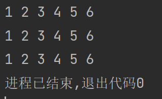

但是一般都是使用增强for循环的，除非有特殊情况，一般来说是不会使用迭代器的，可以理解为增强for循环的底层用的就是迭代器。毕竟这个代码里面无论是第一种还是第三种都是报黄提示可以改为第二种方式

我们来讲讲ArrayList的底层机制和扩容机制

使用ArrayList的时候底层用的就是数组，然后可边长是因为自己在达到阈值的时候会调用扩容方法进行扩容，每次扩容都是1.5倍的扩容。

具体怎么扩容呢也是非常的简单的，就是通过创建新的数组是现在的1.5倍大

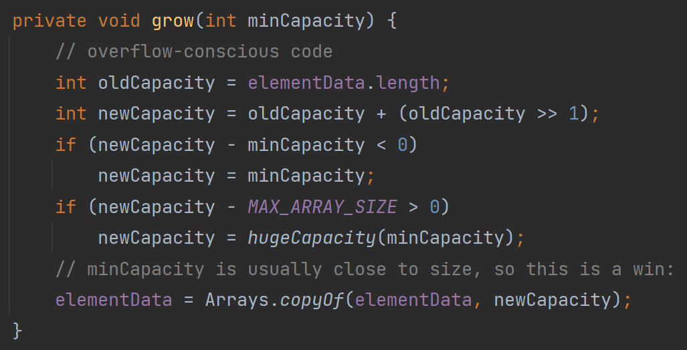

在我们要满的时候会触发扩容，我们可以看到新的容量就是老的容量加上老容量除以2就是右移1位。这就是他的扩容机制。

#### LinkedList

> 我直接就不演示方法了，毕竟同源都是List，在List这里面只有Stack会讲一下新的方法和用法，其他三个其实都是一样的。我们来讲讲区别。

LinkedList的机制就更简单了，但又不是完全简单，使用的是链表这一数据结构，而且是双向链表，我来简单讲一讲，我们的这个链表可以就是一个类，然后这个类的结构是这样的

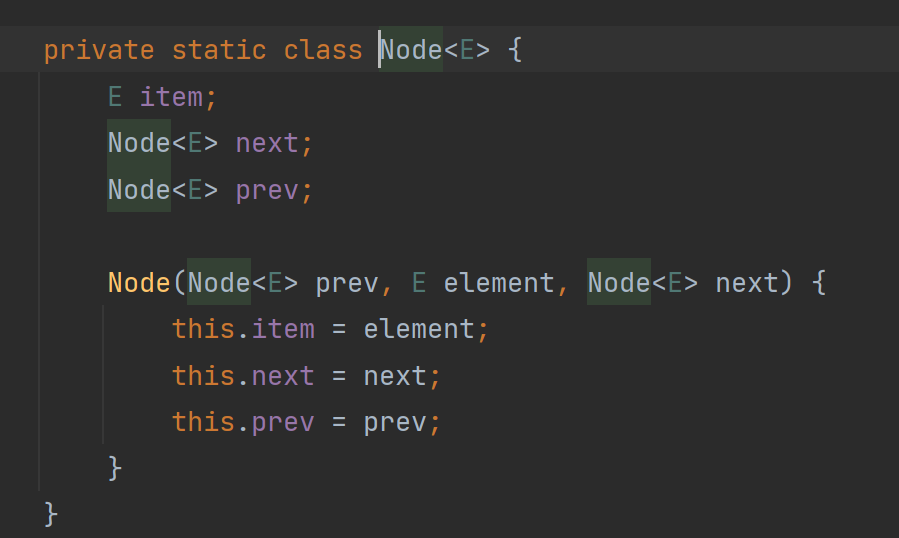

这个就是内部的一个节点类，其实就是链表的节点，我们可以看到，他的属性就是一个元素，一个前面的一个该类的对象，一个后面也是该类对象，如果学过C的话那就更好理解了，就是一个指向前面的指针和一个指向后面的指针，在java里面就理解为引用好了，然后在这个LinkedList类里面会有保存两个Node类型，一个是head一个是tail就是一个头一个尾，还有一个保存大小的size

然后在添加的时候进行判断，如果size==0说明当前是空的，没有储存任何的东西，那么添加的第一个节点自然就是head节点，然后head保存的就是第一个节点的对象，此时size==1的时候说明只有一个节点，说明他既是头又是尾。所以头尾的节点储存的都是这个对象，也就是头尾的指针指向的都是这个对象。

如果再添加，根据添加的情况，比如添加头那就把头变成新添加的，然后再把原来的头挂在新添加的尾部就行，然后互相链接在一起，操作起来也是非常的简单的，只需要同时存在这两个对象然后把指向的对象更改一下就行了。

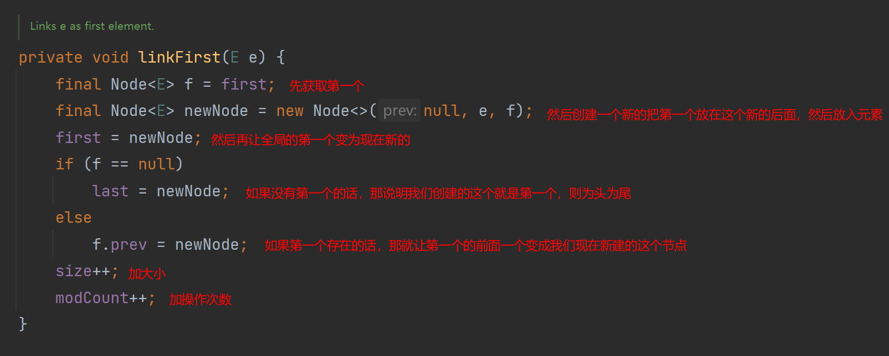

然后加尾部也是一样，非常简单的操作。

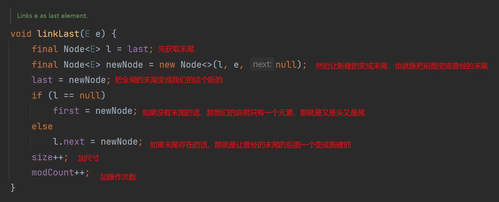

如果插入中间的话，那我们就遍历一下就行，通过这样，比如我们有一个node对象现在让 node = head
是不是我的这个head和node都是指向了head这个对象，那我再开始遍历就行了，这样又不影响head又可以遍历直接就是写一个我们要的循环，然后里面就调用
node = node.next 是不是就是拿到node的下一个节点然后让我们的node去指向这下一个节点。是不是就完成了链表的遍历。

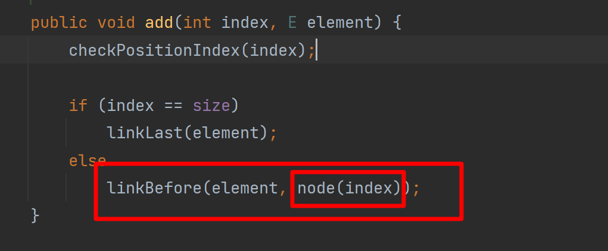

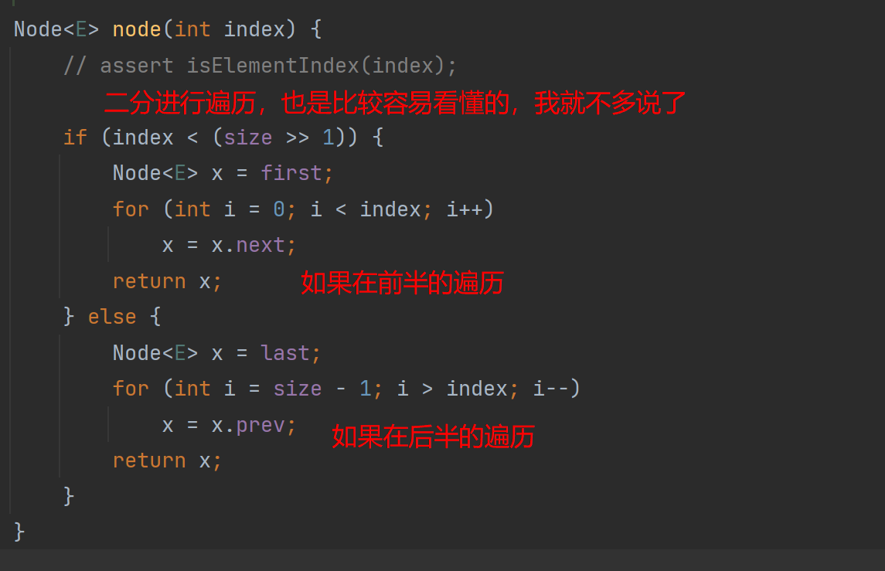

然后到达对应需要添加的地方再把头和尾的两个节点获取到，然后再添加，再挂载就行了。说起来听起来非常的简单，但仔细回想一下其实还是比较有意思的然后我们去实现起来一般来说也不是非常的简单的，如果你没有太好的基础的话，一般基础比较好的，听了是什么个原理就可以去实现了。

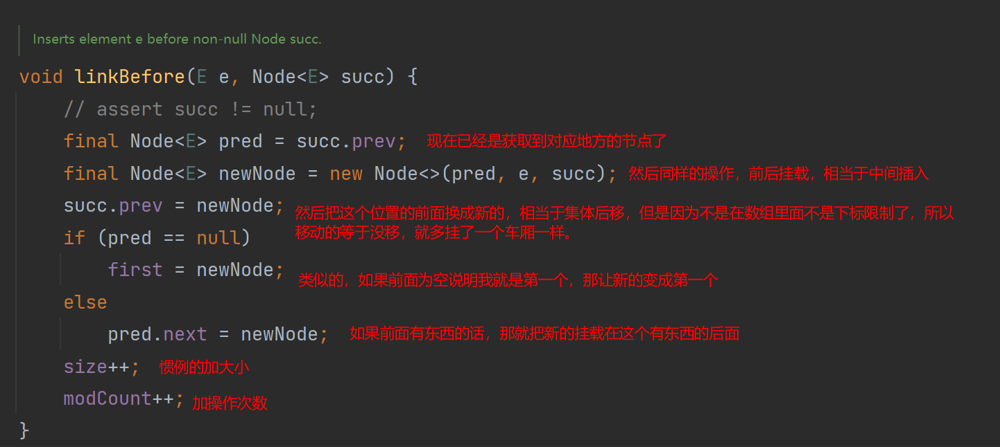

这个就是LinkedList也可以说是链表这个数据结构，链表存在多种，单向链表，双向链表，双向循环链表，我们这里的LinkedList使用的就是双向俩表，头尾不循环指向。

是不是觉得非常的简单，我们现在已经学会了两个列表了，而且还学会了链表这一数据结构，ArrayList的主要是太简单了基于数组的，所以我就不多说了。

#### Vector

> 这个玩意太简单了，就是ArrayList然后带上了线程安全的操作。我的简单的意思就是说他和ArrayList的几乎是一样的。可能自己的方法有些区别。反正一般我们都是用List接口里面的方法的。

这个的话我就不多讲了，大家在后面学会了线程之后再去看一下源码就好了，大部分都非常好理解。

#### Stack

> 这个东西经常用到，但是可能不是很清楚，调用方法的时候其实也就是属于是栈的操作，我们先来讲讲栈的这个数据结构

栈就是先进后出，后进先出，能理解这个意思吗，就是把东西放在行李箱里面，我们放东西是东西叠在东西上面的，所以就是最后放上去的会先拿出来，假如我们要拿最下面的东西，我们肯定要把上面的东西拿走才能拿走最下面的，这个就是栈的概念。

实现起来也是非常的简单的，我们来看看栈的这个结构是怎么样的

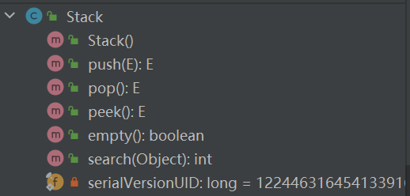

只有这么几个，第一个是构造器，最后一个是一个私有属性我就不多说了, `push`
是压栈，也就是把东西放进来，也就是先进后出的这个先进，然后 `peek` 的作用就是获取栈顶，也就是最近压栈的值是什么，然后 `pop`
的作用就是弹栈，就是把东西获取并且删除掉，然后 `empty` 就是 判断是否为空， `search` 就是从最上面往最下面找是第几个，下标是从1开始，没找到为-1

```java
package collection;

import java.util.Stack;

public class StackUsing {
    public static void main(String[] args) {
        Stack<String> stack = new Stack<>();
        for (int i = 1; i < 10; i++) {
            stack.push(String.valueOf(i));
        }
        System.out.println(stack.search("10")); //没找到为-1
        System.out.println(stack.search("1"));  //从上往下是第九个
        System.out.println(stack.search("9"));  //从上往下是第一个
        System.out.println(stack.peek());           //获取顶部的元素不弹栈
        System.out.println(stack.pop());            //获取顶部元素但是弹栈
        System.out.println(stack.pop());            //所以这里就是第8，弹完之后就是7
        System.out.println(stack.peek());           //用peek就是不弹，获取到的是7
    }
}
```

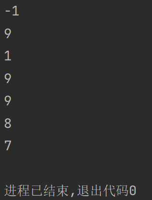

### Set

> 集合，高中学过的知识，也就是不可重复的元素集，所以这里也是一样，是不可重复的。同样的和List是一样，也是有这么一个Set接口作为引用类型，也就是父指子的父。

#### HashSet

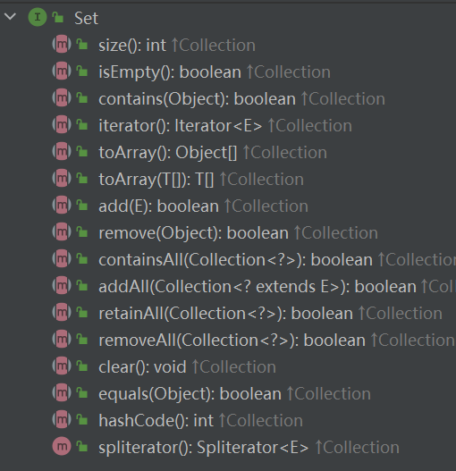

我们来使用一下，解释我也都是写在注释里，大家伙自己看一看吧

```java
package collection;


import java.util.HashSet;
import java.util.Set;

public class HashSetUsing {
    public static void main(String[] args) {
        //创建也是和List一样，毕竟都是用的泛型，所以我们规定一下泛型然后开始调用方法
        Set<String> set = new HashSet<>();
        //添加方法，添加成功返回true不成功返回false，如果内部已经有了这个元素则返回false
        for (int i = 0; i < 7; i++) {
            set.add(String.valueOf(i));
        }
        //判断是否存在这个元素
        System.out.println(set.contains("1") + " " + set.contains("7"));
        //获取大小
        System.out.println(set.size());
        //变成数组
        Object[] array = set.toArray();
        //删除元素
        set.remove("1");
        //然后还有和List类似的containsAll，retainAll，removeAll，addAll
        //自然还有clear和isEmpty
        System.out.println(set.isEmpty());
        set.clear();
        System.out.println(set.isEmpty());

    }
}
```

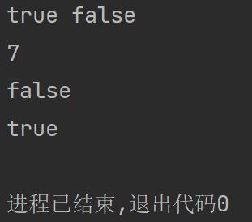

其实用法和List还是非常类似的，就是底层不一样和性质不一样。然后我们来看一下遍历是怎么遍历的，其实和List是一样的，但是由于没有List的这个get方法，所以我们就只有两个遍历方式可以进行遍历

```java
package collection;

import java.util.HashSet;
import java.util.Iterator;
import java.util.Set;

public class HashSetUsing2 {
    public static void main(String[] args) {
        Set<String> set = new HashSet<>();
        for (int i = 9; i >= 0; i--) {
            set.add(String.valueOf(i));
        }
        //第一种遍历方式，通过foreach进行遍历
        for (String s : set) {
            System.out.print(s + " ");
        }
        System.out.println();
        //第二种遍历方式，使用迭代器进行遍历
        Iterator<String> iterator = set.iterator();
        while (iterator.hasNext()) {
            System.out.print(iterator.next() + " ");
        }
    }
}
```

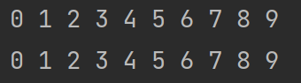

我们可以看到，他好像是有序的遍历，其实是因为在里面存放的时候是通过unicode的排序。因为大家伙可以看到我的加入元素的时候是通过倒着加入的。是不会出现是因为我们的加入方式而影响排序的，他就是根据unicode进行排序的，但实际上里面的排序不是这样的，这个只是我们遍历的时候是这样的。

#### TreeSet

> 这里就让ChatGPT来说说区别在哪里吧，其实之前我也提过一嘴的。不过还是要看情况使用对应的容器。

1. 底层数据结构：

    * HashSet：使用哈希表作为底层数据结构。哈希表通过将元素的键（也就是元素本身）映射到一个哈希码，然后将其存储在相应的位置上，实现了快速的插入、删除和查找操作。
    * TreeSet：使用红黑树（自平衡二叉搜索树）作为底层数据结构。红黑树保持所有元素有序，并提供了快速的有序遍历、查找等操作。

2. 元素顺序：
    * HashSet：元素在集合中的顺序是无序的。HashSet使用哈希码来组织元素，所以元素在集合中的位置是不可预测的。
    * TreeSet：元素在集合中是有序的。TreeSet通过红黑树的排序规则来维护元素的顺序，因此元素在集合中按照其自然顺序或自定义排序规则进行排序。
3. 性能：
    * HashSet：由于使用哈希表，HashSet在插入、删除和查找操作的平均时间复杂度是O(1)
      ，具有较快的性能。但是在极端情况下，哈希冲突可能导致操作的时间复杂度退化为O(n)。
    * TreeSet：由于使用红黑树，TreeSet在插入、删除和查找操作的平均时间复杂度是O(log n)
      ，其中n是集合中元素的数量。虽然相比哈希表，这些操作的性能略慢，但仍然保持较高效率。
4. 可排序性：
    * HashSet：由于无序，HashSet不支持按照元素顺序进行遍历或查找。
    * TreeSet：由于有序，TreeSet可以进行按照元素顺序的遍历和查找，还提供了一些与顺序相关的方法，如获取最小值、最大值、子集等。

### Map

> 映射，在Python里面也叫做字典，他即便要使用也需要规定两个泛型，因为就是如此，做的映射就是K-V也就是Key-Value，使用Key去获取Value的这么个映射
>
> Key是唯一的，但是Value是可以重复的，我可以是是1为Key然后再以2为Key，然后我的Value都可以是6。

#### HashMap

> 基于散列的映射，我们先来看看有什么API可以调用的

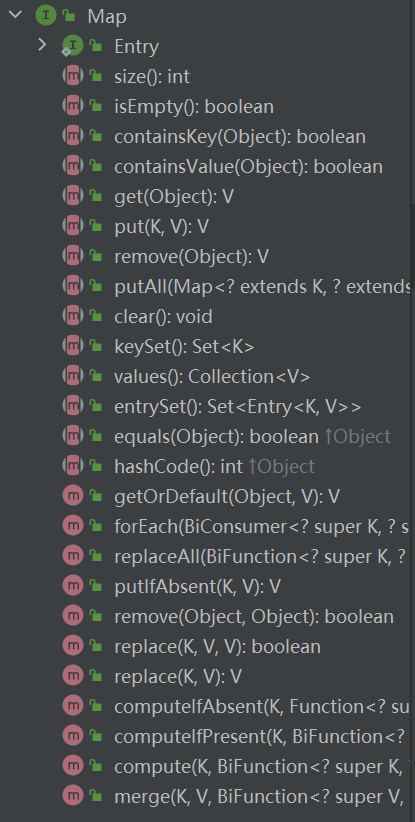

然后我们来实践一下，其实看名字都能知道是干什么作用的，我们现在就只是打一个眼熟的好吧。我们再说一点，其实HashSet的底层是HashMap

```java
package collection;

import java.util.HashMap;
import java.util.Map;

public class HashMapUsing {
    public static void main(String[] args) {
        //由于Map是K-V的映射，所以他的泛型也是有两个的，我们需要给定两个泛型。
        //除了两个都给String之外我们也可以一个String作为K，然后Object作为Value也是可以的
        //给定的泛型都是根据需求进行给的，我们也可以是使用一个类作为泛型是吧，要通过K进行V里面的储存也可以反过来
        Map<String, String> map = new HashMap<>();
        for (int i = 9; i > 0; i--) {
            //这个就是存放的方法，也是需要给定两个，一个是K一个V
            map.put(String.valueOf(i), String.valueOf(i * i));
        }
        System.out.println(map);
        //判断是否有这个Key
        System.out.println(map.containsKey("3"));
        //判断是否有这个Value
        System.out.println(map.containsValue("12"));
        //清空
//        map.clear();
        //假如我们又存入了里面已经存在的K的话，那就会把V给覆盖掉
        map.put("1", "123");
        System.out.println(map);
        //移除给定K上的元素，会返回V，其实看那张图就完事了
        map.remove("2");
        //经典是否为空
        System.out.println(map.isEmpty());
        //获取元素
        System.out.println(map.get("3"));
    }
}
```

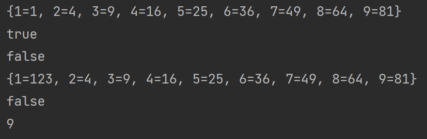

然后用了一些比较常见的API了之后我们来看看这个Map应该怎么遍历，毕竟还是比较麻烦的，是个双例集合而不是单条下去，而且也不继承迭代器，所以不能使用迭代器的方式进行遍历，但是其实他的遍历方式还是有很多种的。接下来我来给大家展示一下

```java
package collection;

import java.util.HashMap;
import java.util.Map;
import java.util.Set;

public class HashMapUsing2 {
    public static void main(String[] args) {
        Map<String, String> map = new HashMap<>();
        for (int i = 9; i > 0; i--) {
            map.put(String.valueOf(i), String.valueOf(i * i));
        }
        //首先我们的可以通过获取Key的方式然后再通过get方法进行获取V值
        //然后在我们的map的API中其实有获取Key的值的方式的
        //就是下面这个方法，KeySet，用Set集合的方式获取Key，毕竟Key是不可重复的，然后集合也是不可重复的
        Set<String> strings = map.keySet();
        //然后我们对这个Set进行遍历并配合get方法就可以获取全部的元素了
        for (String string : strings) {
            System.out.println("K:" + string + " V:" + map.get(string));
        }
        //除此之外我们还有其他的办法，获取一个Entry，这个就是保存着map属性的一个内部类
        //我们可以看到返回的还是一个集合，然后我们的这个Entry是不是也是K-V的这么一个泛型的形式
        //然后他里面保存的就是我们的map里面的内容，他也是有部分的API可以获取Key和Value
        Set<Map.Entry<String, String>> entries = map.entrySet();
        for (Map.Entry<String, String> entry : entries) {
            System.out.println(entry);
            System.out.println(entry.getKey() + entry.getValue());
        }
    }
}
```

```
K:1 V:1
K:2 V:4
K:3 V:9
K:4 V:16
K:5 V:25
K:6 V:36
K:7 V:49
K:8 V:64
K:9 V:81
1=1
11
2=4
24
3=9
39
4=16
416
5=25
525
6=36
636
7=49
749
8=64
864
9=81
981

进程已结束,退出代码0
```

这个就是Map的两个遍历方式

#### LinkedHashMap

> 这个就是保存了一下输入的顺序然后我们直接打印map的时候可以看到他的顺序

我们使用和HashMap的同一套代码，然后就把运行类型变成我们的这个LinkedHashMap然后来看看

```java
package collection;

import java.util.LinkedHashMap;
import java.util.Map;

public class HashMapUsing {
    public static void main(String[] args) {
        //由于Map是K-V的映射，所以他的泛型也是有两个的，我们需要给定两个泛型。
        //除了两个都给String之外我们也可以一个String作为K，然后Object作为Value也是可以的
        //给定的泛型都是根据需求进行给的，我们也可以是使用一个类作为泛型是吧，要通过K进行V里面的储存也可以反过来
        Map<String, String> map = new LinkedHashMap<>();
        for (int i = 9; i > 0; i--) {
            //这个就是存放的方法，也是需要给定两个，一个是K一个V
            map.put(String.valueOf(i), String.valueOf(i * i));
        }
        System.out.println(map);
        //判断是否有这个Key
        System.out.println(map.containsKey("3"));
        //判断是否有这个Value
        System.out.println(map.containsValue("12"));
        //清空
//        map.clear();
        //假如我们又存入了里面已经存在的K的话，那就会把V给覆盖掉
        map.put("1", "123");
        System.out.println(map);
        //移除给定K上的元素，会返回V，其实看那张图就完事了
        map.remove("2");
        //经典是否为空
        System.out.println(map.isEmpty());
        //获取元素
        System.out.println(map.get("3"));
    }
}
```

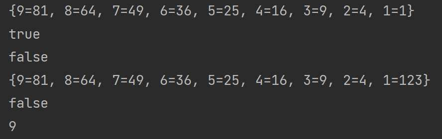

我是不是倒着存放的，这个打印是不是也是倒着输出的，这个就是这个LinkedHashMap的作用，其实也是非常的简单的，就是在储存的时候用链表进行了链接然后就达成了这种方式

#### TreeMap

> 不知道大家看不看得出来，既然我都说HashMap是HashSet的底层实现，那我们的这个TreeMap是不是也是TreeSet的底层实现呢，那必然是，所以我也就不自己说了，毕竟其实用起来都差不多，只是有点微小的区别

所以同样让那个男人来回答你们

1. 数据结构：
    * HashMap：使用哈希表（散列表）实现，通过哈希函数将键映射到表中的一个位置，然后将值存储在该位置上。HashMap中的元素没有固定的顺序，它们根据哈希码分布在表中。
    * TreeMap：使用红黑树实现，这是一种自平衡二叉搜索树。TreeMap中的元素按照键的自然顺序或者自定义比较器的顺序进行排序。
2. 排序：
    * HashMap：不保证元素的顺序，即使在Java 8之前，它们的遍历顺序通常是相同的，但这并不是HashMap的规范保证。
    * TreeMap：保持元素按照键的顺序排列，因此可以根据键的顺序输出有序的结果。
3. 性能：
    * HashMap：由于使用哈希表，HashMap的插入、删除和查找操作具有较快的平均时间复杂度（O(1)
      ）。但在哈希碰撞（两个键映射到同一个位置）时，性能可能下降，导致查找时间略微增加。
    * TreeMap：由于使用红黑树，TreeMap的插入、删除和查找操作的平均时间复杂度是O(log n)
      ，其中n是元素的数量。红黑树的自平衡性质确保了较稳定的性能，但相较于HashMap，它的操作稍微慢一些。
4. 适用场景：
    * HashMap：适用于大部分情况，特别是当你需要快速插入、删除和查找键值对，而不需要保持顺序时。它在大多数情况下提供了更好的性能。
    * TreeMap：适用于需要保持元素有序的情况，或者需要基于键的顺序进行范围查找。例如，你可以使用TreeMap来获取最小键值、最大键值，或者在某个范围内查找键值对。

在选择HashMap和TreeMap时，考虑到你的具体需求和性能要求是非常重要的。通常情况下，HashMap是更常见的选择，但如果你需要有序的映射结构，那么TreeMap可能更适合。

差不多把我们的集合全部讲完了，希望大家能理解一些底层是怎么实现的然后稍微自己琢磨一下，其实Hash的底层我并没有讲，因为他的底层相对来说会比前面几个基本数据结构的线性结构比起来会有点麻烦

所以我就不讲深入了，现在浅讲一下好了，Hash的这个Hash其实就是散列的意思，就是散开，举个栗子就是我们都对16取模，然后存入大小为16的数组中，因为对16取模其实范围就是0 ~
15 然后把东西存入数组当中，那如果他们取完模相等了怎么办，那这个时候就到链表出手的时候了，链表会把他们链在这个数组的下面的。

但是，这个链表是单向链表。然后我们在超过一个阈值的时候会进行树化，因为这个时候使用链表进行储存的效率已经不够高了，所以会把他变成上面所说的，红黑树，但是这个是在散列结构在单个节点上过多了之后才会进行的树化和直接上来就是用树储存的TreeMap还是不一样的。

希望大家听了我说的概念会有点兴趣自己去追溯一下源码，我们就先学到这里

### [上一章](day17.md)

### [下一章](day19.md)

### [返回目录](README.md)