# ***Day19 IO流(文件操作，读写文件)***

> 虽然我标题写的是IO流然后括号里写的文件操作，其实文件操作只需要一个File类即可，IO流主要是单个文件的内容写入或者其他一些东西

根据顺序我们先来学习File这个类，也就是通过Java对文件做处理。然后我们再学习怎么使用IO对文件的内容进行处理再深入了解IO流。

## 第一章 文件操作（File类）

要学习File，首先我们需要认识一下File对应的API，我们一般就是直接调用就行了，然后能看得懂英文其实就没有什么问题，对于使用这个File这个类进行文件操作。

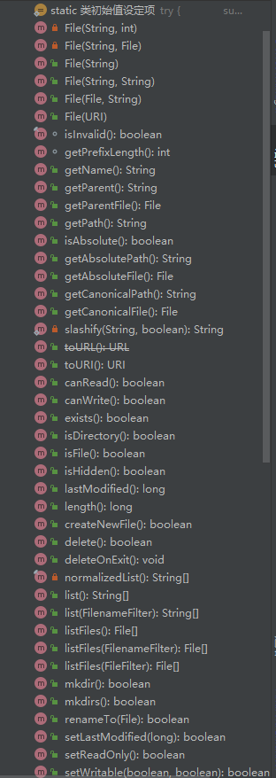

这只是一部分的，但是基本上图上的就是已经是我们平时够用了的。（其实真要用文件处理，等你们学好Java之后去学一下Python，用Python做文件处理是比较省心的，Java写起来还是有点长的）

我们来看看一些最基本的API怎么使用，还有我们的路径问题，首先我们知道路径一般有两种，一种是相对路径另外一个是绝对路径，相对路径是从项目目录下开始的，比如我们这个项目就是这个Learning，然后他下面开始就是相对目录，比如这个list.txt他相对路径直接就是 "
list.txt"

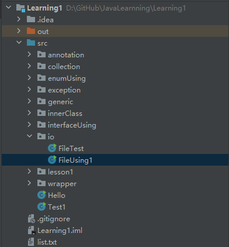

然后我们能看到在我们项目的边上可以看到绝对路径就是 "D:\GitHub\JavaLearnning\Learning1\list.txt"
先不要在意为什么中间多了一个n，手抖多打了一个😅，那么这个就是我们的相对路径和绝对路径，如果是Linux或者MacOS的话就是从根目录开始就是绝对路径 "
/xxx/xxx/xxx/xxx/list.txt"
然后在我们Windows里面就是从盘符开始，如果你没有写盘符那就是相对路径，写了就不是，如果是linux和macOS的话那就是开头不写 "/"
就是相对路径，写了就是绝对路径

然后我们来进行初步的使用，就直接通过代码给大家讲解了。

```java
package io;

import java.io.File;

public class FileUsing1 {
    public static void main(String[] args) {
        //我们通过绝对路径或者是相对路径来创建对象
        File file = new File("list.txt");
        //因为我们的\是转义符然后windows里又是这个作为分割路径的符号，所以我们可以使用/替代或者是\\直接使用\
        //然后这里我们再做一个特殊的处理，就是大家都看到了，我其实写错了多敲了个n，但是这里没有，所以就是搞一手不一样的路径
        //或者说是一个错误的路径。然后我们再来进行调用API来看看
        File file1 = new File("D:\\GitHub\\JavaLearning\\Learning1\\list.txt");
        //我们一般都使用这个方式来创建对象，还有其他的，但是大差不差，比如双String的，parentPath，childPath，父路径和子路径
        //然后父与子的又有FIle对象和String类型，全的String类型有一个URL类替代。
        //接下来我们来调用一些API
        //获得绝对路径，返回String
        System.out.println(file.getAbsoluteFile());
        System.out.println();
        //获得名字，如果你是绝对路径，不管你文件存在与否，都是返回最后一个\的后面字符串，返回String
        System.out.println(file.getName());
        System.out.println();
        //获得路径，就是创建对象的时候填写的那个String，返回String
        System.out.println(file.getPath());
        System.out.println(file1.getPath());
        System.out.println();
        //还有一堆可以get的东西，可以自己查看API
        //判断是否为文件，同样的还有是否为目录等
        System.out.println(file.isFile());
        System.out.println();
        //是否为目录
        System.out.println(file.isDirectory());
        System.out.println();
        //是否为绝对路径，无论存在与否
        System.out.println(file.isAbsolute());
        System.out.println();
        //文件是否存在
        System.out.println(file.exists());
        System.out.println();
        //如果我们判断不存在的文件，就出现false
        System.out.println(file1.exists());
        System.out.println();
        //我们再来看看几个比较有功能性的，比如说删除，返回布尔值
        //是真的会删掉的，请注意了，不要对你宝贵的有用的文件使用这个操作
//        System.out.println(file.delete());
        //在参数列表里面填写的是一个File类型，这个其实就和Linux的mv和dos的move是一样的
        //我这里写的意思就是创建一个新的File对象，但是里面写的字符串处理是比较复杂的。意思就是获取绝对路径，
        //但是绝对路径肯定也是带上文件名的对不对，所以我再获取文件名，通过substring这个方法进行裁剪
        //获取总长度然后减去文件名的长度，是不是就可以得到到\为止的字符串长度然后我再拼接上我要重新写的名字
        //自然大家也可以看到这块代码的可利用度也是挺高的，用一个方法来封装起来，传file对象就行，然后再加上String类型再返回file对象
        //是不是就完成了一个小封装,比如叫
        /*
        public static File rename(File file, String name) {
            return new File(file.getAbsolutePath().substring(0,
                file.getAbsolutePath().length() - file.getName().length()) + "list1.txt");
        }
        */
        System.out.println(file.renameTo(new File(file.getAbsolutePath().substring(0,
                file.getAbsolutePath().length() - file.getName().length()) + "list1.txt")));
        System.out.println();
        //还是有一系列的比如mkdir创建1级文件夹，大于1级就不创建，mkdirs就是创建多级文件夹，还有createNewFile创建新文件，但是这个会抛异常
    }
}

```

```
D:\GitHub\JavaLearnning\Learning1\list.txt

list.txt

list.txt
D:\GitHub\JavaLearning\Learning1\list.txt

true

false

false

true

false

true


进程已结束,退出代码0
```

然后咱们再来测试一段代码，比如遍历打印一个目录下的所有文件并且打印他是否为文件或者是是否为目录

```java
package io;

import java.io.*;

public class FileTest {
    public static void main(String[] args) {
        File file1 = new File("D:\\GitHub\\JavaLearnning\\Learning1");
        fileUsing(file1.getPath());
    }

    public static void fileUsing(String filePath) {
        File file = new File(filePath);
        if (!file.exists()) {
            return;
        }
        if (file.isDirectory()) {
            System.out.println(file.getParentFile().getPath() + File.separator + file.getName() +
                    " is directory");
            File[] files = file.listFiles();
            for (File file1 : files) {
//                System.out.println(file1.getPath());
                String path = file1.getPath();
                if (path.contains("src")) {
                    fileUsing(path);
                }
            }
        }
        if (file.isFile()) {
            System.out.println(file.getParentFile().getPath() + File.separator + file.getName() + " is file");
        }
    }
}
```

```
D:\GitHub\JavaLearnning\Learning1 is directory
D:\GitHub\JavaLearnning\Learning1\src is directory
D:\GitHub\JavaLearnning\Learning1\src\annotation is directory
D:\GitHub\JavaLearnning\Learning1\src\annotation\AnnotationTest.java is file
D:\GitHub\JavaLearnning\Learning1\src\collection is directory
D:\GitHub\JavaLearnning\Learning1\src\collection\ArrayListUsing.java is file
D:\GitHub\JavaLearnning\Learning1\src\collection\HashMapUsing.java is file
D:\GitHub\JavaLearnning\Learning1\src\collection\HashMapUsing2.java is file
D:\GitHub\JavaLearnning\Learning1\src\collection\HashSetUsing.java is file
D:\GitHub\JavaLearnning\Learning1\src\collection\HashSetUsing2.java is file
D:\GitHub\JavaLearnning\Learning1\src\collection\StackUsing.java is file
D:\GitHub\JavaLearnning\Learning1\src\collection\TreeMapUsing.java is file
D:\GitHub\JavaLearnning\Learning1\src\enumUsing is directory
D:\GitHub\JavaLearnning\Learning1\src\enumUsing\EnumTest.java is file
D:\GitHub\JavaLearnning\Learning1\src\enumUsing\EnumTest2.java is file
D:\GitHub\JavaLearnning\Learning1\src\exception is directory
D:\GitHub\JavaLearnning\Learning1\src\exception\ExceptionTest.java is file
D:\GitHub\JavaLearnning\Learning1\src\exception\MyException.java is file
D:\GitHub\JavaLearnning\Learning1\src\generic is directory
D:\GitHub\JavaLearnning\Learning1\src\generic\GenericTest1.java is file
D:\GitHub\JavaLearnning\Learning1\src\generic\GenericTest2.java is file
D:\GitHub\JavaLearnning\Learning1\src\generic\GenericTest3.java is file
D:\GitHub\JavaLearnning\Learning1\src\Hello.java is file
D:\GitHub\JavaLearnning\Learning1\src\innerClass is directory
D:\GitHub\JavaLearnning\Learning1\src\innerClass\AnonymousInnerClass.java is file
D:\GitHub\JavaLearnning\Learning1\src\innerClass\LocalInnerClass.java is file
D:\GitHub\JavaLearnning\Learning1\src\innerClass\OuterClass.java is file
D:\GitHub\JavaLearnning\Learning1\src\interfaceUsing is directory
D:\GitHub\JavaLearnning\Learning1\src\interfaceUsing\TestInterface.java is file
D:\GitHub\JavaLearnning\Learning1\src\io is directory
D:\GitHub\JavaLearnning\Learning1\src\io\FileTest.java is file
D:\GitHub\JavaLearnning\Learning1\src\io\FileUsing1.java is file
D:\GitHub\JavaLearnning\Learning1\src\lesson1 is directory
D:\GitHub\JavaLearnning\Learning1\src\lesson1\Extends1.java is file
D:\GitHub\JavaLearnning\Learning1\src\Test1.java is file
D:\GitHub\JavaLearnning\Learning1\src\wrapper is directory
D:\GitHub\JavaLearnning\Learning1\src\wrapper\CalenderTest.java is file
D:\GitHub\JavaLearnning\Learning1\src\wrapper\InstantTest.java is file
D:\GitHub\JavaLearnning\Learning1\src\wrapper\LocalDateTimeTest.java is file
D:\GitHub\JavaLearnning\Learning1\src\wrapper\SBTest.java is file
D:\GitHub\JavaLearnning\Learning1\src\wrapper\SystemTest.java is file
D:\GitHub\JavaLearnning\Learning1\src\wrapper\UsingBigDecimal.java is file
D:\GitHub\JavaLearnning\Learning1\src\wrapper\WrapperTest.java is file

进程已结束,退出代码0
```

大家可以尝试各种想法通过File去写文件处理的脚本，比如说把一个文件夹内所有的文件移动到另外一个文件夹，比如说一个file他是目录，那你就可以通过list获取一个字符串数组，里面存的就是单单的名字。通过拼接路径达到访问文件的目的，然后我们还可以通过正则表达式进行筛选等等，代码的功能还是很强大的。毕竟计算机上的所有的操作可以说都是有代码的身影，我们不写java也可以写bat脚本对windows进行操作。linux和macOS我们就可以通过shell脚本进行操作。

## 第二章 io流

> 首先我们来看看，一张图，来讲io流关系的。


io流分两种流一种是`基本流`一种是`包装流`，`基本流`也叫做`节点流`，包装流就是对节点流进行包装的一个流，首先我们得对流有些概念。

流这个字一听就是和水流强相关，所以我们可以根据水流去理解io流的概念，我们可以把数据都当做水，我们通过水源流出的水流到达目的地，这个就是io流。

io流也分两大种，一种是`输入流`一种是`输出流`，如果名字一样io就是input
output，input就是输入，output就是输出，然后我们又分两种一种是字节流一种是字符流。字节流就是一种二进制流，而字符流就是文本流。所以一分就是有四种流

* 字节输入流 InputStream
* 字节输出流 OutputStream
* 字符输入流 Reader
* 字符输出流 Writer

### 1.输入流

我们做文件的写入使用的就是输出流，然后读取用的就是输入流。从之前我们已经知道了什么是相对路径什么是绝对路径，所以我们在创建流的时候就可以使用，当然我们第一章用到的File也是可以直接创建流的。

比如我们直接使用Reader也就是字符输入流我们在创建对象的时候可以看到我们可以直接写对应的路径，也可以直接传入一个File对象。
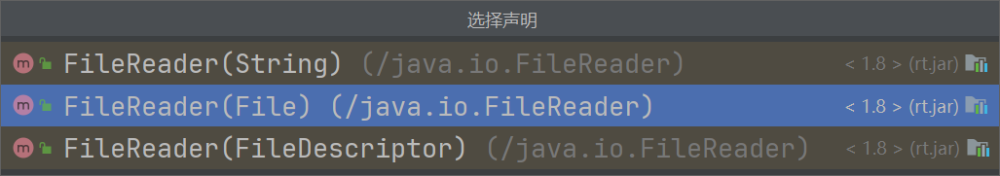

但是我们在使用io流的时候是可能发生一些问题的，所以我们需要对异常进行处理

作为读取端我们得和C语言一样需要一个缓冲区，字符输入流的缓冲区自然就是char数组而字节输入流的缓冲区。

然后我们来看看list里面有什么，然后我们开始编写代码进行读取。
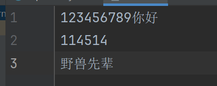

```java
package io;

import java.io.File;
import java.io.FileReader;
import java.io.IOException;


public class InputTest {
    public static void main(String[] args) {
        //先获得file
        File file = new File("list.txt");
        //判断文件是否存在和是否为文件
        if (file.exists() && file.isFile()) {
            //创建字符输入流（节点流）
            FileReader fileReader;
            //这个是可变字符序列
            StringBuilder sb = new StringBuilder();
            try {
                //缓冲区
                char[] chars = new char[255];
                //通过file创建对象
                fileReader = new FileReader(file);
                int i;
                //读取的时候将数据存入缓冲区，当返回值是-1的时候相当于碰到了EOF也就是end of file文件的结尾，所以循环结束
                //这里获得的i是当前长度，如果没有当前没读取到东西所以返回的就是-1也就是嗲表这eof的标记，然后我们就可以用这个来切割数组
                while ((i = fileReader.read(chars)) != -1) {
                    //进行切割存到字符串里
                    String s = String.valueOf(chars, 0, i);
                    //用可变字符序列进行拼接
                    sb.append(s);
                }
                //不要忘记关闭你的流，不然容易内存泄漏
                fileReader.close();
            } catch (IOException e) {
                throw new RuntimeException(e);
            }
            //打印拼接成果
            System.out.println(sb);
        }
    }
}
```

```
123456789你好
114514
野兽先辈

进程已结束，退出代码为 0
```

### 2.输出流

然后我们再来看看输出流的案例，首先我们可以先创建一个文件，当然我们也可以直接写路径在输出的时候会自动创建文件，都是可以的，这个都是看我们自己的个人选择。那我这里既然读取用的都是File了，那我也用File做输出好了

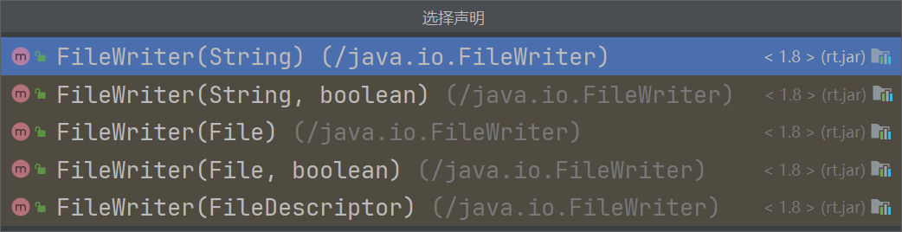
我们可以看到在FileWriter比起FileReader多了两个布尔值的参数，我们可以进入查看一下。

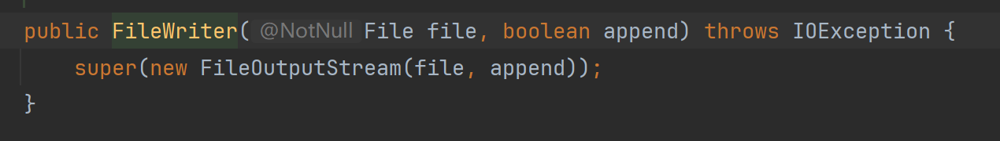
我们可以发现原来是不给定这个布尔值那就是覆盖，如果给了那就是末尾添加上去。

```java
package io;

import java.io.File;
import java.io.FileWriter;
import java.io.IOException;


public class OutputTest {
    public static void main(String[] args) {
        File file = new File("list2.txt");
        if (!file.exists()) {
            try {
                if (file.createNewFile())
                    System.out.println("文件不存在创建成功");
            } catch (IOException e) {
                throw new RuntimeException(e);
            }
        }
        //我们这里使用的是一个try-catch的高级用法，在使用完之后会自动close，所以我们就不需要主动调用了
        try (FileWriter fileWriter = new FileWriter(file)) {
            //写入
            fileWriter.write("123123\n");
            //写完之后要使用刷新才能写入不然不会写入
            fileWriter.flush();
            fileWriter.write("114514,port=25565,name=XingZai");
            fileWriter.flush();
        } catch (IOException e) {
            throw new RuntimeException(e);
        }
    }
}
```

当然我们这么写打印信息几乎没有只有一个文件不存在的时候才会打印一个创建文件成功的操作。

```
文件不存在创建成功

进程已结束，退出代码为 0
```

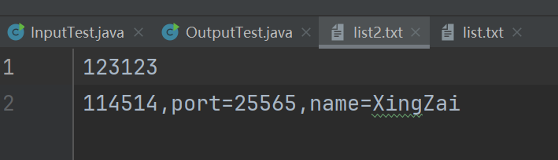

我们可以看到文件是创建成功了的。

### 3.输入输出混合使用

> 那我们可以考虑一个问题，如果我们的输入流和输出流一起使用的话是不是就可以出现一个拷贝的情况了。

没错就是这样，但是这次我们就不用字符了，因为这样子就单纯的拷贝文本，还是有点没意思的，我们就去用字节输入输出流传输一个mp3文件好了，大家可以改成自己的路径。

```java
package io;

import java.io.File;
import java.io.FileInputStream;
import java.io.FileOutputStream;
import java.io.IOException;

public class CopyTest {
    public static void main(String[] args) {
        //这里是我的mp3路径，你们改成自己的就行了
        File file = new File("E:/CloudMusic/VipSongsDownload/米津玄師 - LOSER.mp3");
        //惯例判断是否存在和是否为文件，自然也可以不写，但是写起来严谨一点
        if (file.exists() && file.isFile()) {
            System.out.println("文件存在");
            //这里也是我根据相对路径写的我这里要存的路径
            File output = new File("src/io/Loser.mp3");
            //这里直接我们用输出流那会用的技巧两个都混合在一起
            try (FileInputStream fileInputStream = new FileInputStream(file);
                 FileOutputStream fileOutputStream = new FileOutputStream(output)) {
                //因为是字节，所以缓冲区也是字节
                byte[] bytes = new byte[5120];
                //然后定义长度
                int len;
                //获得长度并且判断长度是否不为-1
                while ((len = fileInputStream.read(bytes)) != -1) {
                    //写入
                    fileOutputStream.write(bytes, 0, len);
                    //刷新
                    fileOutputStream.flush();
                }
                //这里是末尾了，因为try里面写的io流，所以会自动关闭我们也不需要调用close了
            } catch (IOException e) {
                throw new RuntimeException(e);
            }
            //最后的打印
            System.out.println("圆满结束");
        }
    }
}
```

```
文件存在
圆满结束

进程已结束，退出代码为 0
```

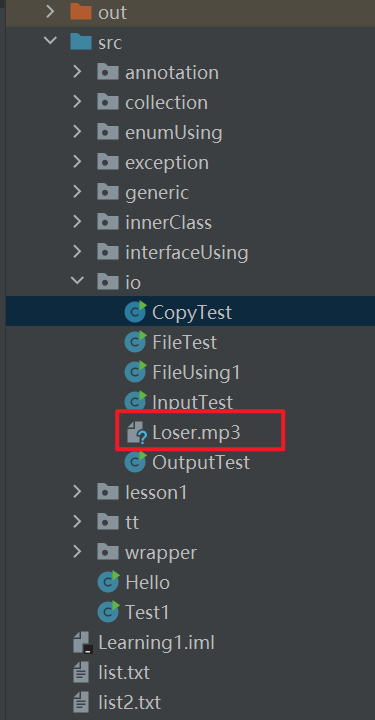

### 4.包装流

大家可以看到我这里就拷贝过来了，大家可以自己去试一下。这就是java的io流。基本原理就是这样，后面还有包装流但是也是需要节点流的支持，也就是说包装流是包装节点流的。提供了更强大的功能，所以只要学会了节点流包装流就是用更多的API。

```java
package io;

import java.io.BufferedWriter;
import java.io.FileWriter;
import java.io.IOException;

public class BufferedStreamTest {
    public static void main(String[] args) {
        try (BufferedWriter bufferedWriter = new BufferedWriter(new FileWriter("list3.txt"))) {
            bufferedWriter.write("一二三四五六七");
            //这个就是bufferedWriter添加的一个API可以创建新的一行，考虑到在不同机器上的新的一行不一定是\n
            bufferedWriter.newLine();
            bufferedWriter.write("七六五四三二一");
            bufferedWriter.newLine();
        } catch (IOException e) {
            throw new RuntimeException(e);
        }
    }
}
```

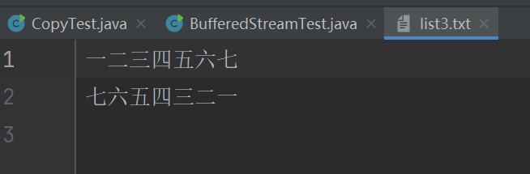

```java
package io;

import java.io.BufferedReader;
import java.io.FileReader;
import java.io.IOException;

public class BufferedInputTest {
    public static void main(String[] args) {
        StringBuilder sb = new StringBuilder();
        try (BufferedReader bufferedReader = new BufferedReader(new FileReader("list.txt"))) {
            String s;
            //直接读取一行，这个就是bufferedReader提供的一个API
            while ((s = bufferedReader.readLine()) != null) {
                sb.append(s);
                sb.append("\n");
            }
        } catch (IOException e) {
            throw new RuntimeException(e);
        }
        System.out.println(sb);
    }
}

```

```
123456789你好
114514
野兽先辈


进程已结束，退出代码为 0
```

### 5.数组节点流

还有一些我就混在一起给大家展示了，想要看详细API可以进入对应的类然后用结构structure去查看，看能调用的只需要看public的即可

我们先来看看数组的流，字节byte数组的输入输出流，字符char数组的输入输出流，还有字符串的输入输出流

```java
package io;

import java.io.*;
import java.util.Arrays;

public class ArrayStreamTest {
    public static void main(String[] args) throws IOException {
        System.out.println("===============分割线===============字节数组输出流");
        //字节数组输出流，只对数组做IO没有涉及文件系统，无需填入任何参数
        ByteArrayOutputStream byteArrayOutputStream = new ByteArrayOutputStream();
        for (int i = 1; i < 51; i++) {
            //写了之后内容也是存在输出流里面
            byteArrayOutputStream.write(i);
        }
        //可以通过toByteArray获得byte数组
        byte[] byteArray = byteArrayOutputStream.toByteArray();
        //关闭流
        byteArrayOutputStream.close();
        //打印获得的数组
        System.out.println(Arrays.toString(byteArray));
        System.out.println("===============分割线===============字节数组输入流");
        //字节数组输入流，只对数组做IO没有涉及文件系统，参数除了直接给数组之外还可以给数组和初始下标与长度
        ByteArrayInputStream byteArrayInputStream = new ByteArrayInputStream(byteArray);
        int b;
        //这里也是懒得做缓冲了，直接读了
        while ((b = byteArrayInputStream.read()) != -1) {
            System.out.print(b + ", ");
        }
        System.out.println();
        System.out.println("===============分割线===============字符数组输出流");
        //字符数组输出流
        CharArrayWriter charArrayWriter = new CharArrayWriter();
        for (int i = 0; i < 128; i++) {
            if (i >= '0' && i <= '9' || i >= 'a' && i <= 'z' || i >= 'A' && i <= 'Z')
                charArrayWriter.write(i);
        }
        char[] charArray = charArrayWriter.toCharArray();
        System.out.println(charArray);
        System.out.println("===============分割线===============字符数组输入流");
        //字符数组输入流
        CharArrayReader charArrayReader = new CharArrayReader(charArray);
        int c;
        while ((c = charArrayReader.read()) != -1) {
            System.out.print((char) c);
        }
        System.out.println();
        System.out.println("===============分割线===============字符串输出流");
        StringWriter stringWriter = new StringWriter();
        stringWriter.write(charArray);
        System.out.println(stringWriter);
        System.out.println("===============分割线===============字符串输入流");
        StringReader stringReader = new StringReader(stringWriter.toString());
        int s;
        while ((s = stringReader.read()) != -1) {
            System.out.print((char) s);
        }
        System.out.println();

    }
}

```

```
===============分割线===============字节数组输出流
[1, 2, 3, 4, 5, 6, 7, 8, 9, 10, 11, 12, 13, 14, 15, 16, 17, 18, 19, 20, 21, 22, 23, 24, 25, 26, 27, 28, 29, 30, 31, 32, 33, 34, 35, 36, 37, 38, 39, 40, 41, 42, 43, 44, 45, 46, 47, 48, 49, 50]
===============分割线===============字节数组输入流
1, 2, 3, 4, 5, 6, 7, 8, 9, 10, 11, 12, 13, 14, 15, 16, 17, 18, 19, 20, 21, 22, 23, 24, 25, 26, 27, 28, 29, 30, 31, 32, 33, 34, 35, 36, 37, 38, 39, 40, 41, 42, 43, 44, 45, 46, 47, 48, 49, 50, 
===============分割线===============字符数组输出流
0123456789ABCDEFGHIJKLMNOPQRSTUVWXYZabcdefghijklmnopqrstuvwxyz
===============分割线===============字符数组输入流
0123456789ABCDEFGHIJKLMNOPQRSTUVWXYZabcdefghijklmnopqrstuvwxyz
===============分割线===============字符串输出流
0123456789ABCDEFGHIJKLMNOPQRSTUVWXYZabcdefghijklmnopqrstuvwxyz
===============分割线===============字符串输入流
0123456789ABCDEFGHIJKLMNOPQRSTUVWXYZabcdefghijklmnopqrstuvwxyz

进程已结束，退出代码为 0
```

管道流不适合在这里说，因为管道流需要用到多线程，我们还没学到那里。

除了以上节点流之外还有很多的包装流，就和第三点的Buffered的类似，有InputStreamReader的这种转换流，可以把字符流转换成字节流，自然有输入也有输出OutputStreamWriter。还有如同对象流这种包装流等等。

这个时候还要讲一个流就是打印流，这个我们时刻可以看到的也就是 `System.out.println`
里面的out，因为我们在ide里面看到他就知道他是一个静态属性，所以我们可以点进System去看他。

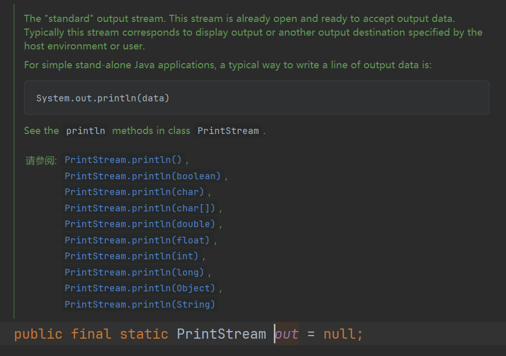

除了out我们还有用过in，就是在使用Scanner的时候写过的`System.in`如下

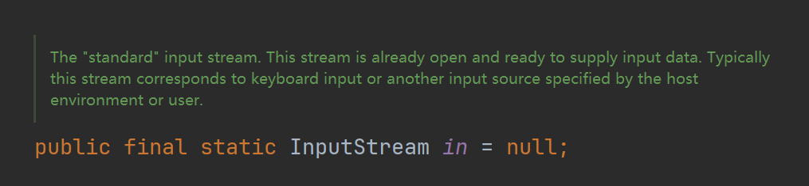

到这里，你已经学会了io流了，剩下就是自己多多尝试得出的结果了。我们也可以配合这些基本的功能去写对应的文本处理的程序还有做文件处理的程序。

### [上一章](day18.md)

### [下一章](day20.md)

### [返回目录](README.md)