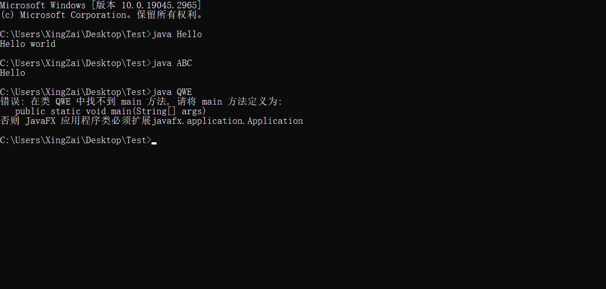
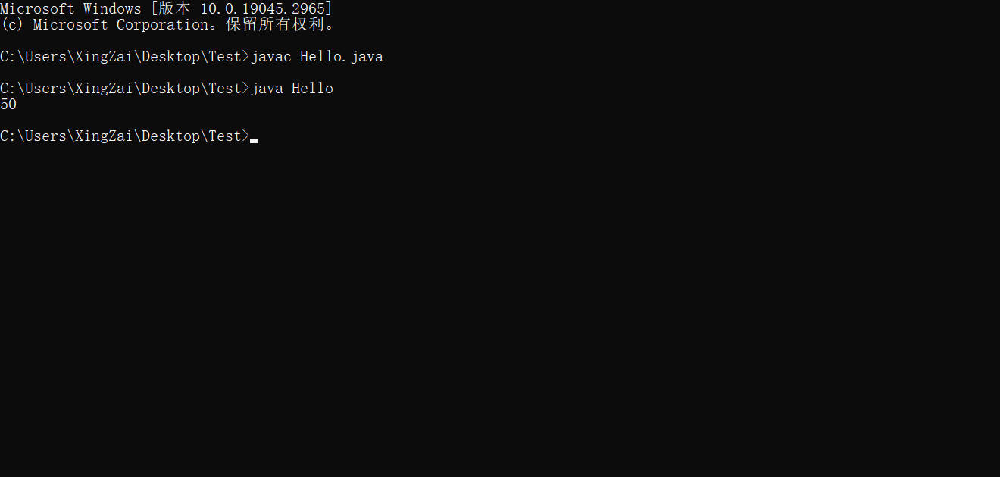
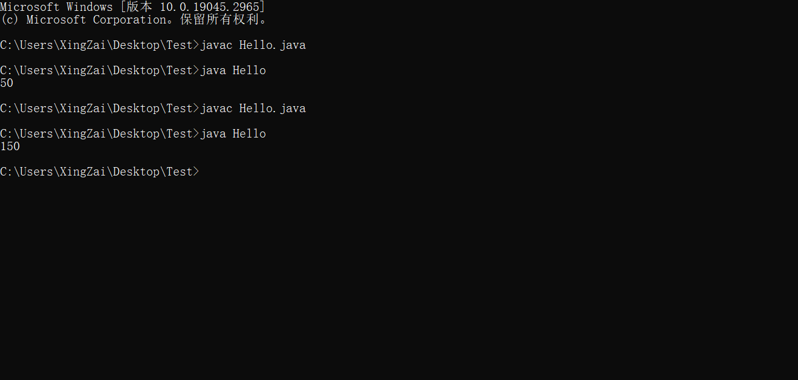
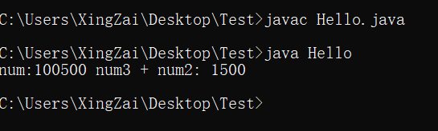
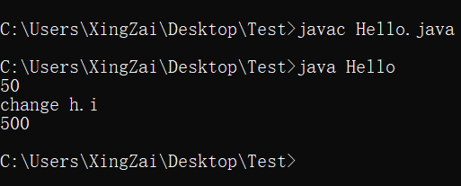
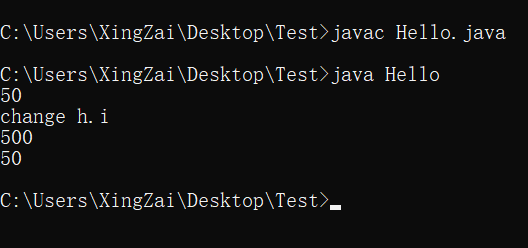

# ***Day2 认识类与对象***

## 第一章 初识类

> 经过一个程序的编写，应该对程序的结构有点好奇了吧，如果你有基础，接下来的肯定非常的易懂，如果你没有基础也没有关系，反复琢磨一下也就懂了😆

我们来重复一下第一个程序

```java
public class Hello {
    public static void main(String[] args) {
        System.out.println("Hello world");
    }
}
```

我们以空格划分多个单词，比如第一行的public就是第一行的第一个，class就是第一行的第二个单词，第二行的public就是第二行的第一个单词，如此。

首先我们看`类名`也就是`class`后面跟着的单词也就是第一行第三个单词，这个尤为的重要，比如我的文件名并不叫做`Hello.java`
那我这样编译就会出问题，即使我是`hello.java`
也会出问题，因为Java是一个对大小写敏感的程序，和Python、C、C++、JavaScript等等是一样的。对大小写不敏感的有各种数据库啊、还有操作系统的文件系统，比如linux或者windows或者是macOS等等，这是第一点。

第二点，`公有类名`要与文件名一致。没错，你一个Java文件内可以有多个类，但是`公有类`
只能有一个，就是带`public class [类名/文件名]`里面的类名，然后你还可以并行很多类像这样

命名规则的话查看normal
solutions.md里面就行

```java
//唯一的public类，类名必须和文件名一致，不然就会报错
public class Hello {
    //我是单行注释使用两个斜杠就可以使用注释了
    //是只会在看代码的阶段存在,编译后并不存在
    //但是我建议删掉注释，因为我打的是中文可能会出现编码问题
    //如果你会改编码的话那就是最好的，如果你不会的话删掉就不会出问题了
    //或者你可以去看看normal solutions.md那个文件
    public static void main(String[] args) {
        /*
                这个是多行注释使用杠星星杠的方式框柱
         */
        System.out.println("Hello world");
    }
}

//非public类可以无限多
class ABC {
    public static void main(String[] args) {
        System.out.println("Hello");
    }
}

//只不过每个类被编译后又会出现一个新的字节码文件也就是.class文件
class QWE {

}
```


如果看了第一天全文字还没被劝退说明你还是有耐心的，可以真的开始学习Java了，

但是这里也很明显因为有三个类虽然放在了一起但是编译出来其实还是三个文件，就是说我其实直接再开两个Java文件也是一样的。这里我们在`ABC`
类和`Hello`类中都有打印，我们来运行一下



这里的信息也告诉了我们，我们需要`main`这么一个“方法”才可以运行，那就说明大家想要运行程序必须要有这么一个`main`
方法，只需要照着写其实就可以了`public static void main(String[] args)`

然后想要打印信息只需要把信息放到`System.out.println("");`的双引号中间即可打印对应的信息。

## 第二章 数据类型

> 每个语言都有数据类型，像Java、C、C++、C#、Python这些都是强类型语言，JS（JavaScript）、vb、php这些就是弱类型语言。  
> 但是强类型语言也分明显与不明显，比如Java、C、C++、C#这些就需要先声明再使用，然后Python是直接赋值但是底层类型还都是规定好的，整形就是整形，浮点就是浮点，字符串就是字符串。
> 弱类型语言就是要声明也就只是声明有这个变量并没有规定是什么数据类型。

Java的数据类型有四种，每种又有其他的分类

* 整形
    * byte 1字节
    * short 2字节
    * int 4字节
    * long 8字节
* 浮点
    * float 4字节
    * double 8字节
* 布尔
    * boolean 1字节
* 字符
    * char 2字节

这些数据类型拿来使用的时候（声明变量）都是做关键字的。就比如`public`,`class`,`static`,`void`
这在上面变成了特殊颜色的就是关键字，在github上的配色方案应该是红色，然后刚刚上面说的8个数据类型也都是关键字。

先来讲讲`字节`是什么(懂的可以跳过)，1个`字节` = 8`位`，一个位就是2进制的数，比如`0000 0001`就是1，`0000 0010`
就是2，`0000 0100`
就是4，`0000 1000`
就是8，如果不会的但是细心的你会发现这不就是2的0到3次幂吗，没错就是这样，通过这样的排列组合在到达`0001 0000`
的16之前，其实后四个数就能表示0 ~ 15，这就是二进制，然后8个`位`为一个`字节`
，相当于byte一个字节那就可以装下256个数，但是要表示负数和正数和0，所以范围是-128 ~ 127，比如int是4个字节也就是32位，那他的最小就是-2^31，最大就是
2^31 - 1，因为需要一个数去表示0。 浮点又是其他的方式存储，布尔又是只有表示正确的true和表示错误的false，字符又是根据unicode进行存储。

```java
public class Hello {
    public static void main(String[] args) {
        int i = 50; //变量的声明并赋值 = 号是赋值
        System.out.println(i);
    }
}
```



以上就是声明变量，通过关键字 变量名的方式去声明并赋值`int i = 50`，在代码里面单个`=`的作用就是`赋值`
然后可以通过打印的方式来具现化，自然我们也可以做运算

```java
public class Hello {
    public static void main(String[] args) {
        int i = 50;
        int i2 = 100;
        //在打印之中也是可以运算的
        System.out.println(i + i2);
    }
}
```

  
自然我们也可以拼接字符串来说明信息比如这样，这个时候就要说`+`号的不同作用了，在与字符串和任何值使用`+`
的时候他就会变成拼接，在数与数之间就是运算，自然在字符串和字符串中间也是拼接

```java
public class Hello {
    public static void main(String[] args) {
        int num = 100;
        int num2 = 1000;
        int num3 = 500;
        //自然也有拼接
        System.out.println("num:" + num + num3 + " num3 + num2: " + (num2 + num3));
    }
}
```

  
明显能看出其中的端倪，`num + num3`并没有相加而是拼接在了一起，而后面的`(num2 + num3)`
确实是相加在了一起，这就是区别，如果想要运算那就加上括号，如果要拼接那就使用和字符串相加的方式，这里也能清楚看到因为运算是从左到右的，所以他是先把`"num:"`
这个字符串和`num`拼接，所以变成了字符串`"num:100"`再下去计算也只是拼接而已。

当然我们的变量声明可不只是能在main方法里的，还可以在main的外面进行声明，这就要讲到下一个知识点了`对象`

## 第三章 初识对象

> 这个其实思维和变量是一样的，也是需要声明并赋值，只不过他是这个变量里面还有东西需要使用`.`去获取，然后从数据类型扩展到类名做声明

```java
public class Hello {
    int i = 50;     //这个就是全局变量的声明并赋值

    public static void main(String[] args) {
        //如果我想要使用这个在main之外但是在Hello类之内的i话
        //那就需要创建这个类的对象像这样
        Hello h = new Hello();  //这就是创建对象和变量差不多
        int i1 = 50000;     //实际上是很像的
        //对象就相当于是把我们的这个Hello类拿过来当变量了
        //然后我们可以使用.的这个方式去获取main之外Hello之内的东西
        System.out.println(h.i);
        //自然我也可以更改掉这个i就像这样
        System.out.println("change h.i");
        h.i = 500;
        System.out.println(h.i);
    }
}
```

  
如果你再创建一个对象hello，他的i自然还是50，自然也是独立存在，你变更的只有h里的i，

```java
public class Hello {
    int i = 50;

    public static void main(String[] args) {
        Hello h = new Hello();
        int i1 = 50000;
        System.out.println(h.i);
        System.out.println("change h.i");
        h.i = 500;
        System.out.println(h.i);
        Hello hello;    //我先声明
        hello = new Hello();//后赋值
        System.out.println(hello.i);
    }
}
```



### [上一章](day1.md)

### [下一章](day3.md)

### [返回目录](README.md)