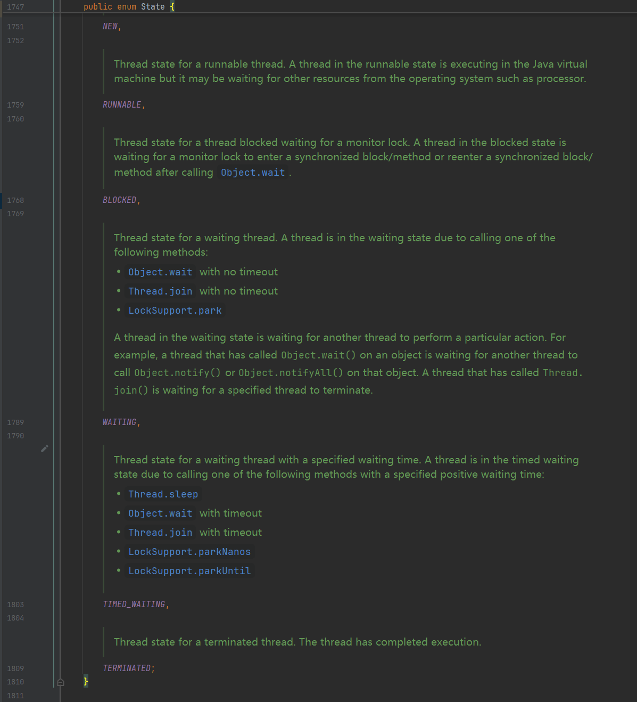
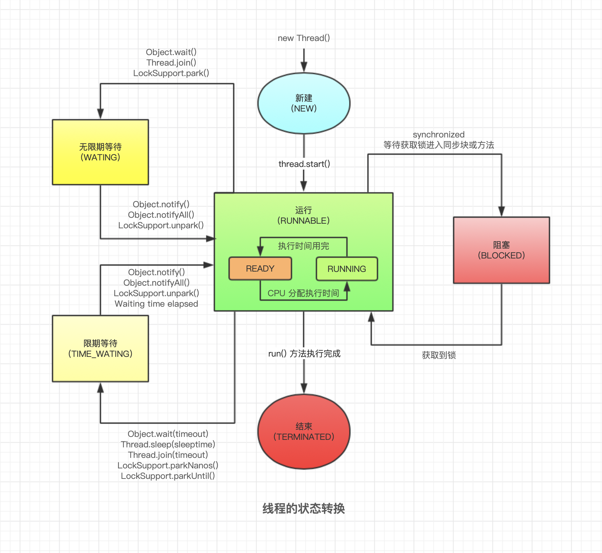

# ***Day20 多线程***

> 线程，很重要的概念，因为我们的CPU假如是intel或者amd的都是说一核二线程，假如你的电脑是8核的cpu那基本上就是16线程，如果你的mac的M芯片自然是几核就是几线程。

想要查看自己的电脑是几个线程的我们有几种方法，一种直接使用Java运行一串代码，其次我们可以看任务管理器，mac直接无需查看，看关于本机就行了，几核就是几线程。

首先我们先打开任务管理器然后点开CPU我们就可以看到内核和逻辑处理器。内核就是几核，逻辑处理器则是线程数，所以我的cpu就是8核16线程


我们自然也可以用Java来打印，代码如下

```java
package thread;

public class ThreadTest {
    public static void main(String[] args) {
        System.out.println(Runtime.getRuntime().availableProcessors());
    }
}
```

```
16

进程已结束，退出代码为 0
```

## 线程理论

### 线程定义

线程是操作系统能够进行调度的最小单位。一个进程可以包含多个线程，这些线程共享进程的资源（如内存、文件句柄等），但可以独立执行。Java的多线程机制允许开发者在一个应用程序中同时执行多个线程。

没错上述是废话，但是我们可以通过任务管理器去看cpu，有进程，线程还有句柄。开启一个应用程序基本上都是一个进程，可能会开其他子进程，然后每个进程最起码有一个线程，多个线程那就是多线程进程。然后句柄就是指的计算机资源，简单理解就是数据，他和语句是不同的概念。

### 线程的生命周期

线程的生命周期主要包括以下几个状态：

* 新建（New）： 线程被创建但尚未启动。
* 就绪（Ready）： 线程已准备好运行，等待CPU的调度。包括在Runnable里
* 运行（Running）： 线程正在执行。包括在Runnable里面
* 阻塞（Blocked）： 线程因为某种原因被阻塞，无法继续执行，如等待资源释放。
* 等待（Waiting）：线程主动等待其他线程
* 超时等待（Timed_Waiting）：超过了一定时间进入的等待
* 死亡（Terminated）： 线程执行结束或因异常退出。

自然我们也可以在线程用到的类里面找到他的状态内部类



自然也是有一些没写上去的，大家看得懂英文的可以看看他的解释

我们上百度随便一搜`Java线程图`可以看到一堆线程关系图，所以我就不画了，直接使用网上的信息



## 一、继承Thread类使用多线程

顾名思义我们直接继承就可以了，但是我们需要重写run方法，然后我们就可以创建对象开启线程了，但是记住开启线程不是运行run方法而是start方法。

```java
package thread;

public class ThreadTest {
    public static void main(String[] args) {
        //创建集成了Thread的类的对象
        AThread aThread = new AThread();
        //这个是不可取的，因为这个并不是开启了线程而是只是运行了run方法
        aThread.run();
        //这个才是正确的写法，会开启一个线程
//        aThread.start();
        for (int i = 0; i < 10; i++) {
            try {
                Thread.sleep(1000);
                System.out.println(i + 1);
            } catch (InterruptedException e) {
                throw new RuntimeException(e);
            }
        }

    }
}

class AThread extends Thread {
    //这个是要重写的方法，也就是线程会用到这个方法
    @Override
    public void run() {
        try {
            //这里直接线程暂停5秒钟再打印
            Thread.sleep(5000);
        } catch (InterruptedException e) {
            throw new RuntimeException(e);
        }
        System.out.println("run方法");
    }
}
```

```
run方法
1
2
3
4
5
6
7
8
9
10

进程已结束，退出代码为 0
```

我们这里直接使用run方法进行运行，结果就是直接卡住，我们用的Thread.sleep单位是毫秒然后是只会对单个线程进行休息，也就是说我们就没开启新的线程，然后我们替换成start方法。

```java
package thread;

public class ThreadTest {
    public static void main(String[] args) {
        //创建集成了Thread的类的对象
        AThread aThread = new AThread();
        //这个是不可取的，因为这个并不是开启了线程而是只是运行了run方法
//        aThread.run();
        //这个才是正确的写法，会开启一个线程
        aThread.start();
        for (int i = 0; i < 10; i++) {
            try {
                Thread.sleep(1000);
                System.out.println(i + 1);
            } catch (InterruptedException e) {
                throw new RuntimeException(e);
            }
        }

    }
}

class AThread extends Thread {
    //这个是要重写的方法，也就是线程会用到这个方法
    @Override
    public void run() {
        try {
            //这里直接线程暂停5秒钟再打印
            Thread.sleep(5000);
        } catch (InterruptedException e) {
            throw new RuntimeException(e);
        }
        System.out.println("run方法");
    }
}
```

```
1
2
3
4
run方法
5
6
7
8
9
10

进程已结束，退出代码为 0
```

在这里我们就回到了正中间了，因为我们开启了线程然后我们对应的sleep在对应的线程里面所以就不会阻塞了。

## 二、实现Runnable接口使用多线程

Runnable接口里面只有run方法，所以我们没有start，但是要开启线程就是要用start，所以我们可以配合Thread类进行启动。

### 1.直接实现

```java
package thread;

public class ThreadTest2 {
    public static void main(String[] args) {
        //集成了Runnable接口之后我们会发现Runnable接口里面就只有一个run方法，所以我们需要使用Thread进行启动
        BThread bThread = new BThread();
        //很明显start是会报错的因为并没有这种方法，但是我们可以配合Thread类
//        bThread.start();
        new Thread(bThread).start();
        for (int i = 0; i < 10; i++) {
            try {
                Thread.sleep(1000);
                System.out.println("114514 " + (i + 1));
            } catch (InterruptedException e) {
                throw new RuntimeException(e);
            }
        }
    }
}

class BThread implements Runnable {

    @Override
    public void run() {
        try {
            //这里直接线程暂停5秒钟再打印
            Thread.sleep(5000);
        } catch (InterruptedException e) {
            throw new RuntimeException(e);
        }
        System.out.println("run方法");
    }
}
```

```
114514 1
114514 2
114514 3
114514 4
run方法
114514 5
114514 6
114514 7
114514 8
114514 9
114514 10

进程已结束，退出代码为 0
```

### 2.创建匿名内部类

匿名内部类我们之前在内部类讲过的

```java
package thread;

public class RunnableTest2 {
    public static void main(String[] args) {
        //这里我们将使用匿名内部类的方式进行
        Runnable runnable = new Runnable() {
            @Override
            public void run() {
                System.out.println("随便打印一点东西");
            }
        };
        new Thread(runnable).start();
    }
}
```

```
随便打印一点东西

进程已结束，退出代码为 0
```

### 3.使用lambda表达式

这边lambda表达式主要是对函数式接口作用的，函数式接口的定义就是只有一个方法的接口，比如Runnable这种只有一个run方法的接口就很符合函数式接口的定义，只要是符合函数式接口的定义的那就是可以用lambda表达式的

lambda表达式还叫做箭头函数，所以是箭头一样的，大家仔细看道理和匿名内部类实现Runnable是一样的

```java
package thread;

public class RunnableLambdaTest {
    public static void main(String[] args) {
        //这里我们将使用Lambda表达式的方式进行
        Runnable runnable = () -> {
            System.out.println("随便打印一点东西");
        };
        new Thread(runnable).start();
    }
}
```

首先我们先这样，简化一遍因为我们之前说过函数式接口就是单个方法的接口，所以说我们可以直接用这个箭头函数也就是Lambda表达式去代表这个方法，比如我们的Runnable接口的方法是void
run，所以我们这里可以直接用Lambda表达式的`()`因为是空参所以我们不需要填任何的东西然后用箭头`->`
再用花括号括起来开始写内容就是直接相当于写这个run方法的内容了。

再然后因为我们这里只有一条语句对吧，所以我们甚至可以把花括号给省了，类似while，if，else，for这些的单行分支，是可以省略花括号的。

```java
package thread;

public class RunnableLambdaTest {
    public static void main(String[] args) {
        //这里我们将使用Lambda表达式的方式进行
        Runnable runnable = () -> System.out.println("随便打印一点东西");
        new Thread(runnable).start();
    }
}
```

然后我们的代码就变成了这个样子，这个就是最精简的匿名内部类使用的就是lambda表达式进行的。

## 三、线程状态（初）

> 我们已经知道了线程和我们也看到了线程在代码里有这么几个状态

* NEW: 当一个 `Thread` 对象被创建但还没有调用 `start()` 方法时，线程处于 `NEW` 状态。
* RUNNABLE: 当调用 `start()` 方法后，线程进入 `RUNNABLE` 状态。这意味着线程已经被启动并且可以由 `JVM` 调度执行。
  `RUNNABLE` 状态并不意味着线程正在运行，而是表示线程已经准备好运行，等待 `CPU` 时间片。
* BLOCKED: 当一个线程试图获取一个已经被其他线程持有的锁时，它将进入 `BLOCKED` 状态。
* WAITING: 当线程调用了某些特定的方法（如 `Object.wait()`, `Thread.join()`, 或
  `LockSupport.park()`），并且没有指定超时时间时，线程将进入 `WAITING` 状态。
* TIMED_WAITING: 当线程调用了某些特定的方法（如 `Thread.sleep(long)`, `Object.wait(long)`, `Thread.join(long)`,
  或 `LockSupport.parkNanos(long)` 和 `LockSupport.parkUntil(long)`），并且指定了超时时间时，线程将进入 `TIMED_WAITING` 状态。
* TERMINATED: 当线程的 `run()` 方法执行完毕或因异常退出时，线程进入 `TERMINATED` 状态。

这是基本状态，我们这次就演示就只显示NEW，RUNNABLE，TIMED_WAITING和TERMINATED

```java
package thread;

public class RunnableLambdaTest {
    public static void main(String[] args) {
        Thread thread = new Thread(() -> {

            try {
                Thread.sleep(1000);
            } catch (InterruptedException e) {
                throw new RuntimeException(e);
            }
            System.out.println("线程");
        });
        System.out.println(thread.getState());
        thread.start();
        System.out.println(thread.getState());
        try {
            Thread.sleep(100);
        } catch (InterruptedException e) {
            throw new RuntimeException(e);
        }
        System.out.println(thread.getState());
        try {
            Thread.sleep(1000);
        } catch (InterruptedException e) {
            throw new RuntimeException(e);
        }
        System.out.println(thread.getState());

    }
}
```

```
NEW
RUNNABLE
TIMED_WAITING
线程
TERMINATED

进程已结束，退出代码为 0
```

## 四、同步锁

> 这里只讲synchronized关键字，juc的内容这里并不涉及

### 1.类锁

首先我们先引入为什么要用synchronized做同步工作，我们先来看一个案例，就是普通的类，但是用多线程去处理，比如喝水，一瓶水550ml但是三个人一起倒水喝，喝到空为止

```java
package thread;

public class SynchronizedTest {
    public static void main(String[] args) {
        new Thread(new Drink()).start();
        new Thread(new Drink()).start();
        new Thread(new Drink()).start();

    }
}

class Drink implements Runnable {
    //这里使用类变量，因为整个类共用的
    private static int waterCapacity = 550;
    private static boolean loop = true;

    private void drinkWater() {
        if (waterCapacity <= 0) {
            loop = false;
            System.out.println("喝完了");
            return;
        }
        System.out.println(Thread.currentThread() + "剩余水量:" + (waterCapacity -= 50));
        try {
            Thread.sleep(50);
        } catch (InterruptedException e) {
            throw new RuntimeException(e);
        }


    }

    @Override
    public void run() {
        while (loop)
            drinkWater();
    }
}
```

```
Thread[Thread-2,5,main]剩余水量:400
Thread[Thread-0,5,main]剩余水量:450
Thread[Thread-1,5,main]剩余水量:450
Thread[Thread-2,5,main]剩余水量:250
Thread[Thread-1,5,main]剩余水量:250
Thread[Thread-0,5,main]剩余水量:250
Thread[Thread-1,5,main]剩余水量:150
Thread[Thread-2,5,main]剩余水量:150
Thread[Thread-0,5,main]剩余水量:150
Thread[Thread-2,5,main]剩余水量:100
Thread[Thread-1,5,main]剩余水量:50
Thread[Thread-0,5,main]剩余水量:50
喝完了
Thread[Thread-2,5,main]剩余水量:0
Thread[Thread-0,5,main]剩余水量:0

进程已结束，退出代码为 0
```

运气不错竟然没有喝到负数。如果我们不做同步处理很有可能出现并发情况导致两次同时-=50如果量在50的时候就会变成-50了

所以假如要避免这个情况的发生我们就得请出synchronized关键字了，这个关键字可以标记方法也可以标记一部分代码块。所以看我们要同步的范围的。

synchronized同步的原理就是根据一个锁，我们谁抢到这个锁谁就能进入执行

```java
package thread;

public class SynchronizedTest {
    public static void main(String[] args) {
        new Thread(new Drink()).start();
        new Thread(new Drink()).start();
        new Thread(new Drink()).start();

    }
}

class Drink implements Runnable {
    //这里使用类变量，因为整个类共用的
    private static int waterCapacity = 550;
    private static boolean loop = true;

    private void drinkWater() {
        synchronized (Drink.class) {
            if (waterCapacity <= 0) {
                loop = false;
                System.out.println("喝完了");
                return;
            }

            System.out.println(Thread.currentThread() + "剩余水量:" + (waterCapacity -= 50));
            try {
                Thread.sleep(50);
            } catch (InterruptedException e) {
                throw new RuntimeException(e);
            }
        }
    }

    @Override
    public void run() {
        while (loop)
            drinkWater();
    }
}
```

```
Thread[Thread-0,5,main]剩余水量:500
Thread[Thread-2,5,main]剩余水量:450
Thread[Thread-1,5,main]剩余水量:400
Thread[Thread-1,5,main]剩余水量:350
Thread[Thread-2,5,main]剩余水量:300
Thread[Thread-0,5,main]剩余水量:250
Thread[Thread-0,5,main]剩余水量:200
Thread[Thread-0,5,main]剩余水量:150
Thread[Thread-0,5,main]剩余水量:100
Thread[Thread-0,5,main]剩余水量:50
Thread[Thread-0,5,main]剩余水量:0
喝完了
喝完了
喝完了

进程已结束，退出代码为 0
```

我们将锁设置为了该类，所以只有获得该类的时候才能进入，为什么不设置为该对象的原因是因为我们创建了三个对象，所以这三个对象都是独立的还是会出现喝多了的情况，所以我们要设置为类。

我们可以看输出台的信息，我们这次就很稳定，前一个人喝完之后后一个人才会去喝，不会发生我们第一次的时候抢着喝，也就是直接变成了450开头连500都看不到。

synchronized会减慢运行效率，因为多线程到了synchronized之后就会变成单线程工作了，这个时候的线程是阻塞的，我们可以打印一下。

```java
package thread;

public class SynchronizedTest {
    public static void main(String[] args) {
        Thread thread = new Thread(new Drink());
        thread.start();
        new Thread(new Drink()).start();
        new Thread(new Drink()).start();
        for (int i = 0; i < 10; i++) {
            try {
                Thread.sleep(50);
                System.out.println(thread.getState());
            } catch (InterruptedException e) {
                throw new RuntimeException(e);
            }
        }
    }
}

class Drink implements Runnable {
    //这里使用类变量，因为整个类共用的
    private static int waterCapacity = 550;
    private static boolean loop = true;

    private void drinkWater() {
        synchronized (Drink.class) {
            if (waterCapacity <= 0) {
                loop = false;
                System.out.println("喝完了");
                return;
            }

            System.out.println(Thread.currentThread() + "剩余水量:" + (waterCapacity -= 50));
            try {
                Thread.sleep(50);
            } catch (InterruptedException e) {
                throw new RuntimeException(e);
            }
        }
    }

    @Override
    public void run() {
        while (loop)
            drinkWater();
    }
}
```

```
Thread[Thread-0,5,main]剩余水量:500
Thread[Thread-2,5,main]剩余水量:450
BLOCKED
BLOCKED
Thread[Thread-1,5,main]剩余水量:400
BLOCKED
Thread[Thread-2,5,main]剩余水量:350
BLOCKED
Thread[Thread-2,5,main]剩余水量:300
BLOCKED
Thread[Thread-2,5,main]剩余水量:250
RUNNABLE
Thread[Thread-0,5,main]剩余水量:200
RUNNABLE
Thread[Thread-0,5,main]剩余水量:150
RUNNABLE
Thread[Thread-0,5,main]剩余水量:100
RUNNABLE
Thread[Thread-0,5,main]剩余水量:50
RUNNABLE
Thread[Thread-2,5,main]剩余水量:0
喝完了
喝完了
喝完了

进程已结束，退出代码为 0
```

我们可以看到出现了BLOCKED的字眼。因为抢锁，所以会导致线程阻塞，堵在了synchronized的门口等待前一个线程执行完防开锁之后才能获取到。

当然我们还能有以对象而非类作为锁的方式。

### 2.对象锁

```java
package thread;

public class CounterDemo {
    public static void main(String[] args) {
        Counter counter = new Counter();

        Thread t1 = new Thread(() -> {
            for (int i = 0; i < 10; i++) {
                counter.increment();
            }
        });

        Thread t2 = new Thread(() -> {
            for (int i = 0; i < 10; i++) {
                counter.increment();
            }
        });

        t1.start();
        t2.start();
        // 主线程等待 t1 和 t2 执行完毕
        try {
            // 这里的join做延时用的
            t1.join();
            t2.join();
        } catch (InterruptedException e) {
            throw new RuntimeException(e);
        }
        // 当 t1 和 t2 都执行完毕后，主线程继续执行
        System.out.println("Final Count: " + counter.getCount());
    }
}

class Counter {
    private int count = 0;

    public void increment() {
        // 同步代码块
        synchronized (this) {
            count++;
            System.out.println("Count incremented to: " + count);
        }
    }

    public int getCount() {
        // 同步代码块
        synchronized (this) {
            return count;
        }
    }
}
```

```
Count incremented to: 1
Count incremented to: 2
Count incremented to: 3
Count incremented to: 4
Count incremented to: 5
Count incremented to: 6
Count incremented to: 7
Count incremented to: 8
Count incremented to: 9
Count incremented to: 10
Count incremented to: 11
Count incremented to: 12
Count incremented to: 13
Count incremented to: 14
Count incremented to: 15
Count incremented to: 16
Count incremented to: 17
Count incremented to: 18
Count incremented to: 19
Count incremented to: 20
Final Count: 20

进程已结束，退出代码为 0
```

当然我们标记在方法上也是一样的，只不过你标记在方法上了之后呢，就会被当做是对象锁，所以说你要变成类锁就需要单独写代码块了

```java
package thread;

public class CounterDemo {
    public static void main(String[] args) {
        Counter counter = new Counter();

        Thread t1 = new Thread(() -> {
            for (int i = 0; i < 5; i++) {
                counter.increment();
            }
        });

        Thread t2 = new Thread(() -> {
            for (int i = 0; i < 5; i++) {
                counter.increment();
            }
        });

        t1.start();
        t2.start();
        // 主线程等待 t1 和 t2 执行完毕
        try {
            // 这里的join做延时用的
            t1.join();
            t2.join();
        } catch (InterruptedException e) {
            throw new RuntimeException(e);
        }
        // 当 t1 和 t2 都执行完毕后，主线程继续执行
        System.out.println("Final Count: " + counter.getCount());
    }
}

class Counter {
    private int count = 0;

    public synchronized void increment() {
        // 同步代码块
        count++;
        System.out.println("Count incremented to: " + count);

    }

    public synchronized int getCount() {
        // 同步代码块
        return count;
    }
}
```

```
Count incremented to: 1
Count incremented to: 2
Count incremented to: 3
Count incremented to: 4
Count incremented to: 5
Count incremented to: 6
Count incremented to: 7
Count incremented to: 8
Count incremented to: 9
Count incremented to: 10
Final Count: 10

进程已结束，退出代码为 0
```

### 死锁

假如A线程和B线程在一个嵌套代码块里获得了不同的锁，就会产生死锁，这样就会让我们卡住不往下走了，比如A拿到了o1锁而B拿到了o2锁，然后A拿到o1锁了之后要下去还得再拿o2锁，但是这个时候o2锁在B的手上，同理B已经有了o2要继续执行需要o1锁，但是这个时候o1在A的手上。

```java
package thread;

public class DeadLock {
    public static void main(String[] args) {
        //模拟死锁现象
        DeadLockDemo A = new DeadLockDemo(true);
        DeadLockDemo B = new DeadLockDemo(false);
        A.start();
        B.start();
    }
}

class DeadLockDemo extends Thread {
    static Object o1 = new Object();    //保证多线程，共享一个对象，使用类变量static
    static Object o2 = new Object();
    boolean flag;

    public DeadLockDemo(boolean flag) {
        this.flag = flag;
    }

    @Override
    public void run() {

        //1. 如果flag为 true，线程A就会先持有 o1 对象锁，然后尝试去获取 o2 对象锁
        //2. 如果线程A得不到 o2 的对象锁，就会Blocked
        //3. 如果flag为 false，线程B就会先持有 o2 对象锁，然后尝试去获取 o1 对象锁
        //4. 如果线程B得不到 o1 的对象锁，就会Blocked
        if (flag) {
            synchronized (o1) { //对象互斥锁，下面是同步代码
                System.out.println(Thread.currentThread().getName() + " 进入1");
                synchronized (o2) { //这里获取li对象的监视权
                    System.out.println(Thread.currentThread().getName() + " 进入2");
                }
            }
        } else {
            synchronized (o2) {
                System.out.println(Thread.currentThread().getName() + " 进入3");
                synchronized (o1) { //这里获取li对象的监视权
                    System.out.println(Thread.currentThread().getName() + " 进入4");
                }
            }
        }
    }
}
```

```
Thread-0 进入1
Thread-1 进入3

进程已结束，退出代码为 -1
```

便一直卡着不会继续往下执行了，然后我们手动打断了之后呢就会出现-1的退出代码因为是非正常退出。

我们还有一个没有运行的状态就是waiting，我们来试一下

```java
package thread;

public class WaitingExample {
    private static final Object lock = new Object();

    public static void main(String[] args) {
        Thread t1 = new Thread(() -> {
            synchronized (lock) {
                try {
                    System.out.println("Thread 1: Waiting for notify");
                    lock.wait(); // 进入 WAITING 状态
                    System.out.println("Thread 1: Notified");
                } catch (InterruptedException e) {
                    throw new RuntimeException(e);
                }
            }
        });

        t1.start();

        try {
            Thread.sleep(100);
            System.out.println(t1.getState());
        } catch (InterruptedException e) {
            throw new RuntimeException(e);
        }
    }
}
```

```
Thread 1: Waiting for notify
WAITING

```

这样就没有后续了，我们还是唤醒一下好了。

```java
package thread;

public class WaitingExample {
    private static final Object lock = new Object();

    public static void main(String[] args) {
        Thread t1 = new Thread(() -> {
            synchronized (lock) {
                try {
                    System.out.println("Thread 1: Waiting for notify");
                    lock.wait(); // 进入 WAITING 状态
                    System.out.println("Thread 1: Notified");
                } catch (InterruptedException e) {
                    throw new RuntimeException(e);
                }
            }
        });

        t1.start();

        try {
            Thread.sleep(100);
            System.out.println(t1.getState());
            new Thread(() -> {
                synchronized (lock) {
                    lock.notify();
                }
            }).start();
        } catch (InterruptedException e) {
            throw new RuntimeException(e);
        }
    }
}
```

```
Thread 1: Waiting for notify
WAITING
Thread 1: Notified

进程已结束，退出代码为 0
```

这就是线程的基本内容了，还有更详细的锁和线程相关的内容在juc部分也就是java.util.concurrent这个包里的类。是和线程强相关的。

### [上一章](day19.md)

[//]: # (### [下一章]&#40;day21.md&#41;)

### [返回目录](README.md)