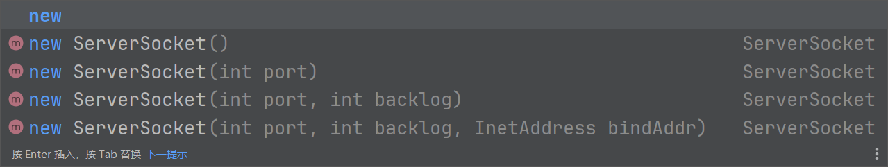
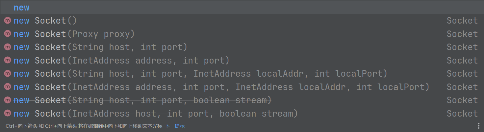
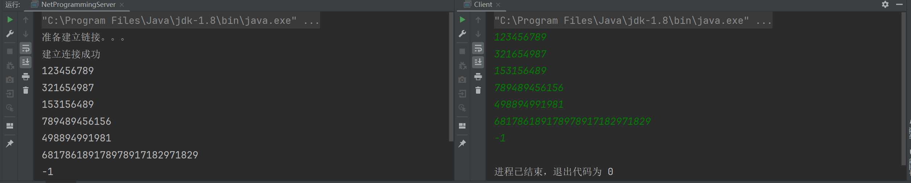

# day20 网络编程

> 网络编程，顾名思义就是通过网络传输数据的编程，我们用到的技术主要是叫做socket

socket中文名叫做套接字，这个中文名怪怪的，所以我们就用socket英文名来称呼吧。

因为是网络编程，所以我们是需要一个服务器端一个客户端，所以我们需要同时运行两个main方法，自然肯定是服务器先运行然后再运行客户端的。

## 一、网络

但是在网络编程之前，我们得先了解一下网络，`ip`相信大家都是知道的，除了`ip`之外还有一个叫做端口的东西，英文名是
`port`，我们在访问互联网的时候都是使用`ip:port`这种方式进行访问的除了ip和端口之外我们需要访问互联网还用到了协议。

目前ip分两种，一个是`ipv4`一个是`ipv6`但是我们目前用的比较多的还是ipv4，范围从0.0.0.0到255.255.255.255。

而port端口则是从0~65535这么个范围，然后对应的协议又是有默认的端口的，比如http的默认端口就是80，假如你光写ip然后用哪个的是http协议那就是默认用80端口。

所以假如你用的是本地也就是http://127.0.0.1那他后面就是默认写的80端口也就是http://127.0.0.1:80的这个:
80会默认写上，但是明显上不会显示，还有对应的https他的默认端口号是443等等之类的。

当然协议不是我们网络编程要用到的东西，我们要用到的就是ip和端口的内容。

然后我们socket想要交互需要一个客户端和一个服务端，服务端监听对应的端口，然后客户端去连接对应的端口。

## 二、ServerSocket

我们可以看到ServerSocket服务端的Socket创建有这么几个构造器。然后我们就选择监听端口的那个进行启动。



```java
package network;

import java.io.BufferedReader;
import java.io.IOException;
import java.io.InputStreamReader;
import java.net.ServerSocket;
import java.net.Socket;

public class NetProgrammingServer {
    public static void main(String[] args) {
        // 监听端口因为和IO流类似，所以可以写在这里在try结束之后直接关闭
        try (ServerSocket serverSocket = new ServerSocket(9999)) {
            System.out.println("准备建立链接。。。");
            Socket accept = serverSocket.accept();
            System.out.println("建立连接成功");
            // 通过socket连接获得输入流并且通过InputStreamReader将字节流转换成字符流然后再用包装流包装起来
            BufferedReader bufferedReader = new BufferedReader(
                    new InputStreamReader(accept.getInputStream()));
            while (true) {
                String s;
                // 读取
                if ((s = bufferedReader.readLine()) != null) {
                    // 打印
                    System.out.println(s);
                    //打断循环
                    if (s.equals("-1")) {
                        break;
                    }
                }
                // 加个延时，不加也可以。
                Thread.sleep(100);
            }
            // 手动关闭
            bufferedReader.close();
            // 手动关闭，最好都移动到finally里面
            accept.close();
        } catch (IOException | InterruptedException e) {
            throw new RuntimeException(e);
        }
    }
}
```

我们先不运行，因为我们还要写客户端的。

## 三、Socket

服务器用ServerSocket去监听端口但是还是要获得Socket的，但是我们客户端只需要连接服务端就行了，我们可以看一下构造器。



```java
package network;

import java.io.BufferedWriter;
import java.io.IOException;
import java.io.OutputStreamWriter;
import java.net.Socket;
import java.util.Scanner;

public class Client {
    public static void main(String[] args) {
        // 搞个手动输入
        Scanner scanner = new Scanner(System.in);
        // 这里也是用io流类似的放到try里面就不需要加close了
        try (Socket socket = new Socket("127.0.0.1", 9999)) {
            // 和服务器同理获得输出流并且转换字符流并且再包装
            BufferedWriter bufferedWriter = new BufferedWriter(
                    new OutputStreamWriter(socket.getOutputStream()));
            while (true) {
                // 获得输入
                String s = scanner.nextLine();
                // 写入流
                bufferedWriter.write(s);
                // 这点很重要，一定要创建新的一行，因为服务器那边是readline
                bufferedWriter.newLine();
                // 刷新了之后才能传输过去，可能做文件io的时候用不着，但是网络编程是必须要用的
                bufferedWriter.flush();
                if (s.equals("-1")) {
                    break;
                }
            }
            // 同理，最好放在finally里面
            bufferedWriter.close();
        } catch (IOException e) {
            throw new RuntimeException(e);
        }
    }
}
```

然后我们看看运行结果，这个我们就直接上截图，用法非常简单，我们只需要先打开服务端的程序然后我们再运行客户端的程序。只需要在客户端的程序里面进行输入然后服务端那边就会接受到消息



这个就是网络编程的基础了，当然我们还可以配合很多情况比如多线程，其他的IO流等等东西进行运用，比如我们可以传输图片进行保存之类的。但是基础就是对于socket的运用。

我们还可以调用各种socket的API去做其他的操作，但本质上还是socket建立链接进行数据传输，但是数据传输是IO流的内容，假如你要对多个数据进行处理，想要提高效率，那就是多线程的内容。

所以网络编程主要是为了让我们理解什么是socket，和socket怎么用，但是在后续的实际开发中基本上用不到。但是如果你是比赛倒是有可能可以用到，因为没有现成的协议，或者不好搭对应协议相关的处理，然后你又需要进行网络传输东西的需求，那socket就很有用了。

### [上一章](day20.md)

[//]: # (### [下一章]&#40;day22.md&#41;)

### [返回目录](README.md)