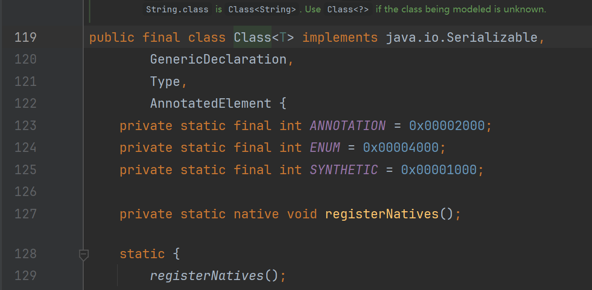
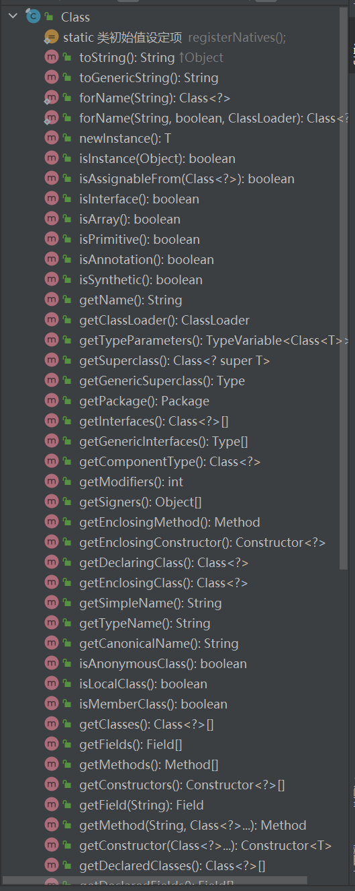
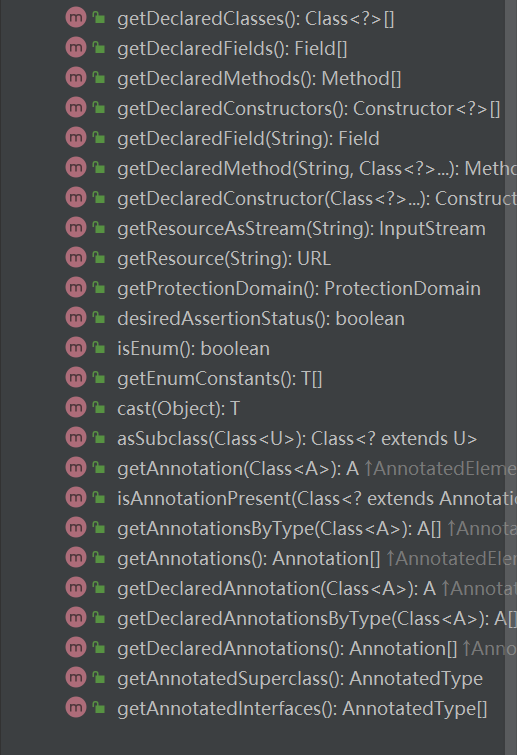
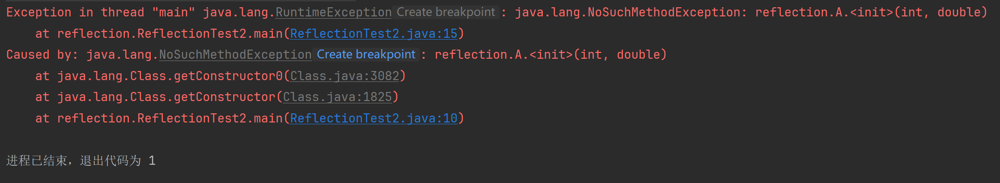

# ***Day22 反射***

> 这个就是Java的最后一个知识点了，学完了这个可以说是学完了Java了，但是这只是Java SE并非所有的Java，后面还有各种框架要学习，还有数据库等等东西。
>
> 但是光会了Java你也可以去做很多你想做的事情了，比如写一个脚本，或者是因为会了Java你去学其他的编程语言也会非常的简单，几乎就是没有门槛，上手就是直接熟悉语法结构。
>
> 又或者是你根据你的思路可以配合反射写出各种各样的有意思的Java工具或者是Java框架。
>
> 后续要学什么怎么去学，学的干什么都是你自己来决定的，可以学习大数据，可以学习MC的模组开发，可以学习Java后端的开发，可以转其他语言等等之类的。

## 一、Class类

我们的反射就是通过其他方式获得的类把他映射成一个Class的对象，这个Class非class，这个是Class类，也就是class Class。我们可以看一下源码



这个Class类是没办法通过new去创建的，我们有这么几种方法：

1. Class.forName(String)
2. 类.class
3. 对象.getClass()

我们可以在代码里演示一下，他们创建的都是Class类。

```java
package reflection;

public class ReflectionTest1 {
    public static void main(String[] args) throws Exception {
        // 使用forName就是通过包名.类名获得，比如我们当前的类就是reflection.ReflectionTest1
        // 然后我们通过字符串动态获得的Class类自然是没有规定属性的
        Class<?> str1 = Class.forName("java.lang.String");
        // 类.class的方式创建
        Class<String> str2 = String.class;
        // 对象.getClass()方法创建
        String s = "";
        // 我们当然可以直接省略成"".getClass()，但是我们需要知道的是这里是通过对象调用getClass方法创建的
        // 然后Class方法是在Object里面就有的
        Class<? extends String> str3 = s.getClass();
    }
}
```

Class类的API都是拿来创建对应的Filed类，Method类还有Constructor类之类的，也就是属性，方法和构造器。

我们有相当多的API可以调用，会在后面说道，我们目前只需要知道Class类就是对于类这个概念的映射的一个可以用的类。





## 二、Constructor类

### 正常通过反射创建

当我们通过以上几个方法获得到了Class类了，所以我们就可以通过Class类获得对应的Constructor类也就是构造器类，前面都说Class类主要是说类类还是有点怪怪的，所以就说英文名了。

当我们获得了对应的Constructor类之后就可以做构造器的对应操作了。当然也就是调用Constructor类的API，我们先正常演示，再给大家看反射的无敌之处

```java
package reflection;

import java.lang.reflect.Constructor;

public class ReflectionTest2 {
    public static void main(String[] args) {
        try {
            Class<?> aClass = Class.forName("reflection.A");
            // 获得无参构造器
            Constructor<?> constructor = aClass.getConstructor();
            // 获得满参构造器
            Constructor<?> constructorAllParam = aClass.getConstructor(int.class, double.class);
            // 通过反射的无参构造器创建对象，但是本来是Object所以进行了强转
            A a1 = (A) constructor.newInstance();
            // 同样反射的有参，也是强转了之后
            A a2 = (A) constructorAllParam.newInstance(18, 5000);
            System.out.println(a1);
            System.out.println(a2);
        } catch (Exception e) {
            throw new RuntimeException(e);
        }
    }
}

class A {
    private int age;
    private double salary;

    public int getAge() {
        return age;
    }

    public void setAge(int age) {
        this.age = age;
    }

    public double getSalary() {
        return salary;
    }

    public void setSalary(double salary) {
        this.salary = salary;
    }

    @Override
    public String toString() {
        return "A{" +
                "age=" + age +
                ", salary=" + salary +
                '}';
    }

    public A(int age, double salary) {
        this.age = age;
        this.salary = salary;
    }

    public A() {
    }
}
```

```
A{age=0, salary=0.0}
A{age=18, salary=5000.0}

进程已结束，退出代码为 0
```

可以正常创建，我们假如把有参构造器私有化了。

```java
package reflection;

import java.lang.reflect.Constructor;

public class ReflectionTest2 {
    public static void main(String[] args) {
        try {
            Class<?> aClass = Class.forName("reflection.A");
            // 获得满参构造器
            Constructor<?> constructorAllParam = aClass.getConstructor(int.class, double.class);
            // 同样反射的有参，也是强转了之后
            A a2 = (A) constructorAllParam.newInstance(18, 5000);
            System.out.println(a2);
        } catch (Exception e) {
            throw new RuntimeException(e);
        }
    }
}

class A {
    private int age;
    private double salary;

    public int getAge() {
        return age;
    }

    public void setAge(int age) {
        this.age = age;
    }

    public double getSalary() {
        return salary;
    }

    public void setSalary(double salary) {
        this.salary = salary;
    }

    @Override
    public String toString() {
        return "A{" +
                "age=" + age +
                ", salary=" + salary +
                '}';
    }

    private A(int age, double salary) {
        this.age = age;
        this.salary = salary;
    }

    public A() {
    }
}
```

改成这样之后我们运行会发现以下报错。



因为私有化了所以获取不到，我们马上学习如何获得私有化之后的构造器

### 通过反射穿透访问修饰符创建

我们正常的操作获取不到没有关系，我们还有特殊的操作可以获取得到。我们不使用普通的`getConstructor()`
，转而使用 `getDeclaredConstructor()` 这样子我们就可以获得到私有构造器了

```java
package reflection;

import java.lang.reflect.Constructor;

public class ReflectionTest2 {
    public static void main(String[] args) {
        try {
            Class<?> aClass = Class.forName("reflection.A");
            // 通过declared方法获取了之后还是会执行失败的
            Constructor<?> constructorAllParam = aClass.getDeclaredConstructor(int.class, double.class);
            // 但是我们可以通过设置可否访问就能破除private的私有了，我们设置true就是可以访问
            constructorAllParam.setAccessible(true);
            // 然后我们就可以正常获得到了
            A a2 = (A) constructorAllParam.newInstance(28, 10000);
            System.out.println(a2);
        } catch (Exception e) {
            throw new RuntimeException(e);
        }
    }
}

class A {
    private int age;
    private double salary;

    public int getAge() {
        return age;
    }

    public void setAge(int age) {
        this.age = age;
    }

    public double getSalary() {
        return salary;
    }

    public void setSalary(double salary) {
        this.salary = salary;
    }

    @Override
    public String toString() {
        return "A{" +
                "age=" + age +
                ", salary=" + salary +
                '}';
    }

    private A(int age, double salary) {
        this.age = age;
        this.salary = salary;
    }

    public A() {
    }
}
```

```
A{age=28, salary=10000.0}

进程已结束，退出代码为 0
```

## 三、Method类

Method也和Constructor类似，我们可以直接通过Class获得，但是我们执行方法的时候需要使用invoke方法去执行对应的方法。同样也可以使用declared获取私有的方法。

```java
package reflection;

import java.lang.reflect.Method;
import java.util.Arrays;

public class ReflectionTest3 {
    public static void main(String[] args) throws Exception {
        Class<B> bClass = B.class;
        B b = bClass.getConstructor().newInstance();
        Method setName = bClass.getMethod("setName", String.class);
        Method[] methods = bClass.getMethods();
        Method getName = null;
        for (Method method : methods) {
            if (method.getName().equals("getName")) {
                getName = method;
            }
        }
        setName.invoke(b, "123");
        if (getName != null) {
            // 调用
            System.out.println(getName.invoke(b));
            // 获得修饰符1就是public，2就是private
            System.out.println(getName.getModifiers());
            // 获得返回值类型，获得的是Class类，可以通过一些API获得ClassName
            System.out.println(getName.getReturnType());
            // 获得参数列表，get方法没参数列表所以自然为空
            System.out.println(Arrays.toString(getName.getParameterTypes()));
            // 获得参数个数
            System.out.println(getName.getParameterCount());
        }
        // 获得参数列表
        System.out.println(Arrays.toString(setName.getParameterTypes()));
        // 获得参数个数
        System.out.println(setName.getParameterCount());
    }
}

class B {
    private String name;
    private int age;

    public String getName() {
        return name;
    }

    public void setName(String name) {
        this.name = name;
    }

    public int getAge() {
        return age;
    }

    public void setAge(int age) {
        this.age = age;
    }

    @Override
    public String toString() {
        return "B{" +
                "age=" + age +
                ", name='" + name + '\'' +
                '}';
    }

    public B() {
    }

    public B(String name, int age) {
        this.name = name;
        this.age = age;
    }
}
```

```
123
1
java.lang.String
[]
0
[class java.lang.String]
1

进程已结束，退出代码为 0
```

假如有private等等访问不到的方法也可以通过和Constructor一样的declared去访问。

## 四、Field类

Filed类也几乎和Method类一样，用法是一样的，只不过从方法变成了字段而已。也就少了个调用，但是多了各种值的设置。

```java
package reflection;

import java.lang.reflect.Field;

public class ReflectionFieldTest {
    public static void main(String[] args) throws Exception {
        Class<C> cClass = C.class;
        // 这个很熟了吧通过Class类反射创建对象
        C c = cClass.getConstructor().newInstance();
        // 获得所有字段
        Field[] fields = cClass.getDeclaredFields();
        // 根据字符串获得对应字段
        Field id = cClass.getDeclaredField("id");
        Field name = null;
        for (Field field : fields) {
            if (field.getName().equals("name")) {
                field.setAccessible(true);
                name = field;
            }
        }
        // 设置可访问因为我们的字段都是private
        id.setAccessible(true);
        id.set(c, 123);
        // 获得值，但是返回的是Object
        System.out.println(id.get(c));
        if (name != null) {
            name.set(c, "123123");
            // 获得访问修饰符
            System.out.println(name.getModifiers());
            // 获得类型的API
            System.out.println(name.getType());
            // 这样可以将获取的值根据我们正确的类型进行强转
            System.out.println(name.getType().cast(name.get(c)));
        }
    }
}

class C {
    private int id;
    private String name;
    private String phoneNumber;
    private int age;

    @Override
    public String toString() {
        return "C{" +
                "id=" + id +
                ", name='" + name + '\'' +
                ", phoneNumber='" + phoneNumber + '\'' +
                ", age=" + age +
                '}';
    }

    public int getId() {
        return id;
    }

    public void setId(int id) {
        this.id = id;
    }

    public String getName() {
        return name;
    }

    public void setName(String name) {
        this.name = name;
    }

    public String getPhoneNumber() {
        return phoneNumber;
    }

    public void setPhoneNumber(String phoneNumber) {
        this.phoneNumber = phoneNumber;
    }

    public int getAge() {
        return age;
    }

    public void setAge(int age) {
        this.age = age;
    }

    public C(int id, String name, String phoneNumber, int age) {
        this.id = id;
        this.name = name;
        this.phoneNumber = phoneNumber;
        this.age = age;
    }

    public C() {
    }
}
```

```
123
2
123123

进程已结束，退出代码为 0
```

## 五、通过反射使用注解(之前说在反射的时候可以用)

其实注解也没什么特殊的也是一个类似于类的结构而已，只不过我们可以通过反射获得对应注解，如果存在就做对应操作就行，Spring框架大部分都是通过反射进行的，所以开发起来相当的方便，但是他的底层写的就是想当的复杂，各种反射盘根错节。

```java
package annotation;

import java.lang.annotation.*;
import java.lang.reflect.Constructor;
import java.lang.reflect.Field;
import java.util.Arrays;

public class AnnotationReflection {
    public static void main(String[] args) throws Exception {
        Class<AAA> aaaClass = AAA.class;
        // 获得全部注解
        Annotation[] annotations = aaaClass.getAnnotations();
        // 根据给定的注解的Class类获得对应注解
        Annotation1 annotation = aaaClass.getAnnotation(Annotation1.class);
        System.out.println(Arrays.toString(annotations));
        System.out.println(annotation);
        // 然后我们就可以根据注解写对应的处理逻辑
        // ...
        // 创建构造器
        Constructor<AAA> declaredConstructor = aaaClass.getDeclaredConstructor();
        // 设置可访问
        declaredConstructor.setAccessible(true);
        // 真正创建对象
        AAA aaa = declaredConstructor.newInstance();
        // 获得私有字段并且通过反射赋值
        for (Field declaredField : aaaClass.getDeclaredFields()) {
            declaredField.setAccessible(true);
            if (declaredField.getName().equals("name")) {
                declaredField.set(aaa, annotation.name());
            }
            if (declaredField.getName().equals("value")) {
                declaredField.set(aaa, annotation.value());
            }
            if (declaredField.getName().equals("age")) {
                // 比如我们的age特殊一定，设置Lalala注解里面的height为age
                Lalala annotation1 = aaaClass.getAnnotation(Lalala.class);
                declaredField.set(aaa, annotation1.age());
            }

        }
        // 打印
        System.out.println(aaa);
    }
}

@Annotation1(value = "你好", name = "Tom", age = 10086)
@Lalala
class AAA {
    private String name;
    private String value;
    private int age;

    @Override
    public String toString() {
        return "AAA{" +
                "name='" + name + '\'' +
                ", value='" + value + '\'' +
                ", age=" + age +
                '}';
    }
}

// 这个虽然之前说过了但是我们再讲一遍，我们可以去查看ElementType这个枚举类，里面也都写了
// 我们这里的Type就是标记在类，接口等等这种类型上面
@Target(ElementType.TYPE)
// 这里则是保留到何时
@Retention(RetentionPolicy.RUNTIME)
// 文档注解
@Documented
@interface Annotation1 {
    String value() default "";

    String name() default "unnamed";

    int age() default 0;
}

@Target(ElementType.TYPE)
@Retention(RetentionPolicy.RUNTIME)
@Documented
@interface Lalala {
    int age() default 180;
}
```

```
[@annotation.Annotation1(name=Tom, value=你好, age=10086), @annotation.Lalala(age=180)]
@annotation.Annotation1(name=Tom, value=你好, age=10086)
AAA{name='Tom', value='你好', age=180}

进程已结束，退出代码为 0
```

我们可以再看一下把Lalala注解去掉之后，我们是不是只需要在每个获取注解之后使用一下判断就可以了。不然就会空指针异常

```java
package annotation;

import java.lang.annotation.*;
import java.lang.reflect.Constructor;
import java.lang.reflect.Field;
import java.util.Arrays;

public class AnnotationReflection {
    public static void main(String[] args) throws Exception {
        Class<AAA> aaaClass = AAA.class;
        // 获得全部注解
        Annotation[] annotations = aaaClass.getAnnotations();
        // 根据给定的注解的Class类获得对应注解
        Annotation1 annotation = aaaClass.getAnnotation(Annotation1.class);
        System.out.println(Arrays.toString(annotations));
        System.out.println(annotation);
        // 然后我们就可以根据注解写对应的处理逻辑
        // ...
        // 创建构造器
        Constructor<AAA> declaredConstructor = aaaClass.getDeclaredConstructor();
        // 设置可访问
        declaredConstructor.setAccessible(true);
        // 真正创建对象
        AAA aaa = declaredConstructor.newInstance();
        // 获得私有字段并且通过反射赋值
        for (Field declaredField : aaaClass.getDeclaredFields()) {
            declaredField.setAccessible(true);
            if (declaredField.getName().equals("name")) {
                declaredField.set(aaa, annotation.name());
            }
            if (declaredField.getName().equals("value")) {
                declaredField.set(aaa, annotation.value());
            }
            if (declaredField.getName().equals("age")) {
                // 比如我们的age特殊一定，设置Lalala注解里面的height为age
                Lalala annotation1 = aaaClass.getAnnotation(Lalala.class);
                if (annotation1 != null)
                    declaredField.set(aaa, annotation1.age());
            }

        }
        // 打印
        System.out.println(aaa);
    }
}

@Annotation1(value = "你好", name = "Tom", age = 10086)
class AAA {
    private String name;
    private String value;
    private int age;

    @Override
    public String toString() {
        return "AAA{" +
                "name='" + name + '\'' +
                ", value='" + value + '\'' +
                ", age=" + age +
                '}';
    }
}

// 这个虽然之前说过了但是我们再讲一遍，我们可以去查看ElementType这个枚举类，里面也都写了
// 我们这里的Type就是标记在类，接口等等这种类型上面
@Target(ElementType.TYPE)
// 这里则是保留到何时
@Retention(RetentionPolicy.RUNTIME)
// 文档注解
@Documented
@interface Annotation1 {
    String value() default "";

    String name() default "unnamed";

    int age() default 0;
}

@Target(ElementType.TYPE)
@Retention(RetentionPolicy.RUNTIME)
@Documented
@interface Lalala {
    int age() default 180;
}
```

```
[@annotation.Annotation1(name=Tom, value=你好, age=10086)]
@annotation.Annotation1(name=Tom, value=你好, age=10086)
AAA{name='Tom', value='你好', age=0}

进程已结束，退出代码为 0
```

这就是反射的基本知识了，因为所有的拓展都是根据基本知识发展而来的。所以只要基础够好看看大佬写的代码，也能快速理解，变成自己的知识，假如我们看的够多，那我们可以累积起来，变成自己的东西来表达。指不定我们还能发散思想，整出更厉害的东西。

那到这里，我们的JavaSE基本上结束了，当然我们这只是结束了普通的知识，我们还要接触各个版本的新特性，也会在后面给大家一一放出，目前的时间是2024年，Java已经推出到了jdk23.

但是我们要学习肯定是学习长期支持版本，目前的长期支持版本是java8，java11，java17还有java21。

所以除了这一天之外我们还有四天拿来讲对应的四个长期版本的新特性。然后我们的Java基础就可以完结撒花了。

### [上一章](day21.md)

### [下一章](day23.md)

### [返回目录](README.md)