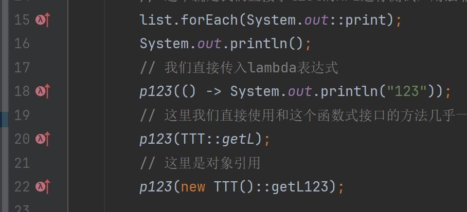

# ***Day23 Java8新特性***

> 这期主要是讲java8的新特性，当然后续的版本都是支持java8的新特性的，而且java在企业里最低用的也都是java8，所以java8的新特性学了还是和重要的
>
> Java8的新特性最重要的我们需要记住的就是lambda表达式（函数式接口相当于是lambda表达式的拓展），方法引用，StreamAPI，默认方法（这个玩意学接口的时候就强调过了）

## 一、Lambda 表达式

> 这个玩意已经是我们的老生常谈了，不知道讲过多少遍了，箭头函数，lambda表达式等等之类的，我们简单再阐述一遍直接上案例吧

首先我们lambda表达式需要的格式就是一个只有一个方法的接口也就是叫做函数式接口，当然我们可以给注解也可以不给注解。详细的我们下一章节再讲。

我们看看lambda的图标


λ然后也是会触发接口的向下箭头

```java
package newFeature8;

public class NewFeature1 {
    public static void main(String[] args) {
        // 这个是老写法，匿名内部类
        LambdaInterface lambdaInterface = new LambdaInterface() {
            @Override
            public int s(int a, int b) {
                return 0;
            }
        };
        // lambda写法，有几个参数就写几个随便写什么都行，只要是符合命名规则的，而且单条语句不需要花括号，且返回不需要return值
        LambdaInterface lambda1 = (x, y) -> 0;
        // 添加了花括号的lambda写起来和正常的方法内部类似了，多条语句选择这种写法
        LambdaInterface lambda2 = (x, y) -> {
            int a = x + y;
            int b = x + y;
            return a + b;
        };
        System.out.println(lambdaInterface.s(1, 2));
        System.out.println(lambda1.s(1, 2));
        System.out.println(lambda2.s(1, 2));
    }
}

interface LambdaInterface {

    int s(int a, int b);
}
```

```
0
0
6

进程已结束，退出代码为 0
```

## 二、函数式接口

> 函数式接口主要是服务于lambda表达式的，当然匿名内部类也是可以用的，而且lambda表达式的写法也就是单个方法的接口的匿名内部类的简化写法。

```java

@FunctionalInterface
public interface LambdaInterface {
    int s(int a, int b);
}
```

我们只需要加上这个注解那这个接口就是函数式接口了，假如我们这个接口里面还有另外一个抽象方法会怎么样，自然是报错了。


具体怎么用我们也都知道了直接用lambda表达式或者匿名内部类或者普通的用类去实现都是可以的。

## 三、方法引用

> 引用使用很简单，但是理解起来比lambda略微难了那么一点点

我们首先看看截图，我们会发现其实方法引用还是lambda的缩影



然后我们来看代码再看运行结果

```java
package newFeature8;

import java.util.Arrays;
import java.util.List;

@FunctionalInterface
public interface LambdaInter {
    void p();
}

class NewFeature2 {
    public static void main(String[] args) {
        List<Integer> list = Arrays.asList(1, 2, 3, 4, 5, 6, 7, 8, 9, 10, 11);
        // 这个就是我们直接拿list的API进行测试，用法非常简单对应的类或者
        list.forEach(System.out::print);
        System.out.println();
        // 我们直接传入lambda表达式
        p123(() -> System.out.println("123"));
        // 这里我们直接使用和这个函数式接口的方法几乎一样的结构（返回值+参数列表）这里是静态引用
        p123(TTT::getL);
        // 这里是对象引用
        p123(new TTT()::getL123);


    }

    public static void p123(LambdaInter l) {
        l.p();
    }
}

class TTT {
    // 结构和p方法一样
    public static void getL() {
        System.out.println("getLMethod");
    }

    // 同上和p方法一样的结构
    public void getL123() {
        System.out.println("疯狂星期四");
    }

}
```

```
1234567891011
123
getLMethod
疯狂星期四

进程已结束，退出代码为 0
```

以上就是无参的方法的方法引用，相信大家都看懂了，我们的getL123和getL的结构和p方法几乎一样，因为我们结构的状态主要看返回值和参数列表。我们可以再来看一个案例，看过了这个案例大家应该就学会方法引用了

```java
package newFeature8;

class NewFeature3 {
    public static void main(String[] args) {
        Calculate calculate = new Calculate();
        // 因为是作用在函数式接口的所以我们可以在创建的时候直接使用这种方式
        // 我们之前的案例是传输参数的时候用了方法引用
        L<Integer> add = calculate::add;
        L<Integer> sub = calculate::sub;
        using(add, 1, 2);
        using(sub, 3, 1);
        // 这里就是之前一样的传参数的方法引用
        using(calculate::multiplication, 3, 6);
        // 自然我们也可以使用自己写的，所以我专门空着了一个除法
        using((a, b) -> a / b, 6, 2);
    }

    public static void using(L<?> l, int a, int b) {
        System.out.println(l.accept(a, b));
    }
}

class Calculate {
    public int sub(int a, int b) {
        return a - b;
    }

    public int add(int a, int b) {
        return a + b;
    }

    public int multiplication(int a, int b) {
        return a * b;
    }
}

@FunctionalInterface
public interface L<T> {
    T accept(int a, int b);
}
```

```
3
2
18
3

进程已结束，退出代码为 0
```

## 四、默认方法

> 这个就太简单了，就是单纯的接口里面可以不专门声明抽象方法了。

```java
package newFeature8;

@FunctionalInterface
public interface DefaultInterface {
    // 我们在接口里面直接声明一个属性的话他前面默认会加上public static final大家可以用自己的IDE去看，在加上这三个会灰掉
    int i = 1;

    // 方法也是同样的前面会多出来public abstract，你手动加上也会灰掉
    void p();

    // 这个就是这章节要讲的东西，获得的就是默认方法，会默认带上public，所以我们直接写public也会灰掉
    default void p123() {
        System.out.println("p123Method");
    }
}

class RunMain {
    public static void main(String[] args) {
        // 这里可以使用lambda表达式的原因是，抽象方法就只有唯一一个，所以就可以使用
        // 毕竟我们的lambda表达式主要是对抽象方法进行实现毕竟就是匿名内部类的单方法的实现法
        DefaultInterface defaultInterface = () -> System.out.println("p()");

        // 我们可以正常调用默认方法
        defaultInterface.p123();
        // 这里就是我们写的lambda表达式写的方法
        defaultInterface.p();
    }
}
```

```
p123Method
p()

进程已结束，退出代码为 0
```

## 五、Stream API

> 这一part的内容比较多，其实也不算多，主要就是用到了stream这个包提供的各种API，所以我就展示几个，剩下的大家可以自己去试试


```java
package newFeature8;

import java.util.Arrays;
import java.util.List;
import java.util.stream.Collectors;
import java.util.stream.Stream;

public class StreamTest {
    public static void main(String[] args) {
        List<Person> people = Arrays.asList(
                new Person("Tom", 18),
                new Person("XingZai", 25),
                new Person("Unrivaled", 20),
                new Person("Invincible", 28)
        );

        // 过滤年龄大于20的人，顺带一提，lambda表达式假如只有一个参数可以免写括号
        // 获得流
        Stream<Person> stream = people.stream();
        // 过滤，可以用方法引用也可以直接写lambda
        Stream<Person> stream2 = stream.filter(person -> person.getAge() > 20);
        // 变成列表
        List<Person> collect = stream2.collect(Collectors.toList());
        // 这样写错误，因为流只能用一遍
//        List<String> collect2 = stream2.map(Person::getName).collect(Collectors.toList());
        // map进行映射然后再将他转换成List
        List<String> collect2 = people.stream()
                .filter(person -> person.getAge() > 20)
                .map(Person::getName)
                .collect(Collectors.toList());
        System.out.println(collect);
        System.out.println(collect2);
        // 我们再看一个打印案例也就是我们方法引用的时候用到的foreach，我们这里就不用方法引用直接用lambda表达式也是一样的
        people.forEach(p -> System.out.print(p + " "));
        System.out.println();
    }
}

class Person {
    private String name;
    private int age;

    @Override
    public String toString() {
        return "Person{" +
                "name='" + name + '\'' +
                ", age=" + age +
                '}';
    }

    public Person() {
    }

    public Person(String name, int age) {
        this.name = name;
        this.age = age;
    }

    public String getName() {
        return name;
    }

    public void setName(String name) {
        this.name = name;
    }

    public int getAge() {
        return age;
    }

    public void setAge(int age) {
        this.age = age;
    }
}
```

```
[Person{name='XingZai', age=25}, Person{name='Invincible', age=28}]
[XingZai, Invincible]
Person{name='Tom', age=18} Person{name='XingZai', age=25} Person{name='Unrivaled', age=20} Person{name='Invincible', age=28} 

进程已结束，退出代码为 0
```

用过基础的之后了我们就再来细细讲一下，首先我们创建Stream类需要使用集合的`stream()` 串行流
或者 `parallelStream() ` 并行流 还有一些我们用到的API

* foreach 顾名思义是遍历
* map 重新映射结果
* filter 过滤
* limit 限定数量
* sorted 排序
* Collectors 集合工具，可以奖流变成正常集合

所以我们可以把这些API全部运用起来。

```java
package newFeature8;

import java.util.Arrays;
import java.util.List;
import java.util.stream.Collectors;

public class StreamTest2 {
    public static void main(String[] args) {
        List<Integer> list = Arrays.asList(1, 2, 3, 4, 5, 6, 7, 8, 9, 10);
        // 我们学过了用引用方法的操作也学习了使用lambda表达式的方式，当然还是用lambda比较灵活
        list.forEach(a -> System.out.print(a + " "));
        System.out.println();
        // 这里就使用的并行流，效率比串行流要高，自然性能的消耗也越大
        List<Integer> collect = list.parallelStream().filter(a -> a < 8)    // 1,2,3,4,5,6,7
                .limit(5)   // 1,2,3,4,5
                .map(a -> a + 1)    // 2,3,4,5,6
                .collect(Collectors.toList());  // 变成了list
        System.out.println(collect);
        collect.add(1);
        // 现在1在最后
        System.out.println(collect);
        // 可以直接排序，但是我们这里要通过Stream进行排序再变成List，所以这么麻烦
        System.out.println(collect.stream().sorted().collect(Collectors.toList()));

    }
}
```

```
1 2 3 4 5 6 7 8 9 10 
[2, 3, 4, 5, 6]
[2, 3, 4, 5, 6, 1]
[1, 2, 3, 4, 5, 6]

进程已结束，退出代码为 0
```

## 六、Optional 类

Optional 类是一个可以为null的容器对象。如果值存在则isPresent()方法会返回true，调用get()方法会返回该对象。

Optional 是个容器：它可以保存类型T的值，或者仅仅保存null。Optional提供很多有用的方法，这样我们就不用显式进行空值检测。

Optional 类的引入很好的解决空指针异常。

```java
package newFeature8;

import java.util.Optional;

public class OptionalExample {
    public static void main(String[] args) {

        Integer value2 = 10;

        // Optional.ofNullable - 允许传递为 null 参数
        Optional<Integer> a = Optional.ofNullable(null);

        // Optional.of - 如果传递的参数是 null，抛出异常 NullPointerException
        Optional<Integer> b = Optional.of(value2);
        System.out.println(sum(a, b));
    }

    public static Integer sum(Optional<Integer> a, Optional<Integer> b) {

        // Optional.isPresent - 判断值是否存在

        System.out.println("第一个参数值存在: " + a.isPresent());
        System.out.println("第二个参数值存在: " + b.isPresent());

        // Optional.orElse - 如果值存在，返回它，否则返回默认值
        Integer value1 = a.orElse(0);

        //Optional.get - 获取值，值需要存在

        Integer value2 = 0;
        if (b.isPresent()) {
            value2 = b.get();
        }

        return value1 + value2;
    }
}
```

```
第一个参数值存在: false
第二个参数值存在: true
10

进程已结束，退出代码为 0
```

## 七、新的时间日期 API

有关日期，我们在[day17](day17.md)的时候讲过了，但是我们只讲了本地的时间，我们展示一下时区的。

```java
package newFeature8;

import java.time.*;

public class NewDate {
    public static void main(String[] args) {
        testZonedDateTime();
    }

    public static void testZonedDateTime() {

        // 获取当前时间日期
        ZonedDateTime date1 = ZonedDateTime.parse("2015-12-03T10:15:30+05:30[Asia/Shanghai]");
        System.out.println("date1: " + date1);

        ZoneId id = ZoneId.of("Europe/Paris");
        System.out.println("ZoneId: " + id);

        ZoneId currentZone = ZoneId.systemDefault();
        System.out.println("当期时区: " + currentZone);
    }
}
```

```
date1: 2015-12-03T10:15:30+08:00[Asia/Shanghai]
ZoneId: Europe/Paris
当期时区: Asia/Shanghai

进程已结束，退出代码为 0
```

## 八、Nashorn JavaScript 引擎

Nashorn 一个 javascript 引擎。

Nashorn JavaScript Engine 在 Java 15 已经不可用了。

这已经在 Java 11 标记为：

`@deprecated (forRemoval = true)`

从 JDK 1.8 开始，Nashorn取代Rhino(JDK 1.6, JDK1.7) 成为 Java 的嵌入式 JavaScript 引擎。Nashorn 完全支持 ECMAScript 5.1
规范以及一些扩展。它使用基于 JSR 292 的新语言特性，其中包含在 JDK 7 中引入的 invokedynamic，将 JavaScript 编译成 Java 字节码。

与先前的 Rhino 实现相比，这带来了 2 到 10倍的性能提升。

既然已经被抛弃所以我们就只放一个案例

```java
package newFeature8;

import javax.script.ScriptEngine;
import javax.script.ScriptEngineManager;
import javax.script.ScriptException;

public class JSExample {
    public static void main(String[] args) {

        ScriptEngineManager scriptEngineManager = new ScriptEngineManager();
        ScriptEngine nashorn = scriptEngineManager.getEngineByName("nashorn");

        String name = "xingzai";
        Integer result = null;

        try {
            nashorn.eval("print('" + name + "')");
            result = (Integer) nashorn.eval("10 + 2");

        } catch (ScriptException e) {
            System.out.println("执行脚本错误: " + e.getMessage());
        }

        System.out.println(result);
    }
}
```

```
xingzai
12

进程已结束，退出代码为 0
```

这基本上就是比较主要的Java8的特性了，下一次要讲的就是Java11的特性，也就是从Java9开始到Java11的特性。

### [上一章](day22.md)

### [下一章](day24.md)

### [返回目录](README.md)