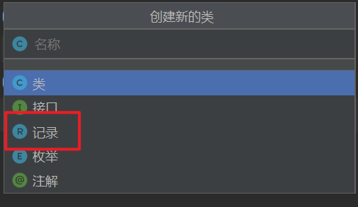

# ***Day25 Java17新特性***

## 一、Java 12 - Switch 表达式

> 这个是我最喜欢的一个更新，因为switch这样子看上去就很好看

现在的Switch可以通过箭头来代替冒号和break，而且多个值可以放在一个case里面不需要写多个case了。但是还是没有if好维护，但是确实看上去相当的舒服

```java
package newFeature17;

public class SwitchExpressionPreview {
    public static void main(String[] args) {
        Day day = Day.MONDAY;

        // 使用 switch 表达式
        String result = switch (day) {
            case MONDAY, FRIDAY -> "Work day";
            case SATURDAY, SUNDAY -> "Weekend";
            default -> "Midweek day";
        };

        System.out.println(result); // 输出: Work day
    }

    enum Day {MONDAY, TUESDAY, WEDNESDAY, THURSDAY, FRIDAY, SATURDAY, SUNDAY}
}
```

```
Work day

进程已结束，退出代码为 0
```

## 二、Java 13 - 文本块

这下向python看齐了，就是三个双引号设置的字符串

```java
package newFeature17;

public class TextBlocksPreview {
    public static void main(String[] args) {
        String html = """
                <html>
                    <body>
                        <p>Paragraph 1</p>
                        <p>Paragraph 2</p>
                    </body>
                </html>
                """;

        System.out.println(html);
    }
}
```

```
<html>
    <body>
        <p>Paragraph 1</p>
        <p>Paragraph 2</p>
    </body>
</html>


进程已结束，退出代码为 0
```

## 三、Java 14 - 记录类型

这次是多了个新的类型，是和class，interface，@interface还有enum同级的，叫做record，我们也可以在创建的时候看到



这个是基本上是类但是不是一般的类，我们可以理解为只有全参构造器的类，且不能拥有自己的字段但是可以有静态的字段，而且可以有方法。但是没有构造器，因为结构已经确定了，且能在方法内生写上，也就是局部内部类的方式

```java
package newFeature17;

public class RecordTypePreview {
    public static void main(String[] args) {
        // 也可以在方法内定义
        record Rect(int x, int y) {
            public void p() {
                System.out.println("ppp");
            }

        }
        // 创建并使用记录实例
        Point p = new Point(10, 20);
        System.out.println(p); // 输出: Point[x=10, y=20]
        Rect x = new Rect(50, 60);
        System.out.println(x); // 输出: Rect[x=50, y=60]
        x.p();
    }

    // 定义一个记录类型
    record Point(int x, int y) {
    }
}
```

```
Point[x=10, y=20]
Rect[x=50, y=60]
ppp

进程已结束，退出代码为 0
```

## 四、Java 15 - 密封类

> 这个玩意一下子给我们多出来了两个关键字，一个是sealed一个是permits，一个是密封一个是授权的意思。

sealed关键字是拿来声明父类/接口的，然后permits则是授权的类且被授权的类必须是final类才行，所以也就是可以存在sealed标记了接口和类，然后我们拿一个final且被授权的类去继承以及实现被标记了的接口。

然后因为被permits的必须是final，所以这个被permits的类就不可能是接口。

```java
package newFeature17;

public class SealedClassesPreview {
    public static void main(String[] args) {
        Shape shape = new Circle(10);

        if (shape instanceof Circle c) {
            System.out.println("Circle with radius: " + c.radius());
        } else if (shape instanceof Square s) {
            System.out.println("Square with side: " + s.side());
        }
    }

    // 定义密封类
    sealed interface Shape permits Circle, Square, ASD {
    }

    // 这里是类的方式
    sealed class SASD permits ASD {

    }

    // 同样的被授权的继承
    final class ASD extends SASD implements Shape {

    }

    // 实现密封类
    static final class Circle implements Shape {
        private final double radius;

        public Circle(double radius) {
            this.radius = radius;
        }

        public double radius() {
            return radius;
        }
    }

    // 因为这种的声明方式就非常的适合记录类
    record Square(double side) implements Shape {
    }
}
```

```
Circle with radius: 10.0

进程已结束，退出代码为 0
```

## 五、Java 16 - 模式匹配 for instanceof

> 被强化了的instanceof，以前只能判断类型，现在甚至可以有些扩展，我们查看代码

```java
package newFeature17;

public class InstanceOfPatternMatchingPreview {
    public static void main(String[] args) {
        Object obj = "Hello, World!";
        // 我们这里可以直接在判断的时候再创建一个变量进行后续的判断
        if (obj instanceof String s && s.length() > 5) {
            System.out.println("String with length greater than 5: " + s);
        }
    }
}
```

```
String with length greater than 5: Hello, World!

进程已结束，退出代码为 0
```

## 六、Java 17 - 增强的伪随机数生成器

这个确实没什么好说的，也就是给你增加了一个增强版的生成器，但是用起来比自己直接写还是略微快一点的。但是需要一部分的额外学习。

```java
package newFeature17;

import java.util.random.RandomGenerator;
import java.util.random.RandomGeneratorFactory;

public class EnhancedRandomNumberGenerators {
    public static void main(String[] args) {
        // 获得随机数工厂
        RandomGeneratorFactory<RandomGenerator> factory = RandomGeneratorFactory.getDefault();
        // 创建一个新的随机数生成器
        RandomGenerator rng = factory.create();

        // 生成随机数
        for (int i = 0; i < 10; i++) {
            System.out.println(rng.nextInt(500));
        }
    }
}
```

```
152
408
314
224
457
493
12
126
361
493

进程已结束，退出代码为 0
```
### [上一章](day24.md)

### [下一章](day26.md)

### [返回目录](README.md)