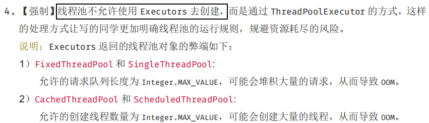

# ***Day26 Java21新特性***

> java21主要就是虚拟线程，其他的功能还是在预览阶段，所以我们这章只说虚拟线程

## 一、虚拟线程 (Java 21)

### 介绍虚拟线程

虚拟线程是一种轻量级的用户态线程，由 JVM 管理，而不是操作系统。与传统的操作系统线程相比，虚拟线程的创建和销毁成本非常低，可以在一个程序中创建大量的虚拟线程。

虚拟线程相比普通的线程的优点就在:

* 性能：操作系统线程的创建和上下文切换开销相对较高。虚拟线程通过复用少量的操作系统线程来执行大量任务，从而减少了这种开销。
* 简洁性：编写高并发程序通常需要复杂的回调、Future 或其他异步编程模式。虚拟线程允许你以同步的方式编写代码，而不需要这些复杂的机制。
* 可伸缩性：由于虚拟线程的轻量级特性，你可以轻松地创建数百万个虚拟线程，这使得处理大规模并发请求变得更加容易。

而且虚拟线程也没说多学其他东西就是基于Thread这个类进行的拓展

```java
package newFeature21;

import java.util.concurrent.*;

public class VirtualThreadsExample {
    public static void main(String[] args) {
        // 创建并启动虚拟线程
        Thread.ofVirtual().start(() -> System.out.println("Hello, Virtual Thread!"));
        // 主线程等待一段时间，确保虚拟线程完成
        try {
            Thread.sleep(1000);
        } catch (InterruptedException e) {
            throw new RuntimeException(e);
        }

        // 这个就是使用线程池了，主要是我们创建线程也可以使用线程池
        try (ExecutorService pool = Executors.newFixedThreadPool(5)) {
            for (int i = 0; i < 5; i++) {
                pool.execute(() -> System.out.println(Thread.currentThread().getName()));
            }
        } catch (Exception e) {
            throw new RuntimeException(e);
        }

        // 这个就是使用线程池的方式创建虚拟线程了
        try (ExecutorService executorService = Executors.newVirtualThreadPerTaskExecutor()) {
            for (int i = 0; i < 5; i++) {
                int i1 = i;
                executorService.execute(() -> {
                    // 我们不主动设置名字的话，虚拟线程是没有名字的
                    Thread thread = Thread.currentThread();
                    thread.setName(String.format("task-%d", i1));
                    System.out.println(thread.getName());
                });
            }
        } catch (Exception e) {
            throw new RuntimeException(e);
        }
    }
}
```

```
Hello, Virtual Thread!
pool-1-thread-1
pool-1-thread-3
pool-1-thread-2
pool-1-thread-5
pool-1-thread-4
task-2
task-0
task-4
task-1
task-3

进程已结束，退出代码为 0
```

但是我们都知道阿里开发手册告诉我们不要用Executors线程池创建



所以我们需要使用ThreadPoolExecutor，但是我们知道想要创建线程要么使用默认的线程工厂，或者是自己创建线程工厂，很明显我们的虚拟线程是没有工厂的，所以我们们可以自己写一个工厂，只需要实现一下ThreadFactory就行了

```java
package newFeature21;

import java.util.concurrent.*;

public class VirtualThreadsExample {
    public static void main(String[] args) {
        // 我们使用try-with-resource的方式也就是io流那样的方式来操作线程池就行，就不需要手动关闭了
        try (ThreadPoolExecutor threadPoolExecutor = new ThreadPoolExecutor(
                4,
                8,
                60,
                TimeUnit.SECONDS,
                new LinkedBlockingQueue<>(50),
                new VirtualThreadFactory())) {
            for (int i = 0; i < 10; i++) {
                int i1 = i;
                threadPoolExecutor.execute(() -> {
                    String name = Thread.currentThread().getName();
                    if (!name.isEmpty())
                        System.out.println(name);
                    else
                        System.out.println(i1 + 1);
                });
            }
        } catch (Exception e) {
            throw new RuntimeException(e);
        }
    }
}

// 自己创建一个虚拟线程工厂
class VirtualThreadFactory implements ThreadFactory {

    @Override
    public Thread newThread(Runnable r) {
        // 里面使用Thread的虚拟线程里面的工厂创建的新线程进行返回
        return Thread.ofVirtual().factory().newThread(r);
    }
}
```

```
1
4
5
7
8
9
2
3
6
10

进程已结束，退出代码为 0
```

## 二、记录模式 (Java 21)

这个就很简单了，就是instanceof支持了record类

```java
package newFeature21;


public class RecordPatternMatchingExample {
    public static void main(String[] args) {
        Object obj = new Point(10, 20);

        if (obj instanceof Point(var x, var y)) {
            System.out.println("Point with x: " + x + " and y: " + y);
        }
    }
}

record Point(int x, int y) {
}
```

```
Point with x: 10 and y: 20

进程已结束，退出代码为 0
```

### [上一章](day25.md)

### [返回目录](README.md) 