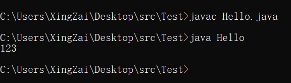
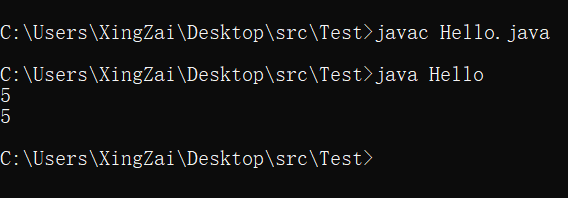
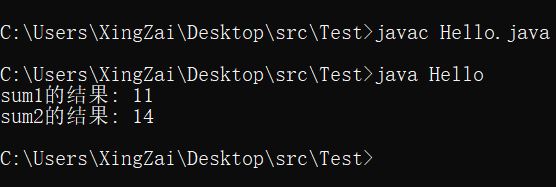
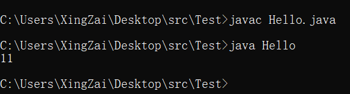
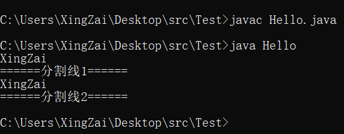
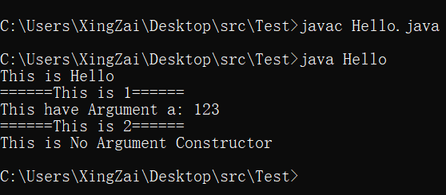

# ***Day3 对类的深刻认识***

## 第一章 方法

> 在Day2的时候已经浅浅的认识过类，但是还是不够深刻，我们现在来深刻的认识一下类是什么和他的结构，首先在认识类的结构之前我们需要再认识和了解这么一个东西，他就是——方法

`方法(method)`也叫`函数(function)`，两种称呼都是可以的，而且要记住都是同一个东西，比如在C和Python里面就叫做`函数`
，Java和Ruby，C#等等里面就叫做`方法`，所以`方法`在指`方法`也在指`函数`，`函数`也在指`方法`在指`函数`理解为`函数`==`方法`即可

我们来试一下方法的声明、编写和调用，在此之前我们要再了解一个东西，就是方法的`返回值(return)`和返回值的`类型`
，类型和正常声明一样，可以是`数据类型`也可以是`类`也可以是没有返回值的`void`

* 返回值的类型
    * 基本类型
        * int
        * byte
        * short
        * long
        * float
        * double
        * char
        * boolean
    * 类
        * String(自带的)
        * Hello(自定义的)
        * ...
    * 无返回值
        * void(不需要加上return语句)

```java
public class Hello {
    //无论在上面声明
    public void print123() {
        System.out.println("123");
    }

    public static void main(String[] args) {
        //因为这个方法是写在Hello这个类里面的，所以我们想要调用的话
        //就和Day2使用在Hello这个类里面声明的i一样
        //首先先创建这个对象
        Hello hello = new Hello();
        //然后我们再使用hello这个对象进行调用方法，和调用i一样
        hello.print123();
    }
    //还是在下面声明效果都一样
}
```

  
可以明显看到直接就是打印了123，因为我们主方法main方法里面只是创建了Hello类这个对象和使用这个对象调用了一下方法，实际打印的东西都是已经写在了print123，但是我们使用的是void，还是没有用到return的，我们现在使用带return的

```java
public class Hello {
    public static void main(String[] args) {
        //继续创建对象进行调用
        Hello hello = new Hello();
        //这样是没用的，因为返回回来的是一个值
        hello.get5();
        //这样是可以的，把拿回来的值进行了使用，打印就是一种使用
        System.out.println(hello.get5());
        //这样子是接收了，所以也是有用的
        int i = hello.get5();
        System.out.println(i);
    }

    //声明在下面
    public int get5() {
        return 5;
    }
}
```

  
只有两次打印，因为单调用是没有用的，只有后面赋值和打印是有用的。

接下来我们来添加更多的参数，因为现在的方法还是没有参数的，参数是写在括号里面的

举个例子就是假如我要一个叫做`sum`
的方法，然后可以做两个数的相加，因为return是个语句可以直接写在里面或者可以把运算写在return的外面然后赋值最后返回这么一个值，示例的话(
假如传入的参数是a和b)就是

```java
public class Hello {
    public static void main(String[] args) {
        //继续按照惯例创建对象
        Hello hello = new Hello();
        //我们既然是有参数的，所以就要填写参数，可以是变量也可以是自己写的数
        System.out.println("sum1的结果: " + hello.sum1(5, 6));
        System.out.println("sum2的结果: " + hello.sum2(7, 7));
    }

    //这个就是带参数的方法的写法，在括号里面写需要的参数的声明
    //比如我们这里需要的就是两个int类型的，名字叫什么无所谓符合规则就行
    public int sum1(int a, int b) {
        //这个就是return语句直接写运算
        return a + b;
    }

    public int sum2(int a, int b) {
        //这个就是return一个值，把运算写在return的外面
        int c = a + b;
        return c;
    }

}
```

  
注意这种参数里面的逗号都必须是英文的逗号，如果出现了中文的逗号的话就会报错了，然后在我们的参数列表里面就是方法后面的括号里的参数，我们一般称之为 `形参`，`形式参数`，`形参`
的作用于仅限于该方法，因为程序是一步一步执行下来的，如果调用到了方法就会进入方法继续执行方法里面的步骤，执行完了就退出方法，所以我们写在括号里面的`形参`
就是局部的，出了这个方法就没了，所以和外面重名也没有关系，

```java
public class Hello {
    public static void main(String[] args) {
        Hello hello = new Hello();
        int a = 5;
        int b = 6;
        System.out.println(hello.sum(a, b));
    }

    public int sum(int a, int b) {
        return a + b;
    }
}
```

  
是不影响的，还有就是如果我们的参数填写不够或者有问题就会报错，返回类型不能错误，方法名前面的返回类型写了就是确定了这个方法返回的是什么类型，那返回值就不能不是这个类型或者不写(
void除外)

## 第二章 类的结构，构造器介绍

> 类由三部分组成，第一个就是属性也叫字段(可以没有)，第二个就是方法也叫函数(也可以没有)
> ，第三个就是构造器也叫构造函数也叫构造方法(不可以没有，但是你不写会自动生成的)

```java
public class Hello {
    //这个就是属性
    public int i = 50;

    //这个就是方法
    public int sum(int a, int b) {
        return a + b;
    }

    //这个就是构造器，不写也会生成，会在创建对象的时候调用构造器
    //比如我们在构造器里面写一点打印信息，在我们创建对象的时候就会打印
    public Hello() {
        System.out.println("XingZai");
    }

    public static void main(String[] args) {
        //正常创建对象，创建对象并接收
        Hello hello = new Hello();
        //这个叫做匿名对象，也可以称之为创建对象不接收
        System.out.println("======分割线1======");
        new Hello();
        System.out.println("======分割线2======");
        //这个只是单单的声明，并没有创建对象，所以这个不会打印信息
        Hello hello1;
    }
}
```

  
稍微能理解一下构造器了吧，构造器就是在你创建对象的时候会自动调用的一个方法，他的结构就是这样 `访问修饰符(public) 类名(){}`

他其实就是一个特殊的方法，所以他的参数列表也是可以填写的，然后他也可以是存在多个的我们来试一下

```java
public class Hello {
    //其实方法的参数也可以是这样传输不仅为基本数据类型也可以是类
    public Hello(String str) {
        System.out.println("This is " + str);
    }

    public Hello(int a) {
        //这个是有参构造器，参数是a
        System.out.println("This have Argument a: " + a);
    }

    public Hello() {
        //这个是无参构造器
        System.out.println("This is No Argument Constructor");
    }

    public static void main(String[] args) {
        new Hello("Hello");
        System.out.println("======This is 1======");
        new Hello(123);
        System.out.println("======This is 2======");
        new Hello();
    }
}
```

  
现在可以理解构造器的用法了吧，一般我们使用无参构造器就是空着的，然后有参构造器拿来初始化类内部的属性，还有一个特性口述即可。那就是如果你没有构造器那他会自动生成一个无参构造器。如果你但凡写了一个有参或者是无参的构造器，那他在编译的时候就不会去创建任何的构造器

### [上一张](day2.md)
### [下一章](day4.md)
### [返回目录](README.md)