# ***Day4 运算符和数据转换***

> 今天来讲运算符，每个运算符的作用和现象，首先我们先复习一下数据类型，
> day2讲过基本数据类型有八种，int、short、long、byte、char、boolean、float、double，分别为四个整型、一个字符型、一个布尔值、两个浮点型

## 第一章 数据类型转换

为了对数据类型更加的熟悉，我们再用一种列表的方式呈现

- 数据类型
    - 整形
        - byte、short、int、long
    - 浮点
        - float、double
    - 布尔
        - boolean
    - 字符
        - char

数据类型转换正常情况只能同类型转换，多个数据类型互转也是可以的。

首先我们来说一下整形的这四个，分别是byte(1字节)，short(2字节)，int(4字节)，long(8字节)，我们直接写的数字例如 `int i = 123`
的这个123就是int类型，如果在不超范围的情况下我们是可以把这个赋值给更小的数据类型的，然后想要写long类型是稍微需要一点特殊手段比如在末尾加个 `l或者L`,
比如 `long l = 123456L` 和 `long l = 123456l`

在我们给更小一点的数据类型，比如short和byte只要我们不超上限就可以使用int类型的数据直接赋值，但是如果超了的话就需要强制类型转换

```java
public class Hello {
    public static void main(String[] args) {
        //很正常的声明和赋值
        int i = 456;
        //报错
        byte b = 456;
    }
}
```

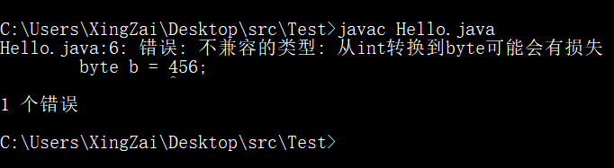  
明显可以看到直接就是一个报错，正确的写法是这样

```java
public class Hello {
    public static void main(String[] args) {
        //这个就是强制类型转换，通过括号扩住里面写要转换的类型
        byte b = (byte) 456;
        //因为byte只有一个字节所以他的范围是-128~127，超了范围就不行
        //但是如果没有超出范围的话就是可以的
        byte b1 = 123;
        //对应的还有short
        //这里就会报错，但是我注释掉了，你们可以解除注释
        //short占2个字节也就是-32768~32767
        //short s = 45645;
        //所以需要这样
        short s1 = (short) 45645;
        System.out.println("b: " + b);
        System.out.println("b1: " + b1);
        System.out.println("s1: " + s1);
    }
}
```

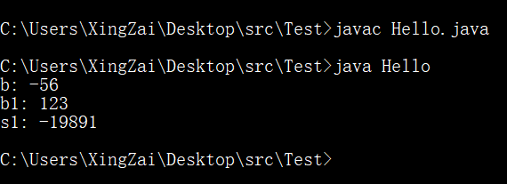  
出现了负数，但是你们先不要惊讶和失措，因为这个是正常现象，我们来分析一下，比如这个b一开始是不是456，但是我们进行了强制类型转换，从int的456变成了byte的456，因为byte是-128~
127所以是256个数，我们的456是溢出的所以就是456-256=200，但是200对于byte的正数上限127还是溢出的，所以200-256=-56

下面的s1也是同理，因为short的范围是-32768~32767，所以我们的也是用同样的做法，减去他的最大个数，45645-65535=-19891

其实还有一个数据类型我们还没有进行展示，那就是long类型，long类型比较特殊，因为他是八字节，所以最大值是9,223,372,036,854,775,807，所以他完全能包含int类型的四个字节，最大值是2,147,483,647，当我们直接写数字的时候，例如 `456123`
其实写的就是int类型，但是我们写超过int类型的最大值也就是(2^31)-1，那就是会出问题，我们来做个测试

```java
public class Hello {
    public static void main(String[] args) {
        //正好就比最大值多了一个数
        int i = 2147483648;
    }
}
```

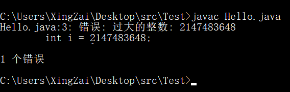  
也是有问题的，所以这个时候我们就需要使用long类型去接收了，急着测试的小伙伴们先别急，你这下long替换掉int还是会出问题的，因为我们写的正常数就是int类型，本来就是超数据的  
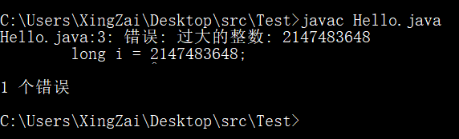  
所以我们需要的操作就是把我们直接写的这个数变成了long类型的数，这个操作其实不难，很简单，只需要将数字的末尾上面加上一个 `l`
或者是 `L` 就行，我们之前在上面其实也讲过了，不知道还有多少小伙伴是记得住的，我们在写数字的时候直接加上这么一个L就可以解决直接写的数是int然后导致大于int最大值就无法赋值的的这个问题，不过自然我们还是可以原地tp的，看代码：

```java
public class Hello {
    public static void main(String[] args) {
        //我们现在使用L进行赋值
        long i = 2147483648L;
        //自然我们使用int的时候也是需要使用强转的，因为直接写的是long
        int i2 = (int) 2147483648l;
        System.out.println("i: " + i);
        System.out.println("i2: " + i2);
    }
}
```

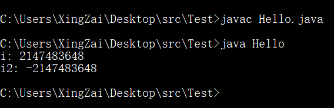  
自然这个出现了-2147483648也是和之前一样的算法就能算出来，大家伙可以自己试一下不加这个强转会不会报错，答案是肯定会报错的
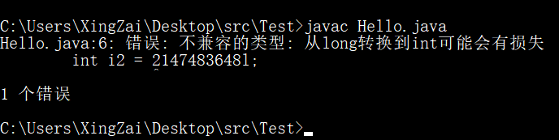  
通过整型讲完的最复杂的转换方式，其他的大家伙应该可以很好理解了，现在我们要说的是浮点型的转换，我们还没有使用过浮点型，但是没有关系，接下来会使用大把大把的浮点型来写程序

首先先提一嘴，就是我们直接写的浮点类型就是double是八个字节的，也叫双精度浮点型，因为double的这个双，我们想要把他变成了float需要加一点东西，然后还有一个就是整型到浮点型的转换

```java
public class Hello {
    public static void main(String[] args) {
        //注意看，我这里写的是123所以其实就是int类型
        //但是int类型是四个字节的，然后double是8个字节
        //所以可以轻松接收，即使我现在用float也是一样
        double d = 123;
        //也是没有任何的关系的，因为float本身也就是四个字节的
        //虽然其实你用long类型用float也可以接收，一般我的评价就是
        //浮点的事你少管，管好整型就好
        float f = 456;
        //现在要来说说什么情况才是double类型，就是这样
        //但凡你加上一个.x无论是什么数，都是可以变成浮点型的double
        double d2 = 456.0;
        //但是我接下来写的这个就会导致报错，我希望你们能比较熟练的使用注释给他注释掉
        float f2 = 123.0;
    }
}
```

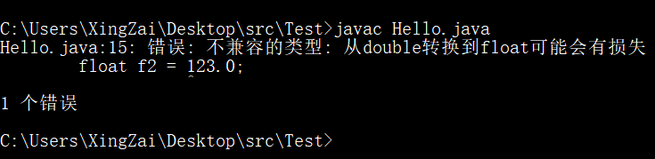  
看看，兄弟们是不是报错了，因为这个其实就和你把int赋值给short和byte是一样的，把long赋值给int一样，自然是说大于他们最大值的时候的情况，然后这个为什么就加个.0就会出问题的

其实啊，即使就只是加上个.0也是说明是双精度的浮点，单精度还是容纳不下双精度的大小的，所以就会出问题，那么有些小伙伴就会有疑问了那我使用 `(float) 123.0`
然后再赋值是不是就可以了

我只能说，嘿小伙子你还真是个天才哈，是可以的，但是我们一般使用的解决方案并不是这个，虽然这个也可以但是我们有更简单的解决方案，就是在末尾加上一个 `F`
或者 `f`和long一样，很明显能看出来long的那个L就是long的开头字母，这个也是就是float的开头字母

```java
public class Hello {
    public static void main(String[] args) {
        float f = 15263.0F;
        System.out.println("f: " + f);
    }
}
```

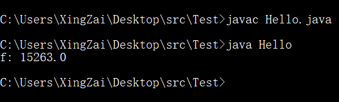  
是不是没有一点毛病

接下来就是一个既不是很难也不算很简单的点了，那就是char类型的转换，因为char类型是字符所以其实他写起来应该是这样的 `'a'`
，但是他的这个a本身又是一个数，详情可以查看ascii码因为这里还是处于ascii的范围内，现在用的unicode都是在ascii的基础上做添加的，这两个都是编码，然后他们又是有对应的数的就比如我现在要把char类型的 `'a'`
转换为int类型的数字也是可以的

```java
public class Hello {
    public static void main(String[] args) {
        char c = 'a';
        //这里也是可以正常打印的，但是还是可以做其他的操作
        System.out.println(c);
        //比如将它转换为int类型然后再来打印，其实打印的就是数字了
        System.out.println((int) c);
    }
}
```

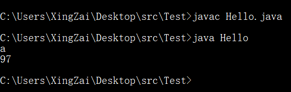  
这里a显示97的原因大家可以查看这个
[ascii的百度百科](https://baike.baidu.com/link?url=t_PzuX_8P8Y9QMtDEzmlBIpZytuQN3ye-8QWl7z9RA33pB6H6BEsFK7c7w1LYb1iI2kH0QBSp8f4QGh7aIUVVK)
，自然我也是把截图截下来了
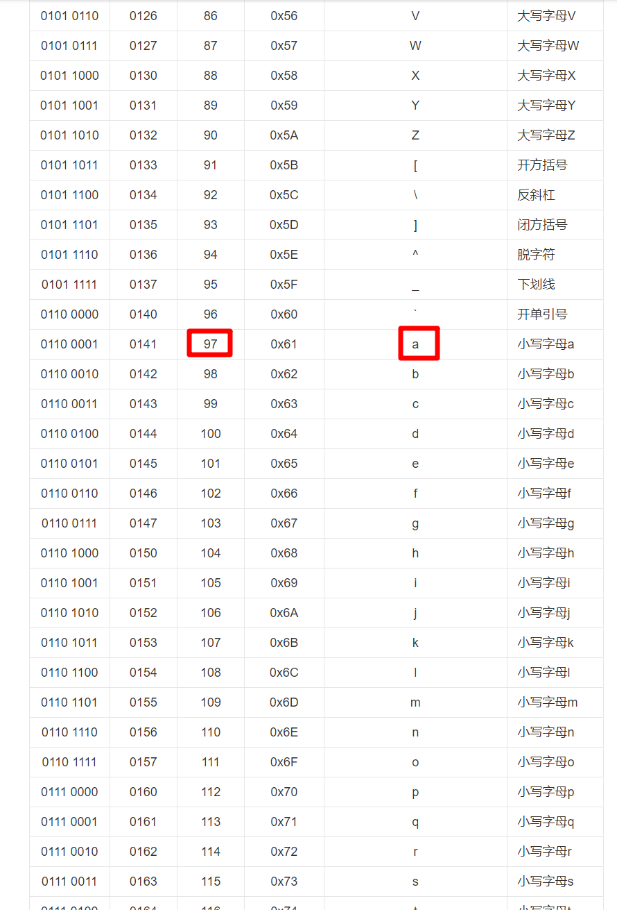  
所以大家只需要知道char类型和int类型是可以互相转换的这一点是比较重要需要记住的。

```java
public class Hello {
    public static void main(String[] args) {
        int i = 98;
        System.out.println((char) i);
    }
}
```

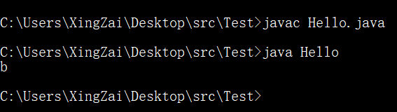  
是吧，98就可以直接换成b了，对照表上

还有一个特殊的，那就是布尔值，布尔值本来就只有true或者是false的两种选择，但是我们正常的数字和字符的强转和其他的都是变成不了为布尔的，需要用到接下来要学习的内容——运算符

还有一点我没讲的，但是是很简单的，比如我把 `byte b = 123;` 的b赋值给 `short s = b;`
这种就叫做隐式类型转换，把小的byte赋值给了大一点的short，值的类型从byte变成了short，还有 `1+1.0` 会是
2.0，因为int+double，然后double是八个字节，所以发生了隐式的类型转换，只有写上了 `(类型)` 的才是显式类型转换，也叫做强制转换

```java
public class Hello {
    public static void main(String[] args) {
        byte b = 123;
        //刚刚说的把b赋值给s是将byte隐式转换为short
        //但是现在的操作是byte+int变成了int，但是值被锁定成了int
        //所以现在的就是需要把int强转变成short
        //我们需要把他运算完的结果进行强转，所以要加个括号，效果和数学里面是一样的
        short s = (short) (b + 7);
        //还有一个也是小+大变成大的，也是我上面说过的
        //这里我们直接打印，还记得吧，打印里面可以放运算式的
        System.out.println(1 + 1.0);//答案是2.0
    }
}
```

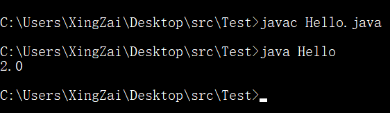

## 第二章 运算符

> 经过了类型转换的学习，对以后的学习和写代码都是很有帮助了，还是需要自己给自己出题然后训练，能做到这一点说明自学能力不错。  
> 这一章我们要学习运算符，其实就是加减乘数然后再有一点新的内容

* 运算符
    * 赋值运算符
    * 算术运算符
    * 自增、自减运算符
    * 关系运算符
    * 逻辑运算符
    * 位运算符
    * 复合赋值运算符
    * 三元运算符
    * 圆括号

### 赋值运算符

首先，我们说一下赋值运算符，其实在前面的演示也已经够多了因为就是一个等于号 `=` ，比如前面的 `int i = 50`
那这个等于号就相当于把右边的那个50赋值给了i，然后在等号的右边也可以是算式，比如 `1 + 2`

### 算术运算符

第二个，我们来说说算术运算符，其实就是加减乘数，用过电脑上的计算器的应该都会的，其实就是加减乘除 `+` `-` `*` `/`
，优先级和数学里面是一样的，先乘除后加减

### 自增、自减运算符

第三个，我们来说一下这个自增、自减，这个可是一个小难点，我先说一下写法 `++` 和 `--` ，假如我们有这么一个数 `int i = 1`
，那我的使用了 `++i` 和 `i++` 之后，最后的结果是一样的，但是我们放在式子里面去计算就不一样了，然后这个 `--` 的作用和 `++`
是类似的，只是一个是加1，一个是减1罢了

```java
public class Hello {
    public static void main(String[] args) {
        int i = 1;
        //不一样的从现在开始
        System.out.println("i++: " + i++);
        System.out.println("++i: " + ++i);   //这里可能会有歧义，最好是把++i使用括号括起来
        /*
           现在我们来讲特殊的情况，第一个打印的i会是1，然后过了这个打印之后i的值就变成了2
           第二个打印，会打印3。
           不知道通过的我描述能不能看懂这两个++的作用呢
           我们把++放在后面的话，会做完一系列的计算啊和打印啊等等操作之后才会自加
           但是++在前面的时候，在做任何操作之前都会先自加，所以就导致了1和3的情况
           接下来我们看结果
         */
    }
}
```

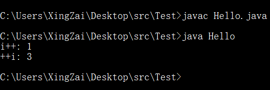  
`--` 也是同理，比如我们现在有个数i的值是5，我先 `--i` 然后 `i++`，如果打印的话，那就是 `4` 和 `4` 然后i的最终结果是 `3`

### 关系运算符

第四个，我们现在来说一下这个关系运算符，这个就和布尔值有关系了，那先来说说有什么关系运算符

* 关系运算符
    * ==
    * \>=
    * <=
    * !=
    * \>
    * <

直接读符号就能大概明白意思了，比如 `==` 等于等于，连等那就是判断是否为相等，这个时候就需要说到布尔值的那两个了true和false，如果确实相等那就是true，如果不是那就是false，都是这么一个关系

`>` 读音就是大于，那就是判断是否为大于，正确返回true，错误返回false，比如 `5 > 3` 那就是true

`<` 读音就是小于，那就是判断是否为小于，如果正确返回true，错误返回false，同理，我就不举例了

`>=` 根据读音就是大于等于，就多个了等于操作

`<=` 小于等于，也是小于上面多了个等于的操作

`!=` 这个叹号代表非的意思，所以就是不等于的意思 `5 != 3` 那就是true， `5 != 5` 那就是false

```java
public class Hello {
    public static void main(String[] args) {
        //记住加上括号，如果没有括号的话，说明就是先拼接字符串然后拿字符串去和int类型判断了
        //这样自然是判断不了的
        System.out.println("5 >= 3: " + (5 >= 3));
        System.out.println("5 > 3: " + (5 > 3));
        System.out.println("5 <= 3: " + (5 <= 3));
        System.out.println("5 < 3: " + (5 < 3));
        System.out.println("5 != 3: " + (5 != 3));
        System.out.println("5 == 3: " + (5 == 3));
    }
}
```

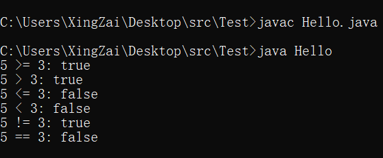

### 逻辑运算符

第五个，就是逻辑运算符，逻辑运算符就只有三个，但是会导致非常多的逻辑，详情可以去看看逻辑电路😁，我们程序里面只有三个，短路与、短路或和非，为什么会有短路，是因为和正常的与或非不一样，他们的符号分别是

* 逻辑运算符
    * 与
        * &&
    * 或
        * ||
    * 非
        * !

我们换一种说法更能理解的，那就是与就是和，或就是或，非就是反，我们举个例子 `&&` 这个符号的作用就是连接两个
需要前后两遍的表达式都是true才会返回true，但凡有一个false那就是false，所以就是`和`

我们在看或是 `||` 作用也是连接两个但是先后的关系是 `或` 的关系，两者表达式但凡有一个true那就是true

还有一个就是 `!`
其实就是取反，如果你出来的结果是true那就会变成false，如果你出来的结果是false，那就会被叹号变成true，比如 `!true` 那就是false

```java
public class Hello {
    public static void main(String[] args) {
        System.out.println("true && true: " + (true && true));
        System.out.println("false && true: " + (false && true));
        System.out.println("false || true: " + (false || true));
        System.out.println("true || true: " + (true || true));
        System.out.println("!true: " + (!true));
        System.out.println("!false: " + (!false));
    }
}
```

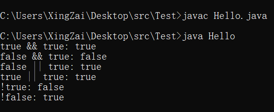

### 位运算符

这个东西就是想当炸裂了，就是操作二进制的。我们先说明他的符号然后我们再做举例说明，然后我们再使用代码的方式给大家展示。

我们先说符号，分别是 `&、|、^、~` 分别的意思也是`与、或、异或、非` 。

然后我们举例说明，首先在举例之前还是需要学习一个东西，那就是二进制的编码，分别是三个码， `原码` ， `反码` ， `补码`
，然后这三个码还分正数情况和负数情况，负数不一样，正数三个码都是一样的，负数在原码和正数不一样的只有符号位，然后在反码是除了符号位之外全部翻转，补码就是反码+1，然后计算机上的任何计算都是从补码进行计算的，如果你算完之后的结果的符号位还是1说明他是负数，还是需要做翻转。我知道现在看的人有点懵，但是你先别懵，看我后面的例子

源码的举例说明，我们举例5和-7这两个数，然后我们现在使用1个字节去储存这个数

我们先看5的编码
> 0000 0101 原码  
> 0000 0101 反码  
> 0000 0101 补码

看出来了吧这就是正数的三码合一，然后我们的负数又是不一样的，就是我上面说的情况，我们再来分析一下

-7的编码
> 1000 0111 原码，表示和正数一样，但是符号位是1，正数是0  
> 1111 1000 反码，除了符号位之外全部翻转  
> 1111 1001 补码，反码+1

我们还有一个工具可以来验证这个东西，就是我们的windows自带的计算器，的程序员功能，就像我说的，计算机中存储和运算都是通过补码的方式存储的，如下分别是5和-7
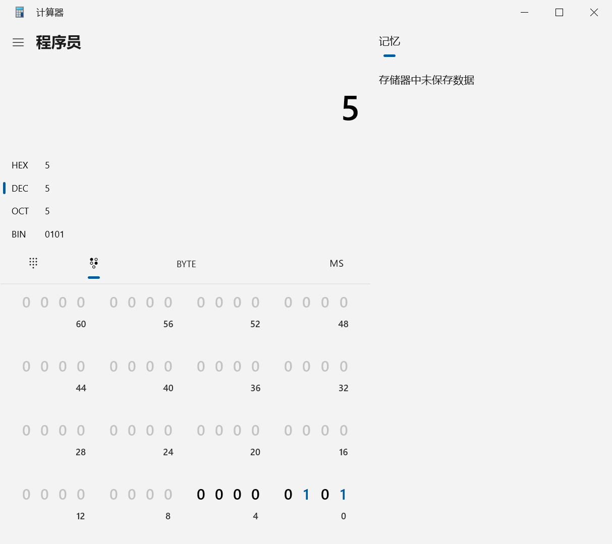  
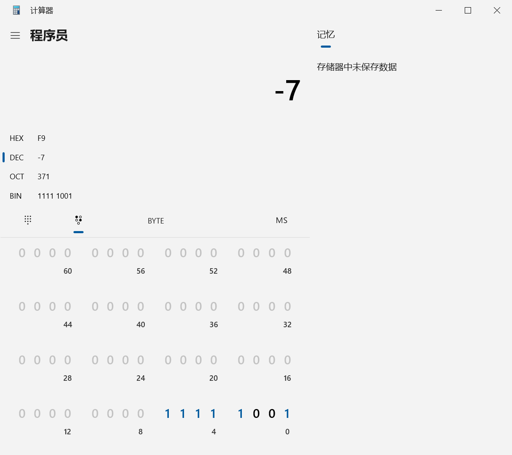  
很好，你已经会看补码了，那我们说明完`& | ^ ~`的作用后直接开始运算好吧，他们的运算都是上下对着运算，如果你让byte类型和int类型互相做位运算的话，他会补齐到int的32位也就是4字节进行运算

首先是 `&` 他的结果是这样的，同一出一，不同出零，这个意思就是理解为1和0乘法，`1 & 1` 那就是 `1` ，`1 & 0` 那就是 `0`

然后是 `|`，
他的运算规则就是，有一出一，全零出零，可以理解为加法，但是最大值是1所以 `1 | 1` = `1` ， `1 | 0` = `1`， `0 | 0` = `0`

第三个就是 `^` ，他的运算规则是，不同出一，相同出零， `1 ^ 0` = `1`， `0 ^ 0` = `0`， `1 ^ 1` = `1`

最后一个就是 `~`，他就是取反，但是他的取反和负数的反码对原码取反不一样，因为他是将符号位也取反

很好，现在你们已经会了，可以写题目了，就写一点题

1. `5 & 15`
2. `5 & -7`
3. `6 | -8`
4. `~5`

我们先来看第一题，因为都是正数，所以三码合一都可以是补码`5 & 15`
> 0000 0101  
> 0000 1111 &  
> 0000 0101  
> 5

第二题 `5 & -7`
> 1000 0111 -7的原码  
> 1111 1000 -7的反码  
> 1111 1001 -7的补码，现在可以开始计算了  
> 0000 0101 &  
> 0000 0001
> 1

第三题 `6 | -8`
> 1000 1000 -8的原码  
> 1111 0111 -8的反码  
> 1111 1000 -8的补码  
> 0000 0110 |  
> 1111 1110 结果的补码  
> 1111 1101 结果的反码  
> 1000 0010 结果的原码  
> -2

第四题 `~5`
> 0000 0101 ~  
> 1111 1010 补码  
> 1111 1001 反码  
> 1000 0110 原码  
> -6

```java
public class Hello {
    public static void main(String[] args) {
        System.out.println("5 & 15: " + (5 & 15));
        System.out.println("5 & -7: " + (5 & -7));
        System.out.println("6 | -8: " + (6 | -8));
        System.out.println("~5: " + (~5));
    }
}
```

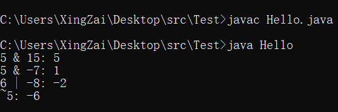  
相信大家都已经会用了，可以通过程序计算然后自己也计算去计算一下其他的数，然后我举的例子里面少了异或，在我写完的时候才想到，想想算了，大家伙应该已经会了，只要跟着规则来都是不会出问题的，毕竟计算机是肯定会去计算出一个准确的结果的

但是还有一件事要告诉大家，其实位运算还是没有学完，因为只是学完了最难的四个，其实还有三个分别是 `<<` `>>` `>>>`
，分别是左移、右移和无符号右移

```java
public class Hello {
    public static void main(String[] args) {
        System.out.println(50 << 1);
        System.out.println(50 >> 1);
        System.out.println(50 >>> 1);
        System.out.println(-8 >> 1);
        System.out.println(-8 >>> 1);
    }
}
```

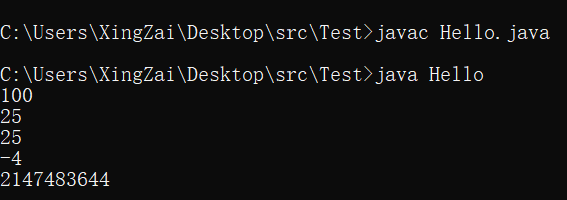  
分别是左移(乘2，因为底层是除了符号位整体左移1位)，右移(除以二，整体除符号位右移1位)，无符号右移(
整体右移1位，这个就要看底层了)，自然把1给改成2就是乘4或者是除以4了，这个可以自己摸索一下，原理不难

### 复合赋值运算符

> 最难的部分，位运算符已经攻克了，所以现在来学习一个简单一点的东西来放松一下吧

顾名思义，就是复合赋值，比如说，`i = i + 1`，那就是把i+1了之后的结果赋值给i，这个复合起来写，可以不写i+，就是写成 `i += 1`
就是`i = i + 1`，加减乘除，左右移，位运算这些。

### 三元运算符

> 这个比较有意思

首先先说一点，三元运算符是一个整体，然后他的结构我来介绍一下是这样 `表达式1 ? 表达式2 : 表达式3`

表达式1 是返回布尔值的也就是返回true或者false，表达式2是在表达式1返回true的时候才会执行，然后返回false的话就会执行表达式3。

```java
public class Hello {
    public static void main(String[] args) {
        System.out.println(true ? 5 : 3);
        System.out.println(false ? 5 : 3);
    }
}
```

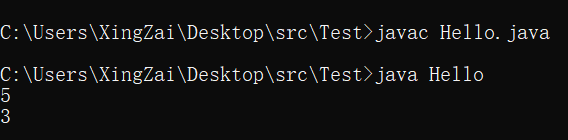  
然后他是一个整体，也是会进行隐式类型转换的，比如 `true ? 1 : 2.0`,那他的结果会是1.0

### 圆括号

> 这个玩意讲都可以不用讲了，括号括上优先级直接飙升，就这样

也很长了，差不多结束了