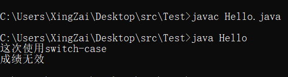
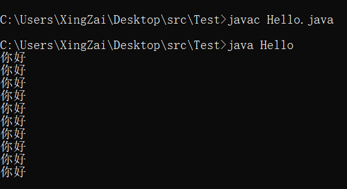

# ***Day5 控制结构***

> 这么叫可能有些就算有基础的人也看不懂，其实就是if-else、switch-case、for、while、do-while这几个，没基础的听到了这个也不要慌张，这几个是程序的基础，多多训练就好

## 第一章 顺序结构

> 这章其实没有什么好讲的，其实正常看代码也看得懂的，就是代码的执行按照顺序下来

## 第二章 条件语句（分支）

### if 语句

> 程序自然是有判断的对吧，所以这个if就是一个判断，如果有C语言基础的可以跳过，因为这块其实和C语言、C++、C#是一样的

if听意思也能看得出来其实就是如果的意思，语法是这样的 `if (条件结果是true或者是false){}`

既然是分支的话，那说明肯定是有反着的情况的，那就是 `else`
，接在if语句的结束后面，就是当if语句的条件为false的时候就执行else，语法也和if一样需要花括号，自然也是可以不用花括号的

```java
public class Hello {
    public static void main(String[] args) {
        int i = 50;
        int j = 15;
        if (i == 50)
            System.out.println(i);
        if (j != 15) {
            System.out.println(j);
        } else
            System.out.println("j == 15");
    }
}
```

  
上面的程序明显可以看出就只是一个判断而已，但是他是可以进行嵌套进行的，还有一点就是这个语句其实是可以不加花括号的，但是代价就是只能执行一行语句，一个语句的结束就是一个分号，所以你也可以单写一个分号就是一个语句，根据顺序结构下来，其实就是所有判断都会进入，只不过是否为true才决定是否执行

在没有花括号的情况下else会对最近的if进行关联(必须是同级的)

### switch-case语句

我们先来看一个案例

```java
public class Hello {
    public static void main(String[] args) {
        int score = 5;
        if (score == 1) {
            System.out.println("不及格");
        } else if (score == 2) {
            System.out.println("及格");
        } else if (score == 3) {
            System.out.println("中等");
        } else if (score == 4) {
            System.out.println("良好");
        } else if (score == 5) {
            System.out.println("优秀");
        }
    }
}
```

  
这样是不是太糅杂了，一般这种情况，我们都会使用switch-case去解决

```java
public class Hello {
    public static void main(String[] args) {
        int score = 5;
        System.out.println("这次使用switch-case");
        switch (score) {
            case 1:
                System.out.println("不及格");
            case 2:
                System.out.println("及格");
            case 3:
                System.out.println("中等");
            case 4:
                System.out.println("良好");
            case 5:
                System.out.println("优秀");
        }
    }
}
```

  
是不是出来了，然后看的也比if-else疯狂嵌套要舒服，但是其实是错误的，我们来说一下是为什么，因为这里并没有进行执行完就跳出的选择，之所以只打印了一个优秀是因为我的5写在了最下面，还记得我说的顺序结构吗，这里也不例外，假如我们把score改成1会发生什么

  
是不是明显是有bug的，我们再来改变一下代码，我们就能准确判断了，然后是不是还有一个问题，那就是如果我的值都不是在1-5之间我想要直接打印一个，成绩无效呢？也很简单，我们慢慢道来

```java
public class Hello {
    public static void main(String[] args) {
        int score = 1;
        System.out.println("这次使用switch-case");
        switch (score) {
            case 1:
                System.out.println("不及格");
                break;
            case 2:
                System.out.println("及格");
                break;
            case 3:
                System.out.println("中等");
                break;
            case 4:
                System.out.println("良好");
                break;
            case 5:
                System.out.println("优秀");
                break;
        }
    }
}
```

  
这次是不是就没有连携下去了，这个就是break的作用，从英文我们也能看懂是干什么的，就是打断的作用，我们直接打断退出这个switch部分。

我们在去执行一下我们刚刚的想法，是不是说如果我输入的6是不是就不执行了，但是我想要他打印一个成绩无效怎么办，只需要加一个东西，那就是default就行，语法用的其实和case是一样的，只不过他就和if-else的else一样，其他情况才会使用default

```java
public class Hello {
    public static void main(String[] args) {
        int score = 6;
        System.out.println("这次使用switch-case");
        switch (score) {
            case 1:
                System.out.println("不及格");
                break;
            case 2:
                System.out.println("及格");
                break;
            case 3:
                System.out.println("中等");
                break;
            case 4:
                System.out.println("良好");
                break;
            case 5:
                System.out.println("优秀");
                break;
            default:
                System.out.println("成绩无效");
                break;
        }
    }
}
```

  
如果有小伙伴说那我每句都要加break为什么不直接让break作用在每一个上面不就好了吗，人话就是我自带break属性不就好了吗？但是这样的话就不能处理其他事情，比如我有些情况，就那月份判断季节来说，是不是就可以这样实现

```java
public class Hello {
    public static void main(String[] args) {
        int season = 1;
        switch (season) {
            case 3:
            case 4:
            case 5:
                System.out.println("Now is Spring");
                break;
            case 6:
            case 7:
            case 8:
                System.out.println("Now is Summer");
                break;
            case 9:
            case 10:
            case 11:
                System.out.println("Now is Autumn");
                break;
            case 12:
            case 1:
            case 2:
                System.out.println("Now is Winter");
                break;
            default:
                System.out.println("输入的月份有误");
                break;
        }
    }
}
```

  
在以上代码里面是不是就是有用了，少些了8次同样的语句是吧

## 第三章 循环语句

> 循环语句是程序中最重要的步骤之一，很多地方都是需要使用到循环语句的，这块至关重要，但是又有点小麻烦，比起分支结构

循环语句有三个for、while、do-while，还有一个迭代器一样的foreach也就是增强for循环，现在还不学，之后再学习

### while循环

我们先来看看while循环，while循环的语句是这样 `while(条件){}`自然也是可以不用花括号，但是这样的话就会只是循环一个语句，使用循环是会使用前面学过的不少知识，我们来稍稍循环一下

```java
public class Hello {
    public static void main(String[] args) {
        //我们现在的目标就是连续打印十次，你好
        int i = 0;
        while (i < 10) {
            System.out.println("你好");
            i++;
        }
    }
}
```

  
一般情况下我们都是会这么使用的，先声明一个整型变量初始化为0，这个是有说法，因为以后要学到的一个知识，是数组，他的下标就是从0开始，直接这样使用是比较方便的。

还有一个语句也是循环的标配，就是while循环体内部的i++，因为这个就是自增嘛，之前学过的，除了之前说过的是自增1，其实也可以等价为 `i += 1`
也可以等价为 `i = i + 1`，然后就是内部的语句了，比如也可以写一个判断，小于5执行什么，大于5执行什么，等于5执行什么，循环还是比较有意思的

### do-while循环

现在我们来讲讲这个do-while循环，首先我们先来看一个案例，之前我们也说过了 `while(条件){}` 中的这个条件也就是布尔值，如果我上来就不满足的话，那我直接执行不了

```java
public class Hello {
    public static void main(String[] args) {
        int i = 10;
        System.out.println("开始循环");
        while (i < 10) {
            System.out.println("你好");
            i++;
        }
        System.out.println("结束循环");
    }
}
```

  
这里是不是没有执行，但是do-while不会出现这种情况，因为do-while会先执行一遍然后再判断条件，先说说语法是怎么样的 `do{}while(条件);`

```java
public class Hello {
    public static void main(String[] args) {
        int i = 10;
        System.out.println("开始循环");
        do {
            System.out.println("你好");
            i++;
        } while (i < 10);
        System.out.println("结束循环");
    }
}
```

  
这样就能先执行一遍然后再判断条件

### for循环

> 接下来这个可是大头，大部分情况的循环其实使用的都是for循环

for循环的语法是这样的 `for(初始化值; 条件; 条件变化){};`

```java
public class Hello {
    public static void main(String[] args) {
        for (int i = 0; i < 5; i++) {
            System.out.println("你好");
        }
    }
}
```

  
然后for循环的这个括号里的三个该写的东西其实也可以都不写，注意分开的时候是使用分号进行分割的，初始值可以不写，因为可以使用外部的，条件可以不写，因为这样就是死循环除了使用其他方法跳出循环，
条件变化也可以不写，也可以不止写一个++，也可以使用+=2等等，一般 `初始化值` 和 `条件变化` 这两个地方使用多个参数也是可以的，只不过需要使用逗号来隔开。

## 第四章 跳转语句

> 这个跳转语句可是和循环息息相关的，然后还和switch有点小关系

那么这个跳转语句其实只有两个，一个就是switch-case里面使用过的break，和continue，从名字应该能看懂了，break就是直接打断，在循环里的作用也是直接跳出循环，然后continue就是继续循环，那他做了什么呢？那就是继续执行，
但凡执行到了continue语句，那就会直接继续执行下一次循环。

```java
public class Hello {
    public static void main(String[] args) {
        System.out.println("测试break");
        for (int i = 0; i < 10; i++) {
            if (i == 5)
                break;
            System.out.println("你好");
        }
    }
}
```


以上是break的，我们现在来看看continue的

```java
public class Hello {
    public static void main(String[] args) {
        System.out.println("测试continue");
        for (int i = 0; i < 10; i++) {
            if (i == 5)
                continue;
            if (i == 5)
                break;
            System.out.println("你好");
        }
    }
}
```

  
直接继续执行，跳过了break，但是打印也是只有9个了，因为也跳过了，就相当于执行到continue的时候就直接重新执行下一遍语句

### [上一张](day4.md)
### [下一章](day6.md)
### [返回目录](README.md)