# ***Day6 数组和检测输入***

> 数组在程序之中是最重要的一个知识点之一，很多东西都是需要使用数组来进行存放和运算的，我们数组除了正常的迭代方式之外还有特殊的迭代方式，就是前面说要后面要讲的foreach循环

## 第一章 一维数组

> 首先我们需要对数组有个概念，数组的意思就是，数的组😅，说了个什么东西呢，数组就是一组的数据，这个数不是简简单单的数字，而是数据，比如，除了基本数据类型的那四个，还有很多，
> 比如String类（Java自带的）啊，还有我们写的Hello类（自定义类）啊都是可以有数组的。

因为想用一个东西那么就得声明，所以紧接而来的就是数组的声明

### 一维数组声明

> 首先，我们先回想一下数据的声明，结构是 `类型 名字 = 初始化(可选)`，所以数组的声明其实就是多了个组的表现

那我们来声明一下数组，语法有两种，一种是怀旧的🧐，还有一种是java类型的，怀旧的自然是C，这里我就多用一点C的知识去讲一下，看不懂的没必要硬看哈，因为比起零基础接触一个新的东西，还是用比喻比较好接入新的记忆。

假如我们需要一个int类型的数组，那我们可选的声明方式有两种，第一种是java类型的 `int[] i = new int[(数字)]`
，第二种C语言怀旧版就是 `int i[] = new int[(数字)]` ，细心的小伙伴们应该都发现了，我这里都是直接初始化了，如果只是声明的话，看我等于号的前面部分就够了

> 那我浅讲一下C语言怀旧版，没有C基础的可以跳过这一段话，我们C语言中声明数组还记得吗就是 `int i[(数字)]`
> 是吧，Java只是把数字放到后面初始化的状态，没有一声明就进行初始化的状态，这两者可以分割开来，但是做静态初始化的时候C的方式还是和Java一样的

### 一维数组的初始化

那我们来讲讲这个初始化的操作，我们初始化的时候需要跟上的就是 `new int[(数字)]`
，这个数字很明显，就是这个数组的大小，new是为什么呢，这就该扯到Java抛弃的C的一个特性(明面上的，实际底层还是用着的)
，就是指针，顾名思义，指向一个地方的针，就和指南针一样，只不过这个针是指向地址的，我们用代码去理解一下，因为这里和创建对象一样，都是使用了 `new`
这么一个关键字的

```java
public class Hello {
    public static void main(String[] args) {
        //这里创建对象
        Hello hello = new Hello();
        //这里创建数组
        int[] ints = new int[10];
        System.out.println("hello: " + hello);
        System.out.println("ints: " + ints);
    }
}
```

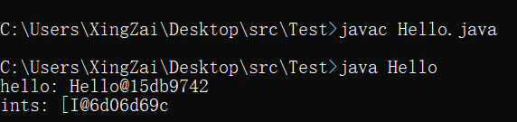  
我来给大家稍微分析一下，像这个@的后面就是叫做hashcode的一个值，可以理解为在java中的地址，所以他们其实还是指向一个地址的，因为直接打印是出不了的，这个就是有点面向对象的内容了，我们之后再讲，就是现在可以说明的就是我们直接将它丢入到了打印语句里面，那他会自动调用这个对象的一个方法，那个方法就是默认打印`类@地址`

但是那个默认打印自然是可以改的，我们以后再说，目前我们看到的这个hello是不是Hello类的对象是吧，打印的是不是Hello类然后再@地址的，那我们再看一眼我们的ints，是不是有点看不懂，但这个就是我们一维数组的表现，一个方括号[
然后跟上一个类型I，如果我还一个类型自然就发生了变化后面也是@跟上地址

```java
public class Hello {
    public static void main(String[] args) {
        long[] l = new long[10];
        byte[] b = new byte[10];
        System.out.println("l: " + l);
        System.out.println("b: " + b);
    }
}
```

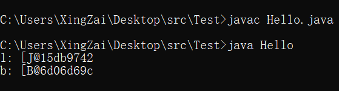  
我们再来看看现在的这两个，是不是一个是long一个是byte的数组啊，对吧，那他们同样都是一维数组，前面是不是都是一个方括号，然后后面跟上一个字母，这里也能看得出来跟的不一定是自己类型的首字母大写
，其实跟什么无所谓，我们要的就是能看懂这个是几维的数组和他的这个new创建的是不是就是有地址的。

如果有点好奇心的其实我可以直接说，
像long的就是J，byte的是B，short的是S，int的是I，boolean的是Z，然后char是没有打印信息的，因为他是特殊的，字符型，说明字符的数组就是字符串，就到了Java最特殊的类，String了，这里我们就不多说了

> 接下来我将好好讲讲这个数组的初始化方式

首先就是直接初始化，在我们声明完之后，在任何地方都能进行初始化的这个new 数据类型[(数字)]

第二种，那就是静态初始化，静态顾名思义，那就是写死的，不会动态变更的，就像这样， `int[] a = {1,2,3,4,5,6,7,8,9,10};`
这样就是静态初始化，写的方式就是在声明的时候直接把一个花括号里面的数据赋值过去

```java
public class Hello {
    public static void main(String[] args) {
        int[] a = {1, 2, 3, 4, 5, 6, 7, 8, 9, 10};
    }
}
```

这里我就不截图了，毕竟也没有任何的输出内容，接下来我要讲的东西可就厉害了，那就是数组的使用，还记得我之前教循环的时候说的吗，为什么一般我们的循环变量都是从0开始，这个就是为了照顾我们的数组，因为数组我们想要去获取数组里面储存的值，需要通过下标去获取的，然后这个下标就是从0开始的。

### 一维数组的使用

还有一件事，就是我想用这个数组获取值的时候就需要这样 `a[(下标)]`
要这么个方式去填写，因为我们声明的数组就是a，所以a就是数组，所以需要通过方括号去调用里面储存的东西，毕竟我们直接打印是只能打印地址的

这里还是需要再讲到一个东西，假如我声明的数是8个，但是因为下标是从0开始的，所以有效获取值的下标是0~
7，然后还有一个属性就是，我使用 `a.length`
我能直接获取数组的长度，猜猜为什么他打印和对象一样，因为他和对象一样里面塞了属性，就和我之前讲的`hello.i`
一样，只不过他的属性是length罢了

```java
public class Hello {
    public static void main(String[] args) {
        //那我们这里就使用静态初始化的方式来声明好了
        int[] a = {1, 2, 3, 4, 5, 6, 7, 8, 9, 10};
        //然后就配合我们之前说过的循环去获取值并打印
        //这个a.length其实也很巧妙的，因为他现在的大小是10
        //所以我的a.length正好是10，所以i能自增的最大值正好是9
        //所以是永远不会越界的，待会让大家看看越界会出现什么问题
        for (int i = 0; i < a.length; i++) {
            //自然我们获取值的时候肯定不一定只能写死的，我们还可以写活的
            //就想这样，因为i一直是在自增变化的，所以每一次都是不一样的
            System.out.println(a[i]);
        }
    }
}
```

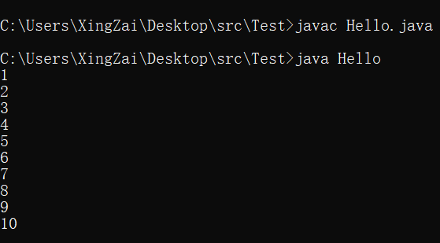  
是不是还是觉得有点不好，想要放在一排是吗，那也很简单，这个时候我们就只需要对打印方法动动手脚就行了

```java
public class Hello {
    public static void main(String[] args) {
        int[] a = {1, 2, 3, 4, 5, 6, 7, 8, 9, 10};
        for (int i = 0; i < a.length; i++) {
            //看出来我的变化了吗，我把ln给去掉了，然后末尾加上了空格
            //如果不加空格的话就会挤在一起了，所以用空格好看一点
            //只要你不加ln那他正常的print是不会换行的，ln就代表着换行
            //就是line的意思，一行
            System.out.print(a[i] + " ");
        }
    }
}
```

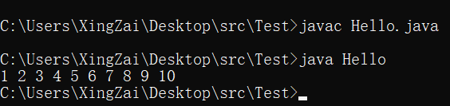  
是不是看到了一点问题，因为没有换行了，所以和下面的命令行贴在了一起，这个时候我们空写一个打印换行就行了 `System.out.println()`
即可

现在我们使用的是静态初始化的，那我们来看看正常初始化的情况

```java
public class Hello {
    public static void main(String[] args) {
        int[] a = new int[10];
        for (int i = 0; i < a.length; i++) {
            System.out.print(a[i] + " ");
        }
        System.out.println();
    }
}
```

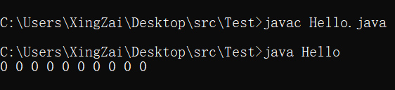  
是不是发现了一点不对劲，怎么都是0啊，那必然的，因为我们只是做了声明和默认初始化的操作，默认初始化的操作就是全部初始化为0，那我们只需要手动变更一下即可。

```java
public class Hello {
    public static void main(String[] args) {
        int[] a = new int[10];
        //我们先来一个赋值的循环
        for (int i = 0; i < a.length; i++) {
            a[i] = i + 10086;
        }
        for (int i = 0; i < a.length; i++) {
            System.out.print(a[i] + " ");
        }
        System.out.println();
    }
}
```

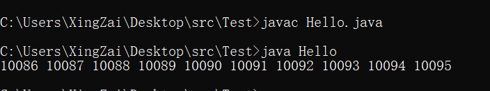  
是不是觉得动态的这种初始化非常的灵活，自然，我们一般情况都是会使用这种的初始化，使用静态的情况一般只有一种，就是测试数据的时候，我们拿着一组肯定的数据去做算法啊什么的。

自然我们只需要拿到了数据，就这样从数组之中取出了数据，那我们就能干各式各样的操作了。这就交给大家发挥了。

然后接下来我讲几个比较好用的工具，首先我们需要学习一个小东西，后面也是会教的，现在就浅用一下，那就是导入其他类

```java
//这个就是导入一个类的操作

import java.util.Arrays;

public class Hello {
    public static void main(String[] args) {
        //比如这种数组我们直接打印是不是出的就是地址哦
        int[] a = {1, 2, 3, 4, 5, 6, 7, 8, 9};
        //但是我们使用这个类里面的一个方法再把数组当做参数传进去
        //就会发生奇妙的事情
        System.out.println("奇妙的事情:");
        System.out.println(Arrays.toString(a));
        System.out.println("直接没有用循环然后就打印了");
        //底层我就不细说了，反正大家伙只需要知道导入了java.util.Arrays
        //这个类之后，然后使用Arrays.toString(数组)，传数组就能直接打印了
    }
}
```

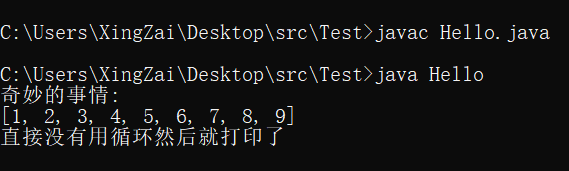

这里再讲一个神奇的东西就是循环里说会在数组里面讲的一个东西，现在还是只是了解一下就行了，在非常的后面我们说容器的时候我们再仔细去了解一下这个东西，那这个东西，如果有认真记的人的话会发现就是foreach

```java
public class Hello {
    public static void main(String[] args) {
        int[] a = {1, 2, 3, 4, 5, 6, 7, 8, 9};
        System.out.println("foreach教学区的防伪标签");
        for (int i : a) {
            System.out.print(i + " ");
        }
        System.out.println();
    }
}
```

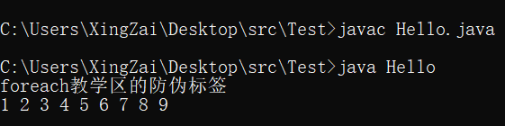

## 第二章 二维数组

> 二维数组的意思其实就是两个维度的数组，也就是，数组的数组，能理解吗，就是第一维度的数组里面的元素还是数组。可以理解为矩阵了，或者理解为直角坐标系，

### 二维数组的声明

> 就是多了一个维度，其实也就是多一个方括号

`int[][] i;`

### 二维数组的初始化

> 因为说过了二维数组其实就是数组的数组，所以，第二维度的数组可以自主初始化，也可以被统一初始化，看接下来的例子

`i = new int[5][]`，这是一种， `i = new int[5][5]`，这是第二种，也就是刚刚说的统一初始化，第一种的方式需要自己继续去初始化，因为是两个维度，所以想要遍历也需要嵌套一下循环

```java
public class Hello {
    public static void main(String[] args) {
        //第一种方式，稍后再初始化第二维度，可以自定义二维的长度
        int[][] a = new int[5][];
        //统一初始化，长度相等
        int[][] a2 = new int[5][5];
        //第一种的初始化
        for (int i = 0; i < a.length; i++) {
            a[i] = new int[i + 1];
        }
        System.out.println("第一种方式初始化的遍历");
        for (int i = 0; i < a.length; i++) {
            for (int j = 0; j < a[i].length; j++) {
                //因为是两维的，所以取值也是需要两个括号，需要两个循环变量
                System.out.print(a[i][j] + " ");
            }
            //前面打印完这里换行
            System.out.println();
        }
        System.out.println("接下来是第二种方式初始化的遍历");
        for (int i = 0; i < a2.length; i++) {
            for (int j = 0; j < a2[i].length; j++) {
                //因为是两维的，所以取值也是需要两个括号，需要两个循环变量
                System.out.print(a2[i][j] + " ");
            }
            //前面打印完这里换行
            System.out.println();
        }
    }
}
```

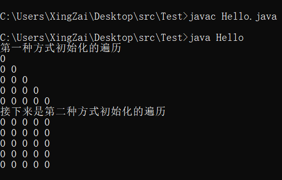  
这个就是看自己的需求来进行初始化了，赋值也是一样，通过下标进行赋值

```java
public class Hello {
    public static void main(String[] args) {
        //第一种方式，稍后再初始化第二维度，可以自定义二维的长度
        int[][] a = new int[5][];
        //统一初始化，长度相等
        int[][] a2 = new int[5][5];
        //第一种的初始化
        for (int i = 0; i < a.length; i++) {
            a[i] = new int[i + 1];
        }
        //接下来我们进行赋值
        for (int i = 0; i < a.length; i++) {
            for (int j = 0; j < a[i].length; j++) {
                a[i][j] = j;
            }
        }
        for (int i = 0; i < a2.length; i++) {
            for (int j = 0; j < a2[i].length; j++) {
                a2[i][j] = j;
            }
        }

        System.out.println("第一种方式初始化的遍历");
        for (int i = 0; i < a.length; i++) {
            for (int j = 0; j < a[i].length; j++) {
                System.out.print(a[i][j] + " ");
            }
            System.out.println();
        }
        System.out.println("接下来是第二种方式初始化的遍历");
        for (int i = 0; i < a2.length; i++) {
            for (int j = 0; j < a2[i].length; j++) {
                System.out.print(a2[i][j] + " ");
            }
            System.out.println();
        }
    }
}
```

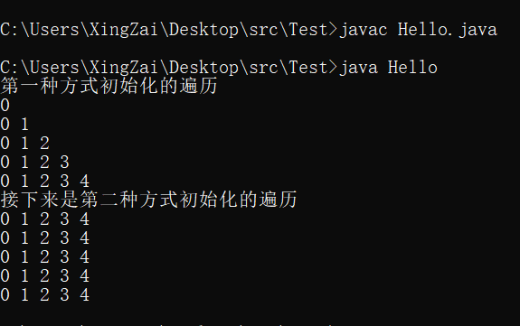  
看到这个是不是想到一个东西，那我能用这个东西做个杨辉三角出来吗？自然是可以的！

### 二维数组的使用

```java
public class Hello {
    public static void main(String[] args) {
        //这个是杨辉三角形的层数，更改了这个值就会让他变的更多的
        int length = 10;
        int[][] a = new int[10][];
        //初始化三角形
        for (int i = 0; i < a.length; i++) {
            a[i] = new int[i + 1];
        }
        //先把1给他填上然后再算，这是一种方式，还有很多方式
        //写代码其实和写数学题是比较相似的，一个结果可以有很多种过程
        //这个方式比较简单，但是会多增加一次的全部的遍历数，但是做教程所以就简单一点
        for (int i = 0; i < a.length; i++) {
            for (int j = 0; j < a[i].length; j++) {
                a[i][j] = 1;
            }
        }
        //因为杨辉三角的特性，所以1和2层是不变的，我们从第三层开始
        //因为下标从0开始，所以下标2就是3
        for (int i = 2; i < a.length; i++) {
            //然后我们第一列又是不变的，所以我们也直接从第二列开始
            for (int j = 1; j < a[i].length; j++) {
                //我们开始赋值然后要判断一下，会不会越界，所以拿上一层来判断
                //很明显i就是行数，也就是层数
                if (j < a[i - 1].length)
                    //然后开始赋值，取上一层的自己的这个位置和前一个位置相加
                    a[i][j] = a[i - 1][j] + a[i - 1][j - 1];
            }
        }
        //然后就形成了杨辉三角形，这里使用的是foreach遍历
        for (int[] ints : a) {
            for (int anInt : ints) {
                System.out.print(anInt + " ");
            }
            System.out.println();
        }
    }
}
```

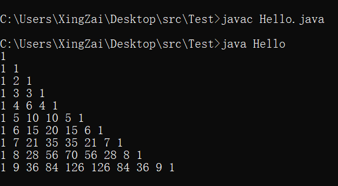  
我知道有人会觉得你这不多余吗，判断前一列后一列然后直接赋值1不就好了吗，然后还能少一次遍历，能有这种想法的，说明有基础，如果你本来就是零基础的话，那说明你对算法的亲和度还是不错的。以后会有不错的发展

## 第三章 基于数组的简单算法

> 这里不讲难的，就只讲一两个算法，是比较简单的排序算法，因为我们的数组可以乱存东西，这样就不会让他看着很有序，包括遍历出来也不是很有序，所以这里就应该是我们的排序算法出马的时候了

首先第一个算法，是很简单的，叫做冒泡排序，原理很简单，一次一次的遍历数组，然后把小的或者是大的放到后面来，假如有一个数组是这样的 `int[] i = {5,1,8,9,4,6,7,3,2};`
> 5 1 8 9 4 6 7 3 2 数组原样  
> 5 1 8 4 6 7 3 2 9 一次遍历移动  
> 5 1 4 6 7 3 2 8 9 二次遍历移动

是不是有模有样，大的慢慢排到的后面来
> 5 1 4 6 3 2 7 8 9 第三次遍历移动  
> 5 1 4 3 2 6 7 8 9 第四次遍历移动  
> 1 4 3 2 5 6 7 8 9 第五次移动  
> 1 3 2 4 5 6 7 8 9 第六次移动  
> 1 2 3 4 5 6 7 8 9 第七次移动

不知道大家看例子能不能看懂，想法已经说明了，所以实现就自己实现一下，然后再来看我的代码，因为写程序就是这么一个过程，先进行想法的构造，然后确定想法，然后再用代码实现出来，使用代码实现出来这一步是非常的困难和重要的

```java
import java.util.Arrays;

public class Hello {
    public static void main(String[] args) {
        int[] a = {5, 1, 8, 9, 4, 6, 7, 3, 2};
        //为什么遍历长度-1次的原因是，我们是替换过来，是两两之间交换
        for (int i = 0; i < a.length - 1; i++) {
            //这里还要再减i的原因是因为我们移动到最后面之后就确认了这么一个数是不会再交换了
            for (int j = 0; j < a.length - 1 - i; j++) {
                //这里进行判断，如果前后满足替换条件，比如前面大于后面，就可以进行交换
                //为什么是j+1和j的原因是，我们从0开始，然后长度-1，如果是1开始，长度可以不减一
                //这个选择是看你遍历的初始值是多少的，会不会越界
                if (a[j] > a[j + 1]) {
                    //我们替换的话，直接替换是不是会出问题，所以我们需要一个中间值
                    int temp = a[j];
                    a[j] = a[j + 1];
                    a[j + 1] = temp;
                }
            }
        }
        //我们这里使用之前讲的工具进行打印
        System.out.println(Arrays.toString(a));
    }
}
```

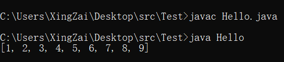  
看结果就知道了已经完成了正常的排序

接下来就要告诉大家一个黑科技，也是这个Arrays类里面的一个方法，工具方法，他的作用就是排序，而且速度非常的快，我现在说一下他用的是什么，以后有兴趣的可以自己去研究一下，底层用的是 `双路基准快速排序`

```java
import java.util.Arrays;

public class Hello {
    public static void main(String[] args) {
        int[] a = {5, 1, 8, 9, 4, 6, 7, 3, 2};
        //直接调用进行排序
        Arrays.sort(a);
        //然后我们看结果，虽然已经封装好了方法，但是大家学习的时候不能对算法太怠惰
        System.out.println("使用Arrays.sort();进行排序");
        System.out.println(Arrays.toString(a));
    }
}
```

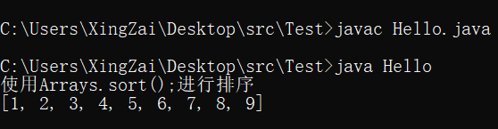  
今天的学习就到这里，如果大家伙还是比较懵逼的，可以多敲一下代码就会解除迷惑的

### [上一张](day5.md)
### [下一章](day7.md)
### [返回目录](README.md)