# ***Day7 字符串与键盘输入***

> 字符串作为所有程序都很重要的东西，这个东西必须好好的学习，在Java中String会比较好学习，比起C和C++里面会更加的简单，
> 在Java之中也是很好理解的，因为底层已经封装好了char数组，也就是字符串  
> 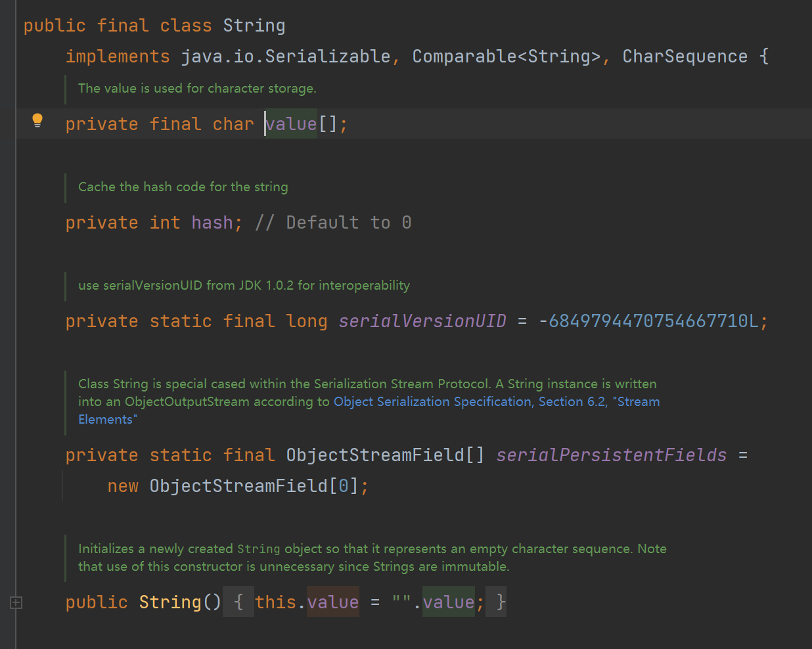

## 第一章 字符串

字符串的声明非常的简单，只需要使用使用String这个类作为数据类型即可， `String name = "XingZai"`
，String这个类是特殊的类，可以直接写值而不需要使用new关键字，这是在jdk1.2版本开始就优化了这个，可以直接写了，但是还是保留着的，而且是不一样的，待会就稍微浅讲一下。

还记得我之前所说的，使用new就相当于是创建对象，然后这个对象直接丢入打印里面就是直接调用这个对象的 `toString()`
这个方法，但是我们来看方法名，是不是 to String，转换到String类型，但是我们的String本来就是String是吧，所以String的toString()
其实就是打印自身，直接上代码

```java
public class Hello {
    public static void main(String[] args) {
        String name = "123123";
        System.out.println(name);
    }
}
```

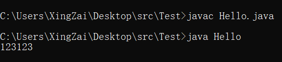  
感觉这个没有什么好说的，还是非常简单的，声明是这样，然后就是我们之前讲过的拼接字符串，使用 `+`
号，在数字和数字之间是计算，但是在字符串和其他面前就是拼接了，可以拼接的又但不限于，数字，布尔值，和对象，因为如果拼接对象的话会自动调用这个对象的toString()
方法也就是那个 `类@hashCode`

```java
public class Hello {
    public static void main(String[] args) {
        String s = "123123" + true;
        System.out.println("s: " + s);
        String s2 = "Hello: " + new Hello();
        System.out.println(s2);
    }
}
```

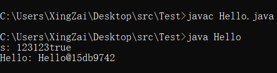  
接下来我们来自定义一下这个toString方法，比如现在我们使用的是Hello类的对象，那我们直接写就行了

```java
public class Hello {
    public static void main(String[] args) {
        System.out.println(new Hello());
    }

    //toString方法是一个返回String类型的方法，我们只需要在返回值上加上就行
    public String toString() {
        return "Hello类" + "123";
    }
}
```

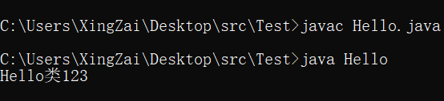  
欧克，接下来我们来讲讲，jdk1.1及之前的使用new关键字创建String对象的方法，和我们现在直接写String的方法有什么区别。这个时候我们还需要知道一个方法，这个是所有的类都有的这么一个方法除了toString()
之外都有的这么一个方法，那就是hashCode()
，之前我也说过了在Java中地址的显示都是通过hashCode的方式来显示了，所以我们的这个 `hashCode()`这个方法就是获取他的hashCode

```java
public class Hello {
    public static void main(String[] args) {
        //传统创建对象的方式来创建String类的对象
        String s = new String("123");
        String s1 = "123";
        System.out.println("s: " + s);
        System.out.println("s1: " + s1);
        System.out.println("s: " + s.hashCode());
        System.out.println("s1: " + s1.hashCode());
        boolean b = s == s1;
        System.out.println("s == s1: " + b);
        if (!b)
            System.out.println("哈希值是不是一样，但是让他判断竟然是false");
        Hello hello = new Hello();
        Hello hello1 = hello;
        System.out.println("hello: " + hello);
        System.out.println("hello1: " + hello1);
        System.out.println(hello1 == hello);
    }
}
```

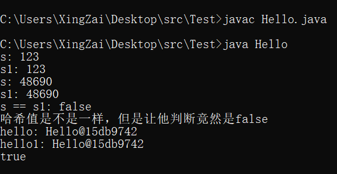  
是不是感到了深深的疑惑，同样的hashCode，Hello类的对象就是相等，但是同样hashCode的字符串竟然不是相等，你们先别急，我来慢慢道来，这个时候就需要画个图了，请出灵魂画手，s1这个对象是怎么指的

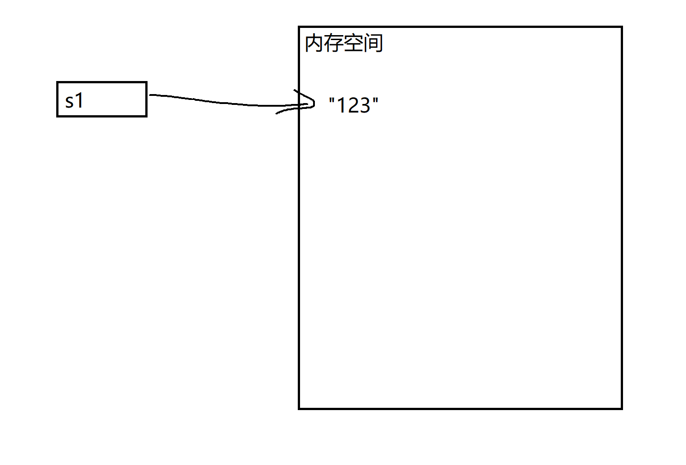  
(了解Java内存的先别喷，现在还不分开来说，无论常量池，堆还是方法区等等现在都统一叫做内存空间)  
我们再来看看，s这个对象是怎么指的

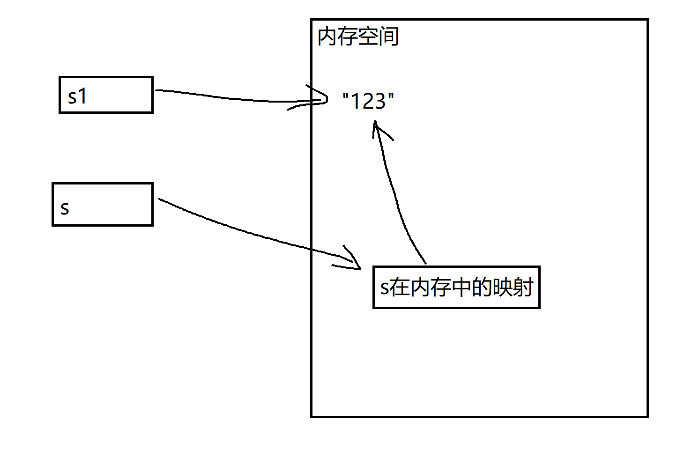  
所以比对才是不一样的，hello和hello1一样的是因为他们都是指向原hello这个对象，我们的s打印的其实可以理解为toString的hashCode，还是追去
"123"去取hashCode了，但是实际比对比的还是 "123"和s在内存中的映射，咱们直接来看源码

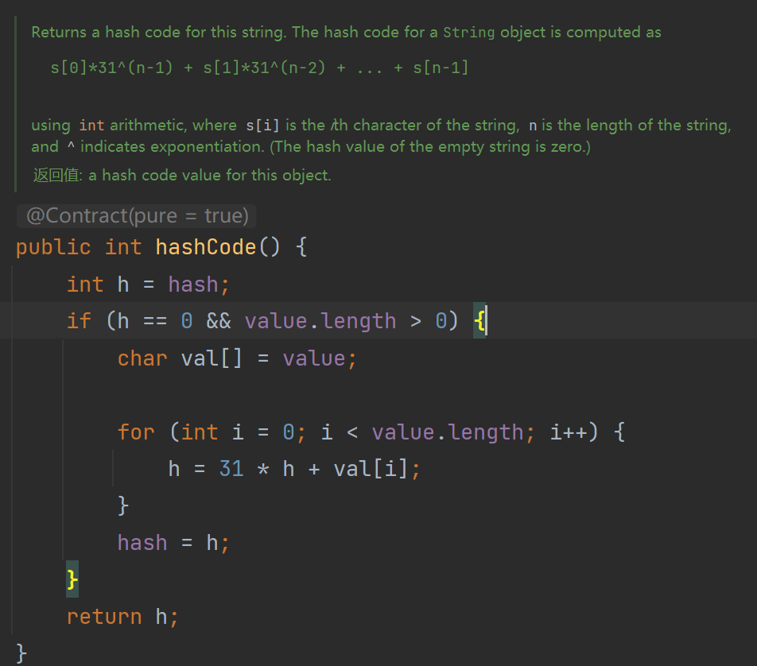
拿的都是底层的字符数组，来计算的，所以hashCode才会一样，实际上就是我画的图的那样的指向

这个就是字符串的难题了，剩下的就是很简单的调用一下String这个类的方法，因为直接写的字符串就是String这个类的对象，所以直接使用
`.方法()` 的操作就行

```java
public class Hello {
    public static void main(String[] args) {
        /*
        在String类中还是有很多方法的，有很多实用的方法，比较常用的比如
        length,isEmpty,equals,toCharArray,split,indexOf,replace,toUpperCase,toLowerCase,trim
         */
        //第一个length，顾名思义，就是长度
        String s1 = "123456";
        System.out.println("s1.length(): " + s1.length());
        System.out.println("======");
        //第二个isEmpty，顾名思义，是空，如果真的空就会返回true，如果不是那就返回false
        //这个\是转义字符，待会会讲，现在在讲String类的API
        System.out.println("\"123\".isEmpty()" + "123".isEmpty());
        System.out.println("\"\".isEmpty()" + "".isEmpty());
        System.out.println("======");
        //第三个equals就是相等的意思，这个是比对字符串用的，因为使用==比对的其实是hashCode
        System.out.println("equals()" + new String("123").equals("123"));
        System.out.println("======");
        //第四个toCharArray就是转换char数组
        String s2 = "123456";
        char[] charArray = s2.toCharArray();
        for (char c : charArray) {
            System.out.print(c + " ");
        }
        System.out.println();
        System.out.println("======");
        //第五个split，的意思是切割，根据给的参数切割字符串
        String s3 = "123 456 789";
        String[] strings = s3.split(" ");
        for (String str : strings) {
            System.out.println(str);
        }
        System.out.println("======");
        //第六个indexOf 下标
        String s4 = "123456";
        int i = s4.indexOf('3');
        System.out.println("index: " + i);
        System.out.println("======");
        //第七个replace 重新放置
        String s5 = "123456";
        String replace = s5.replace('1', '4');
        System.out.println("replace: " + replace);
        System.out.println("======");
        //第八个toUpperCase 大写转换
        System.out.println("abc".toUpperCase());
        System.out.println("======");
        //第九个toLowerCase 小写转换
        System.out.println("QWE".toLowerCase());
        System.out.println("======");
        //第十个trim 去除前后空格
        System.out.println("  123123  456456  ".trim());
    }
}
```

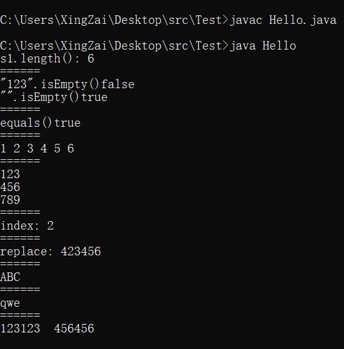  
我话先说在前头，这个东西不用死记，用到就记住了，前提稍微学好一点英语，以后上ide之后直接翻结构来查看用方法。

接下来就是我上个代码里面要讲的一个知识点，转义符，在Java中的转义符是有很多的，比如有 `\n,\r,\',\",\\,\t`
等等，有很多，我就举这几个例子，还有更多的可以去查看ascii码的表里面其实是有的

```java
public class Hello {
    public static void main(String[] args) {
        //\n 换行，这个很熟悉，因为在println的末尾会自动添上这么一个，当然也可以手动添加
        System.out.println("123\n123456");
        System.out.println("======");
        //\r 这个是做回车作用的，单个时候就是回到这一行的开头
        System.out.println("123456\r456");
        System.out.println("以上是发生了替换");
        System.out.println("======");
        //\t 制表符的打印
        System.out.println("123\t123");
        System.out.println("======");
        //\\,\',\" 这个就是转义了，就是直接打印
        //因为默认的双引号就是字符的开头和结尾，你想要在字符串里面有双引号就需要转义
        //然后反斜杠本来就是转移符，所以需要转义才能打印出来
        //还有一个就是单引号，在字符串里面其实可以直接使用，但是在其他语言中不一样
        //比如python，他无论单引号还是双引号都是字符串，所以这个就需要用到转义
        //但是在java中如果是你字符串那你就不需要转义了，因为单引号没有阻碍任何东西
        System.out.println("\\,\',\"");

    }
}
```

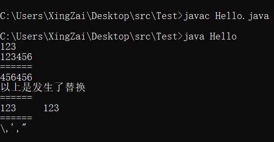  
字符串还有一个内容，那就是可以通过字符串转换其他类型，这个会在之后的常用类里面讲到，不少方法是放在包装类里的，之后学会了包装类之后，那就是真的完全拿捏了字符串了

字符串暂时就先讲这么多内容了，只要你都会了就说明你对字符串了如指掌了，那对 `System.out.println()` 用起来会更加的得心应手

## 第二章 键盘输入

> 我们进行开发自然少不了要输入，首先我们想要输入需要引入一个东西，在我们说数组的时候，其实已经讲解过什么是引入，那就是import，在我们使用这个输入类的时候，我们就需要引入一下这个类，就和数组工具Arrays一样

首先我们先说这个类在哪里，这个类在java.util.Scanner，没错这个类就叫做Scanner，然后我们引入了这个类就可以创建这个类的对象并进行使用了

```java
import java.util.Scanner;

public class Hello {
    public static void main(String[] args) {
        //我们先来创建对象，这次我们需要在括号里添加东西了
        Scanner scanner = new Scanner(System.in);
        //scanner内有多种方法，我们根据需要选择对应的方法，比如我们要输入int类型那就使用nextInt
        System.out.println("请输入:");
        int i = scanner.nextInt();
        System.out.println(i);
    }
}
```

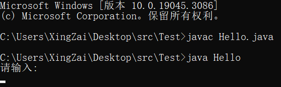

我们使用了之后，会出现光标卡住，这里其实就是在等待我们输入了，然后我们直接输入数字，因为我们使用的是int类型的键入

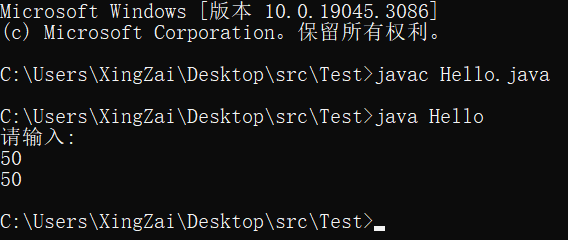

这样就完成了我们的输入，那如果你不想输入数字的话，输入了别的，然后代码里面写的是nextInt的话，那就会报错

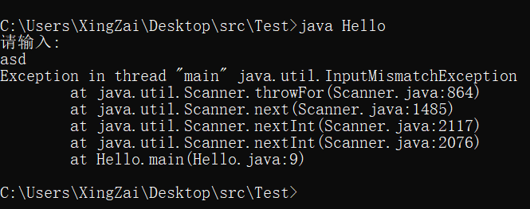

这样就会报错，因为我们的nextInt只能接受int类型的输入，输入其他的就会报这样的错误，说是 输入类型适配错误异常，所以我们只需要调整代码或者是外部的输入就不会报错了

我们可以使用的方法有但不限于这张图里面显示的方法

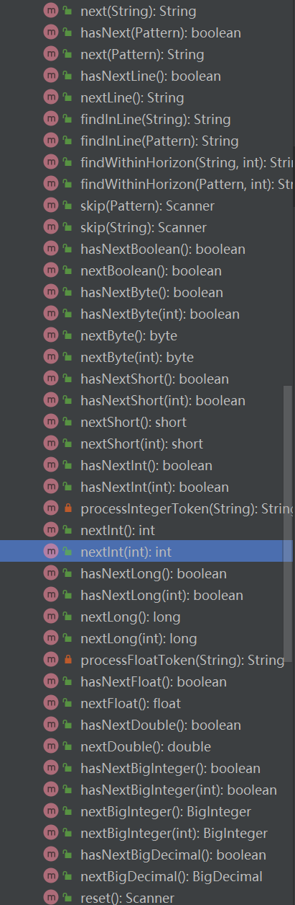

然后我们可以依次类推，是不是看到了除nextInt之外的nextDouble，nextFloat等等，其实都是获取对应类型的值的，我们还有特殊的两个，一个是next()
，一个是nextLine，他们分别为空格结尾和回车作为结尾，然后返回的都是字符串类型

```java
import java.util.Scanner;

public class Hello {
    public static void main(String[] args) {
        Scanner scanner = new Scanner(System.in);
        System.out.println("请输入:");
        String next = scanner.next();
        System.out.println(next);
    }
}
```

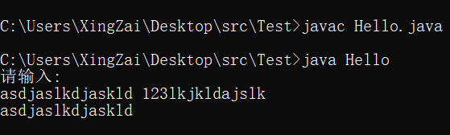

就和我说的一样，从空格开始就隔断了

```java
import java.util.Scanner;

public class Hello {
    public static void main(String[] args) {
        Scanner scanner = new Scanner(System.in);
        System.out.println("请输入:");
        String next = scanner.nextLine();
        System.out.println(next);
    }
}
```

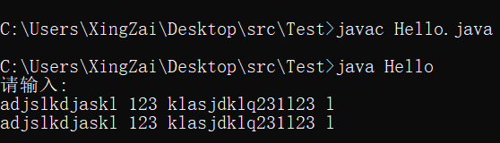

使用Line的时候就是在一行结束之后也就是碰到回车了之后才隔断

```java
import java.util.Scanner;

public class Hello {
    public static void main(String[] args) {
        Scanner scanner = new Scanner(System.in);
        System.out.println("请输入:");
        for (int i = 0; i < 2; i++) {
            String next = scanner.next();
            System.out.println(next);
        }
    }
}
```

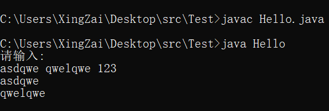

我们明显可以看到，空格自动隔开，如果后面还有获取，或者循环了一下这个获取，还是能获取到的，所以我们可以使用这种方式进行数组的输入啊等等，因为int，double，float等等都是和next是一样的，只有nextLine是特殊的。

### [上一章](day6.md)

### [下一章](day8.md)

### [返回目录](README.md)