# ***Day8 方法与递归***

> 方法这个东西我们之前讲过，但是只是讲了原理并没有详细的讲解东西，还有构造器这个东西，也只是介绍过全貌，构造器其实就是一个特殊的方法，在今天也是会简单说到的，还有一个就是算法相关的递归

## 第一章 方法的结构

> 我们方法的结构也是比较简单的，目前学的知识就是这样 `[访问修饰符] [是否有static] [方法名]([参数列表]){[方法体]}`

```java
public class Hello {
    public static void main(String[] args) {
        Hello hello = new Hello();
        hello.print();
        hello.p2();
        hello.p();
        hello.p3();
    }

    public void print() {
        System.out.println("public void print()");
    }

    public static void p() {
        System.out.println("public static void p()");
    }

    void p2() {
        System.out.println("void p2()");
    }

    static void p3() {
        System.out.println("static void p3()");
    }
}
```

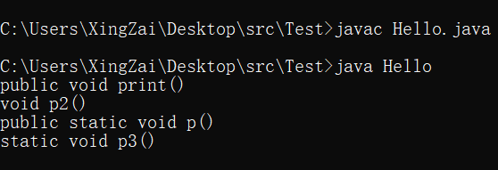  
我们之后再详讲public和static对方法的影响，目前大家只需要知道这个东西是可加可不加的就行，只是目前的情况哈，但是我们都还是把public带上然后把static去掉

这就是一个方法的结构，虽然还有很多关键字，比如final，synchronized，abstract等等，但是目前我们就先了解这么多，主要我们还是来详讲方法的作用和特性。

## 第二章 方法的参数

> 咱们在之前也说过方法需要创建对象然后再调用了，但是我们在这之前呢还需要知道一件事情，那就是方法的创建的时候的参数列表。

是方法我们都知道，需要传入参数，就像之前教方法的时候的那个sum方法，就是传入两个参数进行计算然后返回，所以我们这一章节详细来讲一讲方法的参数

就正如大家所知道的，我们的主方法，main方法其实本身也是方法，只不过他也是一个特殊的方法，所以我们主函数里面能写的，也都可以写到普通方法里，就比如我们之前的冒泡排序

```java
import java.util.Arrays;

public class Hello {
    public static void main(String[] args) {
        int[] a = {1, 5, 3, 7, 8, 9, 6, 4, 2};
        Hello hello = new Hello();
        hello.bubbleSort(a);
        System.out.println(Arrays.toString(a));
    }

    //这个就是int数组的传参，
    public void bubbleSort(int[] a) {
        for (int i = 0; i < a.length - 1; i++) {
            for (int j = 0; j < a.length - i - 1; j++) {
                if (a[j] > a[j + 1]) {
                    //你使用没有标注static的方法可以直接调用非static的方法
                    swap(a, j, j + 1);
                }
            }
        }
    }

    //这个是多参数的参数列表，使用逗号隔开
    public void swap(int[] a, int left, int right) {
        int temp = a[left];
        a[left] = a[right];
        a[right] = temp;
    }
}
```

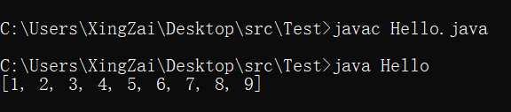  
方法的参数列表就是这么一个格式， `变量 变量名, 变量2 变量名2`
以此类推，样子都是和声明变量的时候一样的，然后他们的作用域仅仅只是在这个方法内部，出了这个方法就没了，还有可变参数我们后面再说。

## 第三章 方法是否为静态(static)

static是静态的意思，这里就需要说道说道了，虽然说以后再讲，但是大家还是需要知道的，就是标注了 `static`
的方法是没办法直接调用 `非static`
的方法的，但是能直接调用 `static` 方法， `非static` 方法 可以调用 两者

```java
public class Hello {
    public static void main(String[] args) {
        s1();
    }

    public static void s() {
        System.out.println("static s");
    }

    public void s1() {
        System.out.println("no static s1");
    }

    public void invokeS2() {
        s();
        s1();
    }
}
```

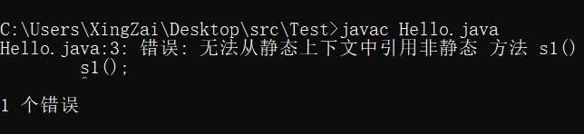  
这里是使用直接报错，我们继续测试

```java
public class Hello {
    public static void main(String[] args) {
        s();
        Hello hello = new Hello();
        hello.s1();
        hello.invokeS2();
    }

    public static void s() {
        System.out.println("static s");
    }

    public void s1() {
        System.out.println("no static s1");
    }

    public void invokeS2() {
        s();
        s1();
    }
}
```

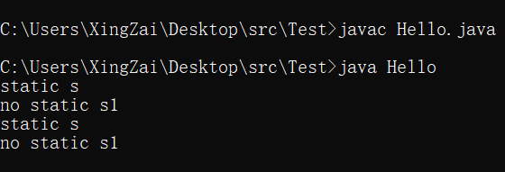  
明显可以看到在主方法里面直接调用了身为static的s方法，和创建完对象后调用的非static方法s1和invokeS2，然后在invokeS2之中调用了身为static方法的s()

这就是一个static和非static的调用关系，分别是 `静态` 能调用 `静态` 不能调用 `非静态` ， `非静态` 则是全部都能调用

## 第四章 方法的返回值

> 在之前我们也是提到过返回值的，但是那个时候只是浅讲了一下可以返回值也可以返回表达式

虽然其实就只能返回值或者表达式，不过我们还是可以调用有返回值的方法

```java
public class Hello {
    public static void main(String[] args) {
        System.out.println(new Hello().doSome());
    }

    public int get5() {
        return 5;
    }

    public int doSome() {
        return get5() + 5;
    }
}
```

  
无需局限于值和表达式，完全可以延伸到方法，虽然说白了这个方法运行完之后就是返回出来的那个值。然后我们的返回类型也无需局限于基本数据类型，还可以是String类，也可以是我们自定义的Hello这个类。

```java
public class Hello {
    public static void main(String[] args) {
        Hello hello = new Hello();
        Hello h = hello.getHello();
        System.out.println(h.saySome());
    }

    public Hello getHello() {
        return new Hello();
    }

    public String saySome() {
        System.out.println("now is saySome()");
        return "some";
    }
}
```

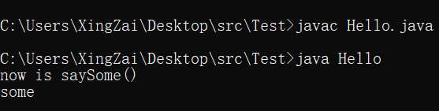  
不止如此，我们还可以在void里面也使用 `return` 这个关键字，不过自然是没有返回任何东西的。

```java
public class Hello {
    public static void main(String[] args) {
        new Hello().printSome();
    }

    public void printSome() {
        for (int i = 0; i < 5; i++) {
            if (i == 2) {
                return;
            }
            System.out.println(i + 1 + " Hello");
        }
        System.out.println("结束For循环");
    }
}
```

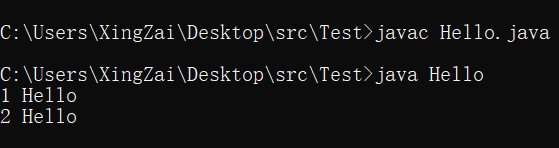  
这个可是比break要果断多了的，如果使用break的话还是会打印下面那个语句的。

## 第五章 可变参数

这个就不一样，首先我们先说说怎么写，然后我们再说说怎么用

```java
public class Hello {
    public static void main(String[] args) {
        //叫可变参数不是没有道理的，因为是不定长度的，所以叫可变参数
        //然后因为我们写的是 int... 所以需要的是int类型，不能传其他的
        new Hello().p(1, 2, 3, 4, 1, 1, 1, 1, 2, 3, 5, 5, 7);

    }

    //想要使用可变参数要 数据类型... 变量名的方式，然后这个变量是数组
    public void p(int... a) {
        for (int i : a) {
            System.out.println(i);
        }
    }
}
```

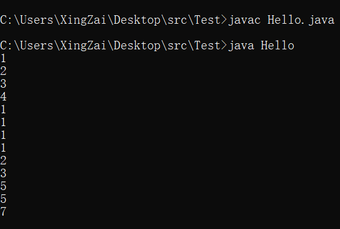  
这是我们放在了第一个，我们也可以先接受其他的然后再接受可变参数

```java
public class Hello {
    public static void main(String[] args) {
        new Hello().p(new int[]{1, 2, 3, 4, 5, 6}, 7, 8, 9, 6, 1, 54, 645, 3, 4);
    }

    public void p(int[] a, int... b) {
        int[] c = new int[a.length + b.length];
        //可以用很多方法，但是我使用的是比较绕逻辑的方法，考验一下大家
        for (int i = c.length - 1, j = 0; i >= 0; i--) {
            if (j < a.length)
                c[i] = a[j++];
            else
                c[i] = b[j++ - b.length];
        }
        for (int i : c) {
            System.out.print(i + " ");
        }
        System.out.println();
    }
}
```

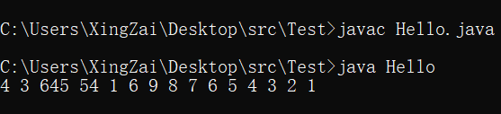  
如果你逆过来了那就会报错了。希望大家没理解的可以自己动一下手就会理解了😋

## 第六章 方法的重载

> 大家是不是看到我在同一时间，就是同一个类里面是不是没有任何两个方法是同名的，因为同名同参会报错，为什么这么说呢？
> 那肯定是同名不同参不会报错，所以，接下来要介绍的这个知识点，就是这个操作，当然他是有学名的，叫做方法的重载

我们直接上案例

```java
public class Hello {
    public static void main(String[] args) {
        Hello hello = new Hello();
        hello.p();
        hello.p(1);
        hello.p(1.0);
    }

    public void p() {
        System.out.println("我是无参的p()");
    }

    public void p(int i) {
        System.out.println(i + " 有参p(int i)");
    }

    public void p(double d) {
        System.out.println("这里是double的参数的p() " + d);
    }
}
```

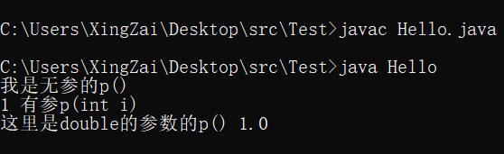  
不知道大家有没有看懂呢，我是不是用的都是p这么一个方法，但是我根据参数的不同就调用了不同的方法是不是，然后不同参数列表的方法虽然名字相同但是都没有报错

这个就叫做方法的重载，好处是有很多的，比如我有一个方法，我要给他转为int的数组，那就叫做toIntArray好了，那我如果换个类型的参数就得换一个名字，那我怎么知道我什么参数对应着的就是我这个名字呢是吧

所以方法的重载也是有很多实用价值的，给大家截一个图好了，是Arrays.toString的源码，他就用了非常的重载，因为我要兼容的数组又不止有一个int是吧，还有很多比如double啊，short啊，float啊等等，还有很多方法

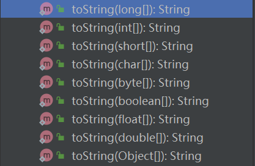

## 第七章 递归

> 这个就是重头了，因为很多算法很快的算法都是用到了递归的，因为很多情况都需要使用空间来置换时间的，我既然这么说了，大家伙应该也能知道了，那递归肯定很占空间

递归这个东西呢，其实就是我调用我自己，就形成递归，所以必须需要一个终止条件，不然就永无止境的自己调用自己就会变成开一万个方法内存自然就爆炸了。不知道大家伙还记不记得`斐波那契数列`
，递归其实是有比较强的数学思维的，正常的逻辑去理解会稍微复杂一点，但是用数学的思维去理解就不一样了。

比如 `斐波那契数列` 他的关系式就是 f(x) = f(x-1)+f(x-2) 然后 x>2是吧，我们也可以这么写，但凡用到递归只需要使用数学的思维就行了

```java
public class Hello {
    public static void main(String[] args) {
        Hello hello = new Hello();
        for (int i = 0; i < 10; i++) {
            System.out.print(hello.f(i) + " ");
        }
        System.out.println();
    }

    //首先我自己想要调用我自己的值是不是需要一个返回值
    public int f(int x) {
        //然后我想要有一个终止条件，是不是x>2，但是我不能没有1和2是吧，但是在程序里面我又是0做开头
        //不过也可以不从0开头，我就把外面的循环变成从1开始就行
        if (x == 1 || x == 0)
            return 1;
            //如果输入的值小于0说明就不是第一个是第负一个，因为下标从0开始，小于0就是越界，给他返回一个0
        else if (x < 0)
            return 0;
        else
            return x = f(x - 1) + f(x - 2);
    }
}
```

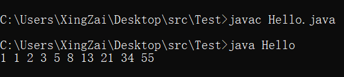  
我们能看到，在f方法的最后一行，那个就是递归，整理一下思路就是，我，假如我输入的是0，那我就是1是吧，因为上面的判断就拦截了。

如果我输入的是1，那也被拦截了，那我如果输入的是2呢，是不是进入的最下面的else里面了，要返回x但是又执行了方法，f(x - 1)
，那我输入的x是不是2，在这里面传入的是不是就是1，因为2-1=1，
然后就直接返回1，后面的也同理，访问进去的是0，所以直接拦断返回出来。出来的就是1+1=2，后面就这么同理即可

自然不能只用递归的方式，因为使用递归的方式是比较占空间的，这种还可以使用一个叫做dp的方式，其实也是一种算法，这里浅提一下，不想了解的或者要以后了解的已经可以撤退了。

这种一层一层叠下来的其实不只用递归，使用循环的方式也是很快能解决的，一个叫做动态规划的算法，其实就是一个思维，我这里写的简单一点，还可以写的难理解一点

```java
public class Hello {
    public static void main(String[] args) {
        Hello hello = new Hello();
        for (int i = 0; i < 10; i++) {
            System.out.print(hello.f(i) + " ");
        }
        System.out.println();
    }

    public int f(int x) {
        //前面思维一样，直接返回
        if (x == 1 || x == 0)
            return 1;
        //我们这里使用数组，简单一点，自然可以用传统的dp，我们传过来的参数是下标的方式的，所以要+1，因为少一个
        int[] a = new int[x + 1];
        //0下标那就是第一个所以是1
        a[0] = 1;
        //1下标是第二个所以也是1
        a[1] = 1;
        //这里从2开始，也就是第三个开始才变化，里面也是写和递归一样的想法，但是我们使用数组，所以就能少很多的东西
        for (int i = 2; i < a.length; i++) {
            a[i] = a[i - 1] + a[i - 2];
        }
        return a[x];
    }
}
```

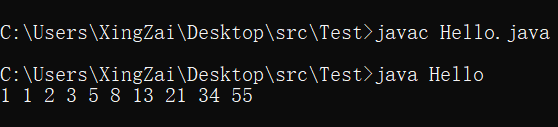  
自然，虽然说不写了，但是还是写了一版dp的，就是传统动态规划的

```java
public class Hello {
    public static void main(String[] args) {
        System.out.println("使用dp还是加个防伪标志好了");
        Hello hello = new Hello();
        for (int i = 0; i < 10; i++) {
            System.out.print(hello.f(i) + " ");
        }
        System.out.println();
    }

    public int f(int x) {
        //照样，打断
        if (x == 1 || x == 0)
            return 1;
        //然后我们这里少了数组所以就会节省很多空间
        //我们的a现在是0
        int a = 1;
        //我们的b初始化现在是1
        int b = 1;
        //c是我们要返回的数
        int c = 0;
        //也是从2开始，因为0和1不操作，长度还是x+1，因为x输入的就是下标，是斐波那契数列的下标
        for (int i = 2; i < x + 1; i++) {
            //经典相当于a[i] = a[i-1]+a[i-2]
            //相当于x = f(x-1)+f(x-2)
            c = a + b;
            //这里就是变更第一个和第二的区别了，我们使用取模来确定是第一个还是第二个变化
            //因为c到达了第四个之后那就是a到达c原来的地方
            if (i % 2 == 1)
                a = c;
                //反之则是b该发生变化了
            else
                b = c;
        }
        return c;
    }
}
```

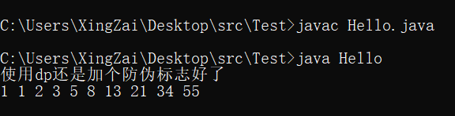  
这就是今天的彻底的内容了，希望大家能早日掌握好好提升自己的编程能力。