# ***Day9 构造器与访问修饰符***

> 本来其实是想在Day8里面把这个构造器给讲掉的，但是发现篇幅有点长的，后面的内容也是稍微有一点点超纲了，所以就先把这个留着，现在再讲。

## 第一章 构造器

> 构造器，我们之前在讲类的时候其实是说过的，就是我们创建类的对象的时候会调用构造器，然后我们的构造器也可以有很多个，这个其实就得益于方法的重载

然后我们再看看构造器的结构他就是这样 `[访问修饰符] [方法名==类名](参数列表){方法体}`
他是没有返回值的一个方法，但他其实是会返回东西的，就是返回一个对象，这句话能理解吗，然后这个 `类名==方法名`
其实就是在说他的方法名要和类名一样，这样才能不需要返回值然后能变成构造器，上代码案例

```java
public class Hello {
    public static void main(String[] args) {
        //还有就是方法的调用里面，他就只能在new的时候被调用，无法通过对象被调用
        Hello hello = new Hello();
        new Hello("123");
        //普通方法，就是需要对象去调用
        hello.Hello();
    }

    //最普通的构造器，无参构造器
    public Hello() {
    }

    //有参构造器
    public Hello(String str) {
        System.out.println(str);
    }

    //并非构造器，因为他有返回值类型，只不过返回值类型是不返回东西
    public void Hello() {
        System.out.println("void Hello()");
    }
}
```

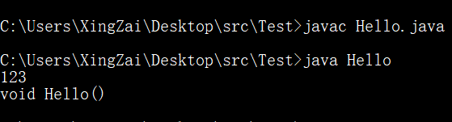

再看看这个，其实构造器虽然是只能在创建对象的时候调用的方法，但是他还是可以和正常的方法一样执行东西的

```java
import java.util.Arrays;

public class Hello {
    public static void main(String[] args) {
        new Hello(1, 2, 3, 4, 5, 6, 7, 8, 9, 0);
    }

    public Hello(int... ints) {
        System.out.println(Arrays.toString(ints));
    }

}
```

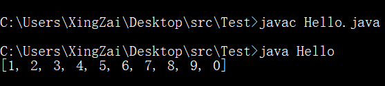

但是不仅如此，构造器还有不少的东西，在介绍这个东西之前，我们得介绍一下一个关键字 `this` 看意思应该也能看懂一点就是 `这个`
的意思，实际是指本对象，就和我们之前使用的 `Hello hello = new Hello()` 里面的 `hello` 就是这个的当前对象，this就是在这个对象里面指自己

```java
public class Hello {
    //咱们使用属性来搞一下，现在初始化为50
    public int i = 50;

    public static void main(String[] args) {
        Hello hello = new Hello();
        System.out.println(hello.i);
    }

    public Hello() {
        //这个就相当于外面的hello.i
        this.i = 100;
    }

    public Hello(int a) {
        System.out.println("调用的是带参数的构造器，所以值不变");
    }

}
```

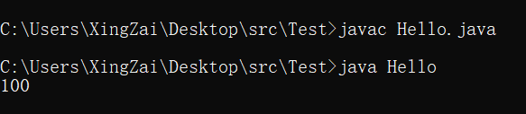

我们这里再教一个this的用法，就是我可以用this()
然后里面带上参数或者不带参数，可以在构造器里面调用我另外一个重载的构造器，但是这里有要求，只能位于方法开始的第一行，其他会出问题，我们先看成功的再看失败的

```java
public class Hello {
    public int i = 50;

    public static void main(String[] args) {
        Hello hello = new Hello(123);
        System.out.println(hello.i);
    }

    public Hello() {
        this.i = 100;
    }

    public Hello(int a) {
        //这里要写在第一行
        //就相当于是构造器然后通过重载根据我参数里面写或者不写来调用构造器
        this();
        System.out.println("调用的是带参数的构造器，所以值不变");
    }
}
```

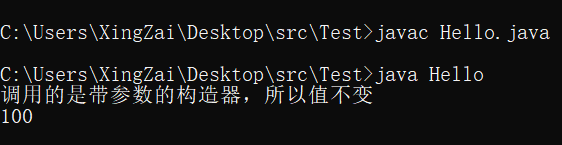

接下来就是出问题的，因为this()不在第一行的情况

```java
public class Hello {
    public int i = 50;

    public static void main(String[] args) {
        Hello hello = new Hello(123);
        System.out.println(hello.i);
    }

    public Hello() {
        this.i = 100;
    }

    public Hello(int a) {
        this.i = a;
        this();
        System.out.println("调用的是带参数的构造器，所以值不变");
    }
}
```

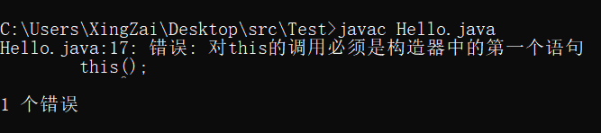

还有个小知识点，就是我们的参数列表里的参数的命名如果和我们类里面的属性重名了，那我该如何区分和调用

```java
public class Hello {
    public int i = 0;

    public static void main(String[] args) {
        Hello hello = new Hello(123);
        System.out.println("有参构造器的i: " + hello.i);
        Hello hello1 = new Hello();
        System.out.println("无参构造器的i: " + hello1.i);
    }

    public Hello() {
        i = 100;
    }

    public Hello(int i) {
        //其实也很简单，我们只需要通过this.i就是调用我们类里面的属性了
        //他取元素其实也是就近原则，假如我直接写i他只会取参数里的，想要使用类里的需要使用this
        //自然，如果我们没有参数i的时候，自然可以直接写，因为在编译的时候
        //会自动加上this.的
        this.i = i;

    }
}
```

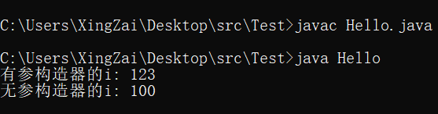

## 第二章 package关键字

> 主要是确实就是普通方法的变形，没什么好说的，我们重点来到访问控制符，就是前面的那个public，但是我们虽然说要讲控制符，但是在访问控制符之前我们先讲一个东西，那就是package关键字

写法是很简单的，就是在最上方的开头加上package关键字和包名，这个包名其实就是文件夹的名字，如果是多级的，那就是使用点来分开，比如我现在的文件在Test文件夹下那就是 `package Test;`
假如我现在的文件夹在Test\Test1的话，在linux上是Test/Test1，我们都是写的 `package Test.Test1;`
我们使用点去分割多级目录，我们下面的案例使用单级目录，多级就是多个等级的分明，使用的就是 `.`
和对象调用方法有点像，我们里面还有方法可以直接查看这个类的目录的

```java
//如果有package的话那就得写在最开头不然会报错
package Test;

public class Hello {
    public static void main(String[] args) {
        //只要编译没有报错那就是成功
        System.out.println("Hello world");
    }
}
```

我们先说说结构，先别急着看结果，我们的文件结构现在不能是单单的散在地上的，我们需要先创建一个Test文件夹然后再把Hello.java文件丢进去，希望大家能够理解这样做的目的

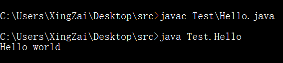

我们先看看这次的编译命令，是不是还是javac但是路径不一样的，我们先回到了上一级的目录，方式也很简单先输入 `cd ..`
即可，然后再使用javac编译，但是因为我们回到了上一级的目录，所以我们需要通过加上文件夹的方式进行编译，根据我们的程序是这样的 `javac Test\Hello.java`
然后我们运行的方式也是在这个文件夹内部使用的还是java，但是我们需要加上 `包.类` 这样的方式来进行运行

```java
package Test;

public class Hello {
    public static void main(String[] args) {
        //还记得我们说打印路径吗？我们使用这个就能打印这个类的路径了
        System.out.println(Hello.class);
    }
}
```

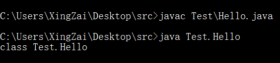

这就是包，package，假如我们再来个几层，比如我基于现在的Test我再往里面深入几层然后把类命名为PackageTest好了，不要忘记java的最基础的，public
class的类名要和文件名一样

```java
package Test.learning.packageUsing;

public class PackageTest {
    public static void main(String[] args) {
        System.out.println(PackageTest.class);
    }
}
```

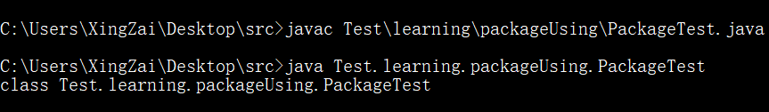

再给大家看看文件情况，其实只需要看上面的路径就知道了


那么这个就是我们的package内容了，是不是非常的简单，以后用package的情况一般都是在ide中了，但是ide中你甚至都不需要关心怎么打编译指令了

## 第三章 访问修饰符

> 既然都已经讲完了package关键字了，那接下来就是要讲访问修饰符了，这个时候就要提一提我以前踩的坑了，以前学package这个关键字是在ide之后才学的，甚至都搞不清在外面是干什么用的
> 所以那个时候刚切出来的时候还是很蒙蔽的，但是后面慢慢的捣鼓还是给我摸索出来了，因为在ide之中真的很安逸，这种琐事鸟都不用鸟。
> 接下来要说访问修饰符了，之前也说了和这个package可以是息息相关

首先我们先来说说这个访问修饰符的关键字有哪几个，不搞谜语人直接说，有三个，但是有四个访问级别，分别是`public protected default private`
，分别是从最大到最小，然后刚刚说到的，三个关键字，但是四个访问级别，是不是能想到，有个访问级别就是不写访问修饰符。

`public` 这个我们很熟悉，毕竟经常写，意思也是公有，所以我们被public修饰的，无论在哪个包的类都是可以调用的，这个包的分类就是通过package进行分的

`protected` 受保护的，这个是以后再讲，在我们说过继承之后再说，他的访问等级是同包和不同包的子类，这块有面向对象的内容，所以在我们之后再讲，我们现在只需要认个齐就行

`default` 不知道大家有没有猜到，这个访问等级就是，不写的那个，他的访问级别是同包

`private` 私有，只有本类可以访问，同包的也不行，一般private和public在正常的开发中使用的比较多，或者说基本上都是这两个，上了private就是我只能内部用用，使用了public就是哪里都能用。

既然已经讲完了这四个，所以我们现在在直接上案例好吧，这次就要使用一个方式了，单个文件多个类，大家要注意，开发中一定不能这么写，顶多也是内部类，当然这个内部类也是以后的内容。
其实听名字也听出来了，内部类就是内部的类，和我们现在要采用的操作还是有很多的区别的。

```java
package Test;

public class Hello {
    public static void main(String[] args) {
        //首先我们先来测试这四个对本类的访问控制，其实都是能访问的
        //毕竟我们的主方法就在我们的Hello类中
        Hello hello = new Hello();
        hello.p1();
        hello.p2();
        hello.p3();
        hello.p4();
    }

    public void p1() {
        System.out.println("public p1()");
    }

    protected void p2() {
        System.out.println("protected p2()");
    }

    void p3() {
        System.out.println("default p3()");
    }

    private void p4() {
        System.out.println("private p4()");
    }
}
```

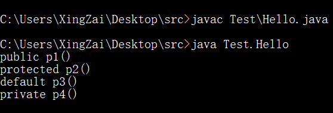

其实猜都不用猜，同个类是这样的，接下来我们使用多个类

```java
package Test;

public class Hello {
    public void p1() {
        System.out.println("public p1()");
    }

    protected void p2() {
        System.out.println("protected p2()");
    }

    void p3() {
        System.out.println("default p3()");
    }

    private void p4() {
        System.out.println("private p4()");
    }
}
```

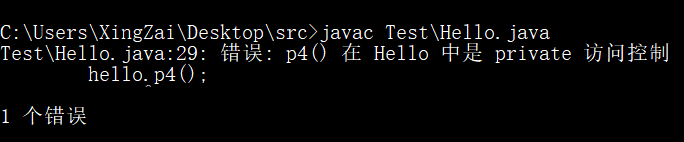

很明显，在编译阶段就已经报错了，所以我们现在使用两个不同文件的类去访问

```java
package Test;

public class H1 {
    public static void main(String[] args) {
        Hello hello = new Hello();
        hello.p1();
        hello.p2();
        hello.p3();
        hello.p4();
    }
}
```

```java
package Test;

public class Hello {
    public void p1() {
        System.out.println("public p1()");
    }

    protected void p2() {
        System.out.println("protected p2()");
    }

    void p3() {
        System.out.println("default p3()");
    }

    private void p4() {
        System.out.println("private p4()");
    }
}
```

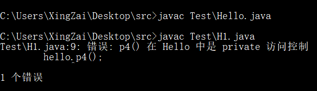

很明显，及时分开了还是在编译的时候检查了，还是不行，那我们现在再来增加测试，就是分不同的包，我们再来看看有几个报错

```java
package Test.T1;

//因为在不同包里了，所以我们想要使用其他包的里类需要使用import

import Test.Hello;

public class H1 {
    public static void main(String[] args) {
        Hello hello = new Hello();
        hello.p1();
        hello.p2();
        hello.p3();
    }
}
```

```java
package Test;

public class Hello {
    public void p1() {
        System.out.println("public p1()");
    }

    protected void p2() {
        System.out.println("protected p2()");
    }

    void p3() {
        System.out.println("default p3()");
    }

    private void p4() {
        System.out.println("private p4()");
    }
}
```

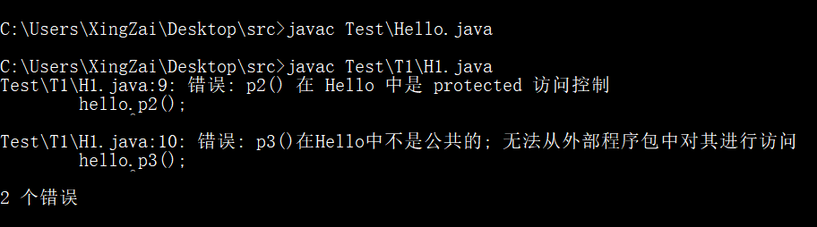

很明显啊，直接两个错误，还记得我之前说的吗default的访问级别只有同包，因为不同包所以直接报错，还有protected，因为不是子类所以直接报错，详情在后面学了面向对象的继承之后我再细说

今天的东西其实就这么点，可能day10要讲面向对象相关的东西了，虽然我们这一天也讲了，就访问修饰符其实就是面向对象的三大特性中的封装性

### [上一章](day8.md)
### [下一章](day10.md)
### [返回目录](README.md)