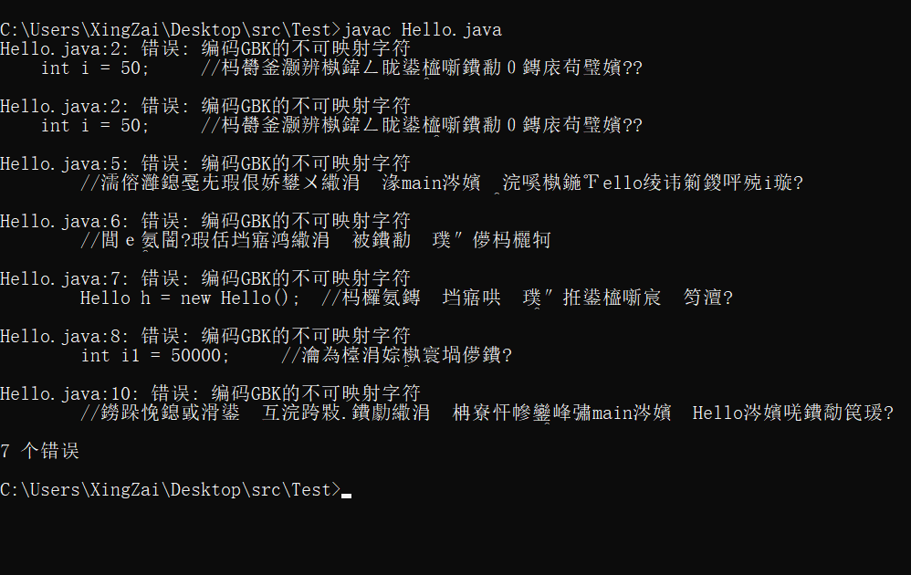

# ***常用问题解决方案***

## 编码问题

> 图片内的问题，一眼就能看到错误的存在是什么：编码GBK的不可映射字符

  
一般碰到编码问题，要么你把出现编码问题的文字删除，要么你就是改编码，大家伙首先需要知道的是编码不同转换会出问题，一般只有除了英文和一些你键盘上可以打出来的特殊符号不会出问题，剩下的多多少少从不同编码转换都会出现问题，一般windows的控制台就是这个cmd基本上都是GBK这个编码，然后我们使用记事本写的都是UTF-8编码，细节我就不说了，百度一下就能看到是为什么编码出问题，如果你看了头疼也没有关系，我们直接上解决办法

> * 第一个办法  
    使用其他的记事本，增强记事本sublime等一些比较厉害的笔记本，比windows自带的要强
> * 第二个办法  
    查看这个文档去更改cmd的编码格式为UTF-8就行[Windows CMD设置为UTF-8编码](https://blog.csdn.net/fuhanghang/article/details/130803605)
> * 第三个办法  
    直接使用IDE(集成开发环境)比如idea、eclipse等等java的IDE

## 命名规则

> 我们程序除了关键字之外需要的就是自己命名的，我们自己命名是有规范的，有些是命名不了的

* 命名规则
    * 开头
        * a-z
        * A-Z
        * _
        * $
    * 中间及结尾
        * a-z
        * A-Z
        * _
        * $
        * 0-9

中间是不能加空格的，加了空格就算是分开的名字了。我们Java中的连接一般都是这么写的，使用驼峰，小驼峰，就是单词的连接处使用首字母大写

比如
人的名字，我们就会使用一个人的这个单词，可以不一样反正能表示意思和大家能看懂就行，人取person，名字取name，拼在一起的时候就用personName这个就是驼峰中的小驼峰，大驼峰的话就是PersonName开头也大写就是大驼峰，我们java一般使用小驼峰。

### [返回目录](README.md)